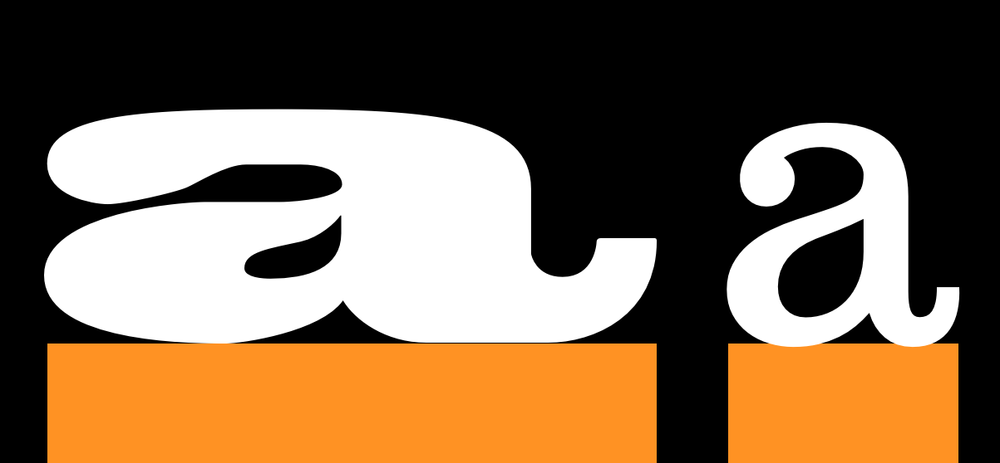
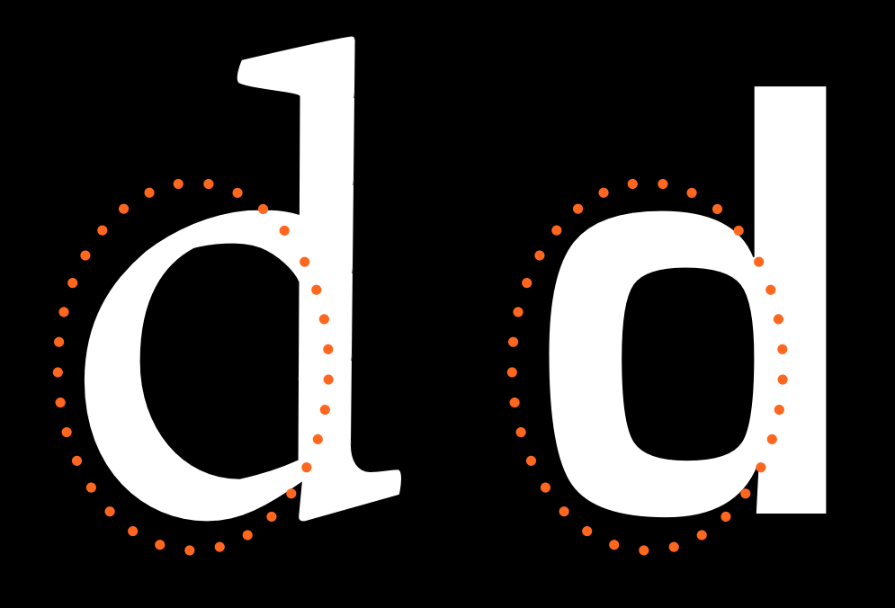

What makes typefaces different from handwritting, calligraphy, lettering, and logos?

The single biggest issue that makes type design different is the need for every glyph in the typeface to work with every other glyph. This often means that the design and spacing of each part of the typeface ends up being a series of careful compromises. These compomises mean that we can best think about typeface design as the creation a wonderful collection of letters but not as a collection of wonderful letters. In other words we must think about the group and how it will perform together and prioritize this over any question of what is wonderful in a single letter.

This need to prioritize with the system rather than with any single part also leads to a need to analyse our design process on the level of the system. Characteristics which span letters become the things we want to focus on particularly at the begin of the design process.

The other oddity in type design is that to very large extent the forms we are designing are already significantly established. Our task as type designers is not so much to create an utterly new form but rather to create a new version of an existing form. This can perplex new type designers. Finding the just right amount to change in order to excite but not to alienate a reader is a tricky thing. Often designers get stuck in letter-specific thinking. This mistake can be easily avoided if you realize from the start that what is most meaningful in a typeface are the parts of it that repeat the most. This typeface design is mostly about designing the characteristics applied not just to the common forms we all recognize but to the characteristics that occur the most often.

It is also useful to recognize that these characteristics not only help to create a font’s voice or atmosphere, but also determine what the font will or will not be useful for, and they sometimes help detemine the technological contexts for which a font is suitable.

It may seem intimidating or excessively abstract to think about the design of a font in this way. However, getting used to these ideas is the key to a faster, more effective, and satisfying type design process.  

Let's begin by identifying the main systemic characteristics in type design.

### Construction

Construction refers to the underlying strokes that form a particular glyph. The kind of construction you use is arguably one of the most important questions to think about, because the construction implies so much about the remaining choices, particularly if your design is going to feel somewhat familiar to readers. In the example above, the white line inside the letters indicate the approximate construction suggested by the shape of the letters themselves.

### Proportion of X-height to Cap-height

The letters on the left come from Playfair, which has a large x-height relative to its cap-height. The letters on the right are from EB Garamond, which has a smaller x-height. In the sample above, the size of the H has been adjusted so that they match.

### Ascender Height

In example above, the x-heights have been matched in order to illustrate the relative difference in ascender heights.

Ascenders usually exceed the cap-height by at least a little, especiually in text designs. In some cases, however, they can match or even be lower than the cap-height. Longer ascenders can add elegance to the look of a typeface. They often go with smaller x-height.

### Descender depth

Like ascenders, descenders that are long can feel elegant. Long ascenders and descenders can also be difficult to manage.

## Width

The width of a type design will alter not just how it feels but also what it is useful for. The example on the right is from a text face. The example on the left is from a display design meant to be eye catching. Letters that are more narrow than the text face example are also possible and can be used to save space or to fit more text in a smaller space.

### Width regularity versus variability

The letters in the top row of this example show a greater variety of width than do the letters in the bottom row.

### Weight

### Slant

### Contrast

Contrast refers to how much variation in stroke width is found within a glyph. Notice in the below two O glyphs that the one on the left has much greater variability in line thinkness between the top and sides of the glyph. Both glyphs have some contrast, but the one on the left has much more than the one on the right.

### Angle of contrast

In the below image, we see that the thin parts of the lower case letter o shapes are different. In the glyph on the left, the thin points lie on a perfectly vertical axis. In the glyph on the right the axis is diagonal. 

### Weight distribution

If your font uses very little or even no contrast, this question is not relevant. Most fonts, however, have at least some degree of contrast. In these cases, you have a wide variety of options to choose from when it comes to how to distribute the weight in your font.

<h4>Vertical</h4>

Vertical distribution of weight is very common. The 9 and 8 above are a particularly intense example.

<h4>Horizontal</h4>

Horizontal weight distribution is much less common, but is nonetheless seen in many fonts.

<h4>Bottom-heavy</h4>

<h4>Top-heavy</h4>

<h4>Irregular</h4>

### Stems

It is easy to assume that your stems will simply be straight and that there are no real questions to to worry about. But both the weight and the shape of your stems are things you can and should make deliberate choices about.

### Joins

### Bowls

### Terminals

### Speed

The n on the left seems to be written much faster than the one on the right. Speed is discussed in more detail in the chapter on italics.

### Regularity

The following characteristics are not present in all type designs, however they are variables that may be a part of your design. If this is the case, it is worth considering the degree to which they will play a role as a variable.

### Flourish

Notice that in the font on top the flourish is more present in the capital letter and the second one the flourish is more in the lowercase.

### Decoration

<h3 class="p1">Dimension

