## Introduction

In some cases a font may lack a glyph that is essential for its use in your application. Arabic fonts present special issues here, because the shape of the glyph depends not only on its position in the word, but also on the attributes of the letter itself. Thus, using the nonsense sequence *babab*, the letter *beh* has three different shapes depending on whether it comes initially, medially, or finally. However, using the nonsense sequence *dadad*, the letter *dal* has only one shape, no matter where it occurs in the word.

Fonts under open licenses (e.g. [GPL](http://gnu.org/copyleft/gpl.html) or [OFL](http://scripts.sil.org/OFL-FAQ_web)) allow the user to make modifications. If you adapt a font that was originally under an open licence and then distribute it, you must retain the original author's copyright notices and licensing information, although you can append a note at the end of the copyright notice covering your contribution.

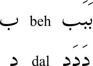

This chapter walks through adding a glyph to an Arabic font. The font we will use is [Graph](http://openfontlibrary.org/en/font/graph), and the glyph we will add is *peh* (U+067E), which does not occur in Arabic itself, but designates *p* in some languages for which Arabic script is used. (For a full listing of the glyphs available for Arabic script, see the [Unicode charts](http://www.unicode.org/charts).)

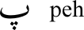

## Make a working copy of the font

Download the font from the webpage and unzip it. Launch FontForge and load the font. Save it as an *sfd* file, editing the suggested name to read **GraphNew.sfd** before saving.

## Rename the font

### Why should I rename the font?

If you do not rename the font, your adapted font will not install separately from the original &mdash; you will have to uninstall the original font first. It is also sensible to rename the font if you are going to distribute your adaptations &mdash; if the original author of the font has reserved the font name under the Reserved Font Name (RFN) mechanism, that original name can only be used with the original author's version of the font.

### Change the name data

Select **Element > Font Info**, and in the *PS Names* panel, change *Fontname*, *Family Name*, and *Name For Humans* to **GraphNew**.

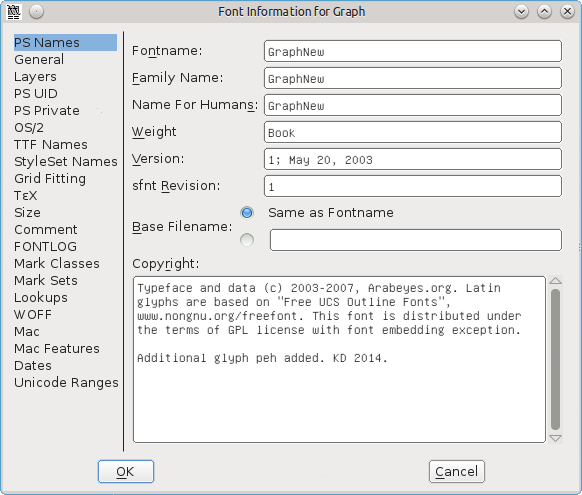

If desired, you can place an 'Additional glyphs added by' message after the text already in the entry for *Copyright*.

In the *TTF Names* panel, the names for *Family* and *Fullname* are taken from the *PS Names* entries, and should already be showing *GraphNew* (you cannot edit them directly). Change the entries for *Preferred Family* and *Compatible Full* to **GraphNew**. These name changes will now allow you to install this font alongside the original one if you wish.

If desired, you can place an 'Additional glyphs added by' message after the text already in the entry for *Designer*.

Click **OK** to save these changes. You will get a message about generating a new UniqueID (XUID) for the font &mdash; click **Change**.

## Add the glyph for the isolated form of *peh*

Go to the Arabic section of the font chart: select **View &mdash; Go to**, click the dropdown box and select **Arabic**, then click **OK**.

Clicking on a cell in the font chart will show its Unicode number and name in blue at the top of the panel. Go to position 1662 , which will show in blue as *1662 (0x67e) U+067E "uni067E" ARABIC LETTER PEH*. The cell below the reference glyph contains a grey X, showing that the font does not include this glyph.

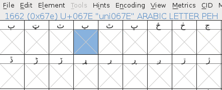

We will make *peh* by copying *beh* (U+0628) and swapping its single dot for three dots.

Click on the *beh* cell (position 1576), then right-click and select **Copy**. Then right-click on the *peh* cell and select **Paste**. Now that *beh* is now copied into the *peh* cell, the next thing is to change the dot.

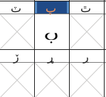

Find a glyph with three dots &mdash; *sheen* (position 1588, U+0634) will do. Double-click on the cell &mdash; this will open a glyph design panel. Press <kbd>V</kbd> to ensure the pointer tool (arrowhead) in the toolbox is selected, and press <kbd>Z</kbd> and enlarge the panel to give you a good view of the glyph.

Click and drag so that the nodes of the three dots above sheen change colour from pink to beige. If you accidentally include or omit a node, deselect or select it by pressing <kbd>Shift</kbd> and clicking. Press <kbd>Alt</kbd> + <kbd>C</kbd> to copy.

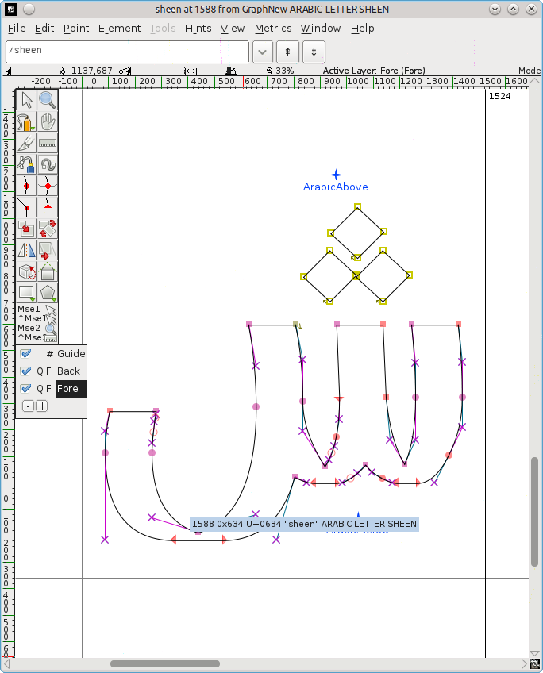

Go back to the font chart and double-click on the *peh* cell &mdash; this will load *peh* into another tab in the glyph design panel, alongside the *sheen* tab.

Click and drag to highlight the dot below *peh*, then press <kbd>Delete</kbd>. Press <kbd>Alt</kbd> + <kbd>V</kbd> to paste in the three dots, which will likely appear above the body of *peh*. Leave the dot nodes highlighted so that you can invert and move them more easily.

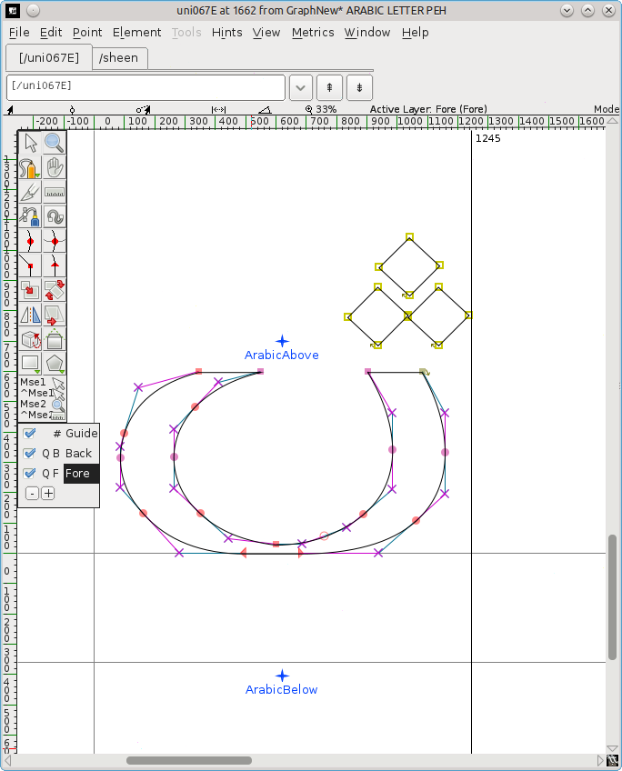

Invert the dots: select the flip tool (two triangles with a red dashed line between them) from the toolbox. (Alternatively, right-click in the middle of the dots, and select **Flip the selection** from the popup.)  Click on one of the dot nodes and drag the mouse slightly left or right.

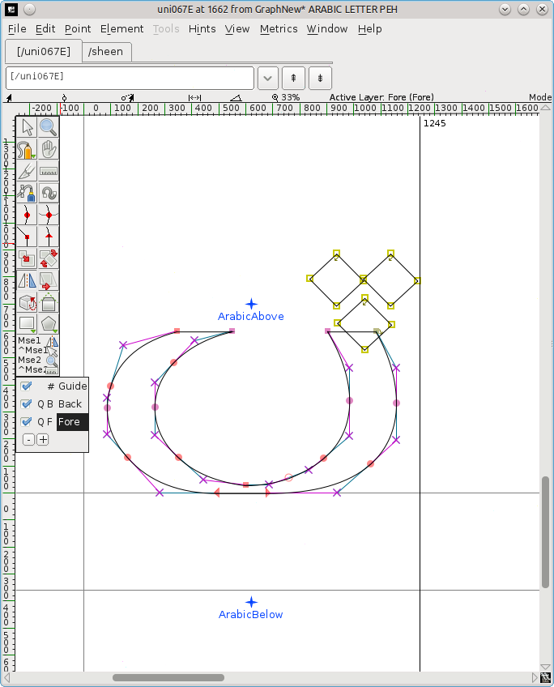

Move the inverted dots: press <kbd>V</kbd> to select the pointer tool again, click on one of the dot nodes, and drag them down below the body of the glyph. Position them centrally, above the *ArabicBelow* mark.

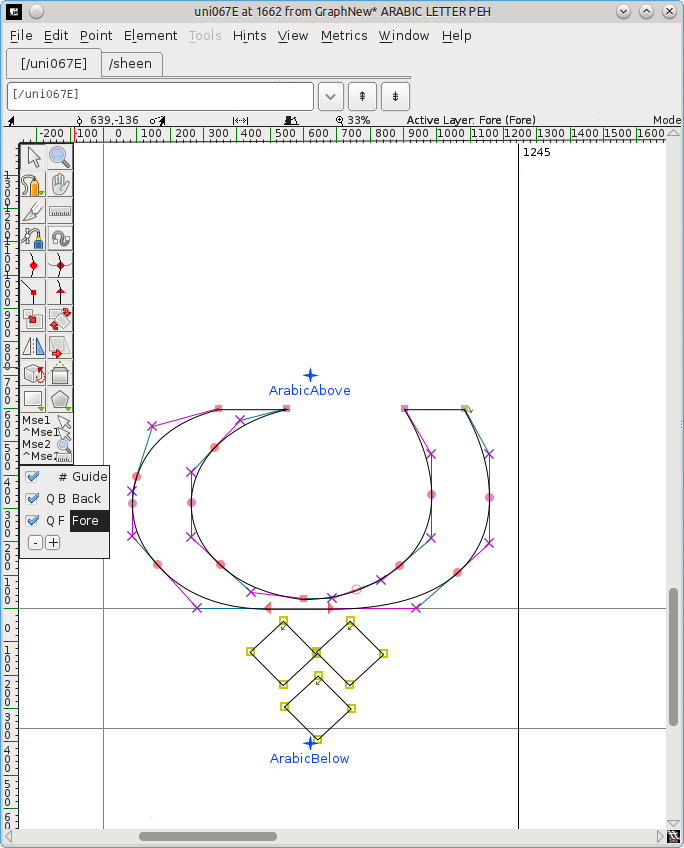

Close the glyph design panel. There should now be a new glyph for *peh* in the font chart. Save the adapted font (**File > Save**).

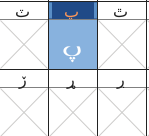

## Add the glyphs for the connected forms of *peh*

However, this is only the isolated (standalone) form of the glyph. If you try to use your adapted font, you will find that initial, medial and final forms are not available. These have to be created separately.

>The[se] forms are built as unencoded glyphs (glyphs whose encoding is -1 in FontForge conventions). Th[ey] have no predefined slots." (Khaled Hosny)

Select **Encoding > Add Encoding Slots** and enter the number of the glyphs you want &mdash; in this case, 3. FontForge will add the same number of slots at the very end of the font, and you will be moved there in the font chart. The last three cells (positions 65537, 65538, 65539) have a question mark as a reference glyph, and it is in those cells that you will add the unencoded glyphs by repeating the process above.

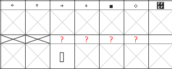

Note that if by mistake you start typing when the font chart still has focus, you get moved to the European section at the top. To get back to the bottom, select <strong>View > Go to</strong>, click the dropdown box and select <strong>Not a Unicode Character</strong>,  and then click <strong>OK</strong>.

### Create the final form

Roll the font chart up a bit until you come to a set of Arabic glyphs at position 65152 (U+FE80) onwards. At U+FE90 (position 65168) you will see a *behfinal* glyph &mdash; click on it and press <kbd>Ctrl</kbd> + <kbd>C</kbd> to copy it. Roll down to the third last cell in the chart (position 65537), click on it, and press <kbd>Ctrl</kbd> + <kbd>V</kbd> to paste in the *behfinal* glyph.

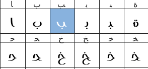

Right-click on the cell and select **Glyph Info**. The naming convention is to use the number of the isolated glyph + a suffix for the form, so change *Glyph Name* to **uni067E.fina**,  and click **OK**. The question mark in the reference cell will change to *peh*.

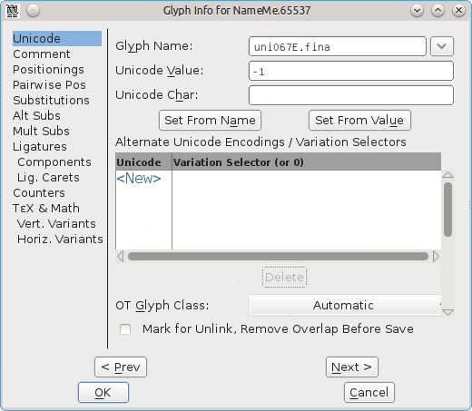

Get the three dots: double-click on *sheen* (U+FEB5) to load it into the glyph design panel, select the three dots and press <kbd>Ctrl</kbd> + <kbd>C</kbd>.

Double-click on the new *pehfinal* to load it into the glyph design panel, click and drag to highlight the nodes of the dot and press <kbd>Delete</kbd>.

<kbd>Ctrl</kbd> + <kbd>V</kbd> to insert the three dots from *sheen*, flip them, and move them into position below the glyph body. Press <kbd>Ctrl</kbd> + <kbd>S</kbd> to save the revised font chart.

### Create the initial and medial forms

Copy the initial form U+FE91 (position 65169) to the penultimate cell (position 65538), delete the single dot and paste in the three dots.

Right-click the cell, select **Glyph Info**, change *Glyph Name* to **uni067E.init**, and click **OK**.

Copy the medial form U+FE92 (position 65170) to the last cell (position 65539), delete the single dot and paste in the three dots.

Right-click the cell, select **Glyph Info**, change *Glyph Name* to **uni067E.medi**, and click **OK**.

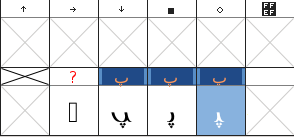

Select **File > Save** to save the revised font chart.

## Add the lookups

The isolated form has to be mapped (linked) to its initial, medial and final forms.

Select **Element > Font Info > Lookups**.

Click on the **+** beside the entry *'init' Initial Forms in Arabic lookup 2*. This will open a submenu of the same name. Click on this submenu.

The *Edit Data* button on the right will now become available &mdash; click it.

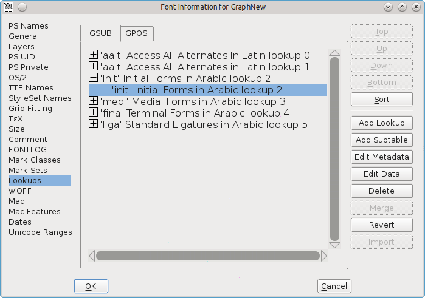

In the *Lookup Subtable* panel that pops up, ensure that the *Unicode* button is checked. Roll the list of characters down until you come to the end.

In the box beside *Default Using Suffix*, enter the relevant suffix (in this case, **init**), and then click **Default Using Suffix**.

A new mapping will be added to the list of characters, from uni067E (the isolated form of *peh*) to uni067E.init (the initial form).
Click **OK**.

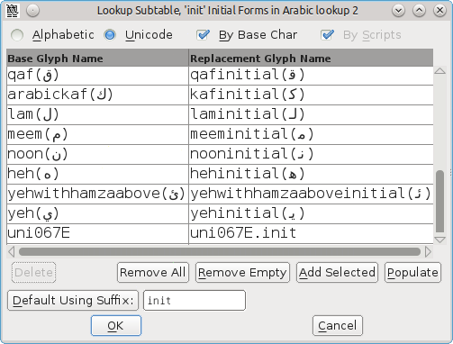

Do the same for the submenus under the entries *'medi' Medial Forms in Arabic lookup 2* and *'fina' Terminal Forms in Arabic lookup 2*, choosing *medi* and *fina* as the relevant suffix.

Click **OK** again to close the panel, and save the font chart (<kbd>Ctrl</kbd> + <kbd>S</kbd>).

Note that *Default Using Suffix* only seems to work on glyphs in the Unicode 06 (*Arabic*) block &mdash; glyphs in Unicode 07 (*Arabic Supplement*), e.g. *ain* with two dots may have to be added manually by clicking the line marked *New* and typing in the names.

### Generate the adapted font

Select **File > Generate Fonts**.

In the dropdown showing *PS Type 1 (Binary)*, select **TrueType**, and check that the filename reads *GraphNew.ttf*.

Navigate to where you want to save the font, and then click **Generate**. Click **Yes** and **Generate** to the two information messages that come up.

You can then use your normal font installation procedure to install the adapted font. The new glyph *peh* can then be used alongside the existing glyphs in the same nonsense examples as at the beginning of this chapter:

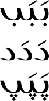

Note that if you are using a font in LibreOffice and make changes to that font, you need to restart LibreOffice to have it see any changes &mdash; otherwise it will use the previous version of the font, and not the one with the new changes.

Thanks to [Khaled Hosny](http://khaledhosny.org) for his advice on using FontForge to edit Arabic glyphs.

## Further reading

* [This thread on improved Arabic auto-hinting](http://lists.nongnu.org/archive/html/freetype-devel/2015-08/msg00016.html) has a tip about how to draw the overlapping parts of Arabic glyphs.
