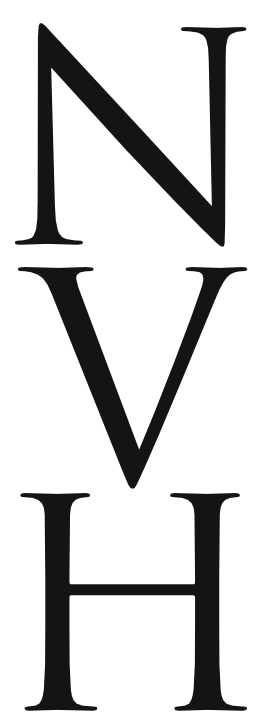

Making the capital letters should follow a pattern very similar to the making of the lower case letters. You begin by designing key letters whose shapes and characteristics lend themselves to the design of characters which share a common shape. Just like with lower case letters, the frequency with which letters are used also remains an important factor in the choice of the letters.

The first two letters to design are "H" and "O". The design of these letters should not just be in relation to each other, but also in relation to the existing lower case letters.

It is at this stage that you determine the proportion of the lower case to the upper case. You may want to adjust the ascenders and descenders of your lower case or adjust your capitals to the lower case to create the proportion that suit the purpose of your design.

The weight of strokes in the upper case often needs to be somewhat heavier than the strokes of the lower case. You may want to create an interpolation experiment to rapidly find how much heavier they should be.

The next set of letters to consider adding are A E S I N and either P or D and maybe V.

Depending on the style of the font you are making you may find that the capital letters require more variation in width than you have in the lower case letters. The width of the E S and P may be substantially narrower than the H or may be similar. 

Generally the N and V are similar to H but slightly wider.

<table border="0" cellpadding="13"><tbody><tr><td></td>
<td></td>
<td> </td>
</tr></tbody></table>

The D may be similar to H or quite a bit wider.

<table border="0" cellpadding="13"><tbody><tr><td></td>
<td> </td>
<td> </td>
</tr></tbody></table>

The shape of O can tell you quite a lot about the C, G and Q. The shape of H tells you a bit about I and J and the left side of B D E F K L P R.

It also tells you a little about T and U. The shape of A can tell you quite a lot about the shape of V.

<table border="0" cellpadding="13"><tbody><tr><td></td>
<td style="text-align: center;"> </td>
<td></td>
</tr><tr><td></td>
<td></td>
<td></td>
</tr></tbody></table>

The shape and proportions of V tells you a little about how to design Y W X. The shape of the Z is distinctive.

<table border="0" cellpadding="13"><tbody><tr><td></td>
</tr><tr><td> </td>
</tr><tr><td> </td>
</tr><tr><td> </td>
</tr></tbody></table>
