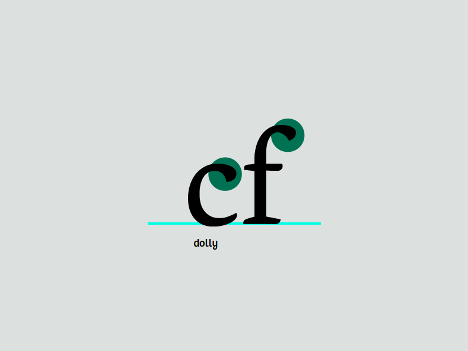
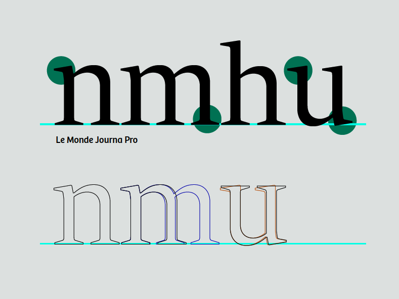
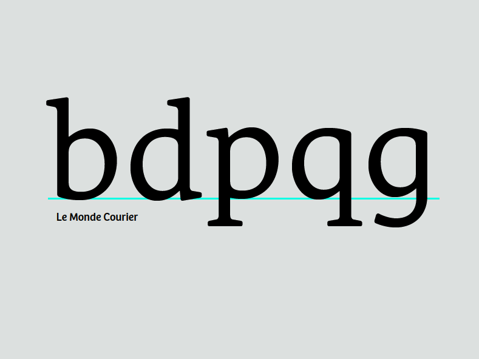

You may have noticed in fonts you've seen before that, while each letter has its own shape, they all relate to each other. By carefully de-constructing a few glyphs, you gain the building blocks of nearly all the others.

Note the similarity between the upper terminals on this c and f:

Their shapes indicate that they belong in the same group, even though they are subtly different. The terminals are one of the identifying traits of a font, and generally are repeated on many of the letter forms.

However, excessive dependence on modularity shows its own marks in a design, and therefore should be avoided &mdash; unless that is a look you want.

## Proceeding with the other lower case letters

You have already made your letter 'n'. From this, you can easily derive the 'm', 'h', and 'u' by cloning, stretching, and rotating, respectively. There are subtle changes in the spacing of the stems in the 'm' and the 'u'. In the image below, the 'u' has changed not only its spacing but its serifs. This doesn't happen automatically; it's up to you to get in there and push the points around.

The 'i' can be derived from the stem of the 'n'. The 'l can be made from the stem of the 'n' with some adjustments.

### Making the 'd' from the stem of 'h' and 'o'

Open the glyph window for the letter 'd' by double-clicking below the 'd' in the font view. From the font view, copy the 'o' and paste it into the glyph window for the letter 'd'. Then do the same for the 'h'. At this point you can delete the part of the 'h' that you're not going to use. Position the remaining pieces together so they resemble a 'd'.

Clearly, there's more work to be done here. We'll make some adjustments. Narrow the right side of the 'o' where it meets the stem.

To improve the optical spacing and allow the shape to look more balanced, make a little room at the serif by adding a point to the stem and pushing the bottom points to the right.

Below is an overlay of the starting shape and the new shape.

Now that you know how to assemble from existing parts, you can make other similar letters. Keep in mind the subtleties that make each letter individual, yet still part of a family.

### Deriving the 'b', 'p', and 'q'

Now that you have the 'd', by flipping and rotating you can make a reasonable 'b', 'p', and 'q'. Again, be aware of how the serifs and the contrast differ in each letter. Your font doesn't have to do this exactly the same way, but it's one of the things you should think about.

### Make the 'g'

You can start with the 'q', stretching and altering the tail, to make the single bowl 'g'. No shapes closely resemble the binocular 'g'. The binocular 'g' usually needs to be noticeably lighter in order to look right when set with other letters.

### On to 'f' and 't'

The 't' has an ascender, but it's generally shorter than the ascenders of the other lower case letters. By comparison, the 'f' is much taller and usually encroaches on the space of the letter next to it. They both have crossbars which are generally at the same height, width, and thickness. Often you can copy from one to the other.

### Now make the 'e'

The 'e' will be loosely based on the 'o'. The crossbar of the 'e' is lower than that of the 't', but has the same thickness. The hook at the bottom of the 'e' will be informed by the bottom of the 't'.

### From the 'e' comes 'c'

Creating the 'c' from the 'e' involves deleting the crossbar and adding the terminal at the top. The upper terminal of the 'c' can be similar to the upper terminals of other letters such as the 'a', 'f', and 'r'. The terminals of the 'c' can also form the basis for the 's'. The 'e' can also influence the proportions of your 'a'.

### 'v', 'w', 'x', 'y', and 'z'

These letters are somewhat difficult because they don't have forms that are related to the other letters. This means you have to just jump in and draw the 'v'. Make the downstroke as thick as your thick stems, and make the upstroke as thin as the thinner strokes in your other letters. Once you have the 'v', you have a basic plan for the 'w' and 'y'. For 'x' and 'y', focus on matching the contrast of the rest of the design while compensating for the illusions that occur in diagonal and crossing diagonal forms.
