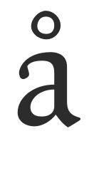
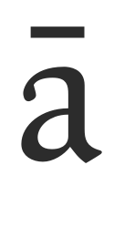
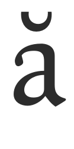

A diacritic is a mark added to a letter, often used to change the sound value of the letter to which they are added. Some diacritical marks, such as the 'acute' and 'grave' are often called accents. Diacritical marks may appear above or below a letter, or in some other position such as within the letter or between two letters.

FontForge can automatically create accented characters in 2 main ways;

1. FontForge contains rudimentary information on where to place diacritic marks, so can automatically build most accented characters.
2. For much greater control of diacritic placement, FontForge can place diacritic marks based on the position of user created anchor points.

### FontForge's basic auto placement of diacritic marks.
In FontForge's 'Element' menu, is a function called 'Build' that can be used to create accented characters, certain composite characters and some duplicate characters. To auto build accented characters FontForge uses the 'Element > Build > Build Accented Glyph' function. This function can also be performed with the keystroke 'ctrl + shift + a'. So, using the example of building the 'a acute' character, we would need to have already created the lowercase 'a' and the 'acute' glyph. Then selecting the 'a acute' character slot and using the 'Element > Build > Build Accented Glyph' function, FontForge will place a reference to the lowercase 'a' glyph and a reference to the 'acute' glyph into the 'a acute' character slot (see below).

This automatic placement of diacritic marks can be tuned by preferences, found in the 'accents' section of FontForge's preferences menu 'File > Preferences > Accents' (see below). 

'AccentOffsetPercent' controls the amount of vertical space between the base glyph and the mark glyph. The value entered here is a percentage of the em square of the font. So a value of '6' will offset the mark glyph from the base glyph by 6 percent  of the font's em square.
The preferences of the horizontal placement of the mark glyph can also be set. Selecting ' On'  for the   preference 'AccentCenterLowest' will centre the accent glyph to the lowest point of the base glyph. 
Selecting 'AccentCenterHighest' to 'On' will centre the accent to the highest point of the base glyph. 
Selecting both the above preferences to 'Off' will centre the accent into the width of the base glyph. Selecting both the above preferences to 'On' will centre the accent in the width of the character slot.

###Using Anchor Points to place diacritics

The most accurate and efficient way to build accented characters in FontForge is to use 'anchor points'.

Anchor points allow fine control of the positioning of where the diacritic mark will be positioned in relation to each base glyph in the accented characters. So, in the case of the 'a ogonek' character, the 'a' glyph is the base glyph, and it will be positioned normally, the 'ogonek' glyph is the 'mark glyph' and will be positioned so that the anchor point in the 'mark glyph' coincides with the anchor point in the base glyph.

In the example below, creating an 'a ogonek' character, an anchor class has been created called 'bottom'. In the lowercase 'a' glyph, the 'bottom' anchor is placed at the bottom of the stem of the 'a'. This is the 'base glyph' form of the anchor. (see below)

In the 'ogonek' glyph the 'bottom anchor is place at the top of the ogonek glyph, in the form of a 'mark' anchor. (see below)

Then, when the 'a ogonek' character is built (using the 'Build Accented Charcter' function) the 'bottom' mark anchor point will be placed at the same location as the 'bottom' base anchor point, ensuring that the referenced ogonek glyph is placed correctly at the foot of the stem of the referenced 'a' glyph (see below).

