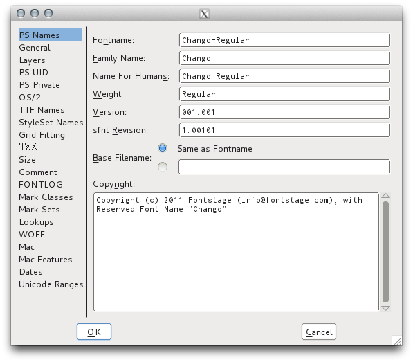

## Element, Font Info

The Font Info window is ubiquitous in font editors, and FontForge closely follows the OpenType Specification. 
It may appear cryptic at first, but using it can help you become more familiar with the OpenType format, and, in turn, reading about the OpenType format makes the dialog more approachable. 

## Version Numbering

Software developers like to use [Semantic Versioning](http://semver.org) for their programs, and this is also a good idea for your fonts. 
In a way, fonts are an "API" for text to access some associative feelings in readers. 

A MAJOR version would be after a complete redesign. Compare [Exo](http://www.google.com/fonts/specimen/Exo) and [Exo 2](http://www.google.com/fonts/specimen/Exo+2). 
If you have a document using Exo, you don't want to jump into Exo 2, because the feeling evoked, the 'voice' or 'flavor,' is (subtly) different. 
Adding support for one or more new scripts that are quite similar in height, or a substantial number of languages, could also constitute a MAJOR revision, as could anything else that substantially changes the vertical or horizontal metrics. 
However, if a complementary design is made for 2 scripts, it may be best to release 2 or 3 families, one with each script scaled appropriately and the other script(s) scaled as secondary fonts for simple fallback typesetting of multilingual texts. 

A MINOR version would be anything that subtly changes the metrics, such as vertical metrics, horizontal sidebearings or improved kerning, or making minor corrections to some glyphs, because such updates will cause documents using the font to reflow (albeit subtly in many cases.) Here is an example from ["Roboto Rebooted: Why Google Updates Its Font Like The Rest Of Its Products"](http://www.fastcodesign.com/3033126/roboto-rebooted-why-google-plans-to-update-its-font-like-the-rest-of-its-products):

 

Adding just a few or a dozen glyphs to "complete" coverage of a previously intended character set or to add support for just a few more languages is probably MINOR, especially if it doesn't change the vertical metrics. 

A change at the PATCH level would be anything that improves the font without changing the metrics or changes a glyph design in a visible way, that don't affect the final text layout. 
Your 1.001 release might not have fsType set to 0 or be run through fontcrunch, and changing both those things in a 1.0.1 release won't be visible or reflow anything. 
Sadly, the third PATCH version number isn't available in OpenType font version metadata fields.
Instead, increment the MINOR version number for such changes to hinting or metadata. 

Also, the version should have no more than 3 decimal places, and this may be represented with 5 in a TTX file.
Eg `2.001` is typical, and may appear as `2.00099` in TTX XML. 

If you release libre fonts, the [Github Releases](https://www.google.com/search?q=github+releases) features are very useful.

## Family Naming

Microsoft works hard to ensure that a program written for a previous version of Windows will continue to run on the latest versions, enticing people to upgrade. This means that the basic TrueType font model introduced in Windows 3 is still with us, and Windows does not support font families with more than the 4 basic styles (Regular, Italic, Bold, Bold Italic.) 

This means for font designers that our font family names should be set up in a way that all our fonts can be used in all operating systems. The OpenType format allows for this, complementing the Family and Style Name values with "Preferred Family Name" and "Preferred Style Name" values that will take precedence in OpenType-aware software.

This [Family Naming Google Docs Spreadsheet](https://docs.google.com/spreadsheets/d/1ckHigO7kRxbm9ZGVQwJ6QJG_HjV_l_IRWJ_xeWnTSBg/edit#gid=0) is based on information shared by Polish font expert Adam Twardoch and discussed in the [Fontlab forum](http://forum.fontlab.com/index.php?topic=313.0). 
It supercedes the [OpenType specification example](https://www.microsoft.com/typography/otspec/namesmp.htm). 
