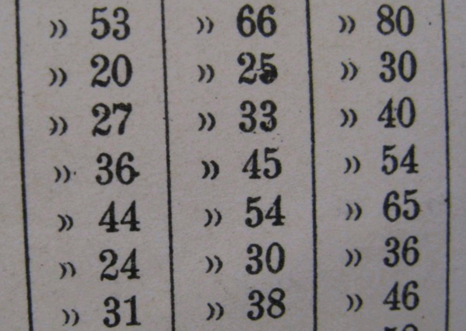

Numerals are often difficult for font designers — and for several reasons. One is that numerals have a very large number of curves. Another is that numerals often use conventions in their shapes that are different from (or are even in violation of) the visual conventions seen in the rest of the font design. Furthermore, numerals can have very large number of strokes (like 8 and 5 do), or they may have large white spaces (like 1, 7, and sometimes 2 and 4). Both situations can be hard to manage. Finally, there is the problem of how to make sure your zero looks different from the capital O.

It can be useful to look at the numerals found in a wide variety of fonts to become more familiar with the ways in which designers cope with these problems.

In those numerals with a dense number of strokes (such as 8), you may find that designers allow the stroke widths to become a little thinner than is typical of the letters in the font. A similar approach can be seen the design of the double story g.

Conversely, to compensate for numerals with large white space proportions, some strokes are likely to become heavier than would be typical.

In the case of distinguishing the zero from the capital O, there are a wide range of solutions — such as making the zero narrower than the O, or a zero that is perfectly round, or perhaps (especially in a monospace font) having a slash through the zero.

Having the zero narrower than the capital O while sharing its height is the common approach. This approach is typical of lining numerals. Lining numerals are the most common style for numerals. Examples of fonts that use this approach include: many Garamonds, Futura, and the Google web font Open Sans. Below is Open Sans showing the zero, capital O, zero and then other numerals.

A perfectly round or nearly perfectly round circle is less common, but does exist. Examples of fonts that use this approach include the Google web font Vollkorn as well as other commercial types such as Mrs Eaves, Vendeta and Fleischman BT Pro. Fonts that use oldstyle proportional numerals are more likely to feature this approach. Sometimes a zero at x-height but which is narrower will also be seen.

Numerals also come in up to 11 identifiable styles when you include fractions, superscripts and subscripts. We will look at the 5 most common ones.

## Lining style numerals

The most common styles of number found in fonts are Tabular Lining and Proportional Lining. Lining refers to the heights that the numbers use. If it is a lining style the heights for all the numbers will be optically the same. The difference between Tabular Lining and Proportional Lining numbers is that in Tabular Lining all the numbers also share the same widths. This style is useful for spreadsheets and any other purpose where it is helpful for numbers to stay stacked up in neat lines both horizontally and vertically. 

Proportional lining numbers have the advantage of having the ability to looking more visually even because the forms and spacing of the numbers can vary to compensate for differing stroke density.

## Ranging or Old style numerals

Tabular numbers are a relatively new invention in historical terms. Before they existed there were old style proportional numbers. Old style numbers are useful if you want the numbers to mix in and share the style of a text.

Tabular oldstyle numbers are fairly rare. They can be useful in an annual report where you want the feeling of an old style number but the tabular spacing typical of that kind of document. The image above is from a typewriter Library catalog card. 

## Hybrid style numerals

Hybrid numerals don't share the font's cap-height or x-height, but instead occupy their own height. The term "hybrid" refers to a mixing of the old-style and lining numerals. Examples of fonts that use hybrid style numerals include Georgia and the Google web fonts Merriweather and Donegal. The zero, capital O, zero, 1, 2, 3, etc glyphs from Merriweather are shown below.

