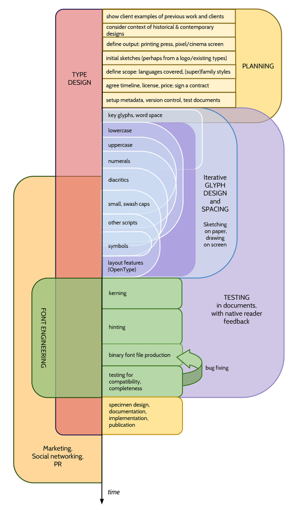

Now that you have a sense of how a font design can vary, you may want to decide whether your project
will have only one font, or if it will be a collection of several inter-related fonts, or a (now traditional)
three or four-styles type family, or perhaps something even larger.

Common styles of type families include:
* A Regular and a Bold weight
* Regular, Bold, Italic &mdash; eventually with a Bold Italic
* Thin, Light, Book, Regular, Semi-Bold, Bold, Extra-Bold, Heavy and Black 
* Regular, Condensed, Bold and Bold Condensed
* Narrow, Condensed, Wide and Extra Wide
* Regular, Semi-Flourished, Flourished, Very Flourished, Extremely Flourished.

While there are reasons that typical patterns in families exist, you may find you want a very
different kind of grouping.

The scope of the project can be determined exclusively by your ambition and the amount of free
time you have. But project scopes are often determined by the intended use of the collection or family of
fonts, or, even further, by the needs of your client. Certainly for professional type designers,
the latter two aspects are usually the determining factors.

## Feeling

The most important thing about a type design is the feeling it evokes. This is notoriously hard
to verbalize, but it is what makes a particular typeface meaningfully different from any other.

A type designer in Portugal, Natanael Gama, designed the [Exo family](https://www.google.com/fonts/specimen/Exo) with FontForge.
On his homepage he describes another project for the sculptor [John Williams](http://ndiscovered.com/john-williams/) and includes a graphic showing his brief in a matrix of continuums of feelings:

* Figurative to Abstract 50%
* Graceful to Robust: 30%
* Calm to Energetic: 0%
* Puzzling to Plain: 15%
* Experimental to Standard: 15%
* Prestigious to Ordinary: 15%
* Other Ideas: Beautiful, Outside Spaces, Human Condition

## Glyph coverage

A font is still a font even if it has only one glyph. But a font can also have a few hundred
or even thousands of glyphs. If your project is self-initiated, then this choice is ultimately
arbitrary. You may decide you only want capitals, or that you want to include the glyphs found in
the other fonts you use. If you are doing work for a client, you may want to clarify which language
or languages the font is meant to support. Your goal could also be to extend an existing font,
adding a few glyphs to make it work in one or more additional languages.

It’s certainly a good idea to make this choice deliberately, and to err on the side of including
less rather than more. Often as a typeface is being made, it can be tempting to include more and
more glyphs &mdash; but it is frequently more valuable to continue to improve the core set of glyphs
rather than adding new ones.

## Multi-style family workflow

If you know from the start that you will have more than one font, you will save yourself time if you
plan and build the font family systematically, and work on the styles somewhat in parallel, rather
than completing one style at a time.

It is of course impossible to create *every* style in a completely parallel manner, but it’s
possible to complete a given design step for each style. This allows the relationships between
the styles to be reviewed early in the process. You may find that it is useful to complete
one full set of test letters (such as “adhesion”) for a regular version, and then to create the same
set of test letters in the other styles. However, you can also take a more granular approach and
make decisions about specific parts of the base letters (such as the ‘n’ and ‘o’) for all styles.

Depending on the size and composition of the font family you are planning, you may find that it saves
time to make instances of glyphs that can be interpolated. Not only does this allow you to interpolate
intermediate styles, but it also aids in making design choices about typographic variables that
shift across members of a family.  

For an overview of the typographic variables you should consider, see the chapter [“What is a
font?”](What_Is_a_Font.html).

## Technical: Version Management 

You should learn to use Git and GitHub to store your files, and use the "SFDir" format for your sources.

* <https://help.github.com/articles/what-are-other-good-resources-for-learning-git-and-github>
* <http://justinhileman.info/article/git-pretty/>

## Overall Process

Back in 2010, Dave Crossland, Eben Sorkin, Claus Eggers Sørensen, Pablo Impallari, Alexei Vanyashin, Dan Rhatigan and other Anonymous contributors developed a total process diagram for Latin fonts:

This was made with Google Drawings and like this site is licensed under the Creative Commons Attribution-ShareAlike licence.
The source is at [goo.gl/rxI63X](http://goo.gl/rxI63X)

A version for Non-Latin projects is also available at [goo.gl/LJ8zm8](https://goo.gl/LJ8zm8)

## Testing Environments

When planning your project, you must consider the intended mediums for your typeface.
Examples of mediums are web and mobile platforms, digital projectors,
cheap office bubble-jet and laser printers, high-end print bureau laser printers,
magazine offset lithographic printing, and high-speed high-volume newspaper printing.

You should then try to acquire or arrange access to those typesetting technologies, so you can see
the real results of your work.

Throughout the type design process, you will find it very helpful to preview text set with your
(prototype) typeface at a resolution higher than your laptop or workstation screen. This typically
means a laser printer with "true" 1200 DPI and Adobe PostScript 3. For individuals it is possible
to purchase something like this for around $500, and some 2013 recommendations were:

* HP P2055d
* Xerox Phaser 4510 
* Xerox Phaser 5550
* Nashua/Ricoh P7026N

In May 2013, the [Production Type](http://productiontype.com) studio had a Xerox 7525 with a "fiery" controller, which cost around €12,000 to purchase. This could be leased for €300 per month with toner, parts and maintenance.
In late 2015, Octavio Pardo leased a [Xerox Phaser 7100](
http://www.xerox.es/oficina/impresoras/impresoras-en-color/phaser-7100/eses.html) in a similar way for €30 per month.

## OpenType Features

You can plan the OpenType features of your project before you begin drawing. Common features include:
* `liga` ligatures
* `onum`, `lnum` numerals

For some languages `locl` works but for others it doesn't, so it is best to expose language specific forms via both `locl` and `ssNN` or `cvNN`.

The OpenType specification allows for some kinds of features which are not recommended:
* `hist`. Read more in this [discussion on TypeDrawers](http://typedrawers.com/discussion/1358/what-are-the-best-practices-for-the-hist-feature-long-s).

## Further Reading

* Aoife Mooney's presentation on the type design process at TypeCon 2014: <https://vimeo.com/107421895>
* TypeDrawers discussion of [Printer recommendations for proofing](http://typedrawers.com/discussion/314/printer-recommendations-for-proofing)
