Designing a font in FontForge will involve using a number of tools and utilities, starting with a
set of drawing tools which may feel familiar to users with experience in vector graphics &ndash;
there are noticeable differences through.  
We’ll first seek to get an understanding of how B&eacute;zier curves work, before looking at
FontForge’s drawing tools themselves.

## Understanding B&eacute;zier curves

The concept of “B&eacute;zier curves” refers to a particular mathematical representation used to
produce smooth curves digitally. Generally, *Cubic*- and *Quadratic*-order of these curves are used
&mdash; through FontForge also supports *Spiro* curves, which are an alternate representation for
the designer.

In this chapter, we will only discuss *Cubic* paths, as that’s what’s generally used when drawing
glyphs. *Spiro* paths will be discussed in the next chapter, and *Quadratic* curves are only found
in TrueType fonts and rarely used in drawing &ndash; they are rather generated at build time.

A typical B&eacute;zier path is composed of an anchor, with two handles that mark the overall
direction &mdash; the length of each handle determines the length of the curve on each side &ndash;
see below.

### Different kinds of points

#### Curve points (shown as round-shaped points)

*Curve points* have two handles, each of them being linked to the other so that the line between
them always stays straight, in order to produce a smooth curve on each side.
 
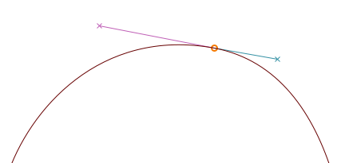

<h4 class="quiet">H/V Curve points (shown as lozenge-shaped points)</h4>

*H/V curve points* (‘horizontal/vertical’) are a variant of curve points that snap to the
horizontal or vertical axe &ndash; an essential tool in getting B&eacute;zier forms done right
(more on that in the next section).

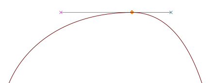

#### Coins or corner points (shown as square-shaped points)

*Coins* can have 0, 1 or 2 B&eacute;zier handles. The position of each handle is independant of the
others, making it suitable for discontinuities in the outline.  
Without handles, coins will produce straight lines.

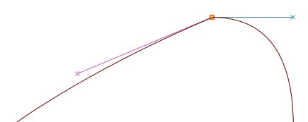

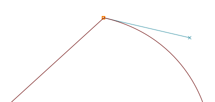

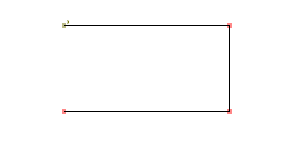

#### Tangent points (shown as triangular-shaped points, or ‘arrowheads’)

If you want to start from a straight line and then start curving smoothly, you will want to use
*tangent points*.  
A *tangent* leaves a straight line on one side, while the B&eacute;zier handle on the other side is
its direction &ndash; this ensures a continuous transition between the line and the curve.

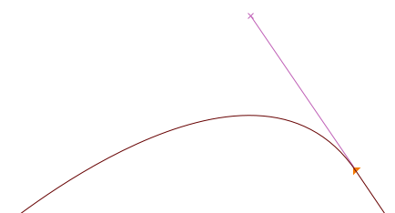

### Getting it right

In order to produce proper curves &ndash; with minimal control points and eased rasterization, the
anchors should always be placed at **the extremas of the curve**, and unless in places where you
have breaks in your letterforms, the line that determines the path should be **horizontal or
vertical**.

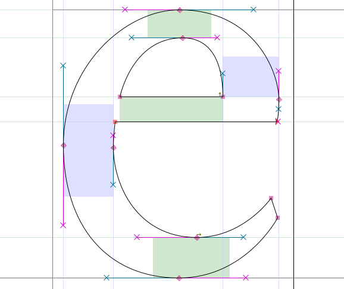

<b>Note:</b> If your control points aren’t placed at the extremas, FontForge will point out
the actual extrema with a sight icon:

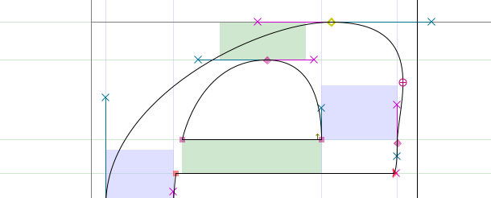

You can then fix this by copying your current outline to another layer, then move the control
points around so that it’s laid out properly &ndash; otherwise the FontForge Validation tool will
add the point at extremas automatically, at which point you can merge your misplaced anchor with
<i>Right-click > Merge</i>. 
More about that will be said later in the <a href="Making_Sure_Your_Font_Works_Validation.html">
Validation chapter</a>.

To elaborate, there are two cases where you will have to give up horizontal/vertical B&eacute;zier
paths:

- If you want to change the overall slope of your curve, as with the upper-left part of the ‘a’
  below that’s being kept almost flat:  
  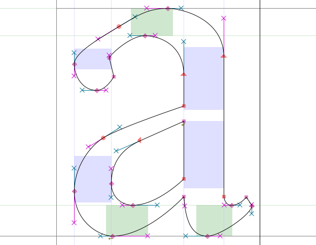
- If you want to place breaks in your letterforms, as with the lower-left part of the ‘g’ below
  &ndash; that’s typically where you will want to use a *Coin* (besides for drawing lines):  
  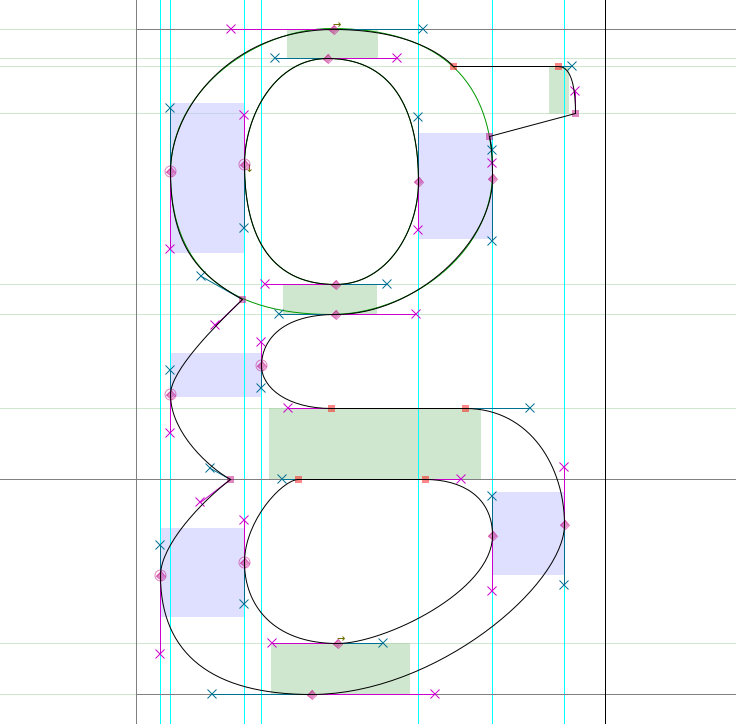

<b>Note:</b> As you can see, when setting breaks with a <i>Coin</i>, the
direction of each handle should be tangent to the curve where it arrives.

## Mastering FontForge’s drawing tools

From the main window, double-click on one of the glyph boxes to launch the Glyph Window.

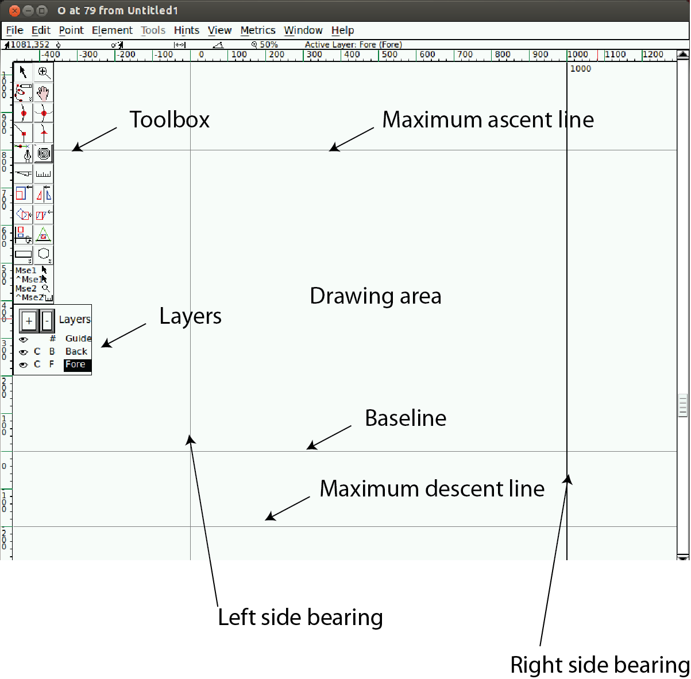

<b>Note:</b> The numbers along the top where the x and y axis intersect indicate, from left to
right:

<ul>
<li>The current (x,y) location of your cursor on the canvas</li>
<li>The location of the most recently selected point</li>
<li>The relative position of your cursor to the selected point</li>
<li>The distance between your cursor and the selected point</li>
<li>The angle from the selected point to the cursor (relative to the baseline)</li>
<li>The current magnification level, followed by the name of the active layer.</li>
</ul>

<b>Caution:</b> Sometimes, it seems like FontForge is not responding when you are
inside the Glyph Window. It might be that there is an open dialog box hidden behind it &ndash; so just
move it and process the dialog box.

A *Line* consists of 2 points.

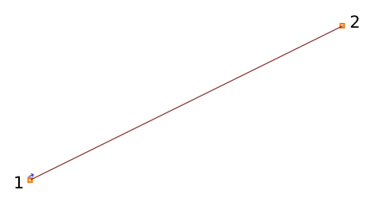

A *Spline* consists of 4 points: 2 end points of the spline and 2 ‘handles’, which describe the slope
of the spline at those end points.

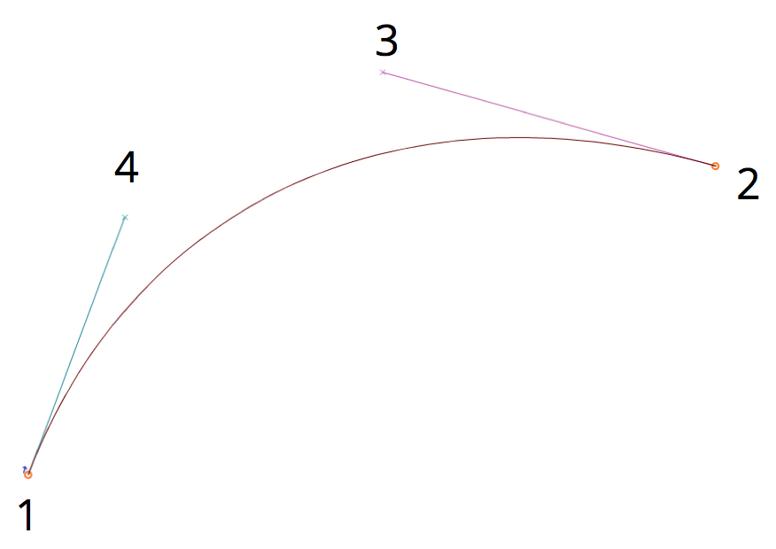

### Copy, paste, cut and delete points, splines and lines

As with most drawing softwares, FontForge allows you to Copy, Cut, Paste or Delete any point, line
or spline. These commands are available in the Edit menu, or using your OS’s typical keystrokes (also
shown alongside each command in the menu).

## Familiarizing yourself with the drawing tools

Now that you know your way around the canvas, it’s time to get acquainted with the tools.

### Point and Zoom

Point and Zoom behave similarly to the equivalent tools in other applications.  
The pointer is a selection tool, used to select points, paths, and other objects on the canvas.  
The Zoom tool lets you zoom in (Z) easily; in order to zoom out: go to the View menu and select
*Zoom out* (X) or *Fit*.

Note that you can also momentarily switch to the pointer tool while using another by holding down
the Control (Ctrl) key.

### The Freehand tool

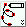

The Freehand tool allows you to sketch out irregular paths.

On the drawing area, click and hold, then move around to draw. Switch back to the pointer tool, and
you can select points on the path you have drawn.

When you select one of the points on the path, it will turn into a yellow circle. If the selected
point is on a curve, it will display its control points with a magenta handle and a cyan handle. You
can grab either handle and drag it around to change the shape of the curve.

### The point tools

Okay, now let’s go about using the point tools.

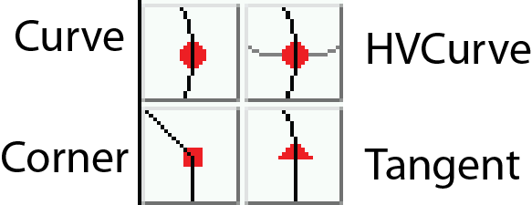

To add a point to a path, first select any of these tools, then click on the path and give it a
little push. You will get a new point on the line.

The Curve point tool is used to add a point in a curved segment.  
The HVCurve point tool constrains the new points so that they have either horizontal or vertical
control points &ndash; this is important for setting up extrema points.  
The Corner point tool allows you to make a sharp bend in the path.  
The Tangent point tool allows you to transition from a straight segment to a curved segment along
the path.

### The Pen tool

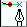

The Pen tool allows you to add a point on the curve and drag out its control points.

### Spiro

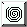

Selecting the Spiro tool puts you into Spiro drawing mode. Spiro drawing allows you to draw curves
that reflow as you reposition the nodes. Some people prefer this to the standard approach (known as
B&eacute;zier editing), but if you are used to B&eacute;zier editing you might find that it does
some unexpected things.

### Knife

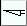

The Knife tool allows you to cut splines in two. This comes in handy if you have drawn a shape, but
only need part of it.

### Ruler

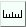

The ruler tool gives you measurement and coordinate information. When you use it, it displays a
floating ‘tooltip’ next to the cursor. If you hover your cursor over a point, the tooltip gives you
even more detailed measurement and coordinate information. If you bring it next to a spline, it
gives you information about the curvature and radius. Most usefully, if you click and drag the ruler
tool, you will see the distance you have dragged the cursor, plus every intersection that you have
stretched across.

### The transform tools

There are six transform tools:

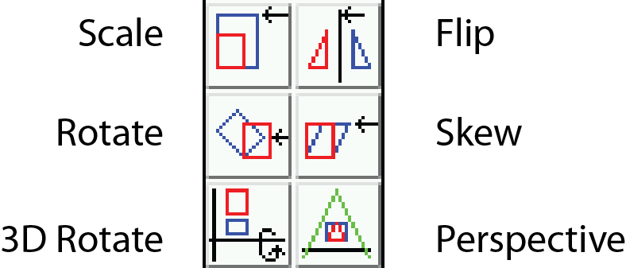

**Note:** For all of the Transform tools, if you double-click on the tool, you can enter numeric
values.

The Scale tool lets you freehand rescale an object. Holding down the Shift key allows you to scale
an object while constraining it to the proportional ratio.

The Rotate tool lets you free-rotate an object. It rotates the selected object around the position
where you initially click.

The 3D rotate tool lets you rotate an object in the third dimension, and projects the result on the
x-y plane.

The Flip tool allows you to flip a selection either horizontally or vertically. The point at which
you click the mouse is the point of origin of the transformation.

**Note:** After flipping a point you will probably want to apply Element &gt; *Correct Direction*.

The Skew tool lets you horizontally skew the selection either clockwise or counterclockwise
(withershins is how the dialog refers to counterclockwise).

The Perspective tool gives you another way to distort a shape in a nonlinear way.

**Note:** There is no numerical option for the perspective transformation.

### The Rectangle/Ellipse and Polygon/Star tools

These tools allow you to draw primitive geometric shapes, which is faster than constructing those
shapes out of separate line segments.

Clicking the chevron area on these tools will give you the option to switch to the alternate tool.
If you double-click on either of the tools, you can open the shape type’s options.

Rectangle options: corner style and bounding box (corner or center out).

Ellipse options: bounding box or center out.

Polygon options: number of vertices.

Star options: number of star points and depth of points by percentage. The higher the percentage
setting, the longer the arms of the star.

### Mse1 and Mse2

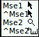

Under the toolbar, you can view the current tool and the operations available to both mouse buttons:

- Left button (Mse1)
- Left button + Ctrl (^Mse1)
- Mouse wheel button (Mse2)
- Mouse wheel button + Ctrl (^Mse2)

This way, you can use a few different tools without having to repeatedly click on the toolbar.

<b>Caution:</b> It appears that the Mse functionality doesn’t currently work
properly.

### Layers

The FontForge canvas has three layers by default: the Guide layer, the Background layer, and the
Foreground layer. Guide layers are used to insert guides (such as x-height or cap-height guides).
Foreground layers and background layers are both used for drawing, but only the topmost foreground
layer will be rendered into your final font.

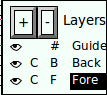

A checkbox indicates whether each layer is visible, and you can uncheck it to make a layer invisible. The C (or Q) indicates whether you’re using Cubic or Quadratic curves.

The #, B, or F refers to whether the type of each layer is a Guide layer, Background layer, or
Foreground layer, which is significant if you add more layers of your own. You can create and delete
additional layers using the plus (+) or minus (&minus;) buttons in this section of the toolbar.
Layer type and curve type can also be controlled by right-clicking (once you have additional
layers).

## Basic drawing

Next we will go over some basic drawing workflows, which you often find yourself in need of.

### Cutting a shape within another

1. Start by using the Rectangle tool to draw a rectangle within the drawing area of the Glyph
   window.
2. Next, use the Ellipse tool to draw an ellipse within the rectangle you just drew.  
   
3. Go to the Element menu and choose *Correct Direction*. You will see that the two shapes merged,
   and that you essentially punched a hole in the center of the rectangle.  
   

### Remove overlap

1. Add a star that overlaps the corner of the rectangle.  
   
2. Select the star and the earlier shape. You only need to select one point of each overlapping
   shape, but it is okay to select extra points.
3. Go to Element &gt; Overlap &gt; *Remove overlap*. You will see that your two shapes have become
   one.  
   

### Add a Point

Using the Pen tool, click and hold in the middle of a line segment, then drag the mouse to change
the shape.

### Tangent points

Select the bottom-left corner point of your new shape (the intersection of the curve and the
straight line). From the Point menu, you will see that *Corner Point* is checked. Select *Tangent*.
This changes the square node to a triangle, but that is all it does until you do the next step:
extending control points.

To do so, choose Element &gt; *Get Info*, which opens the Point Info Window. From the Location tab
in that window, go to the Next CP field set and set the Distance to a large number, such as 75.
Click OK. You will see that the curve now smoothly enters the straight line.

### Transformation

Now select about a quarter of the shape &mdash; the star and part of the ellipse in the middle.

Choose the 3D Rotate tool, move to the middle of the selected area, and slowly click and drag until
you see something you like, then release. Here is an example of 3D Rotate used on the practice
image:

### Set stroke shape and width

So far you have used the Freehand drawing tool to draw a line. If you double-click the Freehand
tool, you get the Freehand dialog shown here, which contains a drawing window. This is where you
select pen shape and size. This dialog also appears when you choose the *Expand Stroke* option in
the Element menu.

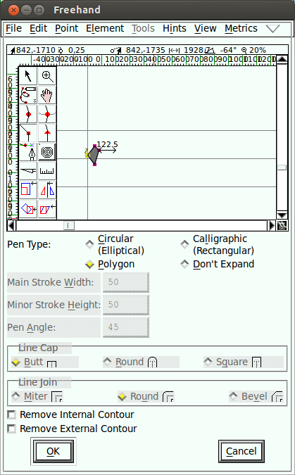

Using the Corner tool, draw a polygon and click OK.

Now, draw a line with the Freehand drawing tool. When you release the mouse button, the new path is
automatically stroked with the shape you chose in the Freehand dialog, as shown here.

## Keep drawing!

You should continue to experiment with the drawing tools until you feel comfortable that you can use
them to draw and transform whatever shapes you need. At this point, you are equipped to start
constructing the components of glyphs, but you should also take time to look at FontForge’s other
set of tools.  
The next chapter, [“Drawing with Spiro”], describes the Spiro drawing mode. Spiro drawing is
distinct enough from B&eacute;zier curve editing that it requires an explanation of its own.

[“Drawing with Spiro”]: Drawing_With_Spiro.html

# Further Reading

A [TypeDrawers Forum Discussion on Beziers](http://typedrawers.com/discussion/967) included these links shared by Nina Stössinger <a href="https://twitter.com/ninastoessinger/status/593687255341998080">on twitter</a>:

* [Bezier Curves and Type Design: A Tutorial](http://learn.scannerlicker.net/2014/04/16/bezier-curves-and-type-design-a-tutorial/) by Fábio Duarte Martins
* [So What’s the Big Deal with Horizontal &amp; Vertical Bezier Handles Anyway?](http://theagsc.com/community/tutorials/so-whats-the-big-deal-with-horizontal-vertical-bezier-handles-anyway/)
* [Hand Lettering: How to Vector Your Letterforms](http://design.tutsplus.com/tutorials/hand-lettering-how-to-vector-your-letterforms--cms-23248) by Scott Biersack
* [Type Basics](http://typeworkshop.com/index.php?id1=type-basics&amp;id2=&amp;id3=&amp;id4=&amp;id5=&amp;idpic=15#pictloader) by Underware
* [The Bézier Game](http://bezier.method.ac) by Marc MacKay
