ساخت حروف بزرگ باید به شکل مشابهی با ساخت حروف کوچک انجام شود.
شما با طراحی حروفی کلیدی که شکل و خصوصیات‌شان در طراحی حروف دیگری با شکل‌های مشابه به کار می‌آید شروع می‌کنید.
مانند حروف کوچک، بسامد استفاده از حروف همچنان یک عامل مهم در انتخاب‌شان است.

نخستین حروف برای طراحی، H و O هستند.
طراحی این حروف نه تنها در ارتباط با یکدیگر، بلکه بایستی در ارتباط با حروف کوچکی که از پیش طراحی کرده‌ایم باشد.

در این مرحله است که نسبت حروف کوچک به حروف بزرگ را تعیین می‌کنید.
ممکن است بخواهید ارتفاع بالا یا پایین‌روندهٔ حروف کوچک را دست‌کاری کرده و یا حروف بزرگ خود را طوری در نسبت با حروف کوچک تغییر دهید که هدف طراحی شما را برآورده کنند.

وزن خطوط در حروف بزرگ اغلب لازم است که بیشتر از وزن این خطوط در حروف کوچک باشد.
ممکن است بخواهید با کمک درون‌یابی (interpolation)، میزان این افزایش وزن را سریع‌تر به دست آورید.

مجموعه بعدی حروف می‌توانند‍ A E S I N و همچنین P یا D و یا شاید V باشد.

بسته به سبک فونتی که در حال ساخت آن هستید، ممکن است متوجه شوید که در قیاس با حروف کوچک، حروف بزرگ نیازمند تنوع بیشتری در عرض‌شان هستند.
عرض E ،S و P ممکن است به طور قابل توجهی کمتر از H بوده و یا ممکن است مشابه باشد.

عموما، N و V عرض مشابهی با H اما اندکی بیشتر دارند.

<table border="0" cellpadding="13"><tbody><tr><td>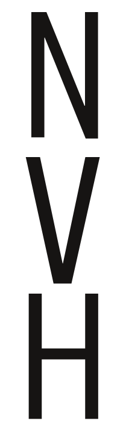</td>
<td>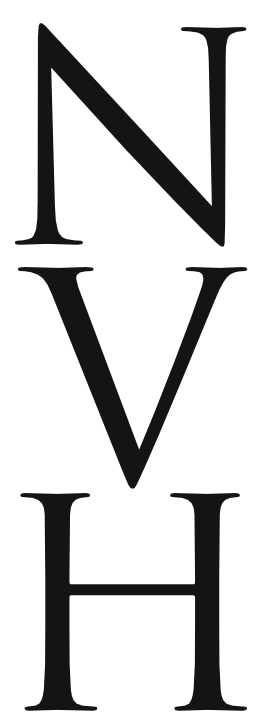</td>
<td>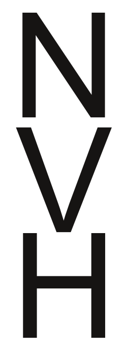 </td>
</tr></tbody></table>

عرض حرف D ممکن است مشابه H و یا قدری بیش از آن باشد.

<table border="0" cellpadding="13"><tbody><tr><td>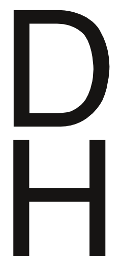</td>
<td> 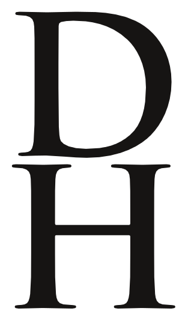</td>
<td> 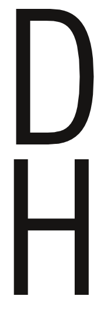</td>
</tr></tbody></table>

شکل حرف O می‌تواند ایده‌های زیادی درباره حروف C و G و Q به شما بدهد.
شکل حرف H می‌تواند ایده‌هایی درباره حروف I و J و همچنین بخش سمت چپ حروف B D E F K L P R در اختیارتان بگذارد.
افزون بر این، برای طراحی T و U نیز می‌تواند مفید باشد. شکل A هم بسیار به شکل V شباهت دارد.

<table border="0" cellpadding="13"><tbody><tr><td>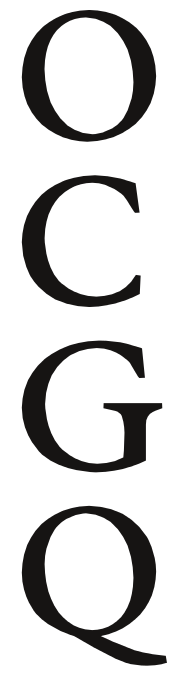</td>
<td style="text-align: center;"> 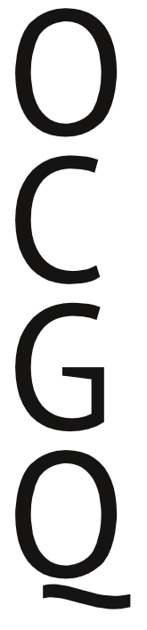</td>
<td>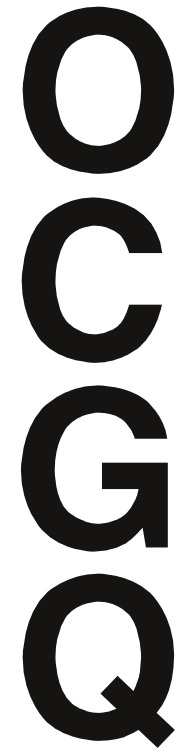</td>
</tr><tr><td>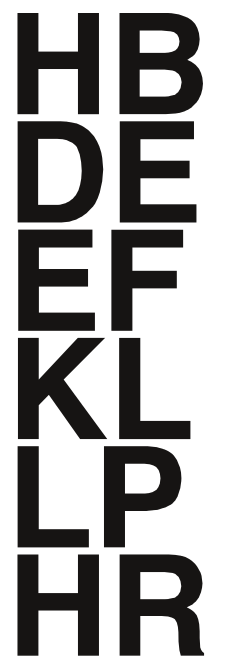</td>
<td>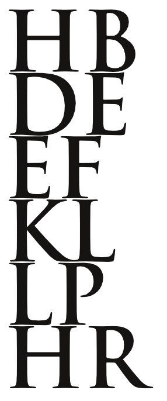</td>
<td>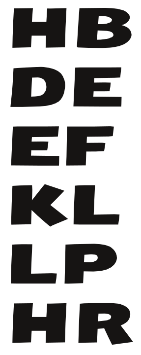</td>
</tr></tbody></table>

شکل و تناسب حرف V می‌تواند به چگونگی طراحی Y W X کمک کند. شکل حرف Z کاملا متمایز است.

<table border="0" cellpadding="13"><tbody><tr><td>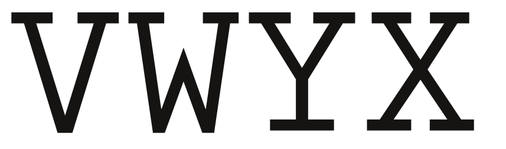</td>
</tr><tr><td> 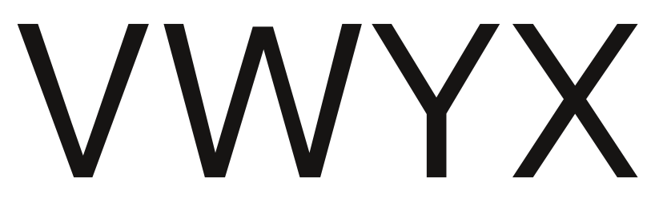</td>
</tr><tr><td> 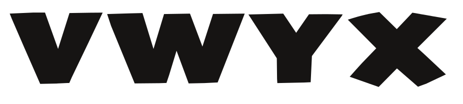</td>
</tr><tr><td> 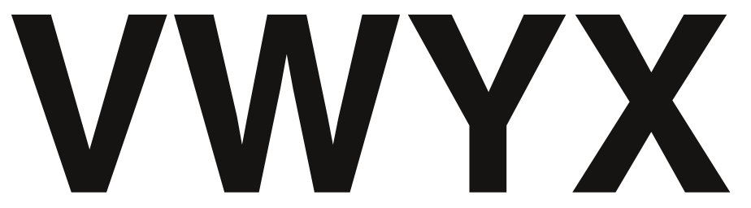</td>
</tr></tbody></table>
