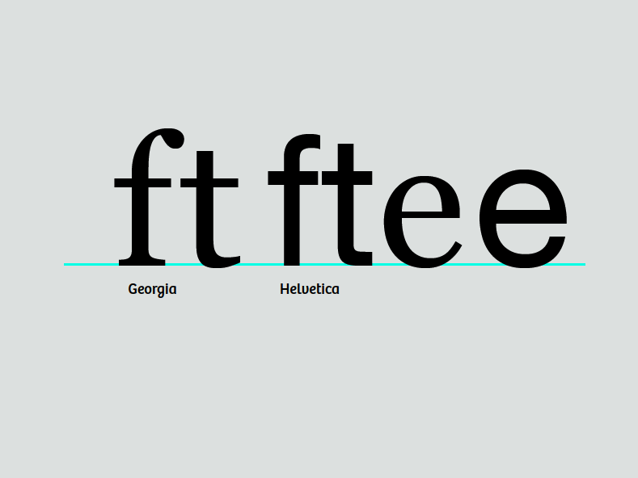
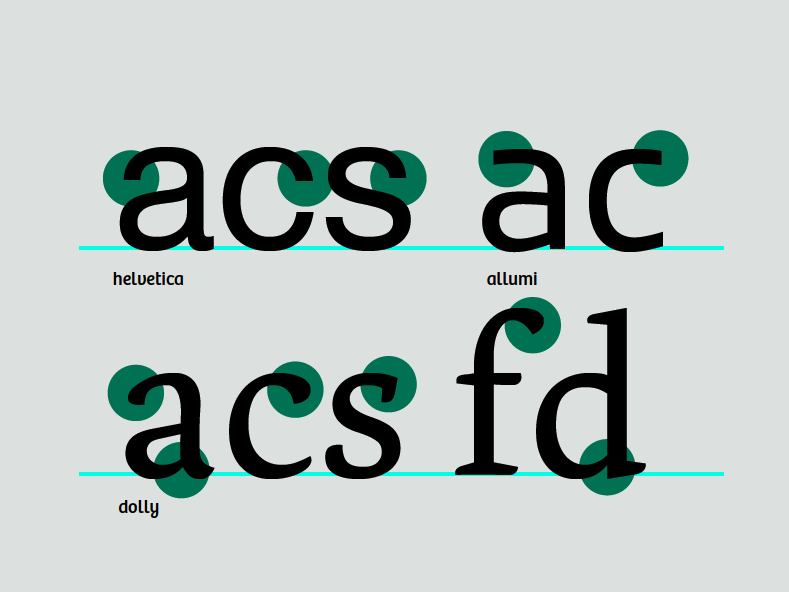

ممکن است در فونت‌هایی که قبلا دیده‌اید توجه کرده باشید که در حالی که هر حرف دارای شکل به خصوص خودش است، همه به یکدیگر مرتبط هستند.
با تجزیه کردن دقیق این گلیف‌ها، بلوک‌های ساخت مورد نیاز برای تقریبا همهٔ حروف را به دست می‌آورید.

به شباهت پایان‌بندی بالایی در  این حرف c و f توجه کنید:

هرچند تفاوت مختصری دارند اما شکل این حروف نشان می‌دهد که به گروهی مشابهی تعلق دارند.
پایان‌بندی‌های یکی از خصوصیات هویتی یک فونت هستند
و معمولاً در شکل بسیاری از حروف تکرار می‌شوند.

با این حال، وابستگی بیش از حد به ماژولاریته، نشانه‌های خاص خود را در طراحی نشان می‌دهد و بنابراین باید از آن جلوگیری شود
&mdash;
مگر اینکه این نگاهی است که می‌خواهید.

## ادامه کار روی سایر حروف کوچک

شما قبلاً حرف n را ساخته‌اید.
به کمک این حرف می‌توانید به راحتی h و m و u را به ترتیب با رونوشت (clone) گرفتن، کشیدن و چرخاندن استخراج کنید.
تغییرات جزئی در فضاسازی پایه‌ها در m و u وجود دارد.
در تصویر زیر، u نه فقط فضاسازی بلکه سریف‌های خود را نیز تغییر داده است.
این موضوع به طور خودکار رخ نمی‌دهد؛
شما هستید که باید دست به کار شوید و مقادیر را کم یا زیاد کنید.

حرف i می‌تواند از پایه n استخراج شود.
حرف l نیز می‌تواند از پایه n و با قدری اصلاح ساخته شود.

### ساختن d از روی o و پایهٔ h

با دو بار کلیک زیر حرف d در نمای فونت، پنجره گلیف برای این حرف را باز کنید.
از نمای فونت، از حرف o رونوشت گرفته و آن را در پنجره گلیف حرف d بچسبانید.
سپس همین کار را با حرف h انجام دهید.
اکنون می‌توانید بخشی از h که قصد استفاده از آن را ندارید پاک کنید.
قطعات باقی‌مانده را طوری سر جای خود قرار دهید که شبیه به حرف d شوند.

روشن است که کارهای زیادتری باید اینجا انجام شود.
ما قدری اصلاحات انجام خواهیم داد.
سمت راست حرف o را که به پایه متصل می‌شود را نازک‌تر می‌کنیم.

به منظور بهبود فضاسازی دیداری و این شکل‌مان متعادل‌تر به نظر برسد،
با افزودن نقطه به پایه و حول دادن بخش پایین پایه به سمت رسات، قدری فضا در بخش سریف ایجاد کنید.

تصویر زیر، نمایی هم زمان از طرح ابتدایی و شکل جدید را نشان می‌دهد.

اکنون که می‌دانید چه طور اجزای موجود را با هم ترکیب کنید، می‌توانید حروف مشابه دیگر را نیز بسازید.
ظرافت‌هایی را که در عین حفظ کردن حروف در یک خانواده، به هر کدام‌شان شکل خاص خودشان را می‌دهد خاطر داشته باشید.

### ساختن b و p و q

اکنون که حرف d را ساخته‌اید می‌توانید با وارون‌سازی و چرخاندن، حرف b و p و q قابل قبولی را بسازید.
دوباره به این که چه طور سریف‌ها و تضادها می‌توانند در هر حرف متفاوت باشند دقت کنید.
لازم نیست این کارها را در فونت‌تان دقیقا به همین شکلی که اینجا گفته شده است انجام دهید اما این، یکی از کارهایی است که می‌توانید به آن فکر کنید.

### درست کردن g

می‌توانید با q شروع کنید و سپس دنبالهٔ آن را کشیده و تغییر دهید تا یک حرف g تک‌کاسه‌ای ساخته شود.
هیچ شکل دیگری مشابه g دوچشم نیست.
شکل g دوچشم معمولا باید به اندازه قابل ملاحظه‌ای سبک‌تر و نازک‌تر رسم شود تا در کنار دیگر حروف به درستی بنشیند.

### کار روی f و t

حرف t داری یک برآمدگی است اما این برآمدگی کوتاه‌تر از برآمدگی‌های دیگر در سایر حروف کوچک است.
در مقایسه، برآمدگی حرف f بلندتر است و معمولا وارد فضای حرف بعد از خودش می‌شود.
هر دوی این حروف داری یک نوار متقاطع با ارتفاع و عرض و ضخامت مشابهی هستند.
معمولا می‌توانید یکی را از دیگری رونوشت بگیرید.

### اکنون e را بسازید

حرف e تا حدودی مبتنی بر o است.
خط متقاطع حرف e پایین‌تر از این خط در حرف t رسم می‌شود اما ضخامت مشابهی دارد.
قلاب پایینی حرف e نیز از پخش پایینی حرف t پیروی می‌کند.

### از e می‌توان c را ساخت

ساختن حرف c از روی e شامل حذف کردن خط متقاطع و افزودن پایان‌بندی  در قسمت بالایی است.
پایان‌بندی بالایی حرف c می‌تواند مشابه پایان‌بندی بالایی حروف دیگری مانند a یا f و یا r باشد.
پایان‌بندی‌های c می‌توانند پایه‌ای برای پایان‌بندی‌های حرف s باشند.
حرف e همچنین می‌تواند روی تناسب حرف a اثرگذار باشد.

### ساخت حروف v w x y z

این حروف به نوعی متفاوت هستند زیرا دارای اشکالی هستند که در سایر حروف یافت نمی‌شوند.
این به آن معناست که بایستی مستقیما شروع به رسم حرف v کنید.
ضخامت خط پایینی را به اندازه  ضخیم‌ترین پایه‌ها در نظر گرفته
و خطوط بالایی را به نازکی نازک‌ترین خطوط در سایر حروف رسم کنید.
وقتی که v را آماده کردید، می‌توانید آن را به عنوان اساس طراحی w و y در نظر بگیرید.
برای x و y، و حین رفع مشکل خطای دید در شکل‌های قطری و غیر قطری، روی هم‌گام بودن با تضاد باقی طراحی تمرکز کنید.

### ارتباط با حروف بزرگ

در حالی که روی حروف کوچک کار می‌کنید، می‌تواند مفید باشد که با یاد داشته باشیم که شکل این حروف، نتیجه فرایندی چند قرنی است که در آن، حروف بزرگ رومی با آن سریف‌های درشت، به تدریج به منظور تسهیل شکسته‌نویسی‌شان با قلم تغییر کرده‌اند.
بازافزودن سریف‌ها به این اشکال شکسته که امروز بسیار مورد پذیرش هستند، در مقطعی از زمان و از نظر تاریخی، نامناسب تلقی می‌شدند.

<figure>

<figcaption>Image credit: Matteo P. Ferla (User:Squidonius), <a href="https://commons.wikimedia.org/wiki/File:Evolution_of_minuscule.svg">Wikimedia Commons</a></figcaption>
</figure>
