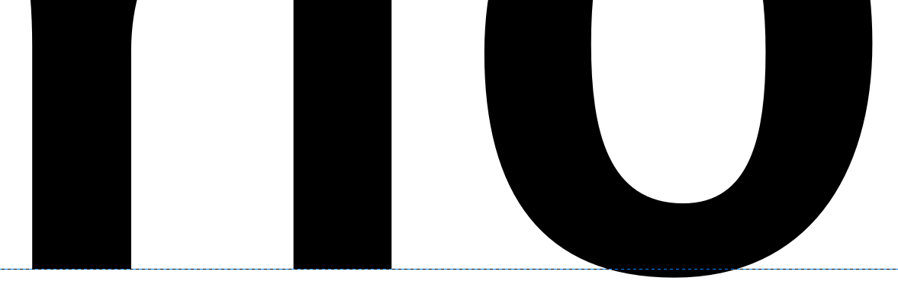
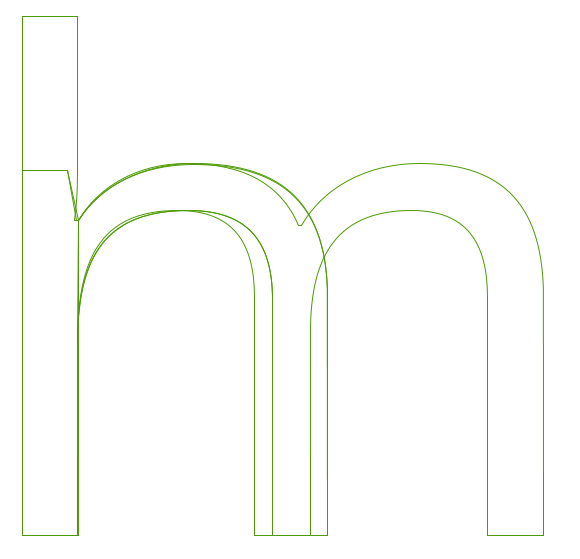
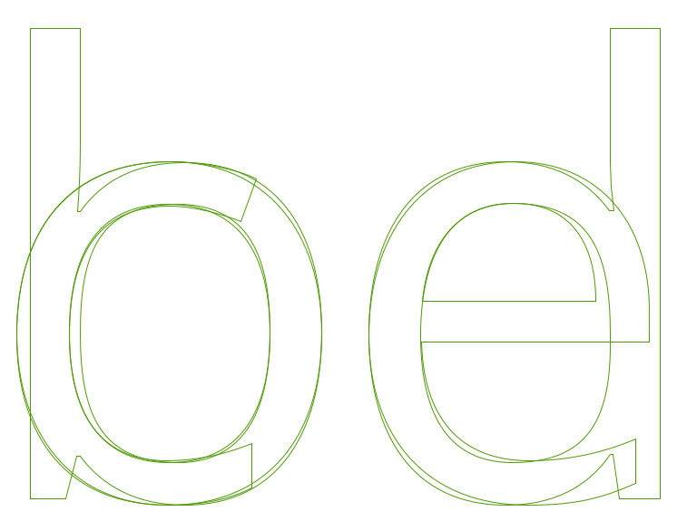

روش های زیادی برای طراحی یک فونت وجود دارد.
این کار می‌تواند مفید باشد که به منظور شروع سریع،
فرآیندهای بزرگتر کار را به اجزای کوچک‌تر تقسیم و پایهٔ استوارتری برای حروف فونت عرضه کنیم.

یک رویکرد محبوب و ارزشمند برای این منظور این است که ابتدا حروف o و n را طراحی
و عناصر اساسی فرم، فضا و تعادل را پیش از به کار بستن‌شان در کنار هم برای ساخت دیگر حروف تحکیم می‌کنیم.
ایجاد حروف o و n کوچک می‌تواند برخی از اشکال و ساختارهای بنیادی را به ما ارائه دهد که در تمام حروف دیگر مورد نیاز به کار می‌روند.

هر چه طراحی o ممکن است کاملا ساده به نظر برسد،
تمام خصوصیات ذکر شده در فصل [“فونت چیست؟”] را به کار می‌گیرد.
انتخاب شما در مورد هر خصوصیت باید یک انتخاب آگاهانه باشد.

## بیش‌فروروی (Underhangs) و بیش‌فراروی (Overshoots)
یکی از راه‌هایی اثر نوری بر طراحی تایپ اثر می‌گذارد در چگونگی ظاهر شدن منحنی‌ها و لبه‌های مستقیم در چشم است.

به عنوان مثال، برای آن که به نظر برسد یک منحنی و یک لبه مستقیم به درستی روی خط پایه تراز شده‌اند،
منحنی باید در واقع کمی پایین‌تر از خط نشسته، و یک *بیش‌فروروی* یا *undershoot* را رقم بزند.
بخشی از حرف که درست زیر خط پایه قرار می‌گیرد تا به نظر برسد بر روی این خط پایه نشسته است،
*بیش‌فروروی* یا *underhang* نامیده می شود
&mdash;
که در تصویر زیر نشان داده شده است.
بدون بیش‌فروروی، این طور به نظر می‌رسد که حروف دارای منحنی در اطراف خط پایه با باقی متن دچار ناترازی هستند.

مشابه بیش‌فروروی، یک ناحیهٔ *بیش‌فراروی* یا *overshoot* برای ایجاد حس ترازی روی خطوط x-height و cap-height لازم است.
(تصویر زیر را نگاه کنید).

## طراحی حرف o کوچک

طراحی o صرفا مسأله آن بخش سیاه از این حرف نیست.
در حالی که o وزن و شکل بسیار پایه‌ای کاسه‌ای را در بر می‌گیرد، بخش سفید
&mdash;
یا خالی، یا مخالف
&mdash;
اندازه و شکل مورد استفاده توسط بقیه فونت را فراهم می‌آورد.

به طور کلی می‌توانیم ببینیم که شکل گرد حرف o در حروف دیگر نیز ظاهر می‌شود.
این موضوع شامل حروف مثل b، c، d، e، p و q می‌شود
و قالب و فرم آن، در شکل و قالب منحنی‌ها در حروف دیگر فونت نظیر O، C، D و Q نیز ظهور می‌یابد.

علاوه بر این، فضای خالی داخل o باید در هنگام طراحی فواصل و فضاهای فونت مورد توجه قرار بگیرد؛
حرف o، آهنگ و ریتم مرجع فضاهای استفاده شده بین تمام گلیف‌های دیگر در فونت را نیز تنظیم می‌کند.
این دو مقدار آن قدر مرتبط هستند که شما اساسا باید میزان فضای سفید را طوری طراحی کنید که در کناره‌های o نیز قرار بگیرد.
به عنوان یک اصل کلی و به استثنای فونت‌های مورب و کج، o باید فاصله مشابهی در دو سمت داشته باشد
و فضای خالی بین یک رشته از حروف o باید در تعادل با فضای خالی داخل o باشد.

در اینجا ما به خوبی وارد قلمروی فاصله‌گذاری و سنجه‌ها می‌شویم،
بنابراین حتی در همین گام‌های آغازین می‌توانید نگاهی به فصل [«فضاسازی، سنجه‌ها و فاصله‌گذاری»] بیندازید که شامل پیامدهای اساسی فاصله‌گذاری در یک فونت است.
این باید به شما برای  رسیدن به یک حرف o خوش فاصله کمک کند که همین امر می‌تواند به در طراحی حرف n نیز یاری‌رسان باشد.

## طراحی حرف n کوچک

هنگامی که شما از قالب و فرم و فواصل حرف o کوچک، آن‌گونه که در یک رشته متن نمونه ظاهر می‌شود رضایت یافتید،
گام بعدی،
ساختن یک حرف n خوش ترکیب، متعادل و دارای فاصله‌گذاری‌های خوب است که آن را به رشته متنی از حروف o اضافه کنید.

با نگاهی به ساختمان و آناتومی حرف n می‌توانیم آن را به دو یا سه جزء تقسیم کنیم که شامل یک *ساقه* و یک *منحنی* می‌شود.

این رویکرد می‌تواند یک راه میانبر برای حفظ تعادل و هماهنگی بین حروفی که به مرور ساخته و کنار هم چیده می‌شوند در اختیار ما می‌گذارد.
به حرف n مثالی زیر نگاه کنید که چه طور به دو جزء شکسته شده است.
این اجزای جداگانه با هم ترکیب می‌شوند تا یک n را بسازند،
اما همین اجزا بعداً در هنگام ساختن حروف دیگر نیز دوباره مورد استفاده قرار می گیرند.
به عنوان مثال، ساقه سمت چپ n می‌تواند برای ساختن ساقهٔ سمت چپ تمام حروف کوچکتر دیگر استفاده شود.

دوباره به فصل مربوط به فاصله‌گذاری رجوع کنید.
طراحی حرف n باید پا به پای فرایند فاصله‌گذاری حروف n و o در کنار هم به پیش برود.

در حال حاضر، با شکل گرفتن روشی که برای ساخت حروف o و n استفاده کردید، آماده گسترش دادن مجموعه حروف هستید.
کیفیات ساقه و انحنای حروف n و o مانند نوعی الگوی برای طراحی سایر حروف هستند.

اگر حروف را در تصویر زیر از فونت [Open Sans] بررسی کنیم می توانیم روابط بین جنبه‌های قالبی حروف جداگانه و چگونگی تکرارشان با اندکی اصلاحات مشاهده کرده و از آن‌ها برای طراحی فونت خودمان بهره ببریم.

[“فونت چیست؟”]: What_Is_a_Font.html
[«فضاسازی، سنجه‌ها و فاصله‌گذاری»]: Spacing_Metrics_and_Kerning.html
[Open Sans]: http://opensans.com/
