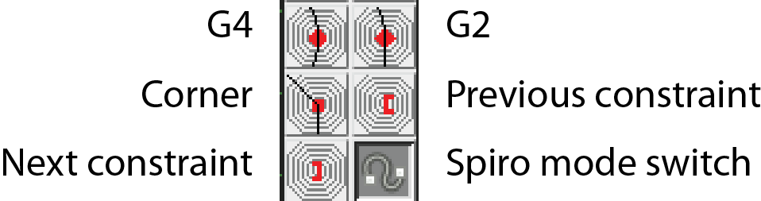
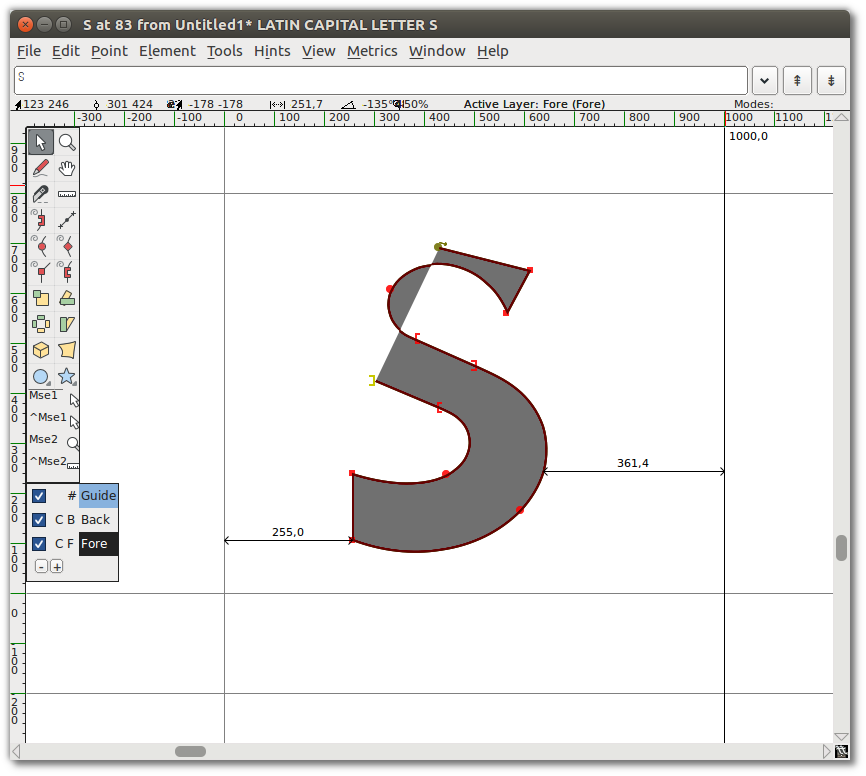
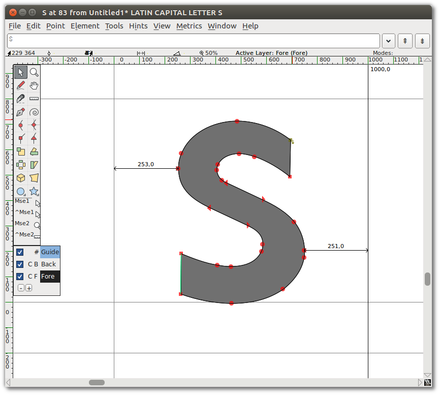

ابزار حلزونی (Spiro) جعبه‌ابزاری جایگزین برای روش سنتی منحنی‌های بزیه (Bézier) است.
ترسیم با ابزار حلزونی دارای رویکرد متفاوتی است که به شما کمک می‌کند تا منحنی‌های خود را به شیوه‌ای متفاوت رسم کرده و مشکلات مفهوم‌بندی خود را حل کنید.
لطفا تجربه‌اش کنید!

## جعبه‌ابزار حلزونی

بسیاری از ابزارهای ترسیمی بحث شده در فصل [«استفاده از ابزارهای رسم فونت‌فورج»] در حالت رسم حلزونی نیز به شکل مشابهی در دسترس هستند،
اما برخی از آنها در حالت رسم حلزونی دارای عملکردی متفاوت‌اند.

پنج نوع متفاوت از گره‌های حلزونی وجود دارند:

1. گره‌های G4، برای داشتن منحنی‌های نرم‌تر
2. گره‌های G2، برای داشتن منحنی‌های تیزتر
3. گره‌های گوشه، برای اتصالات گوشه‌ای تیز
4. گره‌های پیش‌قیدی (Previous constraint points)، برای زمانی که مسیر از منحنی به خط مستقیم تغییر می‌کند.
5. گره‌های پس‌قیدی (Next constraint points)، برای زمانی که مسیر از خط مستقیم به منحنی تغییر می‌کند.

## رسم یک S با ابزار حلزونی

این تمرین برای رسم یک حرف S به شما کمک می‌کند تا کار کردن با ابزار حلزونی برای‌تان راحت شود.

<b>نکته:</b>
هنگام ترسیم در حالت حلزونی،
همیشه با یک گره G4 یا G2 شروع کنید.
شروع با انواع دیگر گره‌های در فونت‌فورج به درستی کار نمی‌کند.

با یک گره G4 در بالاترین قسمت از حرف S شروع کنید، سپس یک گره گوشه بگذارید، و بعد از آن یگ گره گوشه دیگر.
در جهت عقره‌های ساعت حول شکل حرف حرکت کنید.

کار را با یک G4، یک گره پیش‌قیدی و یک گره پس‌قیدی ادامه دهید.

حال یک گره G4 اضافه کرده و سپس با دو گره گوشه دیگر به کار ادامه دهید.

سپس یک G4 و به دنبالش یک پیش‌قیدی و یک پس‌قیدی بگذارید.

سپس یک گره G4 دیگر اضافه کنید و در نهایت، شکل را در نقطه شروع و با کلیک روی آن با استفاده از ابزار گره G4 ببندید.

حالا شما تقریبا یک S دارید!
شروع به ور رفتن با موقعیت گره‌ها برای ساختن شکل S مورد نظرتان کنید.

اوه! چی شد؟

نگران نباشید
&mdash;
گاهی اوقات ابزار حلزونی کارهای خنده‌داری می‌کند.
کافی است "<i><b>Undo</b></i>" کرده یا گره‌ها را جابجا کنید تا شکل به حالت قبل برگردد.

4
حالا باید چیزی شبیه این را ببینید:

از حالت حلزونی خارج و به حالت بزیه بروید.
متوجه خواهید شد که گره‌های زیادی در منحنیِ ساخته‌شده وجود دارد
&mdash;
ممکن است بخواهید برخی از آنها را پاک کنید.

برای پاک کردن این گره‌های اضافی، به منوی "_**Element**_" بروید و _**Simplify**&nbsp;⇨&nbsp;**Simplify**_ را انتخاب کنید.
سپس به "_**Element**&nbsp;⇨&nbsp;**Add&nbsp;Extrema**_" بروید تا گره‌های کرانه اضافه کنید.
در نهایت به "_**Element**&nbsp;⇨&nbsp;**Round**&nbsp;⇨&nbsp;**To&nbsp;Int**_" بروید تا مختصات گره‌ها را گرد کنید.
پس از این عملیات پاک‌سازی، چیزی شبیه به این خواهید دید:

می‌توانید به ور رفتن با اشکال در حالت حلزونی ادامه دهید تا تفاوت آن را با با رسم بزیه بهتر احساس کنید.

اصطلاحات متفاوت هستند،
اما مشابه دیگر ابزارهای طراحی و اصلاح فونت‌فورج،
تمرین بیشتر است که شما را به نتیجه‌ای که مطلوب‌تان است می‌رساند.

[«نصب فونت‌فورج»]: Installing_Fontforge.html
[«استفاده از ابزارهای رسم فونت‌فورج»]: Using_the_Fontforge_Drawing_Tools.html
