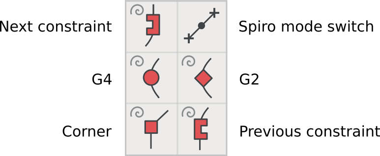

ابزار حلزونی (Spiro) جعبه‌ابزاری جایگزین برای روش سنتی منحنی‌های بزیه (Bézier) است.
اگر چه استفاده از آن اختیاری است، می‌توان فونت‌فورج را طوری نصب کرد که شامل یک حالت حلزونی بوده و ابزارهایی را برای ایجاد این نوع خاص از منحنی‌ها ارائه دهد.

برای دریافت جزئیات بیشتر درباره چگونگی شامل کردن کتابخانهٔ حلزونی در برنامه، بخش [«نصب فونت‌فورج»] را ببیند.

ترسیم با ابزار حلزونی دارای رویکرد متفاوتی است که به شما کمک می‌کند تا منحنی‌های خود را به شیوه‌ای متفاوت رسم کرده و مشکلات مفهوم‌بندی خود را حل کنید.
لطفا تجربه‌اش کنید!

## جعبه‌ابزار حلزونی

بسیاری از ابزارهای ترسیمی بحث شده در فصل [«استفاده از ابزارهای رسم فونت‌فورج»] در حالت رسم حلزونی نیز به شکل مشابهی در دسترس هستند،
اما برخی از آنها در حالت رسم حلزونی دارای عملکردی متفاوت‌اند.

پنج نوع متفاوت از نقاط حلزونی وجود دارند:

1. نقاط G4، برای داشتن منحنی‌های نرم‌تر
2. نقاط G2، برای داشتن منحنی‌های تیزتر
3. نقاط کنج، برای اتصالات گوشه‌ای تیز
4. نقاط پیش‌قیدی، برای زمانی که مسیر از منحنی به خط مستقیم تغییر می‌کند.
5. نقاط پس‌قیدی، برای زمانی که مسیر از خط مستقیم به منحنی تغییر می‌کند.

## رسم یک S با ابزار حلزونی

این تمرین برای رسم یک حرف S به شما کمک می‌کند تا کار کردن با ابزار حلزونی برای‌تان راحت شود.

<b>نکته:</b>
هنگام ترسیم در حالت حلزونی،
همیشه با نقطهٔ G4 یا G2 شروع کنید.
شروع با انواع دیگر نقاط در فونت‌فورج به درستی کار نمی‌کند.

با یک نقطهٔ G4 در بالاترین قسمت از حرف S شروع کنید، سپس یک نقطهٔ کنج بگذارید، و بعد از آن یگ نقطهٔ کنج دیگر.
در جهت عقره‌های ساعت حول شکل حرف حرکت کنید.

کار را با یک G4، یک نقطه پیش‌قیدی و یک نقطه پس‌قیدی ادامه دهید.

حال یک نقطهٔ G4 اضافه کرده و سپس با دو نقطهٔ کنج دیگر به کار ادامه دهید.

سپس یک G4 و به دنبالش یک پیش‌قیدی و یک پس‌قیدی بگذارید.

سپس یک نقطهٔ G4 دیگر اضافه کنید و در نهایت، شکل را در نقطه شروع و با کلیک روی آن با استفاده از ابزار نقطهٔ G4 ببندید.

حالا شما تقریبا یک S دارید!
شروع رو رفتن با موقعیت نقاط برای ساختن شکل S مورد نظرتان کنید.

اوه! چی شد؟

نگران نباشید
&mdash;
گاهی اوقات ابزار حلزونی کارهای خنده‌داری می‌کند.
کافی است <i>Undo</i> کنید یا نقاط را جابجا کنید تا شکل به حالت قبل برگردد.

4
حالا باید چیزی شبیه این را ببینید:

از حالت حلزونی خارج و به حالت بزیه بروید.
متوجه خواهید شد که نقاط زیادی در منحنی ساخته‌شده وجود دارد
&mdash;
ممکن است بخواهید برخی از آنها را پاک کنید.

برای پاک کردن این نقاط اضافی، به منوی Element بروید و `Simplify > Simplify` را انتخاب کنید.
سپس به `Element > Add Extrema` بروید تا نقاط کرانه اضافه کنید.
در نهایت به <i>Element > Round > To Int</i> بروید تا مختصات نقاط را گرد کنید.
پس از این عملیات پاک‌سازی، چیزی شبیه به این خواهید دید:

می‌توانید به ور رفتن با اشکال در حالت حلزونی ادامه دهید تا تفاوت آن را با با رسم بزیه بهتر احساس کنید.

اصطلاحات متفاوت هستند،
اما مشابه دیگر ابزارهای طراحی و اصلاح فونت‌فورج،
تمرین بیشتر است که شما را به نتیجه‌ای که مطلوب‌تان است می‌رساند.

[«نصب فونت‌فورج»]: Installing_Fontforge.html
[«استفاده از ابزارهای رسم فونت‌فورج»]: Using_the_Fontforge_Drawing_Tools.html
