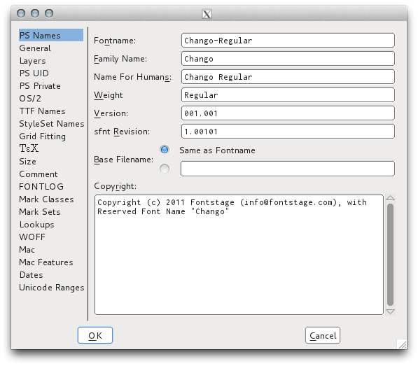

## منوی Element > Font Info

پنجره Font Info در همه برنامه‌های ویرایش‌گر فونت موجود است
و فونت‌فورج به دقت از مشخصات اوپن تایپ پیروی می‌کند،
هر چند ممکن است در نگاه اول قدری رازآلود به نظر برسد،
اما استفاده از آن می‌تواند به شما کمک کند تا با قالب اوپن‌تایپ بیشتر آشنا شوید.
خواندن در مورد قالب اوپن‌تایپ به نوبهٔ خود می‌تواند کار کردن با این پنجره با تسهیل کند.

## شماره‌گذاری نسخه

توسعه‌دهندگان نرم‌افزار تمایل دارند که از نسخه‌بندی معنایی یا
[Semantic Versioning](http://semver.org)
برای برنامه‌های خود استفاده کنند
و این می‌تواند ایدهٔ خوبی برای فونت‌های شما هم باشد.
به عبارتی، فونت‌ها یک «واسط برنامه‌نویسی کاربردی» یا «API» برای متن به منظور دسترسی به برخی از احساسات جانبی در خوانندگان هستند.

نسخه اصلی (major) پس از یک طراحی مجدد کامل استفاده می‌شود.
مثلا [Exo] و [Exo 2] را مقایسه کنید.
اگر سندی با استفاده از Exo دارید،
شما نمی‌خواهید به Exo 2 پرش کنید،
زیرا به دلیل تغییر لحن فونت،
این کار باعث برانگیخته شدن احساسات خواننده می‌شود.
افزودن پشتیبانی از یک یا چند خط جدید که در ارتفاع بسیار مشابه هستند،
یا افزودن تعداد قابل توجهی زبان،
یا هر تغییر دیگری هم که به طور قابل ملاحظه‌ای سنجه‌های عمودی یا افقی را تغییر دهد
می‌تواند به افزایش شماره نسخهٔ اصلی منجر می‌شود.
However, if a complementary design is made for 2 scripts, it may be best to release 2 or 3 families, one with each script scaled appropriately and the other script(s) scaled as secondary fonts for simple fallback typesetting of multilingual texts. 

نسخه فرعی (minor) شامل هر تغییری می‌شود که تغییرات ظریفی در سنجه‌های، نظیر سنجه‌های عمودی، عوارض افقی یا بهبود فاصله‌گذاری (kerning) ایجاد کند،
یا اصلاحات جزئی در برخی گلیف‌ها بدهد.
دلیل این مساله این است که چنین به‌روزرسانی‌هایی باعث می‌شود اسناد با استفاده از نسخهٔ جدید فونت (در بسیاری از موارد) تغییر کنند.
در اینجا مثالی از مقاله
[«Roboto Rebooted: چرا گوگل فونت خود را مانند بقیه محصولاتش  به‌روزرسانی می‌کند» را ببینیم](http://www.fastcodesign.com/3033126/roboto-rebooted-why-google-plans-to-update-its-font-like-the-rest-of-its-products)
را می‌بینیم:

 

افزودن تنها تعدادی گلیف برای  «کامل» کردن پوشش مجموعه حروفی که از قبل در نظر گرفته شده بوده‌اند
و یا اضافه کردن پشتیبانی از تعدادی زبان بیشتر،
به خصوص اگر سنجه‌های عمودی را تغییر ندهد احتمالاً موضوع ارتقای نسخه فرعی به حساب بیایند.

تغییر در سطح وصله (patch) شامل هر آن چیزی است که فونت را بدون تغییر سنجه‌ها و یا بون تغییرات طراحی گلیف مشهود و اثر گذار در قالب متن نهایی بهبود بخشد.
نسخه 1.001 شما ممکن است fsType را روی 0 تنظیم نکرده باشد
و یا از Fontcrunch عبور داده شده باشد.
تغییر هر دوی این موارد در نسخه 1.0.1 چیزی را تغییر نداده و اثر قابل مشاهده‌ای ندارند.
متاسفانه، عدد سوم در نسخه‌بندی معنایی (مربوط به وصله یا patch) در خانه‌های فرادادهٔ مربوط به نسخه فونت اوپن‌تایپ در دسترس نیست.
در عوض، به منظور اشاره کردن به ایجاد تغییرات، عدد نسخهٔ فرعی افزایش دهید.

همچنین توجه داشته باشید که اعداد نسخه نبایستی بیش از سه رقم داشته باشد.
این موضوع می‌تواند در یک پرونده TTX به صورت عدد پنج رقمی نمایش یابد.
مثلا `2.001` ممکن است در یک پرونده TTX XML به صورت `2.00099` ظاهر شود.

اگر فونت‌های آزاد منتشر می‌کنید، قابلیت انتشارهای گیت‌هاب یا [GitHub Releases](https://www.google.com/search?q=github+releases) می‌تواند بسیار سودمند باشد.

## نام‌گذاری خانواده

مایکروسافت به سختی تلاش می‌کند تا اطمینان یابد که یک برنامه نوشته شده برای نسخه‌ای قبلی از ویندوز همچنان در آخرین نسخه‌ها نیز  اجرا می‌شود و با این کار، افراد را به ارتقاء ویندوزشان ترغیب می‌کند.
این بدان معنی است که مدل پایهٔ تروفونت (TrueType) که در در ویندوز ۳ معرفی شد هنوز با ماست و ویندوز از فونت‌هایی که بیش از چهار خانوادهٔ پایه (معمولی، کج، ضخیم، کج ضخیم) دارند پشتیبانی نمی‌کند.

این مساله برای طراحان فونت به این معنی است که خانوادهٔ‌ فونت ما باید به گونه‌ای نام‌گذاری شود که تمام فونت‌های ما روی تمام سیستم‌عامل‌ها قابل استفاده باشند.
قالب اوپن‌تایپ (OpenType) از طریق تکمیل مقادیر نام خانواده و نام سبک با «نام خانواده ترجیحی یا Preferred Family Name» و «نام سبک ترجیحی یا Preferred Style Name» اجازه این کار را می‌دهد. این مقادیر توسط نرم‌افزارهایی که از اوپن‌تایپ پشتیبانی می‌کنند قابل پردازش هستند.

این
[صفحه‌گستردهٔ نام‌گذاری خانواده فونت](https://docs.google.com/spreadsheets/d/1ckHigO7kRxbm9ZGVQwJ6QJG_HjV_l_IRWJ_xeWnTSBg/edit#gid=0)
بر اساس اطاعاتی پایه‌ای است که توسط یک متخصص فونت لهستانی به نام Adam Twardoch در
[انجمن  Fontlab](http://forum.fontlab.com/index.php?topic=313.0)
مورد بحث قرار گرفته تهیه شده است
و برگرفته از 
[مثال خصوصیات اوپن‌تایپ](https://www.microsoft.com/typography/otspec/namesmp.htm)
است.

[Exo]: http://www.google.com/fonts/specimen/Exo
[Exo 2]: http://www.google.com/fonts/specimen/Exo+2
