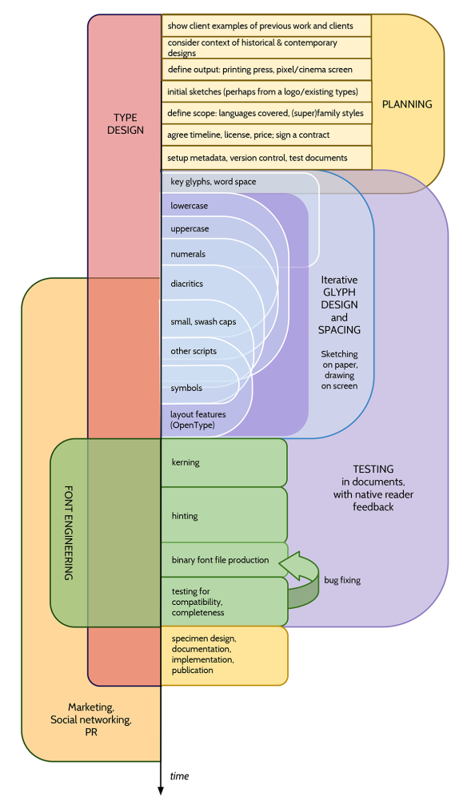

الان که درکی از چگونگی گسترده بودن طراحی فونت دارید،
ممکن است بخواهید بدانید که آیا پروژه شما فقط یک فونت خواهد داشت
یا این که مجموعه‌ای از چندین فونت مرتبط با هم خواهد بود
و یا یک خانواده نایپ با سه یا چهار سبک مختلف یا شاید حتی بیشتر (که الان سنتی خوانده می‌شود).

سبک‌های رایج برای خانوادهٔ تایپ‌ها شامل این موارد می‌شوند:
* یک وزن معمولی و یک وزن ضخیم
* معمولی، ضخیم، کچ &mdash; و نهایتا یک ضخیم کج
* نازک، سبک، کتاب، معمولی، نیمه ضخیم، ضخیم، ضخیم‌تر، سنگین و کلفت
* معمولی، متراکم، ضخیم و ضخیم متراکم
* باریک، متراکم، پهن و بسیار پهن
* معمولی، نیمه جلوه‌گر، جلوه‌گر، بسیار جلوه‌گر، شدیدا جلوه‌گر

در حالی که دلایلی برای داشتن الگوهای کلیشه‌ای در خانوادهٔ فونت‌ها وجود دارد، شما ممکن است بخواهید که نوع گروه‌بندی کاملا متفاوتی داشته باشید.

محدودهٔ پروژه می‌تواند به واسطه شدت جاه‌طلبی و میزان وقت خالی‌ای که دارید تعیین شود.
اما محدودهٔ پروژه اغلب در نسبت با هدف استفاده از خانواده یا مجموعه فونت‌ها،
یا حتی فراتر از آن،
بر اساس نیاز مشتری شما مشخص می‌شود.
قطعا برای طراحان تایپ حرفه‌ای، دو مورد آخر هستند که معمولا به عنوان عوامل تعیین‌کننده به حساب می‌آیند.

## احساس

مهم‌ترین چیزی دربارهٔ یک طراحی تایپ، حسی است که برمی‌انگیزد.
به کلام آوردنش به شدت دشوار است اما همین عامل است که یک تایپ‌فیس به طرز معناداری از بقیه متمایز گردد.

یک طراح فونت پرتغالی به نام Natanael Gama فونت
[Exo family](https://www.google.com/fonts/specimen/Exo)
را با فونت‌فورج طراحی کرد.
او در صفحه خانگی‌اش، پروژه دیگری را برای مجسمه‌سازی به نام
[John Williams](http://ndiscovered.com/john-williams/)
توصیف و تصویری را منتشر کرده است که به طور خلاصه، ماتریسی از طیف احساسات را نمایش می‌دهد:

* از تمثیلی تا انتزاعی: ۵۰٪
* از لطیف تا خشن: ۳۰٪
* از آرام تا پرانرژی: ۰٪
* از معماگونه تا ساده: ۱۵٪
* از تجربی تا استاندارد: ۱۵٪
* از پراعتبار تا معمولی: ۱۵٪
* ایده‌های دیگر: زیبا، فضای خارجی، شرایط انسانی

## پوشش گلیف

یک فونت اگر حتی فقط یک گلیف داشته باشد، باز هم یک فونت است.
اما یک فونت می‌تواند چندصد یا چندهزار گلیف داشته بشاد.
اگر پروژه شما یک پروژه شخصی است، این تصمیم کاملا به شما بستگی دارد.
ممکن است تصمیم بگیرید که فقط حروف بزرگ را داشته باشید،
یا بخواهید گلیف‌های دیگری که در فونت‌های دیگر پیدا کرده‌ای را نیز شامل کنید.
اگر برای مشتری کار مي‌کنید،
ممکن است نیاز باشد که روشن کنید که چه زبان یا زبان‌هایی باید توسط فونت پشتیبانی شوند.
هدف شما ممکن است بسط دادن فونت دیگری از طریق افزودن تعدادی گلیف به آن
و دادن امکان پشتیبانی از یک یا چند زبان دیگر باشد.

ایده خوبی است که آگاهانه چنین تصمیمی را بگیرید و بار اضافه‌تری روی دوش خود نگذارید.
معمولا در زمانی که یک تایپ‌فیس در حال ساخته شدن است،
این حس وجود دارد که گلیف‌های بیشتر و بیشتری به پروژه اضافه کنیم
&mdash;
اما به مراتب این موضوع با ارزش‌تر است که به بهبود مجموعه‌ای مرکزی از گلیف‌ها را بهبود ببخشید به جای آن که گلیف‌های جدیدی اضافه کنید.

## گردش‌کار خانواده چندسبکی

اگر از همان اول بدانید که قرار است بیش از یک فونت داشته باشید،
با برنامه‌ریزی و ساخت نظام‌مند خانواده فونت و کار روی مختلف به صورت موازی به جای کامل کردن یک سبک در هر زمان، 
زمان زیادی را برای خود صرفه‌جویی خواهید کرد.

قطعا این ناممکن است که *همهٔ* سبک‌ها را کاملا به روش موازی بسازید،
اما این امکان‌پذیر است که یک گام مشخص طراحی را برای هر سبک کامل کنید.
این کار به شما اجازه می‌دهد تا رابطهٔ میان سبک‌های مختلف را در مراحل اولیهٔ طراحی مورد بررسی قرار دهید.
ممکن است این را سودمند بیابید که یک مجموعه کال از آزمون‌ها را (مثل «adhesion») را برای نسخه معمولی کامل کنید
و پس از آن،
مجموعه‌ای از حروف آزمون را در سبکی دیگر بسازید.
با این وجود، ممکن است یک رویکرد گام به گام را در پیش بگیرید
و درباره بخش‌های مشخصی از حروف پایه (مانند n یا o) برای همه سبک‌ها به یک باره تصمیم‌گیری کنید.

بسته به اندازه و ترکیب خانواده فونتی که برایش برنامه‌ریزی می‌کنید
ممکن است در بیابید که ساختن نمونه‌هایی از گلیف‌ها که می‌توانند درون‌یابی(interpolate) شوند زمان بیشتر از شما را صرفه‌جویی می‌کند.
این کار نه تنها به شما امکان ساخت سبک‌های میانی و واسط را می‌دهد،
بلکه برای تصمیم‌گیری درباره متغیرهای تایپوگرافیک که در سرتاسر اعضای خانواده فونت جابجا می‌شوند یاری‌تان می‌کند.

برای مرور متغیرهای تایپوگرافیکی که باید در نظر بگیرید، به فصل
[«فونت چیست؟»](What_Is_a_Font.html)
مراجعه کنید.

## فنی: مدیریت نسخه

بایستی استفاده از گیت و گیت‌هاب را برای ذخیره پرونده‌ها فرابگیرید و از قالب «SFDir» برای کد منبع استفاده کنید.

* <https://help.github.com/articles/what-are-other-good-resources-for-learning-git-and-github>
* <http://justinhileman.info/article/git-pretty/>

## فرایند کلی

در گذشته و حوالی سال ۲۰۱۰، Dave Crossland, Eben Sorkin, Claus Eggers Sørensen, Pablo Impallari, Alexei Vanyashin, Dan Rhatigan و چند مشارکت کنندهٔ ناشناس دیگر، نموداری برای کل فرایند ساخت فونت‌های لاتین را عرضه کردند:

این نمودار با Google Drawings ساخته شده و همانند این وبگاه، تحت پروانه Creative Commons Attribution-ShareAlike منتشر شده است.
منبع این نمودار در [این جا](https://commons.wikimedia.org/wiki/File:Latin_Typeface_Design_Process_Overview.pdf) در دسترس است.

نسخه‌ای غیر لاتین (دوانگری) این پروژه نیز در
[این نشانی](https://commons.wikimedia.org/wiki/File:Devanagari_Typeface_Design_Process_Overview.pdf)
در دسترس است.

<!-- Editable versions of the above, with unknown stability, may be found in GitHub PR №225. -->

## محیط‌های آزمون

زمانی که به برنامه‌ریزی پروژه‌تان مشغولید بایستی به رسانهٔ مورد نظرتان برای این تایپ‌فیس فکر کنید.
نمونهٔ رسانه‌ها شامل وب و سکوهای همراه، پروژکتورهای دیجیتال، چاپگرهای لیزری اداری ارزان، چاپگرهای لیزری اداری با کیفیت، چاپ افست با لیتوگرافی مجله، و چاپ سریع و تیراژ بالای روزنامه‌ها می‌شود.

سپس بایستی این فناوری‌های را ابتیاع کرده یا ترتیب دسترسی به‌شان را بدهد تا بتوانید نتیجه واقعی کارتان را ببینید.

در خلال فرایند طراحی تایپ، این را سودمند خواهید یافت که بتوانید پیش‌نمایشی از مجموعه متنی با تایپ‌فیس (نمونه) خود را با کیفیت بالاتر از صفحه رایانهٔ خود ببینید.
این کار معمولا به معنای استفاده از چاپگر با تراکم ۱۲۰۰ DPI «واقعی» و Adobe PostScript نسخه ۳ است.
اشخاص می‌توانند چنین چیزهایی را با هزینه‌های حدود ۵۰۰ دلار امریکا تهیه کنند.

## ویژگی‌های اوپن‌تایپ (OpenType)

شما می‌توانید ویژگی‌های اوپن‌تایپ را پیش از شروع رسم، برنامه‌ریزی کنید.
ویژگی‌های رایج شامل این موارد می‌شوند:
* `liga` ligatures
* `onum`, `lnum` numerals

برای برخی زبان‌ها `locl` کار می‌کند اما برای برخی دیگر خیر،
بنابراین خصوصیات زبان را هم از طریق `locl` و هم از طریق `ssNN` یا `cvNN` منتشر کنید.

خصوصیات اوپن‌تایپ برخی انواع ویژگی دیگر را نیز در اختیار می‌گذارد که توصیه نمی‌شوند:
* `hist`. در [این بحث روی TypeDrawers](http://typedrawers.com/discussion/1358/what-are-the-best-practices-for-the-hist-feature-long-s) بیشتر بخوانید.

## مطالعه بیشتر

* Aoife Mooney's presentation on the type design process at TypeCon 2014: <https://vimeo.com/107421895>
* TypeDrawers discussion of [Printer recommendations for proofing](http://typedrawers.com/discussion/314/printer-recommendations-for-proofing)
