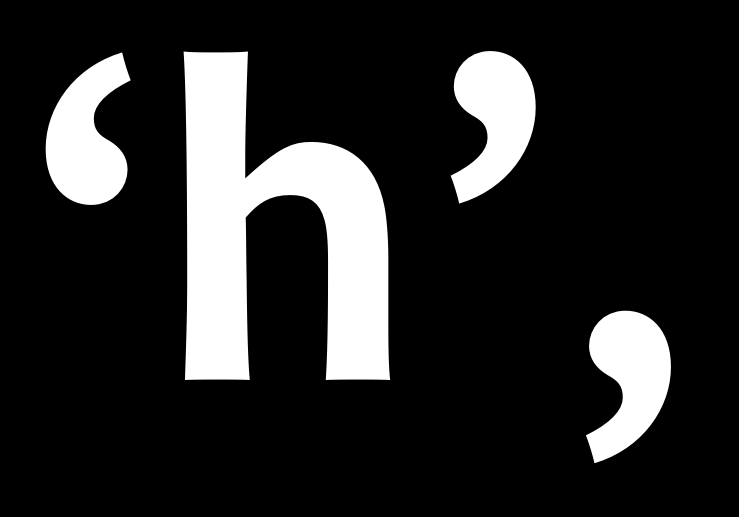

علائم نگارشی و سایر نمادهای تایپوگرافی تاریخ خاص خود را دارند که  از توسعه الفبا جداست.
با این حال، خواهید دید که فرآیند طراحی مشابهی روی این نشانه‌ها نیز اعمال می‌شود،
از جمله استفاده مجدد و تطبیق عناصر مؤلفه، و آزمایش تکراری انتخاب‌های طراحی.

## گلیف‌های علائم نگارشی پایه

اولین کاری که بایستی هنگام طراحی علائم نگارشی انجام دهید ایجاد «.» است که به عنوان نقطه شناخته می‌شود.

شکل این نماد اغلب از نقطه روی i گرفته می‌شود.
پس از گرفتن رونوشت از نقطه، ممکن است لازم باشد که آن را کمی بزرگ‌تر کنید.
توصیه می‌شود که نتیجه را در اندازه‌های مختلف در متن چاپ شده یا روی صفحه نمایش مورد بررسی قرار دهید.

پس از رسیدن به اندازه‌ای که از آن رضایت دارید،
این نقطه می‌تواند به عنوان پایه‌ای برای گسترهٔ وسیعی از علائم نگارشی دیگر مانند : ; : ? ! ¡ ¿ · … مورد استفاده قرار گیرد.

گلیف بعدی که ساخته می‌شود، ویرگول یا کاما است.
تنوع شکل کاما می‌تواند تا حدی شگفت‌آوری زیاد باشد.
بد نیست پیش از شروع طراحی خودتان، به مجموعه‌ای از طراحی‌های کاما نگاهی داشته باشید.

تصویر زیر، دو مورد از رایج‌ترینی شکل‌هایی را نشان می‌دهد که کاما می‌تواند به خود بگیرد.

بالای کاما اغلب کمی سبک‌تر از نقطه است، زیرا اگر همانند باشد، ممکن است بسیار سنگین به نظر برسد.
در تصویر نمونه، کاما در سمت راست یک مثال خوب از این موضوع است.
خطای رایج دیگری که برای این گلیف باید مراقبش باشید این است که آن را خیلی کوتاه طراحی کنید.

وقتی کاما آماده شد، ساخت نقطه‌ویرگول (؛ و ;) بسیار آسان خواهد بود.

## علامت تعجب و علامت سوال

علامت تعجب ممکن است به شکل گمراه کننده‌ای ساده *به نظر برسد*.
اگر به مجموعه‌ای از تایپ‌فیس‌ها نگاه کنید متوجه خواهید شد که گاهی اوقات طراحی آن واقعا ساده است.

با این حال، این گلیفی است که فرصت‌های بسیار شگفت‌انگیزی برای بیان طراحی دارد.
اغلب در فونتی با درجه تضاد پایین، بخش فوقانی میلهٔ بالای نقطه نسبتاً سنگین‌تر از بخش پایینی آن است.
شکل علامت تعجب معمولاً تا حدودی به طراحی کاما مرتبط است.

علامت سوال نیز ممکن است بسیار دشوار باشد زیرا نیازمند برقراری تعادل بین منحنی باز بالایی و نقطهٔ پایین آن است.

مانند علامت تعجب، توصیه می‌شود که قبل از گزینش طراح خود، به مجموعه‌ای از نمونه‌های مختلف نگاه کنید و حتی آنها را آزمایش کنید.

طراحی گلیف‌های c, C, G, s و S می‌تواند پایه‌ای برای طراحی این نماد فراهم آورد،
اما شما ممکن است تصمیم بگیرید که شکلی متمایز را انتخاب کنید.

## نمادهای اضافی

در لاتین، نشان نقل‌قول ساده یا عمودی
&mdash;
&apos; و &quot;
&mdash;
متمایز از نشان نقل‌قول تایپوگرافیک (‘ ’ و “ ” و „) هستند.

نشان نقل‌قول ساده می‌تواند از شکل میلهٔ بالای نقطه در علامت تعجب پیروی کند اما می‌تواند دارای طراحی کاملا مجزا هم باشد.

معمولا نشان نقل‌قول تایپوگرافیک نزدیکی زیادی به طراحی ویرگول (کاما) دارند؛
هر چند بایستی بلندتر از ویرگول و معمولا منحنی‌تر باشند.

ساختن کروشه‌ها ([]) نسبتا ساده است زیرا شکل عصاقورت‌داده‌ای دارند.
با این وجود، طراحی‌شان بایستی بازتاب‌دهندهٔ انتخاب‌هایی باشند که در سایر بخش‌های تایپ‌فیس اعمال کرده‌اید.

مسالهٔ اصلی که باید درباره‌اش تصمیم‌گیری صورت پذیرد این است که چه میزان بلندی و تو رفتگی داشته باشند.
قرارداد معمول این است که باید اندکی از بلندی حروف بزرگ بالاتر رفته و تقریبا ۳/۴ عمق پایین‌روندهٔ حروف کوچک، از خط پایه پایین‌تر بروند.

همین انتخاب‌ها در طراحی پرانتز‌ها () و آکولادها {} نیز استفاده می‌شوند. وزن تنهٔ این سه نماد بایستی کم‌تر از وزن بدنهٔ حروف‌های بزرگ و کوچک باشد.

مراقبت باشید: وقتی که در پنجرهٔ سنجه‌ها (metrics) بخواهید نویسه‌های [ ] # را آزمایش کنید ممکن است نمایش داده نشوند.
دلیل این موضوع هم به این بر می‌گردد که این نویسه‌ها توسط برنامه رزرو شده‌اند.
به جای نوشتن [ ] # بایستی از ‪/bracketleft‬ و ‪/bracketright‬ و ‪/numbersign‬ استفاده کنید.

پرانتزها بایستی روی طراحی حروف مرتبط مانند D و C و G رسم شوند.

آکولادها در میزان بالای تنوع‌شان قابل توجه هستند
و در این خصوص، به علامت سوال شباهت دارند.
توزیع وزن در آکولادها می‌تواند مشابه توزیع وزن در اعداد باشد
و به این ترتیب می‌توانند در مواردی، از بقیهٔ طراحی‌های شما پیروی نکنند.

