فاصله‌های میان نویسه‌ها بخشی مهم و جدایی‌ناپذیر از طراحی یک فونت هستند.
طراحی فاصلهٔ حروف فونت بایستی به عنوان بخشی جدایی‌ناپذیر از کل فرایند طراحی یک فونت در نظر گرفته شود.
فاصله‌گذاری خوب برای عملکرد مناسب ان فونت بسیار ضروری است.

در فونت‌فورج، پنجرهٔ سنجه‌ها (Metrics) به شما اجازه می‌دهد تا سنجه‌های فونت‌تان را طراحی کرده، فواصل میان آن‌ها را تغییر دهید، و چگونگی دیده شدن گلیف‌ها در کنار هم را به آزمون بگذارید.
پنجرهٔ سنجه‌ها را می‌توانید از فهرست Window و با با کلیدهای ترکیبی <kbd>Ctrl</kbd>&nbsp;+&nbsp;<kbd>K</kbd> باز کنید.

فاصلهٔ میان دو گلیف دارای دو مؤلفه است: فاصلهٔ بعد از اولین گلیف و فاصلهٔ قبل از دومین گلیف.
این فاصله‌های میان گلیف‌ها از مقادیر مربوط به حاشیه‌های کنار (side bearings) هر گلیف ساخته می‌شوند.
هر گلیف دارای یک حاشیه چپ و یک حاشیهٔ راست است. در نمونهٔ زیر که به a کوچک در فونت Open Sans مربوط می‌شود، حاشیهٔ راست برابر با ۱۶۶ واحد و حاشیهٔ چپ برابر با ۹۴ واحد تنظیم شده است.

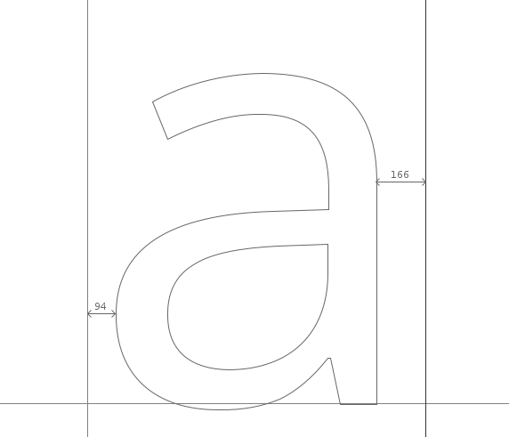

## توابع پایه در پنجرهٔ سنجه‌ها (Metrics)

حاشیه‌های کناری نویسه‌ها را می‌توان در پنجرهٔ سنجه‌های فونت‌فورج به پنج روش ویرایش کرد:

- کشیدن دستی خطوط حاشیه
- کشیدن دستی یک نویسه. البته به این نکته توجه کنید که کشیدن یک نویسه، فقط روی مقدار حاشیهٔ چپ اثر می‌گذارد.
- ویرایش مستقیم مقدار در جدول سنجه‌های پنجرهٔ سنجه‌ها
- افزایش یا کاهش با استفاده از صفحه کلید
- استفاده از فرامین در فهرست سنجه‌های پنجرهٔ سنجه‌ها

### تغییر مقدار حاشیهٔ کناری با کمک صفحه کلید

یک روش سریع و البته دقیق برای تغییر مقدار سنجه‌ها در فونت‌فورج، استفاده از کلیدهای جهت‌نمای بالا، پایین، چپ و راست روی صفحه کلید است. کلیدهای بالا و پایین برای افزایش یا کاهش مقادیر و ترکیب کلیدهای جهت‌نما با کلید دگرساز یا <kbd>Alt</kbd> برای پیمایش روی مقادیر مختلفِ خانه‌ها در پنجرهٔ سنجه‌ها به کار می‌روند.

## اصول کلی

به عنوان یک قاعده کلی حروف متقارن مانند A یا H یا x و w، حاشیه‌های متقارن خواهند داشت.
مثلا حاشیهٔ چپ و راست نویسهٔ H دارای مقادیر برابر خواهند بود.
با این حال توجه داشته باشید که این مساله، نه یک قانون سفت و سخت بلکه یک قاعده کلی است.

حین فاصله‌گذاری برای حروکفی که طراحی می‌کنید بایستی به چشمان‌تان اعتماد کنید. فرایند چنین است: «طراحی کنید، نگاه کنید، اصلاح کنید، دوباره نگاه کنید».

اگر کاملا تازه‌کار هستید توجه داشته باشد که نباید فرض کنید که نتیجه قابل اتکا از طریق اتکا به اندازه‌گیری فاصله حاصل می‌شود.
مثلا در حالی که فاصلهٔ میان دو حرف ممکن است برابر نباشند، چشم ممکن است آن‌ها را برابر ببیند. مثال واضع این مساله را می‌توان در فاصله‌گذاری بین حروف H و O دید. در تصاویر زیر، حاشیهٔ طرفین برای H و O در خط بالایی برابر هستند اما نابرابر به نظر می‌رسند. در خط پایینی، حاشیه‌ها برابر نیستند اما فاصلهٔ بین حروف متعادل به نظر می‌رسند.

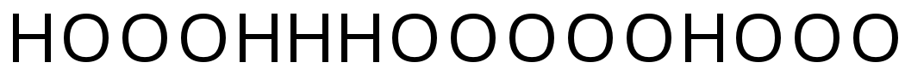

## فرامین فهرست سنجه‌ها برای ویرایش سنجه‌ها

- فرمان «_**Center&nbsp;in&nbsp;Width**_»: گلیف را وسط عرض آن قرار می‌دهد.
- فرمان «_**Thirds&nbsp;in&nbsp;Width**_»: گلیف را طوری قرار می‌دهد که در یک سوم چپ قرار بگیرد.
- فرمان «_**Set&nbsp;Width**_»: عرض گلیف را تنظیم می‌کند.
- فرمان «_**Set&nbsp;LBearing**_»: حاشیهٔ چپ را تنظیم می‌کند.
- فرمان «_**Set&nbsp;RBearing**_»: حاشیهٔ راست را تنظیم می‌کند.
- فرمان «_**Window&nbsp;Type**_»: شیوهٔ عملکرد پنجرهٔ سنجه‌های فونت‌فورج را به یکی از روش‌های زیر تنظیم می‌کند:
  - روش «_**Advance&nbsp;Width&nbsp;Only**_»: فقط عرض تغییر کند.
  - روش «_**Both**_»: هم کرنینگ و هم عرض تغییر کند.

## رویکرد مقدماتی برای فاصله‌گذاری

روشی که در ادامه می‌آید به شما کمک می‌کند که بتوانید به طرز مؤثری طراحی سنجه‌ها را در فونت‌تان شروع کنید.

از نویسهٔ o کوچک در پنجرهٔ سنجه‌ها شروع کنید و مقادیر حاشیهٔ چپ و راست را آن قدر تغییر دهید تا فاصلهٔ بین نویسه‌ها خوب به نظر برسد.
یک راه برای دیدن تشخیص این «خوب» بودن، نگاه کردن به فاصله خالی بین نویسه‌های o است طوری که تعادلی با فضای خالی داخل o داشته باشد.
به طور کلی و به استثنای فونت‌های مورب و ایتالیک، حاشیهٔ راست و چپ o کوچک بایستی با هم برابر باشند.
وقتی از فاصله‌گذاری نویسهٔ o رضایت پیدا کردید، به دنبال نویسهٔ n کوچک بروید و حاشیه‌های چپ و راستش را طوری تنظیم کنید که در کنار حرف o تعادل داشته باشد.
توجه داشته باشید که به خاطر طبیعت شیوه‌ای که چشم ما می‌بیند، حاشیهٔ سمت راست n همیشه دارای مقدار کم‌تری در قیاس با حاشیهٔ سمت چپ آن و حاشیه‌های جانبی حرف o کوچک‌تر از حاشیه‌های جانبی n خواهند بود.

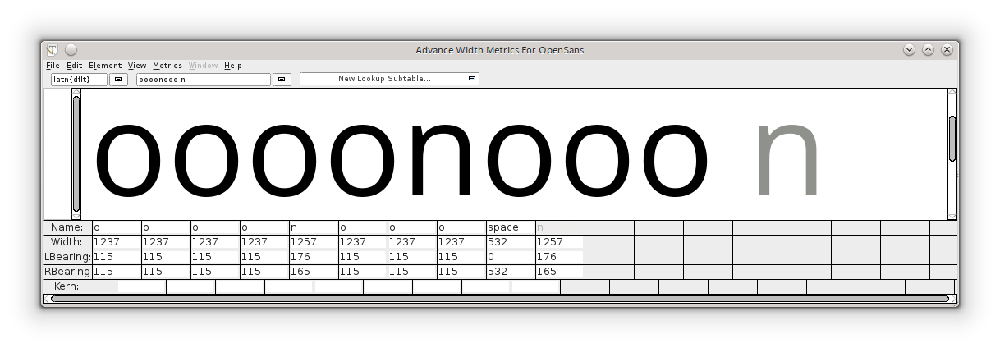

به محض آن که فاصله‌گذاری o و n به میزان کافی انجام شد، حاشیه‌ها جنبی آن‌ها را می‌توان برای آرایه‌ای از نویسه‌های دیگر به کار برد. مثلا
- حاشیهٔ چپ o را می‌توان برای حاشیهٔ چپ c و d به کار برد.
- حاشیهٔ راست o را می‌توان برای حاشیهٔ راست b و p به کار برد.
- حاشیهٔ چپ n را می‌توان برای حاشیهٔ چپ b و r و k به کار برد.
- حاشیهٔ راست n را می‌توان برای حاشیهٔ راست h و m به کار برد.

توجه: توضیحات بالا بایستی صرفا به عنوان یک راهنما و یک نقطهٔ شروع بسیار مؤثر برای یافتن مقادیر درست حاشیه‌های جنبی در نظر گرفته شود.

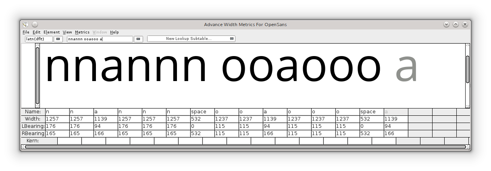

در این زمان و به شکلی که در تصویر بالا می‌بینید، کاملا معقول است که حاشیه‌های جنبی سایر نویسه‌های کوچک را در قیاس با o و n تنظیم کنید.
یادآوری این نکته خالی از لطف نیست که برای رسیدن به تعادل درست برای نویسه‌ها، به چشمان‌تان اعتماد کنید.

## نویسه‌های بزرگ

فاصله‌گذاری نویسه‌های بزرگ را هم می‌توان به روش مشابه انجام داد.
به عنوان مثال، با رشتهٔ «Hoooo» شروع کرده و حاشیه‌های راست آن را تا جایی که در تعادل با نویسهٔ o قرار بگیرد تغییر دهید.
از آن جایی که حاشیهٔ چپ H با حاشیهٔ راستش برابر است، می‌توان حاشیه‌های O را در ترکیب با H تنظیم کرد. (تصویر زیر را ببینید).

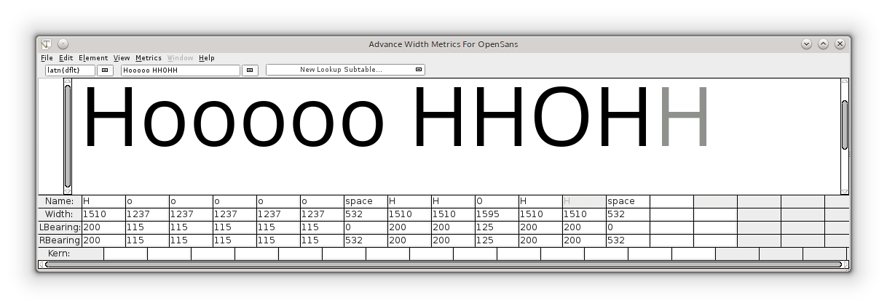

از این زمان به بعد می‌توانید نویسه‌های دیگر را در کنار این نویسه گذاشته و فاصله‌ها را تنظیم کنید.
بایستی به این نکته توجه داشته باشید که این روش صرفا یک نقطهٔ شروع خوب برای فاصله‌گذاری یک فونت است و صرف زمان بیشتر برای تنظیم دقیق‌تر می‌تواند به نتایجی با سطح کیفی بهتری به دست دهد.
از این رشته نویسه‌های دیگری مانند «naxna»، «auxua»، «noxno» و «Hxndo» نیز می‌توانید استفاده کنید.

## کرنینگ

کرنینگ، فرایند تنظیم فاصله بین جفت‌نویسه‌های خاص است.
کرنینگ ما را قادر می‌سازد تا علاوه بر فاصله‌گذاری پیش‌فرض، فاصله‌گذاری اختصاصی برای جفت‌نویسه‌ها را انجام دهیم.
نمونه‌های رایج برای جفت‌نویسه‌های که اغلط نیاز به بهبود فاصله‌گذاری دارند عبارت‌اند از «WA» و «Wa» و «To» و «AV».
در مثال زیر می‌توانید ببینید که بدون کرنینگ، فاصله میان جفت‌حروف «To» و «Av» بسیار گشاد است در حالی که با کرنینگ، این فاصله طوری تغییر یافته که با حس و حال فاصله‌گذاری‌های باقی فونت متعادل باشد.

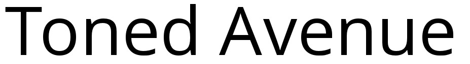

پنجرهٔ سنجه‌ها (Metrics Window) در فونت‌فورج می‌تواند جدا از تنظیم حاشیه‌های جنبی، برای مقادیر کرنینگ نیز مورد استفاده قرار گیرد.
مقادیر کرنینگ را می‌توان به چند روش مختلف در فونت‌فورج اعمال کرد.
دو مورد از این روش‌ها را می‌توانید در زیر مشاهده کنید: کرنینگ با کلاس‌ها و کرنینگ با جفت‌نویسه‌های مجزا.

## فهرست سنجه‌ها در فونت‌فورج

- فرمان «_**Window&nbsp;Type**_»: شیوهٔ عملکرد پنجرهٔ سنجه‌های فونت‌فورج را به یکی از روش‌های زیر برای تنظیم کرنینگ تنظیم می‌کند:
  - روش «_**Kerning&nbsp;Only**_»: فقط کرنینگ تغییر کند.
  - روش «_**Both**_»: هم کرنینگ و هم عرض تغییر کند.
- فرمان «_**Kern&nbsp;By&nbsp;Classes**_»: پنجره‌ای را برای تغییر کلاس‌های کرنینگ به کاربر نشان می‌دهد.
- فرمان «_**Kern&nbsp;Pair&nbsp;Closeup**_»: پنجره‌ای برای به کاربر نشان می‌دهد که در آن می‌توان جفت‌کرنینگ‌های موجود را ویرایش کرد و یا جفت‌های جدید ساخت. (تصویر زیر را ببینید)

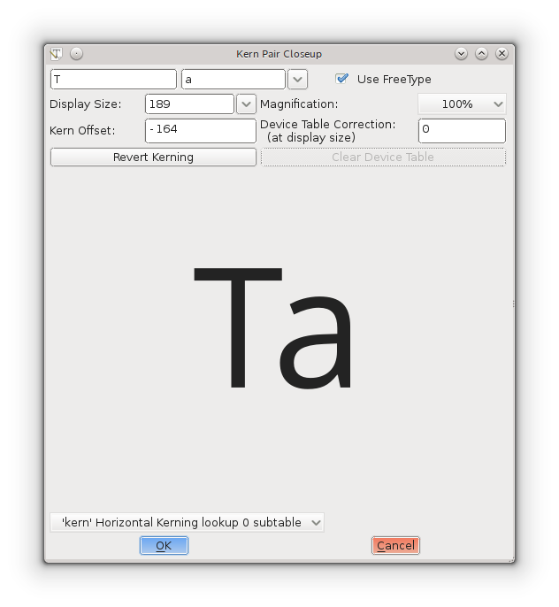

## تنظیم مقدار کرنینگ با صفحه کلید

درست مشابه تنظیم حاشیه‌های جانبی، مقادر کرنینگ را نیز می‌توان با کمک کلیدهای جهت‌نما روی صفحه کلید، سریع و دقیق تنظیم کرد. دکمه‌های بالا و پایین برای افزایش یا کاهش مقادیر و ترکیب کلیدهای جهت‌نما با دکمه دگرساز یا <kbd>Alt</kbd> برای پیمایش روی خانه‌های مختلف مقادیر در پنجرهٔ سنجه‌ها به کار می‌روند.

## تنظیم کرنینگ مجزای جفت‌نویسه‌ها

این، پایه‌ای‌ترین سطح ساخت کرنینگ جفت‌نویسه‌ها در فونت‌فورج است.
در پنجرهٔ سنجه‌ها (Metrics Widnow) مقدار کرنینگ میان دو نویسه را می‌توان هم با کشیدن افقی نویسهٔ دوم و هم با ویرایش مستقیم مقدار کرنینگ در جدول سنجه‌ها تغییر داد.
برای تغییر مقادیر کرنینیگ از طریق کشیدن نویسه، می‌توانید از دستگیرهٔ ابزار کرن (kern-tool) که با قرار گرفتن موشواره بین دو نویسه نمایش می‌یابد (تصویر زیر را ببینید) استفاده کنید.
مقدار کرنینگ در جدول سنجه‌ها می‌تواند با وارد کردن دستی مقادیر و یا افزایش و کاهش از طریق فشردن دکمه‌های بالا و پایین صفحه کلید تغییر یابد.

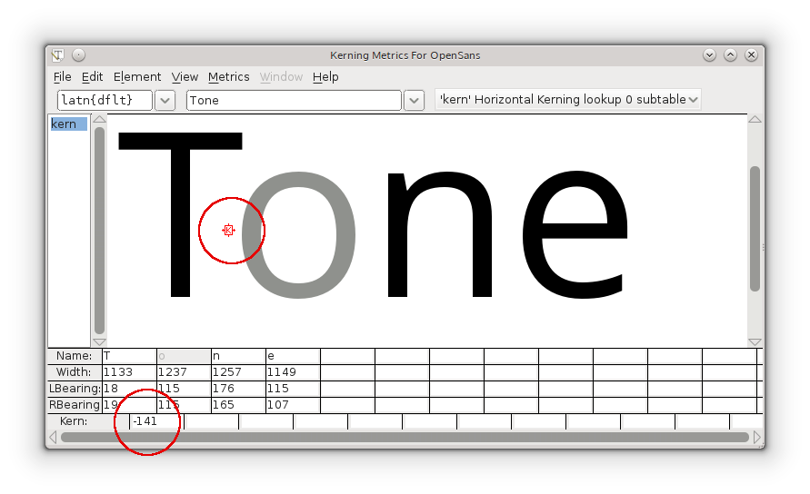

## کرنینگ با کمک کلاس‌ها

کرنینگ با کلاس‌ها می‌توان به صرفه‌جویی قابل توجهی در زمان شما منجر شود!

یک کلاس کرن در فونت‌فورج را می‌توان برای ساخت گروه‌هایی از نویسه‌ها به کار برد که همگی‌شان نیازمند تنظیمات مشابهی برای کرنینگ هستند. به عنوان مثال، می‌توان کلاسی با نام «o_left_bowl» ساخت که در آن، نویسه‌های ocdeq همیشه مقدار کرنینگ مشابهی برای زمانی که بعد از نویسه‌ای مثل T بیایند خواهد داشت.
نویسهٔ T نیز می‌تواند یکی از اعضای کلاس دیگری باشد که حاوی نویسه‌های دیگری است.

کلاس کرنینگ، یکی از انواع مراجعات GPOS یا GPOS lookup است.
با رفتن به `Element > Font Info > Lookups > GPOS` می‌توان به این اطلاعات کرنینگ دست یافت.
(شما هر زمان می‌توانید به این جا برگشته و کاری که در حال انجام بودید را ادامه دهید.)

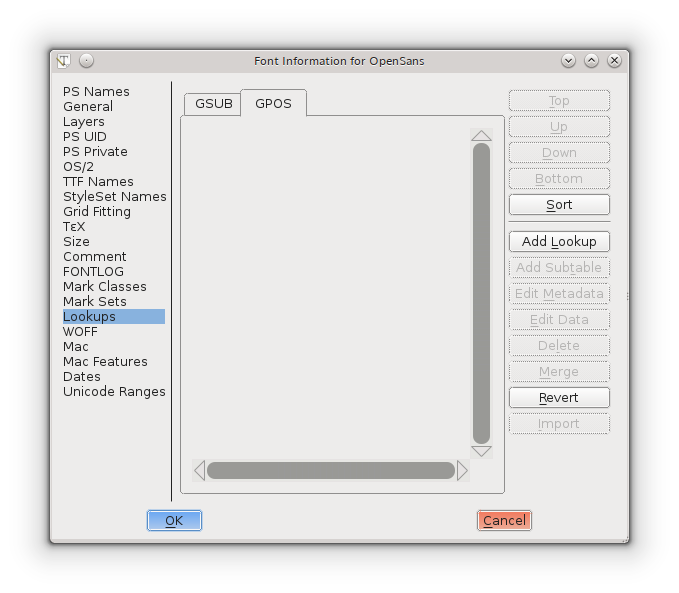

دکمهٔ Add Lookup را فشرده و نوع «Pair Position (kerning)» را انتخاب کنید.

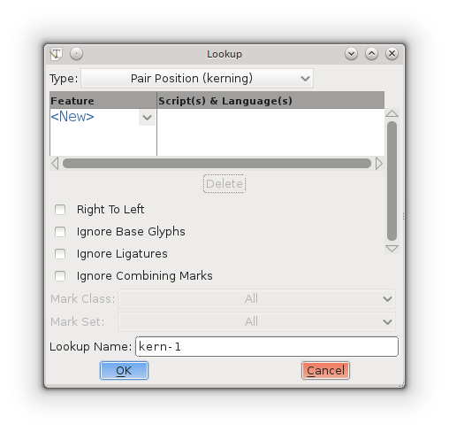

روی دکمهٔ New کلیک نکنید!
به جاش فلش روی به پایین کنارش را بفشارید و کرنینگ افقی (Horizontal Kerning) را انتخاب کنید.
نوشتهٔ New به Kern تغییر می‌یابد.
نام مراجعهٔ پیش‌فرض را بپذیرفته، و یا در صورت تمایل، تغییر دهید.
در پایان، دکمه Ok را بفشارید.

به زبانهٔ GPOS برمی‌گردید و اکنون جدول مراجعه‌ای دارید که انتخاب شده است.
هر مجموعه کلاس کرنینگ در زیرجدول خودش قرار می‌گیرد.
به منظور ساخت زیرجدول، روی دکمهٔ Add Subtable کلیک کنید.
می‌توانید نام پیش‌فرض را پذیرفته و تایید کنید. در این مرحله، پنجره‌ای با گزینه‌های متعدد پیش روی شما قرار می‌گیرد:

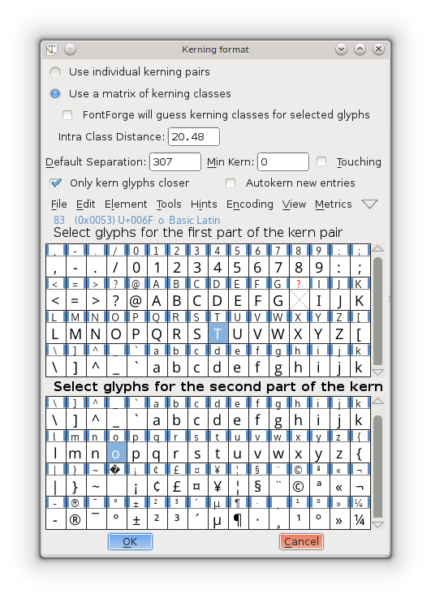

در بخش بالایی از شما پرسیده می‌شود که یکی از دو گزینهٔ «استفاده از کرنینگ جفت‌های مجزا» (Use individual kerning pairs) یا «استفاده از ماتریسی از کلاس‌های کرنینگ» (Use a matrix of kerning classes) یکی را انتخاب کنید.

اگر کلاس‌ها را انتخاب کنید، پنجره‌ای نمایش خواهد یافت که در آن می‌توانید کلاس‌های خود را تعریف کنید.
**برای تنظیم کردن کرنینگ ارجاعات (references) در کنار گلیف‌های اصلی، کلاس‌ها را انتخاب کنید.**

توجه داشته باشید که می‌توانید با انتخاب گزینهٔ autikern، تنظیم کنید که فونت‌فورج دست به حدس زدن مقدار کرنینگ مناسب بین کلاس‌های تعریف شده بکند.
اگر چنین تنظیماتی را انجام دهید، بی‌تردید نیاز به مقداری آزمون و خطا کردن برای رسیدن به مقدار مناسب دارید اما این کار می‌تواند یک راه سریع برای دیدن تاثیری باشد که به دنبالش هستید.

باقی گزینه‌ها را تا زمانی که دلیلی برای تغییرشان پیدا نکرده‌اید به حال خود رها کنید.

پس از کلیک کردن روی Ok در پنجره‌ٔ بالا، پنجرهٔ دیگری نمایش می‌یابد که در آن می‌توانید میزان کرنینگ میان دو کلاس را به دقت تنظیم کنید.
به عنوان مثال، در دومین تصویر پایین، دو کلاس ساخته شده‌اند که یکی شامل نویسهٔ T و دیگری شامل نویسهٔ o است.

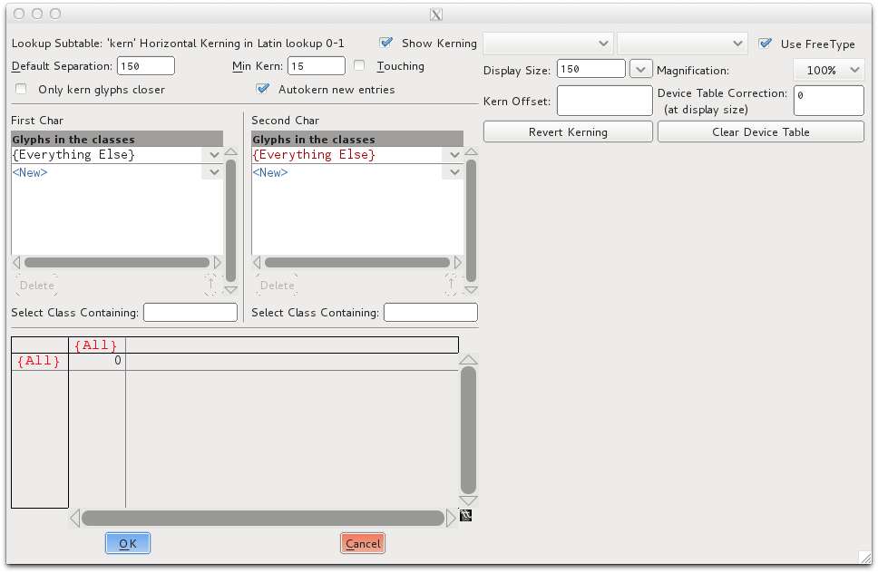

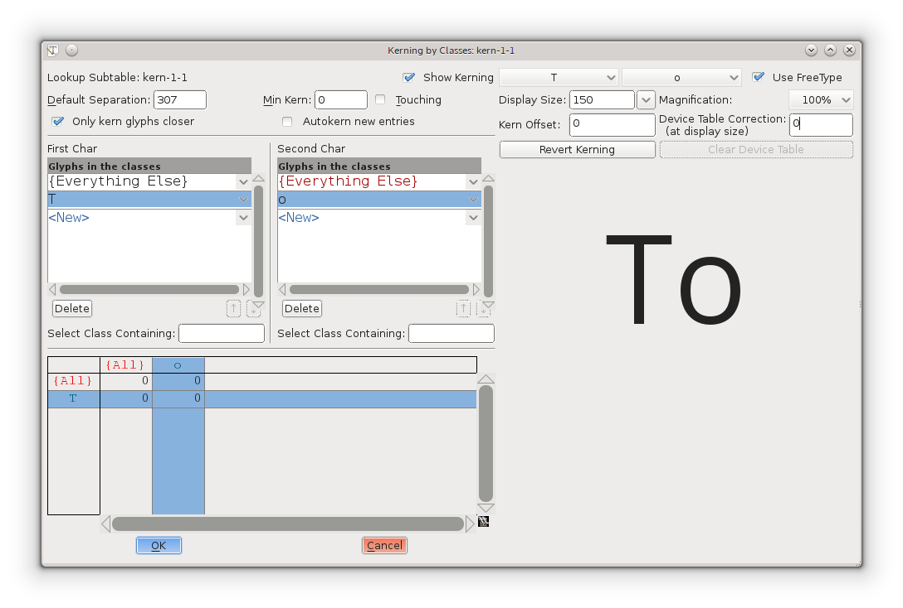

می‌توانید همهٔ گلیف‌ها را انتخاب کرده و بعدتر، کلاس‌ها را حذف کنید، و یا می‌توانید فقط گلیف‌هایی که می‌خواهید کرنینگ‌شان را تنظیم کنید انتخاب کنید.
همهٔ گلیف‌هایی را که به دنبال تنظیم‌شان هستید را انتخاب کنید. فونت‌فورج آن‌ها در کلاس‌ها قرار می‌دهد  &mdash; مگر آن که در حال کار روی خَط، دبیره، زبان‌نگاره یا سامانه نوشتاری دیگری (مثل لاتین، یونانی، سیریلیک و...) باشید که نمی‌خواهید کرنینگ‌شان با هم تنظیم شود.

زمانی که دکمهٔ Ok را بفشارید، پنجرهٔ بزرگی با برخی تنظیمات در بخش بالا به همراه دو فهرست از کلاس‌ها و یک ماتریس در بخش پایینی نمایش می‌یابد.
با انتخاب هر یک از خانه‌ها در ماتریس می‌توانید ببینید که کرنینگ روی هر جفت‌نویسه چگونه اعمال می‌شود،
اگر نتیجه را نپسندیدید، می‌توانید مقدار Kern Offset را در در بخش بالای نمایش جفت‌نویسه تنظیم کنید.

چنانچه چیزی را خراب کردید کافی است که دکمه لغو یا Cancel را بفشارید.
سپس، روی زیرجدول دو بار کلیک کنید (یا اگر آن را نمی‌بینید، علامت + را در کنار جدول بفشارید) تا به پنجرهٔ بزرگ بازگردید.
اگر کار زیادی را بدون بروز مشکلی انجام داده‌اید، فکر بدی نیست که با فشردن Ok، کارتان را ذخیره کرده و برای ادامهٔ کار، مجددا به این پنجره بازگردید. در غیر این صورت ممکن است زحمات‌تان را به باد دهید.

بعدتر و برای بررسی نهایی می‌توان به پنجرهٔ سنجه‌ها مراجعه کرد.
در حالی که تغییرات را می‌توان در آن پنجره انجام داد، مدام از شما می‌پرسد که آیا می‌خواهید که تنظیمات کرنینگ کلاس یا جفت‌نویسه‌ها را انجام دهید.
چرا که نه! اگر دوست دارید امتحانش کنید.
اما بدانید که برخی کاربران باتجربه آن را نمی‌پسندند و تنظیمات کرنینگ را به شیوه‌ای که بالاتر گفته شد انجام می‌دهند: به `Element > Font Info > Lookups > GPOS` رفته، دکمهٔ + را می‌فشارند و روی زیرجدول، دو بار کلید می‌کنند.

## کرنینگ دستی

اگر مقداری تولید شده توسط کرنینگ خودکار (auto kern) نیاز به تغییر داشته باشند (که معمولا دارند) می‌توانید به چند روش این کار را انجام دهید:

- از طریق پنجرهٔ «کرنینگ با کلاس‌ها»
- استفاده از پنجرهٔ سنجه‌ها
- استفاده از فرمان «Kern Pair Closeup» از فهرست سنجه‌ها
