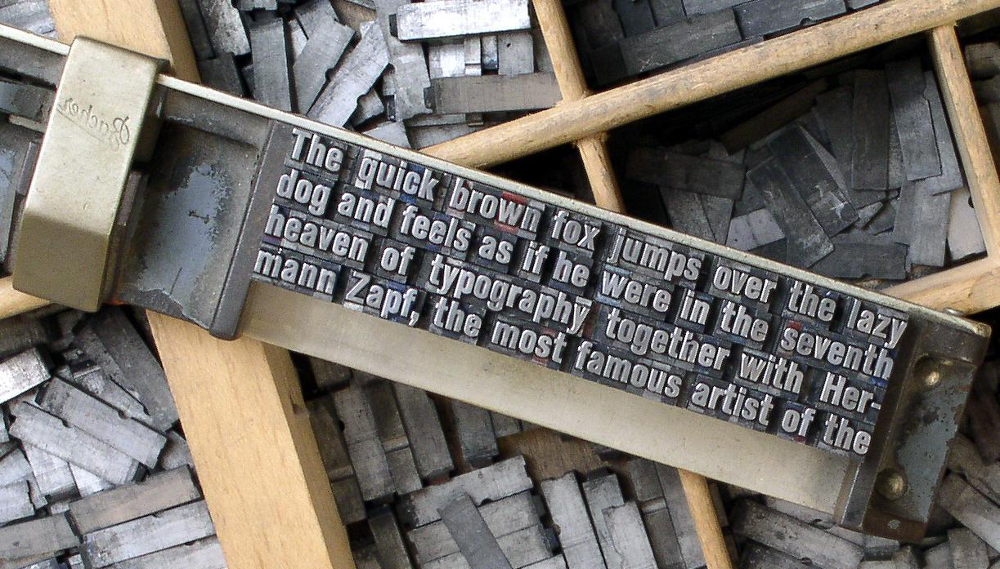

&mdash; همچنین «اندازهٔem» یا «UPM» نیز خوانده می‌شود.  
در یک فونت، هر نویسه در یک فضای مختص به خود گنجانده می‌شود.
در چاپ سنتی فلزی، این فضا واقعا یک بلوک فلزی برای هر نویسه بود.
ارتفاع هر قطعه مشابه بود که اجازه می‌داد حروف به طور مرتب در کنار هم و در ردیف‌ها و بلوک‌ها قرار بگیرند (تصویر زیر را ببینید).

ارتفاع یک تایپ، «em» خوانده می‌شود
که نشأت گرفته از عرض حرف M بزرگ لاتین است؛
دلیلش هم آن است که نسبت عرض و ارتفاع این حرف می‌تواند برابر باشد
(که می‌شود همان ابعاد مربع em).

اندازه em مقداری است که اندازه تایپ فلزی بر اساس آن محاسبه می‌شود.
بنابر این یک تایپ ۱۰ نقطه‌ای (points) دارای یک em ۱۰ نقطه‌ای است
(تصویر زیر را ببینید).

در تایپ‌های دیجیتال، em یک مقدار تعریف شدهٔ دیجیتالی برای فضاست.
در فونت اوپن‌تایپ، UPM یا اندازه em معمولا روی ۱۰۰۰ واحد تنظیم می‌شود.
در فونت‌های تروتایپ،
UPM به طور قراردادی از توان‌های دو و معمولا معادل ۱۰۲۴ یا ۲۰۲۸ است.

وقتی از فونت برای تنظیم تایپ استفاده می‌شود،
em در مقیاس اندازه نقاط (point) دل‌خواه تعیین می‌شود.
این یعنی برای یک تایپ ۱۰ نقطه‌ای،
۱۰۰۰ واحد به ۱۰ نقطه مقیاس می‌یابد.

بنابر این اگر H بزرگ ۷۰۰ واحد بلدا دارد،
در تایپ ۱۰ نقطه‌ای دارای بلندای ۷ نقطه‌ای خواهد بود.

### تنظیم کردن در پنجره گلیف

با دانستن این که فونت شما از UPM برابر با ۱۰۰۰ یا ۱۰۲۴ یا ۲۰۴۸ استفاده می‌کند،
لازم است که تنظیمات رسم گلیف را طوری انجام دهید که اطمینان حاصل شود همهٔ وجوه تایپ‌فیس شما به اندازهٔ کافی در مربع UPM جا می‌گیرد.

اندازه مربع em می‌توان از طریق 
`Element > Font Info…`
و سپس کلیک روی زبانه عمومی (general) انجام شود.
در این جا می‌توانید تنظیمات EM را دیده و مقادیری نظیر بلندای *Ascender* و *Descender* که به ارتفاع بالا و پایین خط مبنا هستند را تغییر دهید.

خط پایه (The Baseline):

The Cap Height:

The x-height:

بعدا و در زمان طراحی تایپ، بایستی مقادیر آبی را نیز تنظیم کنید.
این مقادیر برای outlines در پست‌اسکریپت و همچنین autohinter در فونت‌فورج استفاده می‌شوند
&mdash;
فارغ از این که روی کدام outlines کار می‌کنید.

این تنظیمات را مي‌توانید در
`Element > Font Info…`
زیر زبانه *PS Private* بیابید.
فونت‌فورج می‌تواند در ابتدا مقادیری را بر اساس outlines حدس بزند،
اما شما لازم است آن‌ها را متناسب با overshoots/undershoots تنظیم کنید
&mdash;
چند فصل جلوتر به این مفهوم خواهیم پرداخت ([«ساختن ‘o’ و ‘n’»] را ببینید).

بگذارید ابتدا قدری بیشتر با فونت فورج و قابلیت‌های ترسیمی‌اش آشنا شویم.

[«ساختن ‘o’ و ‘n’»]: Creating_o_and_n.html
