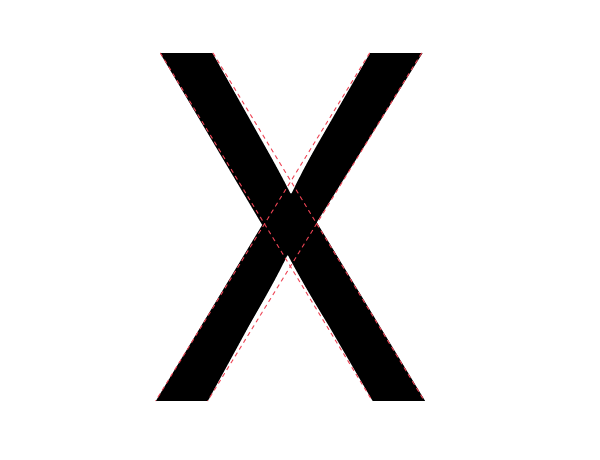

طراحی فونت، فرایند متوالی به آزمون گذاشتن انتخاب‌های منفرد است که به صورت جمعی منتهی به یک طرح کامل می‌شوند.
شما فونت خود را مورد آزمون قرار می‌دهید تا ببینید آیا ترکیب تصمیماتی که گرفته‌اید:

* اجازه می‌دهد که بتوانید فونت را بخوانید
* فونت به شما حس درست می‌دهد
* فونت برای کاری که باید انجام دهد مفید است.

در همین حالی که طراحی خود را به آزمون می‌گذارید، باید به ادراک خود اعتماد کرده و با نوعی عمل‌گرایی طراحی را به پیش ببرید.
بخش زیادی از طراحی نیازمند آن است که شما حروف مشابهی طراحی کنید و قالب‌ها و فرم‌هایی را تکرار کنید.

این ایده وسوسه کننده است که اگر بتوانیم اجزا و فواصل میان گلیف‌ها را اندازه بگیریم، می‌توانیم به نتایج قابل اتکایی دست یابیم.
در حالی که می‌تواند سودمند باشد، این رویکرد دارای محدودیت‌های زیادی است.
اگر چیزی از نظرتان درست نیست باید آماده تغییر باشید.
باید این اعتماد به نفس را داشته باشید که ایجاد تغییر تا رسیدن به «الان درست شد»، همان کار درستی است که باید انجام دهید.

دلیل درستی این حرف این است که تعدادی خطای دید طبیعی وجود دارند که همه خوانندگان در معرض آن‌ها هستند.
این خطاهای دیداری باید در نظر گرفته شده و اَشکال حروف تا جایی تغییر یابند که در دید شما درست به نظر برسند.

می‌توانید در این 
[ویدئوهای بررسی تایپ](https://vimeo.com/typereview/videos)
ایده‌هایی در خصوص این که در کجا و در چه چیزهایی‌ها به دنبال تغییر بگیردید به دست بیاورید.

## مثال‌هایی از خطای دید

برخی خطاها به وزن خطوط مربوط می‌شوند، برخی به طول خطوط، و برخی دیگر مرتبط با شکل‌های ادراکی توسط چشم هستند.

### وزن افقی در مقابل وزن عمودی

مثال سمت چپ یه حرف H را با نوارهایی نشان مي‌دهد که ضخامت یک‌سانی دارند.
درست به نظر نمی‌رسد. می‌توانید این را حس کنید؟

در حرف H سمت راست، نوار افقی نازک‌تر شده است تا حس ضخامت مشابه را به مخاطب بدهد.

گلیف‌هایی که باید چنین اصلاحاتی در آن‌ها داده شوند متعدد هستند و شامل موارد زیر می‌شوند:

A, E, F, L, H, f, t, z

### ضخامت قطری

به شکل مشابه، اگر نوارهای هم عرضی داشته باشید که یکی از آن‌ها به صورت قطری قرار گرفته باشد، نوار قطری اندکی سنگین‌تر، از نوار عمودی و اندکی نازک‌تر از نوار افقی به نظر می‌رسد.
اگر بخواهید درست دیده شود، لازم است که آن را تغییر داده و آن را اندکی نازک‌تر از نوار افقی کنی؛ اما فقط اندکی.

گلیف‌هایی که در آن‌ها چنین مشکلی می‌تواند بروز کند متعددند و شامل موارد زیر می‌شوند:

k, K, N, Q, R,
v, V, w, W, x, X, y, Y, 7, 2, &amp;, ł, Ł, &oslash;, &Oslash;, &radic;, ∕, &lsaquo;, &rsaquo;,
&laquo;, &raquo;, ½, ⅓, ¼, &le;, &ge;و &times;

### طول و زاویه قطری حسی

به منظور ایجاد حس شیب مشابه، شکل‌های بزرگ‌تر لازم است که اندکی کم‌شیب‌تر از شکل‌های کوچک‌تر باشند.

تصویر زیر خطوط موربی با شیب یکسان نمایش مي‌دهد.
خط طولانی‌تر این گونه نشان می‌دهد که گویی زاویه‌اش متفاوت است.

در تصویر زیر، زاویه خط بلندتر تغییر یافته است:

اکنون بیایید نگاهی به گلیف‌های کج نگاهی داشته باشیم که چه طور چنین اصلاحی روی‌شان انجام شده است:

### قطری متقاطع

وقتی یک نوار، نوار قطری یا خط مستقیم دیگری را قطع می‌کند نیاز به اصلاح دارد تا ناتراز دیده نشود.

در مثال بالا، حرف X سمت چپ دارای دو نوار متقاطع اصلاح‌نشده است.
مثال سمت راست اصلاح شده است تا این نوارها تراز به نظر برسند.

همان طور که در این تصویر با خطوط نقطه‌چین می‌بینید، با قدری جابجایی، خطوط به صورت تراز به نظر می‌رسند.

گلیف‌های زیر دارای خطای مشابه هستند:

x, X, k, K, ×, #, and the Icelandic letter ‘eth’
(&eth;).

### ارتفاع حسی

شکل یک گلیف در این که چه قدر بلند باید باشد تا هم قد گلیف‌های دیگر د به نظر برسد مؤثر است.
گلیف‌های منحنی لازم است اندکی از گلیف های تخت بلندتر باشند.
گلیف‌هایی با نوک‌های تیز لازم است از این هم بلندتر باشند.
هر چه شکل تیزتر باشد، بیشتر نیاز به افزایش ارتفاع دارد تا درست به نظر برسد.

در تصویر بالا، سه شکل ردیف بالا به درست اصلاح نشده‌اند 
&mdash;
به این معنا که ارتفاع‌شان دقیقا یکی است.
سه شکل ردیف پایین اما اصلاح شده‌اند تا این حس را بدهند که دارای ارتفاع یکسان‌اند.

این خطای دید در همهٔ گلیف‌های گرد یا نوک‌تیز وجود دارد و شامل حروف زیر می‌شود:

O, Q, C, S, A, V, W

## شما صلاحیت کافی را برای اصطلاح این خطاها دارید

به این خاطر که شما هم خطاهای دید را می‌بینید و هم اثر اصطلاح برای آن خطاها را، قادر هستید که خودتان این اصلاحات را انجام دهد.
تنها کافی است که به احساس خود اعتماد کنید.

## انطباق با هدف را به آزمون بگذارید

همان‌طور که می‌توانید خطاهای دید و اصلاح‌شان را ببینید، می‌توانید بگویید که آیا یک فونت آن هدفی را که برایش ساخته شده است را برآورده می‌کند یا خیر.
این جا هم جایی است که باید به قضاوت خود اعتماد داشته باشید.

جدا از این موضوع، لازم است که به این نکته توجه داشته باشیم که هیچ فونتی را نمی‌توان بدون در نظر گرفتن شیوه‌ای که استفاده می‌شود و چیزی که برایش استفاده می‌شود ارزیابی کرد.
به همین دلیل است که شروع به آزمون گذاشتن فونت را باید از همان مواحل اولیه فرایند طراحی در دستور کار قرار داد و تا رسیدن به نقطه‌ای که حس کنیم کار تمام شده است ادامه دهیم.

این آزمون‌ها چه شکلی هستند؟
آزمون‌ها در ابتدا ساده هستند تا به شما اجازه دهند که نخستین تصمیمات طراحی‌تان را بگیرید.
با کامل‌تر شدن طراحی شما، آزمون‌ها نیز با همین سرعت تغییر کرده
و به شما امکان ارزیابی موفقیت یا شکست نسبی تصمیمات جدیدی که اتخاذ کرده‌اید را می‌دهند
&mdash;
یا حتی بهتر، امکان مقایسهٔ دو (یا سه یا بیشتر &hellip;) گزینه‌ای که در نظر دارید را می‌دهند.

گاهی ممکن است چند گام از تصمیماتی که فکر می‌کردید کارساز باشند به عقب برگردید.
این عادی است.
ساختن یک فونت نیازمند ایجاد تعادل بین متغیرهای بسیاری است و غافل‌گیر شدن، بخشی جدایی ناپذیر از کار است.
هر چه بیشتر فونت طراحی می‌کنید، تجربهٔ بیشتری در گرفتن چنین تصمیماتی به دست می‌آورید.

وقتی به پایان فرایند نزدیک می‌شوید،
اگر فونت قرار باشد به صورت ساده استفاده شود،
آزمون‌ها نیز باید به همین اندازه ساده باشند.
ولی اگر قرار باشد که یک فونت به شکل‌های مختلفی به کار گرفته شود
یا مثلا بخواهد در بازه گسترده‌از از محیط‌های چاپ یا نمایش استفاده شود،
لازم است که در تمام دامنه مورد استفاده‌اش مورد آزمون قرار بگیرد
که این موضوع شامل بررسی نسخه چاپی فونت نیز می‌شود.

داشتن تعریف دقیقی از کاربرد نهایی یک فونت می‌تواند زمانی زیادی را در زمان طراحی برای شما بخرد.
با این حال، این موضوع همیشه ممکن نیست و ایده‌های شما هم به مرور زمان متحول می‌شوند.
نکته کلیدی در این جا این است که تا جای ممکن فکر کنید و تلاش کنید به تعریف دقیق موارد استفاده،
و سپس اطمینان یابید که به کمک پرسش‌هایی که طرح می‌کنید، آزمون‌های شما هم‌پای طراحی فونت روزآمد می‌شوند

## مطالعه بیشتر

* <http://typographica.org/on-typography/making-geometric-type-work/>
* <http://typedrawers.com/discussion/1085/the-letter-s>
