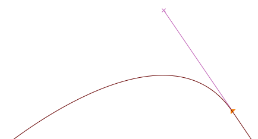
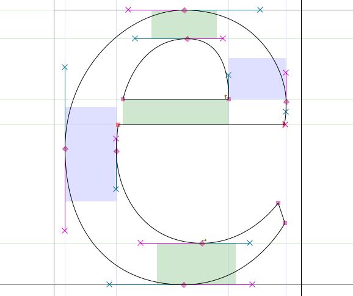
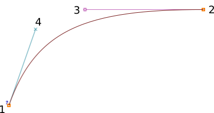

طراحی یک فونت در فونت‌فورج شامل استفاده از تعدادی از ابزارها است که با مجموعه‌ای از ابزارهای طراحی شروع می شود که ممکن است برای کاربران دارای تجربه در گرافیک برداری آشنا باشند
 &mdash;
هر چند تفاوت‌های قابل توجهی وجود دارد.

برای شروع و پیش از نگاه کردن به ابزار طراحی فونت‌فورج،
به چگونگی کار منحنی‌های بزیه (Bezier) می‌پردازیم.

## درک منحنی‌های بزیه (B&eacute;zier curves)

مفهوم «منحنی‌های بزیه» به یک بازنمایی ریاضیاتی به خصوص برای تولید دیجیتالی منحنی‌های نرم اشاره دارد.

عموما مدل‌های درجه مربعی و مکعبی از این منحنی‌ها مورد استفاده قرار می‌گیرند
&mdash;
اگرچه فونت‌فورج، از منحنی های اسپیرو (Spiro) نیز پشتیبانی می‌کند که یک بازنمایی جایگزین برای طراح است.

در این فصل، ما فقط در مورد مسیرهای مکعبی بحث خواهیم کرد که در رسم گلیف‌ها بسیار رایج هستند.
مسیرهای *Spiro* در فصل بعدی مورد بحث قرار خواهد گرفت.
منحنی‌های مربعی تنها در فونت‌های تروتایپ یافت می‌شوند و به ندرت در طراحی به کار می‌آیند
&mdash;
این‌ها بیشتر در زمان ساخت، تولید می شوند.

یک مسیر معمولی بزیه از یک لنگر با دو دسته که جهت کلی را نشان می‌دهند تشکیل شده است
&mdash;
طول هر دسته، طول منحنی را در هر طرف تعیین می‌کند
&mdash;
تصویر زیر را ببینید.

### انواع مختلف نقاط

#### نقاط منحنی یا Curve Points (نمایش یافته با نقاط گرد)

*نقاط منحنی* دارای دو دسته هستند که هر یک به دیگری پیوند خورده است.
در نتیجه، خط مابین این دو دسته، همیشه به صورت مستقیم قرار می‌گیرد
تا بتواند یک منحنی نرم را در هر سو تولید کند.

<h4 class="quiet">
نقاط منحنی H/V یا آ H/V Curve Points(نمایش یافته با نقاط لوزی شکل)
</h4>

*نقاط منحنی H/V* (افقی/عمودی یا horizontal/vertical) گونه‌ای از نقاط منحنی هستند که به محور افقی یا عمومی می‌چسبند
&mdash;
ابزاری اساسی برای ایجاد فرم صحیح بزیه (در بخش بعد بیشتر توضیح می‌دهیم).

#### نقاط سکه‌ای یا گوشه‌ای یا Coins/Corner Points (نمایش یافته با نقاط مربعی)

*سکه‌ها* می‌توانند صفر، یک یا دو دستهٔ بزیه داشته باشند.
موقعیت هر دسته مستقل از دیگر دسته‌هاست که امکان توقف در یک منحنی را در طرح می‌دهد.
بدون دستگیره، سکه‌ها خطوط مستقیم تولید می‌کنند.

#### نقاط مماس یا Tangent points (نمایش یافته با نقاط مثلثی یا پیکانی)

اگر می خواهید از یک خط مستقیم شروع کرده و سپس به آرامی شروع به ایجاد انحنا کنید، نقاط مماس به کارتان می‌آیند.
یک نقطه مماس، خط مستقیم را در یک طرف قرار می دهد،
در حالی که منحنی بزیه در سمت دیگر آن و در همان راستا قرار می‌گیرد
&mdash;
این موضوع، یک انتقال مداوم بین خط و منحنی را تضمین می‌کند.

### درست درآوردن شکل‌ها

به منظور تولید منحنی‌های مناسب
&mdash;
با نقاط کنترل حداقل و برداری‌سازی آسان،
لنگرها باید همیشه در **کرانه‌های منحنی** قرار بگیرند.
با این حال،
در محل‌هایی که در فرم حرف خود نیاز به ایجاد شکست دارید،
خطی که مسیر را تعیین می‌کند باید **افقی یا عمودی** باشد.

<b>توجه:</b>
اگر نقاط کنترل شما در کرانه‌ها قرار نمی‌گیرند،
فونت‌فورج کرانهٔ واقعی را با یک نشان هدف‌گیری مشخص می‌کند. (`⊕`):

سپس می‌توانید شکل را با رونوشت گرفتن از طرح فعلی در لایه‌ای دیگر،
و سپس جابجایی نقاط کنترل تا نشستن نقاط بر سرجای درست‌شان اصلاح کنید
&mdash;
در غیر این صورت ابزار اعتباربخشی فونت‌فورج به طور خودکار نقطهٔ لازم را در کرانه اضافه می‌کند،
در آن نقطه شما می توانید لنگر اشتباه خود را با
<i>Right-click > Merge</i>
ادغام کنید.
 
بعدا در
<a href="Making_Sure_Your_Font_Works_Validation.html">
فصل اعتبارسنجی</a>.

بیشتر در این خصوص خواهیم گفت.

برای توضیح بیشتر، دو حالت وجود دارد که در آن شما باید مسیرهای بزیه افقی/عمودی را کنار بگذارید:

- اگر بخواهید شیب کلی منحنی خود را تغییر دهید، مانند قسمت بالای سمت چپ از حرف "a" زیر که تقریبا تخت نگه داشته می‌شود:  
  
- اگر شما بخواهید شکستی را در شکل حرف ایجاد کنید، آن گونه که در در بخش پایین سمت جپ حرف g زیر می‌بینید &mdash; که معمولا از نقطه *سکه‌ای* (جدا از خصوص ترسیمی) استفاده می‌شود:  
  

<b>توجه:</b>
همان‌طور که می‌بینید، در زمان ایجاد شکست با کمک نقاط <i>سکه‌ای</i>، جهت هر دستگیره بایستی مماس با منحنی در نقطه‌ای باشد که به هم می‌رسند.

## استادی در ابزارهای رسم فونت‌فورج

از پنجرهٔ اصلی، روی قاب‌های گلیف کلیک کنید تا پنجرهٔ گلیف باز شود.

<b>توجه:</b>
اعداد بالای تصویر، جایی که محورهای x و y تقاطع پیدا می‌کنند، از چپ به راست مشخص کننده این موارد هستند:

<ul>
<li>موقعیت (x, y) مکان‌نمای جاری روی بوم</li>
<li>موقعیت آخرین نقطه انتخاب شده</li>
<li>موقعیت مکان‌نمای شما در نسبت با نقطه انتخاب شده</li>
<li>فاصله میان مکان‌نمای شما و نقطه انتخابی</li>
<li>زاویه از نقطه انتخابی تا مکان‌نمای شما (در نسبت با خط پایه)</li>
<li>سطح بزرگ‌نمایی جاری، به همراه نام لایه فعال.</li>
</ul>

<b>توجه:</b> 
گاهی به نظر می‌رسد که فونت‌فورج در زمانی که داخل پنجره گلیف هستید به شما پاسخ نمی‌دهد.
ممکن است این موضوع ناشی از آن باشد که یک پنجرهٔ تعاملی دیگر باز شده و در پشت پنجره جاری قرار گرفته باشد. در چنین حالتی، پنجره را تکان داده و تکلیف آن پنجره تعاملی را روشن کنید.

یک *خط* متشکل از دو نقطه است.

یک *[تکه‌بند] یا Spline* متشکل از چهار نقطه است: دو نقطهٔ پایانی تکه‌بند و دو «دستگیره» که شیب تکه‌بند را در نقاط پایانی تعریف می‌کنند.

### اعمال Copy/paste/cut/delete رو نقاط، تکه‌بندها و خطوط

مشابه اکثر نرم‌افزارهای ترسیم، فونت‌فورج به شما اجازه گرفتن رونوشت (copy)، برش (cut)، چسباندن (paste) یا حذف (delete) هر نقطه، خط و یا تکه‌بندی را می‌دهد.
این فرامین در منوی ویرایش (edit) وجود دارند و همچنین از طریق کلیدهای میان‌بر که بسته به سیستم‌عامل متفاوتند و در مقابل هر دستور نوشته شده‌اند قابل استفاده هستند.

## خودتان را با ابزارهای رسم آشنا کنید

الان که با کلیات بوم آشنا شده‌اید زمان آن رسیده است که دست به ابزار شوید.

### اشاره و بزرگنمایی (Point and Zoom)

اشاره و بزرگنمایی مشابه همین ابزارهای در سایر نرم‌افزارها کار می‌کنند.

اشاره‌گر، یک ابزار انتخاب است که با آن می‌توانید نقاط، مسیرها و ساید اشیاء روی بوم را انتخاب کنید.

ابزار بزرگنمایی به شما امکان بزرگ کردن آسان نمایش (Z) را می‌دهد. برای معکوس کردن رفتار می‌توانید به منوی نمایش یا View رفته و گزینه *Zoom out* یا *Fit* را انتخاب کنید. کلید میان‌بر X هم قابل استفاده است.

توجه داشته باشید که در هر لحظه، فارغ از ابزاری که فعال است می‌توانید با نگه داشتن دکمه <kbd>Ctrl</kbd> از ابزار اشاره استفاده کنید.

### ابزار دست‌باز (The Freehand tool)

این ابزار به شما امکان می‌دهد تا مسیرهای نامنظم رسم کنید.

در بخش ترسیم، کافی است که کلیک کرده، دکمه را نگه دارید و به اطراف حرکت کنید.
سپس با انتخاب ابزار اشاره می‌توانید نقطه‌های مسیر رسم شده را انتخاب کنید.

وقتی که نقطه‌ای از یک مسیر را انتخاب می‌کنید، به شکل یک دایره زرد رنگ در می‌آید.
اگر نقطه انتخابی یک نقطه منحنی باشد،  نقاط کنترلی آن به صورت دستگیره‌های بنفش و فیروزه‌ای در می‌آیند.
می‌تواند هر کدام را گرفته و به اطراف بکشید تا شکل مورد نظرتان در منحنی به دست آید.

### ابزارهای نقطه (The point tools)

اکنون زمان آن است که به سراغ ابزارهای نقطه برسیم.

برای اضافه کردن نقطه‌ای به یک مسیر، ابتدا هر یک از این ابزارها را انتخاب کنید.
سپس روی مسیر کلیک کنید و کمی فشار بدهید.
اکنون یک نقطه جدید روی خط خواهید داشت.

ابزار نقطه منحنی (Curve point tool) برای اضافه کردن یک نقطه در یک بخش منحنی استفاده می‌شود.  
ابزار نقطه HVCurve نقاط جدید را محدود می‌کند به طوری که آنها دارای نقاط کنترل افقی یا عمودی باشند
&mdash;
این برای تنظیم نقاط کرانی مهم است.  
ابزار نقطه گوشه (Corner point tool) به شما اجازه می‌دهد تا یک خم تیز در مسیر ایجاد کنید.  
ابزار نقطه مماس (Tangent point tool) به شما اجازه می‌دهد که یک بخش مستقیم را تبدیل به یک بخش منحنی کنید.

### ابزار قلم (The Pen tool)

این ابزار به شما اجازه می‌دهد تا یک نقطه را به منحنی اضافه کنید و نقاط کنترل آن را بکشید.

### ابزار حلزونی (Spiro)

انتخاب این ابزار شما را در حالت رسم یک شکل مارپیج و حلزونی قرار می‌دهد.
به این ترتیب می‌توانید همانطور که گره ها را جابجا می‌کنید،منحنی‌هایی دورانی رسم کنید.
برخی افراد این را به رویکرد استاندارد
(که به عنوان ویرایش بزیه  یا Bézier شناخته می شود)
ترجیح می‌دهند،
اما اگر شما به ویرایش بزیه عادت دارید،
ممکن است احساس کنید که برخی کارهایی که این ابزار انجام می‌دهد، غیرمنتظره‌اند.

### ابزار چاقو (Knife)

این ابزار امکان بریدن تکه‌بندها (splines) به دو بخش را می‌دهند.
این قابلیت در زمانی که شما فقط نیاز به  بخشی از شکلی که رسم کرده‌ای دارید مفید است.

### خط‌کش (Ruler)

ابزار خط‌کش به شما اطلاعات مربوط به اندازه‌گیری و مختصات را می‌دهد.
حین استفاده، یک tooltip شناور را در کنار نشانگر نمایش می‌دهد.
اگر نشانگر خود را روی نقطه‌ای بیاورید، این tooltip به شما اطلاعات به مراتب بیشتری درباره اندازه‌گیری و مختصات می‌دهد.
اگر آن را در کنار یک تکه‌بند قرار دهید، به شما اطلاعاتی در مورد انحنا و شعاع می‌دهد.
از همه سودمندتر، اگر شما بر روی ابزار خط‌کش کلیک کنید و بکشید، اندازه فاصله نقطه شروع تا پایانِ کشیدن و همچنین همه نقاطی که در مسیر از آن‌ها عبور کردید را خواهید دید.

### ابزار تبدیل (The transform tools)

شش ابزار تبدیل وجود دارد:

**نکته:**
برای تمام ابزارهای تبدیل، اگر روی آن‌ها دوبار کلیک کنید می‌توانید مقادیر عددی وارد کنید.

**ابزار مقیاس (Scale)** به شما اجازه می‌دهد تا مقیاس یک شیء را آزادانه تغییر دهید.
نگه داشتن کلید <kbd>Shift</kbd> کمک می‌کند که نسبت عرض و ارتفاع شیء حین تغییر مقیاس ثابت باقی بماند.

**ابزار چرخش (Rotate)** به شما اجازهٔ چرخاندن آزادانهٔ یک شیء را می‌دهد.
محور چرخش شیء، نقطه‌ای است که در ابتدا کلیک کرده‌اید.

**ابزار چرخش سه‌بعدی (3D rotate)** به شما اجازه می‌دهد یک شی را در بعد سوم چرخانده و نتیجه را بر روی صفحهٔ x-y ببینید.

**ابزار برگردان (Flip)** به شما امکان می‌دهد تا یک شیء انتخاب شده را به صورت افقی یا عمودی برگردانید.
نقطه ای که روی آن کلیک می کنید، نقطه منشأ این تبدیل است.

**توجه:**
پس از برگرداندن یک نقطه، شما احتمالا نیاز خواهید داشت تا اصلاح جهت را از طریق `Element > *Correct Direction*` اعمال کنید.

**ابزار اریب (Skew)** به شما اجازه می‌دهد تا شیء انتخابی را به صورت افقی و در جهت ساعت‌گرد (clockwise) یا پادساعت‌گرد (Withershins) اریب و کج کنید.

**ابزار چشم‌انداز (Perspective)** روش دیگری را برای ایجاد اعوجاج غیر خطی در یک شکل در اختیارتان می‌گذارد.

**توجه:**
هیچ گزینهٔ عددی‌ای برای تبدیل چشم‌انداز وجود ندارد.

### ابزارهای مستطیل/بیضی (Rectangle/Ellipse) و چندضلعی/ستاره (Polygon/Star)

این ابزار به شما اجازه می‌دهد تا شکل‌های هندسی ابتدایی‌ای را به مراتب سریعتر از ساخت این اشکال با پاره‌خط‌های مجزا رسم کنید.

با کلیک کردن روی دکمه هر کدام از این ابزارها عملکرد ابزار به ابزار جایگزین تغییر می‌کند.
اگر روی هر کدام از این ابزارها دوبار کلیک کنید، می توانید گزینه‌های نوع شکل را باز کنید.

- گزینه‌های مستطیل: سبک گوشه و قاب محیطی (رسم از گوشه‌ها یا از مرکز به بیرون)
- گزینه‌های بیضی: رسم از گوشه‌ها یا از مرکز به بیرون
- گزینه‌های چندضلعی: تعداد سرک‌ها
- گزینه‌های ستاره: تعداد سرک‌ها و عمق هم فرورفتگی بر حسب درصد. درصد بالاتر باعث رسم بازوهای ستاره‌ای بلندتر می‌شود.

### ابزارهای Mse1 و Mse2

زیر نوار ابزار می‌توانید ابزار فعلی و عملکردهای موجودش برای دکمه‌های موش‌واره ببینید:

- دکمه چپ برای Mse1
- دکمه چپ + <kbd>Ctrl</kbd> برای ‭^Mse1
- دکمه چرخان برای Mse2
- دکمه چرخان + <kbd>Ctrl</kbd> برای ‪^Mse2

به این شکل می‌توانید بدون نیاز به کلیک کردن‌های متعدد روی نوار ابزار، از ابزارهای مختلف استفاده کنید.

<b>توجه:</b>
ممکن است این قابلیت در حال حاضر به درستی کار نکند.

### لایه‌ها (Layers)

بوم فونت‌فورج دارای سه لایهٔ پیش‌فرض است:
لایهٔ راهنما، لایهٔ پس‌زمینه و لایهٔ پیش‌زمینه.
لایه‌های راهنما برای قرار دادن خطوط راهنما استفاده می‌شوند (مانند خط راهنمای x-height یا cap-height).
لایه‌های پیش‌زمینه و پس‌زمینه هر دو برای طراحی استفاده می‌شوند، اما تنها رویی‌ترین لایه پیش‌زمینه است که در فونت نهایی پرداخت شده و قابل استفاده می‌شود.

یک چک‌باکس نشان می‌دهد که هرکدام از لایه‌ها قابل مشاهده هستند یا خیر.
شما می‌توانید تیک هر کدام را بردارید تا آن لایه نامرئی شود. C (یا Q) نشان می‌دهد که آیا شما از منحنی‌های مربعی استفاده می‌کنید یا منحنی‌های مکعبی.

علامت‌های # یا B یا F نشان می‌دهند که نوع هر لایه، یک لایه راهنماست (#) یا یک لایه پس‌زمینه (B) پیشزمینه (F).
این مساله به خصوص زمانی که لایه‌های بیشتری اضافه می‌کنید اهمیت می‌یابد.

شما می توانید لایه‌های اضافی را با استفاده از دکمه‌های اضافه (+) یا منها (-) در این بخش از نوار ابزار ایجاد و حذف کنید.
نوع لایه و نوع منحنی نیز می‌تواند در هنگامی افزودن لایه‌ها با کلیک راست کنترل شود.

## ترسیم پایه

در گام بعدی مروری می‌کنیم بر برخی از گردش‌کارهای ترسیم پایه که معمولا به آن‌ها نیاز پیدا می‌کنید.

### برش یک شکل در شکلی دیگر

1. ابتدا با ابزار مستطیل، یک مسطیل را داخل محوطهٔ رسم در پنجرهٔ گلیف رسم کنید.
2. سپس با ابزار بیضی، یک بیضی داخل مستطیلی که در گام قبل رسم کرده بودید بکشید.  
   
3. به منوی Element رفته و *اصلاح جهت* یا  *Correct Direction* را انتخاب کنید.
  می‌بینید که هر دو شکل در هم ادغام شده و اساسا سوراخی در مرکز مستطیل ایجاد می‌شود.  
   

### حذف هم‌پوشانی

1. ابتدا ستاره‌ای را روی گوشهٔ مستطیل رسم کنید.   
   
2. ستاره و شکل قبلی را انتخاب کنید. کافی است که فقط یک نقطه از هر کدام از شکل‌های هم پوشان را انتخاب کنید اما اگر نقاط بیشتری را هم انتخاب کنید اشکالی ندارد.
3. به *`Element > Overlap > Remove overlap`* بروید. خواهید دید که این دو شکل تبدیل به یک شکل می‌شوند.  
   

### افزودن نقطه

با استفاده از ابزار قلم (Pen)، وسط یک پاره خط کلیک کرده، دکمه را نگه دارید و سپس به سمت دلخواه بکشید تا شکل تغییر کند.

### نقاط مماس (Tangent points)

نقطه سمت چپ پایین شکل جدیدتان (تقاطع منحنی و خط مستقیم) را انتخاب کنید.
از منوی Point، خواهید دید که گزینهٔ نقطهٔ *گوشه یا Corner* تیک خورده است.
اکنون گزینه *مماس یا Tangent* را انتخاب کنید.
این کار، گره مربع را به یک مثلث تغییر می‌دهد،
اما این تمام کاری است که انجام می‌شود تا زمانی که مرحله بعدی را انجام دهید:
گستراندن نقاط کنترل.

برای انجام این کار، گزینه `Element > Get Info` را انتخاب کنید تا پنجرهٔ Info Point باز شود.
از زبانهٔ موقعیت مکانی (Location) در آن پنجره،
به قسمت Next CP رفته و فاصله را روی عدد بالایی مانند ۷۵ تنظیم کنید.
روی OK کلیک کنید.
خواهید دید که منحنی اکنون به نرمی به خط مستقیم وصل می‌شود.

### تبدیل (Transformation)

اکنون حدود یک چهارم شکل را انتخاب کنید
&mdash;
ستاره و بخشی از بیضی در وسط.

ابزار چرخش سه‌بعدی (3D Rotate) را انتخاب کنید.
به قسمت میانی منطقه انتخاب شده بروید،
و به آرامی کلیک کرده و بکشید تا زمانی که به حالت مورد نظرتان برسید.
سپس دکمه را رها کنید.
این، مثالی از یک چرخش سه‌بعدی است که روی تصویر تمرینی‌مان اعمال شده است:

### تنظیم ضخامت و شکل خطوط 

پیش‌تر از ابزار طراحی دست‌باز (Freehand) برای ترسیم یک خط استفاده کرده‌اید.
اگر دو بار روی این ابزار کلیک کنید، پنجره تعاملی Freehand را که در اینجا نشان داده شده است باز می‌شود که شامل یک پنجره ترسیم است.
در این جا می‌توانید شکل و اندازهٔ قلم را انتخاب کنید.
این پنجره همچنین زمانی که گزینهٔ *گسترش خطوط یا Expand Stroke* را در منوی Element انتخاب کنید ظاهر می‌شود.

با استفاده از ابزار گوشه یا Corner، یک چندضلعی بکشید و روی OK کلیک کنید.

حالا خطی را با ابزار طراحی دست‌باز (Freehand) بکشید.
هنگامی که دکمه ماوس را رها می‌کنید،
همان گونه که در تصویر می‌بینید،
مسیر جدید به طور خودکار و با همان شکل انتخاب شده در پنجره Freehand رسم می‌شود.

## به رسم کردن ادامه دهید!

تا زمانی که احساس کنید به راحتی می‌توانید از ابزارها برای ترسیم و تبدیل هرگونه شکل مورد نیاز خود استفاده کنید باید به تجربه‌اندوزی  در کار با این ابزارها ادامه دهید.
در این مرحله، برای شروع سخت اجزای گلیف‌ها به قدر کافی مجهز شده‌اید،
اما همچنین باید آشنایی با سایر مجموعه ابزارهای فونت‌فورج هم زمان صرف کنید.
در فصل بعدی
([«ترسیم با ابزار حلزونی»])
به حالت ترسیم حلزونی و مارپیچ خواهیم پرداخت.
رسم حلزونی به قدر کافی با ویرایش منحنی بزیه (Bézier) تمایز دارد که نیازمند توضیحات مختص به خود باشد.

# مطالعهٔ بیشتر
A [TypeDrawers Forum Discussion on Beziers](http://typedrawers.com/discussion/967) included these links shared by Nina Stössinger <a href="https://twitter.com/ninastoessinger/status/593687255341998080">on twitter</a>:

* [Bezier Curves and Type Design: A Tutorial](http://learn.scannerlicker.net/2014/04/16/bezier-curves-and-type-design-a-tutorial/) by Fábio Duarte Martins
* [So What’s the Big Deal with Horizontal &amp; Vertical Bezier Handles Anyway?](http://theagsc.com/community/tutorials/so-whats-the-big-deal-with-horizontal-vertical-bezier-handles-anyway/)
* [Hand Lettering: How to Vector Your Letterforms](http://design.tutsplus.com/tutorials/hand-lettering-how-to-vector-your-letterforms--cms-23248) by Scott Biersack
* [Type Basics](http://typeworkshop.com/index.php?id1=type-basics&amp;id2=&amp;id3=&amp;id4=&amp;id5=&amp;idpic=15#pictloader) by Underware
* [The Bézier Game](http://bezier.method.ac) by Marc MacKay

[تکه‌بند]: https://fa.wikipedia.org/wiki/%D8%A7%D8%B3%D9%BE%D9%84%D8%A7%DB%8C%D9%86_(%D8%B1%DB%8C%D8%A7%D8%B6%DB%8C%D8%A7%D8%AA)
[«ترسیم با ابزار حلزونی»]: Drawing_With_Spiro.html
