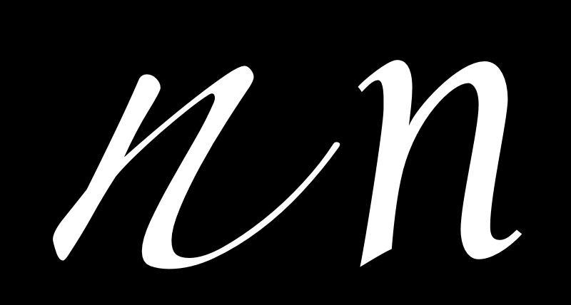

چه چیزی تایپ‌فیس‌ها را از متون دست‌نویس، خوش‌نویسی، حروف‌چینی و لوگوها متمایز می‌کند؟

یگانه مساله عمده‌ای که طراحی تایپ را متمایز می‌کند این نیازمندی است که همه گلیف‌ها در تایپ‌فیس باید در کنار بقیه گلیف‌ها کار کنند.
این موضوع معمولا به آن معناست که طراحی و فاصله‌گذاری هر بخش از تایپ‌فیس منتهی می‌شود به سلسله‌ای از مصلحت‌اندیشی‌های دقیق.
این مصلحت‌اندیشی‌ها به این معنا هستند که ما می‌توانیم طراحی تایپ‌فیس را به عنوان فرایند ساختن مجموعه‌ای شگفت‌انگیز از حروف در نظر بگیریم و نه به عنوان مجموعه‌ای از حروف شگفت‌انگیز.
به تعبیر دیگر، ما بایستی به گروه و این که چه طور اجزای آن در کنار هم عمل خواهند کرد فکر کنیم و این موضوع را بر هر مساله دیگری درباره داشتن یک نویسه فوق‌العاده، در اولویت قرار دهیم.

این اولویت دادن سامانه بر اجزای منفرد، به این نیاز منتهی می‌شود که تحلیل طراحی‌مان را در سطح سامانه انجام دهیم. ویژگی‌هایی که می‌توانند حروف را بسط دهد تبدیل می‌شوند به چیزهایی که ما باید به خصوص در شروع فرایند طراحی روی‌شان تمرکز کنیم.

جنبه خاص دیگر طراحی تایپ این است که به میزان زیادی قالب و فرم‌هایی که طراحی می‌کنیم به اندازه قابل توجهی از پیش جا افتاده‌اند.
وظیفه ما به عنوان طراحان تایپ این نیست که قالب‌های جدیدی بسازیم بلکه این است که نسخه‌های جدیدی از یک قالب موجود پدید بیاوریم.
این مساله می‌تواند باعث گیج شدن طراحان جدید شود.
پیدا کردن اندازه درست تغییرات به منظور دست یافتن به نتیجه‌ای هیجان‌انگیز که منجر به پس زدن خواننده نشود کار ظریفی است.
طراحان اغلب حین اندیشیدن به یک حرف به خصوص گیر می‌کنند.
اگر از ابتدا این موضوع را درک کنید که معنادارترین بخش در طراحی تایپ آن بخش‌هایی است که بیش از بقیه تکرار می‌شوند، به راحتی می‌توانید از این اشتباه اجتناب کنید.
طراحی تایپ‌فیس، طراحی خصوصیات اعمال شده نه فقط روی قالب و فرم‌های رایج که همه تشخیص‌شان می‌دهیم، بلکه همچنین روی قالب‌ها و فرم‌هایی است که بیشتر پدیدار می‌شوند.

همچنین درک این موضوع مفید است که بدانیم این خصوصیات نه تنها به ساختن صدا یا لحن فونت کمک می‌کند، بلکه همچنین کمک می‌کند که بتوانیم تشخیص بدهیم که یک فونت به خصوصی مفید خواهد بود یا خیر،‌ و گاهی هم تشخیص بدهیم یک فونت برای چه بافتار فناورانه‌ای مناسب است.

ممکن است اندیشیدن دربارهٔ طراحی یک فونت به این روش به شدت انتزاعی به نظر برسد. با این حال، خو گرفتن به این ایده‌ها، برای رسیدن به یک فرایند طراحی سریع‌تر و مؤثرتر کلیدی است.

بیایید با شناسایی خصوصات نظام‌مند در طراحی تایپ شروع کنیم.

### ساخت (Construction)

ساخت، به ساختار خطوط موضوعه‌ای اشاره دارد که یک گلیف مشخص را شکل می‌دهند.
شاید بتوانید استخوان‌بندی یک گلیف را تصور کنید.
نوع ساخت مورد استفاده، یکی از مهم‌ترین مسائلی است که باید به آن اندیشید چرا که ساخت، بر بسیاری از تصمیمات اثر می‌گذارند مخصوصا بنا باشد که طراحی شما برای خواننده آشنا به نظر برسد.
در مثال بالا، خطوط سفید داخل حروف، مشخص کننده ساخت تقریبی پیشنهادی توسط شکل خود حروف هستند.

با این حال، روشی که خطوط پایان می‌یابند (پایان‌بندی یا terminals) و «سریف»ها (پایین‌تر را ببینید) معمولا بخشی از آن چیزی نیستند که در «ساخت» به دنبال آن هستیم.
ساخت، استخوان‌بندی یک گلیف است در حالی که بقیه &mdash; طول، عرض، پایان‌بندی &mdash; همگی بخشی از گوشته (flesh) هستند.

### نسبت X-height به Cap-height

حروف سمت چپ از [Playfair Display] هستند که به نسبت، x-height بیشتری در قیاس با cap-height دارند.
حروف سمت راست از [EB Garamond] هستند که 	x-height مشابه دارند.
در نمونهٔ بالا، اندازه حرف H تغییر یافته است که با هم منطبق شوند.

### بلندای بالارونده (Ascender Height)

در مثال بالا، x-heights با هم منطبق شده است تا بهتر بتوان تفاوت نسبی در بلندای بالارونده را به تصویر کشید.
قسمت‌های بالارونده (Ascenders) معمولا و به خصوص در طراحی‌های متن، مقداری از cap-height تجاوز می‌کنند 
هرچند در مواردی ممکن است منطبق با cap-height و یا پایین‌تر از آن باشند.
بخش‌های بالاورندهٔ بلندتر می‌توانند به شکوه در جلوه یک تایپ‌فیس بیفزایند.
چنین فونت‌هایی معمولا با x-height همراه می‌شوند.

### عمق پایین‌رونده (Descender depth)

مشابه ascenders در بخش قبل، descendersهای بلندتر، باشکوه به نظر می‌رسند.

مدیریت ascenders و descenders در کنار هم می‌تواند دشوار شود.
اگر تایپ‌فیسی با ارتفاع خط کم بخواهد استفاده شود، elongation به این معناست که حروف می‌توانند در سراسر ردیف‌های متنی با هم تداخل کنند.

## عرض (Width)

عرض یک طراحی تایپ نه تنها حسی که از آن دریافت می‌شود را تحت تاثیر قرار می‌دهد بلکه روی این که به چه کاری بیاید نیز اثر گذار است.
مثال سمت راست از یک قدم متنی است.
مثلا سمت چپ برای یک طراحی نمایش به منظور جلب توجه است.
حروفی که نازک‌تر از قدم متنی مثال بالا هستند نیز وجود دارند و می‌توانند برای صرفه‌جویی در فضا یا برای قرار دادن متن بیشتر در فضایی کوچک‌تر استفاده شوند.

### منظم بودن در مقابل متنوع بودن عرض

حروف در ردیف بالای مثال زیر درجه بالاتری از تنوع در عرض با در قیاس با حروف در ردیف پایینی نشان مي‌دهند.

### وزن (Weight)

### شیب (Slant)

### تصاد (Contrast)

تضاد به این اشاره دارد که چه میزان تنوع در عرض یک گلیف وجود دارد.
به دو گلیف O در تصویر زیر توجه کنید که در سمت چپ چه میزان تنوع بیشتری در ضخامت خط بین بالا و طرفین گلیف دیده می‌شود.
هر دو گلیف مقداری تضاد دارند اما تضاد در گلیف سمت چپ به مراتب بیش از گلیف سمت راستی است.

تایپی با وزن ثابت (عرض خط) در قالب حروفش و یا بدون تضاد مشهود، تمایز آشکاری با تایپ دارای تضاد دارد.
مانند انتخاب میان قلم‌های سریف یا سنس‌سریف، تضاد یکی از انتخاب‌هایی است که در مراحل اول طراحی تایپ باید مشخص شود.
اشاره به این موضوع جالب توجه است که  طراحی‌های سریف تخت (slab)‌ عموما از عرض با ثباتی در خطوط حروف‌شان استفاده می‌کنند و طراحی سریف‌های تیز بر خلاف آن چه به نظر می‌رسد چندان به سریف بودن‌شان مربوط نمی‌شود!
بایستی به خاطر داشت که قوانین ادراک (perception) برقرار هستند.
([«به چشمان‌تان اعتماد کنید»](Trusting_Your_Eyes.html) را ببینید)
&mdash;
تضاد، دربارهٔ چگونگی دیده و حس شدن وزن است نه این که چه طور اندازه‌گیری می‌شود.

### زاویهٔ تضاد (Angle of contrast)

در تصویر زیر می‌توانیم ببینیم که شکل بخش‌های نازک حرف o کوچک متفاوت است.
در گلیف سمت چپ، بخش‌های نازک دقیقا روی محور عمودی قرار دارند.
در گلیف سمت راست، محور به صورت قطری است.

### توزیع وزن (Weight distribution)

اگر فونت شما از تضاد کمی استفاده می‌کند یا اصلا تضادی ندارد، نیازی ندارید که به آن فکر کنید.
با این حال، بیشتر فونت‌ها دست کم اندکی تضاد دارند.
در این موارد و زمانی که بحث چگونگی توزیع وزن در فونت به پیش می‌آیند، با دایره گسترده‌ای از انتخاب‌ها مواجه می‌شوید.

#### عمودی (Vertical)

توزیع عمودی وزن بسیار رایج است.
اعداد 8 و 9 در تصویر بالا، مثال واضحی برای این مورد هستند.

#### افقی (Horizontal)

توزیع وزن افقی به مراتب کم‌تر رایج است اما همچنان در بسیاری از فونت‌ها دیده می‌شود.

#### زیر-سنگین (Bottom-heavy)

#### زبر-سنگین (Top-heavy)

#### نامنظم (Irregular)

### پایه‌ها (Stems)

آسان است که فرض کنید که پایه‌های شما به سادگی به صورت مستقیم طراحی شوند و این موضوع مساله چندان مهمی نیست اما هم شکل و هم وزن پایه‌ها، چیزهایی هستند که به دقت انتخاب‌شان کنید.

### اتصال‌ها (Joins)

### کاسه‌ها (Bowls)

توجه داشته باشید که کاسه‌ها در تصویر زیر، خطوط هستند نه فضای خالی داخلی موجود در گلیف.
فضاهای داخلی به عنوان بدیل (counters) شناخته می شوند.
حین طراحی تایپ، اغلب با این وضعیت مواجه می‌شوید که در حال تغییر کارتان هستید اما نه به خاطر شکل یا عرض خطوط بلکه به خاطر شکل و اندازه این فضاهای بدیل.

### پایان‌بندی‌ها (Terminals)

پایان‌بندی‌ها، قالب انتهایی خطوط هستند.
پایان‌بندی‌ها با سریف‌ها فرق دارند و معمولا عموی بر زاویه خطوط در پایان‌شان و یا کاملا افقی یا عمودی هستند.
همچنین ممکن است به صورت نوک یا سایر ابزارهای نشانه‌گذاری که قالب‌های حرف اقتضا کند رسم شوند.

### سرعت (Speed)

این طور به نظر می‌رسد که حرف n در سمت چپ بسیار سریع‌تر از همین حرف در سمت راست نوشته شده باشد.
سرعیت با جزئیات بیشتری در فصلی [درباره کجینگی] به بحث گذاشته می‌شوند.

### نظم (Regularity)

خصوصیاتی که در ادامه می‌آیند در همه طراحی‌های تایپ وجود ندارند اما متغیرهایی هستند که ممکن است در طراحی شما به کار بیایند.
در این صورت، ارزشمند است که به اندازه تاثیرشان به عنوان متغیرها به آن‌ها توجه شود.

### جلوه (Flourish)

دقت کنید که در فونت بالایی، میزان بیشتری از جلوه را مي‌توان در حرف بزرگ مشاهده کرد در حالی که در فونت دوم، حروف کوچک هستند که بیشتر جلوه‌گری مي‌کنند.

### سریف (Serif) - بودن یا نبودن

سریف‌ها یکی از متمایزترین جنبه‌های یک تایپ‌فیس هستند و در بیشتر موارد، نخستین دسته‌بندی نوع یا تایپ، بین سریف یا سنس‌سریف بودن انجام می‌گیرد.

این انتخاب بر چگونگی رسم پایان‌بندی‌ها اثرگذار است.
سریف‌ها می‌توانند دوطرفه یا یک‌طرفه باشند.
می‌توانند عمود بر خط بوده و یا جهت ویژه خود را داشته باشند (مثلا این که همیشه افقی یا عمودی باشند).
سریف‌ها می‌توانند با یا بدون قلاب (brackets) باشند.
همه طراحی‌های سریف، ترکیبی از همه موارد بالا هستند که جز در مواردی به خصوص برای حروفی خاص مانند S یا C یا Z به طور ثابت در طراحی تایپ اعمال می‌شوند (مثلا یک تایپ با سریف‌های افقی  برای همه حروف معمولا سریف‌های عمودی برای s و c و z به کار می‌برد).

افسانه‌ای وجود دارد که می‌گوید خوانایی سنس‌سریف‌ها آسان‌تر است
&mdash;
تا اطلاع ثانوی، این موضوع تماما[یک افسانه است](http://asserttrue.blogspot.se/2013/01/the-serif-readability-myth.html).

قالب و فرم سریف‌ها با قالب‌ها و فرم‌های پایان‌بندی‌ها مرتبط است.

#### قلاب‌ها (Brackets)

بخش‌های گوشه‌ای یک سریف که همان‌جایی است که به خط اصلی وصل می‌شود قلاب نام دارد.
یک طراحی به خصوص می‌تواند حسی نرم به سریف بدهد (مثل [Times New Roman]) یا ممکن است انتخاب کند که هیچ قلابی به کار نبرد.
برای طراحی‌ها تنها قلاب‌ها را در یک سو به کار می‌برند و یا نسبتی متفاوت برای طرفین کار استفاده مي‌کنند.

این مووضع یک مؤلفه نسبتا قوی برای ایجاد حسی یک تایپ است
&mdash;
باوقار (با قلاب‌های نرم یا بزرگ در [Times New Roman])
یا زمخت و قلمبه (بدون قلاب در [Arvo]).

#### سریف‌های تخت (Slab-serifs)

این سریف‌ها کلفت و بلوکی هستند و مکانیکی یا مصری هم خوانده می‌شوند.
سریف‌های تخت فاقد قلاب هستند.
به طور کلی مي‌توان گفت که طراحی تایپ با چنین سریف‌هایی دارای تضاد کم‌تری در گلیف‌های‌شان هستند.
&mdash;
مثلا [Rockwell]، [Courier] یا [American typewriter] این را به خوبی نشان مي‌دهند.

می‌توان این گونه گفت که سریف‌های تخت برای افزودن زیبایی یا آهنگ به طراحی‌هایی به کار می‌روند که در غیر این صورت فاقد تضاد هستند.
اما این یک قاعده مطلق نیست.

#### پایان‌بندی‌های سریف (Serif Terminals)

درست مانند پایان‌بندی‌های حروف، شکل انتهایی سریف‌ها به خودی خود در حسی که یک تایپ منتقل مي‌کند مؤثر است.
&mdash;
چه نرم باشد چه زمخت.
پایان‌بندی سریف می‌تواند نرم و دارای انحنا باشد
([Courier])
یا لبه‌دار و دارای زاویه
([Rockwell]).

### تزئیات (Decoration)

فرم‌های حروف می‌توانند به خودی خود دارای تزئینات داخلی باشند
یا ممکن است که با فرم‌های تزئینی اضافی، گسترش یابند - و یا هر دو

### بُعد (Dimension)

[Playfair Display]: http://www.forthehearts.net/typeface-design/playfair-display/
[EB Garamond]: http://www.georgduffner.at/ebgaramond/
[«به چشمان‌تان اعتماد کنید»]: Trusting_Your_Eyes.html
[درباره کجینگی]: Italic.html
[Times New Roman]: http://practicaltypography.com/times-new-roman.html
[Arvo]: http://files.korkork.com/index.php?/fonts/arvo/
[Rockwell]: http://www.myfonts.com/fonts/mti/rockwell/
[Courier]: http://typedia.com/explore/typeface/courier/
[American typewriter]: http://www.myfonts.com/fonts/linotype/itc-american-typewriter/

