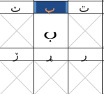
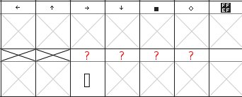
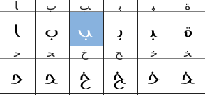
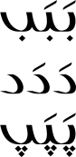

## Introduction

Dans certains cas, il peut manquer un glyphe dans une police qui est essentiel à son utilisation dans votre application. Les polices arabes présentent des problèmes particuliers ici, car la forme du glyphe dépend non seulement de sa position dans le mot, mais aussi des attributs de la lettre elle-même. Ainsi, à l'aide de la séquence sans signification *babab*, la lettre *beh* a trois formes différentes selon qu'elle vient initialement, médialement ou finalement. Cependant (à l'aide de la séquence sans signification *dadad*), la lettre *dal* n'a qu'une seule forme, peu importe où elle se trouve dans le mot.

Les polices sous licences ouvertes (par exemple [GPL](https://www.gnu.org/licenses/gpl-3.0.fr.html) ou [OFL](http://scripts.sil.org/OFL-FAQ_web) permettent à l'utilisateur de faire des modifications. Si vous adaptez une police qui était à l'origine sous licence libre et que vous la distribuiez, vous devez conserver les avis de droits d'auteur et les informations sur les licences de l'auteur original, bien que vous puissiez ajouter une note à la fin de l'avis de copyright couvrant votre contribution.

Ce chapitre décrit pas à pas l'ajout d'un glyphe à une police arabe. La police que nous allons utiliser est [Graph](http://openfontlibrary.org/fr/font/graph), et le glyphe que nous ajouterons est *peh* (U+067E), qui ne se trouve pas en arabe lui-même, mais désigne *p* dans certaines langues pour lesquelles l'écriture arabe est utilisée (pour une liste complète des glyphes disponibles pour l'écriture arabe, voir les [diagrammes Unicode](http://www.unicode.org/fr/charts/).

## Faire une copie de travail de la police

Téléchargez la police de la page Web et décompressez-la. Lancez FontForge et chargez la police. Enregistrez-la en tant que fichier *sfd*, modifiez le nom suggéré pour lire **GraphNew.sfd** avant d'enregistrer.

## Renommer la police

#### Pourquoi devrais-je renommer la police?

Si vous ne renommez pas la police, votre police adaptée ne sera pas installée séparément de l'original &mdash; vous devrez d'abord désinstaller la police d'origine. Il est également judicieux de renommer la police si vous allez distribuer vos adaptations &mdash; si l'auteur original de la police a réservé le nom de la police sous le mécanisme réservé de nom de police (RFN), ce nom d'origine peut uniquement être utilisé avec la version d'origine de l'auteur de la police.

#### Modifier les données de nom

Selectionnez **Element → Infos fonte**, et dans le volet *Noms PostScript*, changez le *nom de la fonte*, le *nom de famille* et le *nom courant* à **GraphNew**.

Si vous le souhaitez, vous pouvez placer un message «Ajout de glyphes supplémentaires par» après le texte déjà entré pour le *Copyright*.

Dans le volet *Noms TTF*, les noms de *famille* et *complet* proviennent des entrées *Noms PostScript* et doivent déjà afficher *GraphNew* (vous ne pouvez pas les modifier directement). Modifiez les entrées pour *Famille préférée* et *Compatibilité totale* à **GraphNew**. Ces changements de nom vous permettront maintenant d'installer cette police à côté de l'original si vous le souhaitez.

Si vous le souhaitez, vous pouvez placer un message 'Ajout de glyphes supplémentaires' après le texte déjà entré pour *Designer*.

Cliquez sur **OK** pour enregistrer ces modifications. Vous recevrez un message sur la génération d'un nouveau UniqueID (XUID) pour la police &mdash; Cliquez sur **Changer**.

## Ajouter le glyphe pour la forme isolée *peh*

Allez dans la section arabe du tableau de fonte: sélectionnez **Vue → Aller au glyphe**, cliquez sur la liste déroulante et sélectionnez **Arabe**, puis cliquez sur **OK**.

Cliquer sur une cellule dans le graphique de la police affichera son numéro Unicode et son nom en bleu en haut de l'application. Allez à la position 1662, qui apparaîtra en bleu comme *1662 (0x67e) U+067E ''uni067E'' ARABIC LETTER PEH*. La cellule sous le glyphe de référence contient un X gris, montrant que la police n'inclut pas ce glyphe.

Nous ferons *peh* en copiant *beh* (U+0628) et en changeant son point unique pour trois points.

Cliquez sur la cellule *beh* (position 1576), puis cliquez avec le bouton droit de la souris et sélectionnez **Copier**. Puis cliquez avec le bouton droit de la souris sur la cellule *peh* et sélectionnez **Coller**. Maintenant que *beh* est copié dans la cellule *peh*, la prochaine chose est de changer le point.

Trouver un glyphe avec trois points &mdash; *sheen* (position 1588, U+0634) suffira. Double-cliquez sur la cellule &mdash; cela ouvrira la fenêtre de conception de glyphe. Appuyez sur **V** pour vous assurer que l'outil pointeur (tête de flèche) dans la boîte à outils est sélectionné, puis appuyez sur **Z** et agrandissez la fenêtre pour avoir une bonne vue du glyphe.

Cliquez et faites glisser afin que les nœuds des trois points au-dessus de sheen changent de couleur de rose à beige. Si vous avez accidentellement inclus ou omis un nœud, désélectionnez-le ou sélectionnez-le en appuyant sur <kbd>Maj</kbd> et en cliquant dessus. Appuyez sur <kbd>Alt</kbd> + <kbd>C</kbd> pour copier.

Revenez à la fenêtre de fonte et double-cliquez sur la cellule *peh* &mdash; cela va charger *peh* dans un autre onglet dans la fenêtre de conception de glyphe, à côté de l'onglet *sheen*.

Cliquez et faites glisser pour sélectionner le point en dessous de *peh*, puis appuyez sur **Supprimer**. Appuyez sur <kbd>Alt</kbd> + <kbd>V</kbd> pour coller les trois points, qui apparaîtront probablement au-dessus du corps de *peh*. Laissez les nœuds de points en surbrillance afin que vous puissiez les inverser et les déplacer plus facilement.

Inverser les points: sélectionnez l'outil symétrie (quatre rectangles jaune et vert) de la boîte à outils. (Alternativement, cliquez avec le bouton droit de la souris dans le milieu des points et sélectionnez **Appliquer une symétrie à la sélection** dans la fenêtre contextuelle.) Cliquez sur l'un des nœuds de points et faites glisser la souris légèrement vers la gauche ou vers la droite.

Déplacer les points inversés: appuyez sur <kbd>V</kbd> pour sélectionner à nouveau l'outil de pointeur, cliquez sur un des nœuds de points et faites-le glisser sous le corps du glyphe. Positionnez-les au centre, au-dessus de la marque *ArabicBelow*.

Fermez le panneau de conception du glyphe. Il devrait maintenant y avoir un nouveau glyphe pour *peh* dans le tableau. Enregistrez la police adaptée (**Fichier → Enregistrer**).

## Ajoutez les glyphes pour les formes connectées de *peh*

Cependant, ce n'est que la forme isolée (autonome) du glyphe. Si vous essayez d'utiliser votre police adaptée, vous constaterez que les formes initiales, médiannes et finales ne sont pas disponibles. Celles-ci doivent être créées séparément. "Ces formes sont construites comme des glyphes non codés (glyphes dont le codage est -1 dans les conventions FontForge). Elles n'ont pas de cases prédéfinies." (Khaled Hosny)

Sélectionnez **Codage → Ajouter des cases de codage** et entrez le nombre de glyphes souhaités &mdash; dans ce cas **3**. FontForge ajoutera le même nombre d'emplacements à la fin de la police, et la vue se déplacera à cet endroit dans le tableau de la police. Les trois dernières cellules (positions 65537, 65538, 65539) ont un point d'interrogation comme glyphe de référence, et c'est dans ces cellules que vous allez ajouter les glyphes non codés en répétant le processus ci-dessus. 

Notez que si par erreur vous commencez à taper quand le focus est toujours sur le tableau de la police, vous serez déplacé à la section européenne en haut. Pour revenir au bas, sélectionnez <i>Vue → Aller au glyphe</i>, cliquez sur la liste déroulante et sélectionnez <i>Remplaçant pour NON unicode</i>, puis cliquez sur <i>OK</i>. 

#### Créer la forme finale

Remontez le tableau de police un peu jusqu'à ce que vous arrivez à un ensemble de glyphes arabes à la position 65152 (U+FE80). À U+FE90 (position 65168), vous verrez un glyphe *behfinal* &mdash; cliquez dessus et appuyez sur <kbd>Ctrl</kbd> + <kbd>C</kbd> pour le copier. Faites défiler jusqu'à la troisième dernière cellule du tableau (position 65537), cliquez dessus et appuyez sur <kbd>Ctrl</kbd> + <kbd>V</kbd> pour y coller le glyphe *behfinal*.

Faites un clic droit sur la cellule et sélectionnez **Infos glyphe**. La convention de dénomination consiste à utiliser le nombre du glyphe isolé + un suffixe pour la forme. Changez le *Nom du glyphe* en **uni067E.fina**, puis cliquez sur **OK**. Le point d'interrogation dans la cellule de référence devient *peh*.

Obtenez les trois points: double-cliquez sur *sheen* (U+FEB5) pour le charger dans la fenêtre de conception de glyphe, sélectionnez les trois points et appuyez sur <kbd>Ctrl</kbd> + <kbd>C</kbd>.

Double-cliquez sur le nouveau *pehfinal* pour le charger dans la fenêtre de conception du glyphe, cliquez et faites glisser pour mettre en surbrillance les nœuds du point et appuyez sur **Supprimer**.

<kbd>Ctrl</kbd> + <kbd>V</kbd> pour insérer les trois points de *sheen*, retournez-les et placez-les en position sous le corps du glyphe. Appuyez sur <kbd>Ctrl</kbd> + <kbd>S</kbd> pour enregistrer le tableau révisé.

#### Créer les formes initiales et médiales

Copier la forme initiale U+FE91 (position 65169) à l'avant-dernière cellule (position 65538), supprimer le point unique et coller-y les trois points.

Cliquez avec le bouton droit sur la cellule, sélectionnez **Infos glyphe**, changez le *Nom du glyphe* à **uni067E.init**, puis cliquez sur **OK**.

Copiez la forme médiane U+FE92 (position 65170) dans la dernière cellule (position 65539), supprimez le point unique et collez-y les trois points.

Cliquez avec le bouton droit de la souris sur la cellule, sélectionnez **Infos glyphes**, changez le *Nom du glyphe* à **uni067E.medi**, puis cliquez sur **OK**.

Sélectionnez **Fichier → Enregistrer** pour enregistrer le tableau de polices révisé.

## Ajouter les lookups

La forme isolée doit être mappée (liée) à ses formes initiale, médiane et finale.

Sélectionnez **Elément → Infos fonte → Lookups**.

Cliquez sur le **+** à côté de l'entrée *'init' Initial Forms in Arabic lookup 2*. Cela ouvrira un sous-menu du même nom. Cliquez sur ce sous-menu.

Le bouton *Éditer données* à droite deviendra disponible maintenant &mdash; cliquez dessus.

Dans la *Sous-table de lookup* affichée, vérifiez que le bouton *Unicode* est coché. Faites défiler la liste de caractères vers le bas jusqu'à ce que vous arrivez à la fin.

Dans l'encadré à côté de *Par défaut en utilisant le suffixe*, saisissez le suffixe correspondant (dans ce cas, **init**), puis cliquez sur **Par défaut en utilisant le suffixe**.

Un nouveau mappage sera ajouté à la liste des caractères, de uni067E (la forme isolée de *peh*) à uni067E.init (la forme initiale).
Cliquez sur **OK**.

Faites la même chose pour les sous-menus sous les entrées *medi' Medial Forms in Arabic lookup 2* et *fina' Terminal Forms in Arabic lookup 2*, en choisissant *medi* et *fina* comme suffixe pertinent.

Cliquez à nouveau sur **OK** pour fermer le volet et enregistrez le tableau de police (<kbd>Ctrl</kbd> + <kbd>S</kbd>).

Notez que *Par défaut en utilisant le suffixe* semble fonctionner uniquement sur les glyphes du bloc Unicode 06 (*Arabe*) &mdash; les glyphes dans Unicode 07 (*Arabe supplémentaire*), par ex. *ain* avec deux points, peut être ajouté manuellement en cliquant sur la ligne marquée *Nouvelle* et en tapant les noms.

### Générer la police adaptée

Sélectionnez **Fichier → Générer fonte(s)**.

Dans la liste déroulante affichant *PS Type 1 (Binaire)*, sélectionnez **TrueType** et vérifiez que le nom de fichier lit *GraphNew.ttf*.

Accédez à l'endroit où vous souhaitez enregistrer la police, puis cliquez sur **Générer**. Cliquez sur **Oui** et **Générer** sur les deux messages d'information qui s'affichent.

Vous pouvez ensuite utiliser votre procédure normale d'installation de polices pour installer la police adaptée. Le nouveau glyphe *peh* peut alors être utilisé aux côtés des glyphes existants dans les mêmes chaînes sans signification qu'au début de ce chapitre:

Notez que si vous utilisez une police dans LibreOffice et apportez des modifications à cette police, vous devrez redémarrer LibreOffice pour qu'elle affiche les modifications. &mdash; sinon elle utilisera la version précédente de la police, et non celle avec les nouvelles modifications.

Merci à [Khaled Hosny](http://khaledhosny.org) pour ses conseils sur l'utilisation de FontForge pour modifier les glyphes arabes.

## Lecture complémentaire (en anglais)

* La page <http://lists.nongnu.org/archive/html/freetype-devel/2015-08/msg00016.html> a un conseil sur la façon de dessiner les parties se chevauchant des glyphes arabes.
