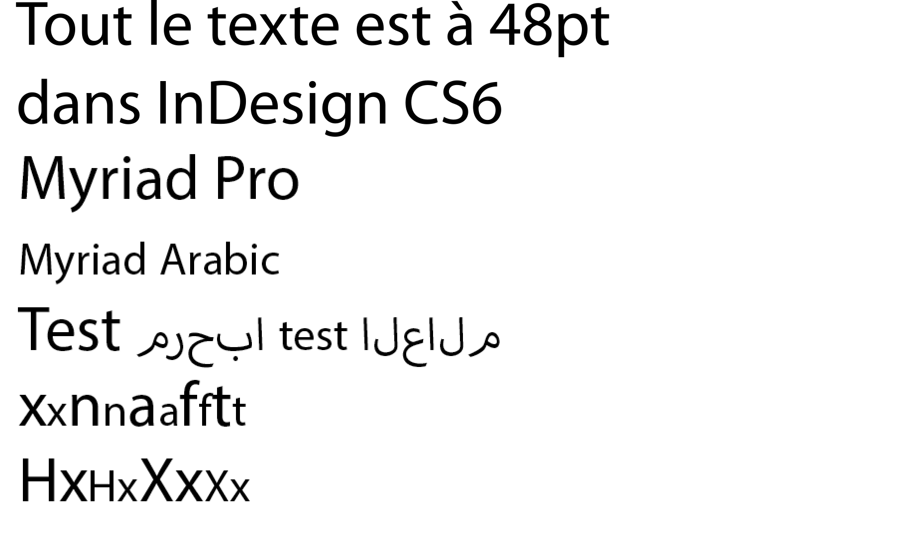

_Merci à Adam Twardoch, Erin McLaughlin, Neelakash Kshetrimayum, Dan Reynolds, Pooja Saxena et au Dr Girish Dalvi pour leur contribution à beaucoup des idées de cette page_

La conception d'une police [Devanagari](https://fr.wikipedia.org/wiki/Devanagari) nouvelle et originale suit un processus similaire au processus de design d'une police latine. L'avantage unique du _libre_ dans les polices libres est que vous pouvez les modifier et les réutiliser à des fins nouvelles à lesquelles leurs créateurs initiaux n'ont jamais pensées &mdash; par exemple, concevoir une police Devanagari et adapter une police latine existante pour l'accompagner.

## Les glyphes Devanagari

Les polices Devanagari contiennent ces différents types de glyphes:

* Consonnes (36)
* Voyelles indépendantes (28)
* Voyelles matras
* Espace(s) de mots
* Chiffres Devanagari (10)
* Les chiffres latins (nouveaux, ou si déjà présents puis ajustés pour fonctionner dans le texte pur Devanagari)
* Diacritiques nuqtā
* Demi-glyphes
* Conjonctions (glyphes de ligature uniques)
* Voyelles "I" matras de différentes longueurs
* Ponctuation Devanagari, marques et symboles
* La ponctuation latine, les marques et les symboles (nouveaux ou ajustés si déjà présents)
* Lettres latines

Consultez le [chapitre 12 d'Unicode sur les écritures indiennes](http://www.unicode.org/versions/Unicode8.0.0/ch12.pdf) (en anglais), ([la page Devanagari d'Unicode](http://www.unicode.org/fr/charts/PDF/U0900.pdf)), ainsi que la ([page de développement de polices OpenType Devanagari de Microsoft](http://www.microsoft.com/typography/OpenTypeDev/devanagari/intro.htm) (en anglais) pour en savoir plus sur ces glyphes et comment le moteur de mise en forme indien fonctionne.

Il est utile de faire de la calligraphie ou d'étudier de près les manuels d'écriture pour apprendre comment l'écriture fonctionne, de sorte que vous compreniez quelles lettres devraient être comme quelles autres lettres dans la structure. Ces [2 pages du Manuel de calligraphie de Devanagari d'Aksharaya](https://groups.google.com/d/msg/googlefonts-discuss/XRYMYHZpUVc/_mLQWbr8rp8J) peuvent être utilisées comme référence pour l'angle de la plume et les proportions de lettre.

## Que faire d'abord

Lors de la conception d'une police de caractères Devanagari et et latine, il est important de commencer par dessiner le latin à côté du Devanagari. Dans les premiers stades, il faut concevoir les glyphes "clés", pour établir la personnalité de la police de caractères à travers les formes fondamentales et l'espacement (qui en latin peut être 'adhesion' ou 'videospan'.) Concevez les glyphes les plus bas et les plus hauts "en hauteur" tôt dans le processus.

Vous aurez besoin de nombreuses voyelles pour commencer à tester la texture et l'échelle.

Le professeur de typographie à IIT Bombay, le Dr Girish Dalvi, a écrit dans sa thèse de doctorat,

> Grâce aux résultats de cette étude, nous pouvons déduire que les dix lettres अ इ ए ख त भ द ध थ ष peuvent presque capturer toutes les propriétés formelles des lettres Devanagari restantes. Dans ces lettres, les lettres अ इ ख भ द ध ष sont les plus critiques car elles définissent des caractéristiques pour la majorité des lettres. Nous pouvons donc suggérer qu'en concevant ces lettres en premier, le processus de conception de la police Devanagari peut être simplifié pour les étudiants et concepteurs de polices puisque les lettres restantes peuvent être dérivées de celles-ci.

Erin McLaughlin a suggéré ces glyphes comme une progression initiale: **पाव + किमीनुफू + भरसगदह + र्मों ड्डू (extrêmes de hauteur) + यथधआछड …  continuez le jeu de caractères** et a suggéré de se concentrer sur le signe de voyelle "Au" + reph + combinaison anusvara! Le Ma est juste là pour la postérité.

Les glyphes de hauteur extrême vous permettent de déterminer les métriques verticales, et comment mettre à l'échelle les deux systèmes d'écriture pour travailler ensemble. Adobe publie des familles de polices très volumineuses qui couvrent des orthographes très différentes. Celles-ci sont divisées en familles avec des proportions communes partagées; Myriad Pro a le latin, le grec et le cyrillique, mais les designs hébreus et arabes sont dans un pack de familles séparées qui incluent des latins **modifiés**.

Voici Myriad Pro Latin et Myriad Arabic juxtaposés:

(Remarquez la décision habile des concepteurs d'Adobe: la hauteur de capitale du latin en Myriad Arabic est la hauteur d'x du Myriad Pro Latin.)

Notez que dans le jeu de caractères Lohit, les glyphes les plus bas sont des formes, destinées à aller en dessous des caractères qui descendent très loin en dessous de la ligne de base:

(Vattu est la forme sous-base de reph. Voir la [terminologie Microsoft](https://www.microsoft.com/typography/otfntdev/indicot/terms.htm) pour plus de détails)

Idéalement, ceux-ci devraient s'empiler au-dessous de votre empilage de conjonction la plus basse, comme dans l'exemple sur la gauche (Lohit, qui n'est pas tout à fait ajusté verticalement, est sur la droite):

## Approche d'espacement

La conception de polices latines implique généralement une série de chaînes d'espacement comme ceci:

> HHxHOHOxOO  
> nnXnonoXoo

Où le X représente la lettre sur laquelle vous vous concentrez à espacer, le concept étant d'examiner cette lettre près d'un caractère au côté assez plat et d'un caractère rond.

Pa et Va ou Da sont les équivalents Devanagari:

> पपXपवपवXवव  
> पपXपदपदXदद

Lorsque vous débutez un projet, commencez par remplir une page entièrement avec Pa afin d'obtenir le bon équilibre entre l'épaisseur du trait, la taille du contrepoinçoin et l'espacement.

> पपपपपपपपपपपपपपपपपपपपप 

Une fois que le Pa a la bonne "couleur", vous pouvez commencer à ajouter ces autres caractères de base communs:

> पपपवपपपपपवपववपपव (va, aléatoire)  
> पपपापपपपापपाप (Aa maatra, aléatoire)  
> पपपदपपपपपदपददपपद (da, aléatoire)  

Ensuite, vous pouvez commencer à utiliser les chaînes d'espacement ci-dessus, afin d'ajouter des glyphes supplémentaires:

> पपरपदपदरदद  
> पपकपदपदकदद  
> पपलपदपदलदद  
> पपपीपदपदपीदद

et ainsi de suite!

Vous devrez les regarder dans une longue liste comme ça pour les comparer d'un glyphe à l'autre, en même temps que vous les faites défiler vers le bas &mdash; à la fois à l'écran et sur papier. Une vérification verticale est plus efficace qu'une simple longue ligne de texte continu. Voici pourquoi:

Lorsque vous regardez les chaînes d'espacement dans les colonnes verticales, vous pouvez facilement comparer l'espacement avec les lignes qui les précèdent et en dessous du caractère actuel. De la même façon que nous pouvons aisément reconnaître les "rivières" dans un texte pleinement justifié et mal réglé, il sera plus facile de voir des blancs ou des taches noires dans l'espacement si vous comparez avec une chaîne d'espacement qui reste constante.

La chaîne d'espacement ci-dessus vous permet de comparer des formes très disparates, de sorte que l'espacement soit plus uniforme (au lieu de tous les caractères ronds étant trop espacés ou trop serrés)

Les quatre glyphes dans le milieu, Pa/Da/Pa/Da vous permettent de comparer le caractère testé contre deux ensembles de trois, si vous regardez juste Pa/Da/Pa ou Da/Pa/Da.

Après avoir dessiné et espacé une poignée de voyelles et de consonnes, vous serez en mesure de faire un nombre limité de mots avec seulement ces lettres, et commencer à tester votre conception avec du texte réel.

## Plan de travail

Dans tout projet de conception de police, c'est une excellente idée d'esquisser un plan de travail.

Pour quelqu'un de très expérimenté, il est possible de concevoir les graisses initiales Léger et Gras d'une police Devanagari en environ 4-6 mois.

Voici un exemple de calendrier pour une famille interpolée de 9 graisses, verticale et inclinée, d'un design 'sans' assez simple, faîte par un designer très expérimenté:

|Semaine|Objectif|Glyphes|
|--:|:--|--:|
|1|Établir le design de 7-10 glyphes clés|10|
|2|Affiner, concevoir les glyphes les plus hauts, faire correspondre les hauteurs et les graisses au latin dans Régulier & Gras, tester le rendu à l'écran avec ttfautohint|20|
|3|Affiner les proportions avec les commentaires des lecteurs natifs|40|
|4|Obtenir des commentaires de lecteurs natifs, affiner et ajouter d'autres conjonctions|100|
|5|Obtenir les commentaires de lecteurs natifs, affiner et ajouter des conjonctions|200|
|6|Obtenir des commentaires de lecteurs natifs, affiner et ajouter des conjonctions|300|
|7|Obtenir des commentaires de lecteurs natifs, affiner et ajouter d'autres conjonctions|400|
|8|Obtenir des commentaires de lecteurs natifs, affiner et ajouter d'autres conjonctions|500|
|9|Obtenir les commentaires de lecteurs natifs, affiner et ajouter des ensembles|600|
|10|Obtenir des commentaires de lecteurs natifs, affiner et ajouter d'autres ensembles|700|
|11|Obtenir les commentaires de lecteurs natifs, affiner et ajouter d'autres ensembles|800|
|12|Obtenir des commentaires de lecteurs natifs, affiner et ajouter d'autres conjonctions|900|
|13|Dériver le Gras|1 800|
|14|Raffinements, crénage, tests avec commentaires des lecteurs natifs|1800 |
|15|Extrapolation et nettoyage des graisses minces et noirs, génération et nettoyage des styles inclinés|3600|
|16|Raffinement des styles interpolés |3600|
|17|Raffinement général de l'espacement, du crénage et tests dans tous les styles|3600|
|18|Finalisation|3600|

Vous voudrez peut-être travailler avec une police qui n'a pas de sources disponibles, seulement les tables binaires OpenType GPOS/GSUB. Il existe quelques outils qui peuvent les convertir dans la syntaxe Adobe FEA, y compris FontForge, mais la sortie de chaque outil nécessitera un retraitement à la main.

Le FDK d'Adobe contient un outil 'spot', qui peut être utilisé comme ceci:

> Spot -t GSUB=7 Font.otf> GSUB.fea

Le projet noto possède un [dump_otl.py](https://github.com/googlei18n/nototools/blob/master/nototools/dump_otl.py)

Les applications 'Fontlab Studio' et 'OpenType Master' possèdent également des convertisseurs.

## Ressources utiles

### Introductions

* <http://www.linotype.com/6896/devanagari.html>

### Où chercher de l'inspiration et des idées

Regardez les polices Devanagari sur le site <http://indiantypefoundry.com>, et ceux qui viennent de sortir via Google Fonts, car les formes de lettres peuvent varier.

Un autre bon endroit pour rechercher de l'Hindi sont les sites de journaux "e-paper" hindi pour voir les polices réelles en cours d'utilisation &mdash; les publicités ont généralement plus de diversité dans les polices. <http://epaper.jagran.com> est un e-papier indien largement diffusé.

Flickr est également une bonne source d'idées par ses images:

* <https://www.flickr.com/groups/devanagari-script/>
* <https://www.flickr.com/groups/37703106@N00/>
* <https://www.flickr.com/groups/indicscripts/>
* <https://www.flickr.com/photos/pauldhunt/sets/72157603715699186>

#### Sources historiques

Mettez la mains sur des copies de _Introduction to the Devanagari Script_ par H. M. Lambert, Oxford University Press 1953 et _Typography of Devanagari_ (trois volumes) par B. S. Naik, Direction des Langues, Bombay 1971.

Au-delà de cela, il existe au moins deux sources générales de fontes du 19e siècle venant d'Europe qui vaut la peine d'être regardées: les polices de caractères de la Grande-Bretagne et celles de l'Allemagne (principalement de Leipzig). Ces fontes ont plus été utilisées pour la mise en texte sanskrit que pour les textes hindi.

Essayez également de trouver des échantillons de caractères de texte de 19e et 20e siècles provenant de fonderies indiennes. Ils sont nettement moins européanisés, comme vous pouvez l'espérer. Il y a des choses stupides qui se voient dans les fontes académiques européennes sanskritiques du 19ème siècle qui ne semble pas du tout apparaître dans la typographie indienne du 20ème siècle. Ces sources indiennes sont probablement plus difficiles à trouver dans les bibliothèques occidentales, mais peut-être qu'Erin McLaughlin a plus d'une piste. Linotype Devanagari de Matthew Carter, 1970, est basé sur des fontes de la fonderie Nirnaya Sagar, par exemple. Les échantillons de leurs polices et les polices de la fonderie de Bombay devraient être accessibles dans certaines universités et/ou bibliothèques nationales occidentales. Je recommanderais également de regarder le Devanagari Monotype et le Devanagari Linotype (la version des années 1970 et la mise à jour des années 80/90s, pas l'original 1935, qui portait seulement le même nom).

Il n'y a pas de police Devanagari dans Typefounders aux Pays-Bas (Charles Enschede, Harry Carter, 1978). Quoi que vous fassiez, ne regardez pas les polices Bodoni de son manuel de 1818.

Un certaine police Devanagari faite en Allemagne par H. Berthold AG peut être vue dans _Alphabete und Schriftzeichen des Morgen- und des Abendlandes_, du Reichsdruckerei, Berlin 1924, p. 45-47.

### Articles

Sarang Kulkarni a écrit ["Issues with Devanagari Display Type (PDF)"](http://www.typoday.in/2013/spk_papers13/sarang-kulkarni-typographyday2013.pdf)

Yashodeep Gholap a écrit [Designing a Devanāgarī text font for newspaper use  (PDF)](http://www.typoday.in/2012/spk_papers/yashodeep-gholap-typographyday2012.pdf)

La disertation de Vaibhav Singh dans MA Typeface Design, [Devanagari in multi-script typography](http://issuu.com/typefacedesign/docs/vaibhav_singh_dissertation)

### Lohit2 Devanagari

Le Lohit2 Devanagari peut être utilisé comme base pour les nouvelles polices OFL en utilisant sa liste de glyphes et son code de disposition OpenType. Il est disponible en tant que [source originale de FontForge](https://github.com/pravins/lohit2/tree/master/devanagari) ou en [téléchargement zip](https://github.com/frank-trampe/lohit2/archive/master.zip)

### Disposition OpenType

[Page de développement de la police Microsoft Devanagari OpenType](http://www.microsoft.com/typography/OpenTypeDev/devanagari/intro.htm)

### Anatomie du Devanagari

[Grammaire d'écriture Devanagari du TDIL (Technology Development for Indian Language) (PDF)](http://www.tdil-dc.in/tdildcMain/articles/82170Devanagari%20Script%20Behaviour%20for%20Hindi%20%20ver%201.4.10.pdf)

[2 pages du manuel de calligraphie Devanagari d'Aksharaya](https://groups.google.com/d/msg/googlefontdirectory-discuss/XRYMYHZpUVc/_mLQWbr8rp8J), which can be used as a reference for pen angle and letter proportions.

Le Professeur Girish Davli de l'IIT Bombay IDC (comparable au MIT Media Lab des Etats-Unis) a publié cet [article sur l'anatomie du Devanagari (PDF)](https://web.archive.org/web/20130913220315/http://www.idc.iitb.ac.in/resources/dt-jan-2009/Anatomy%20of%20Devanagari.pdf)

Si vous êtes nouveau dans l'écriture Devanagari, il est important de prendre conscience de la pression de la plume calligraphique traditionnelle, qui est différente de celle du latin. Voici une démonstration rapide de l'angle d'attaque et de la façon traditionnelle d'appliquer la graisse aux courbes. Votre conception sera plus réussie, et apparaîtra moins «latinisé», si vous dessinez vos courbes selon ces principes de graisse, plutôt que de couper-et-coller des parties de lettres de l'alphabet latin.

<iframe width="560" height="315" src="//www.youtube-nocookie.com/embed/_P-Ty512SyA?rel=0" frameborder="0" allowfullscreen></iframe>

La page [Devanagari Unicode](http://www.unicode.org/fr/charts/PDF/U0900.pdf) montre les lettres de base, mais pas les conjonctions.

### Outils de test

Le support d'Adobe InDesign pour les polices OpenType pour les écritures non européennes n'est devenu fiable qu'avec Creative Cloud et [l'option de paragraphe World Ready Composer doit être activée](http://blogs.adobe.com/vikrant/2012/05/indesign-cs6-indic-support-and-preferences/). Même la dernière version peut être améliorée. Les implémentations libre harfbuzz et Microsoft OpenType sont les plus complètes. Vous devez donc tester vos polices dans les dernières versions de Chrome, Firefox et Microsoft Word, sur Windows et Mac OS X, pour vous assurer que les erreurs de mise en forme sont dues aux polices et non au moteur sous-jacent.

La [page d'essai de Devanagari de Pablo Impallari](http://www.impallari.com/testing/index-devanagari.php) (avec [sources sur github!](Https://github.com/impallari/font-testing-page/) ) fournit des schémas de tests prêts à l'emploi, et vous pouvez glisser-déposer votre OTF ou TTF directement dans la page pour le charger.

Les [outils de police de Pooja Saxena](https://anexasajoop.github.io/devanagari-type-tools) (avec [sources sur github!](Https://github.com/anexasajoop/devanagari-type-tools)) génère des textes de test avec combinaisons de lettres.

Le [Adhesion Text Devanagari](http://www.adhesiontext.com/devanagari/) est une version spéciale de l'outil construit par Miguel Sousa pour faire du texte fictif composé uniquement des mots possibles pour écrire avec les glyphes que vous avez déjà dessiné. Insérez les glyphes (अआईईउऊ etc) que vous avez dessiné, et il apparaîtra quelques exemples de mots à utiliser dans vos tests.

Le Huerta Tipografica [Devanaguide](http://devanaguide.huertatipografica.com/) est un outil open source pour voir et comparer les différentes polices devanagari.
Il vous permet également de taper un texte et de le prévisualiser dans toutes les polices en même temps.
Le Devanaguide comprend également une liste de mots [Devanagari](https://github.com/andrestelex/devanaguide/blob/master/deva-dictionary.txt) qui est utile pour la conception de texte d'essai.

### Autres liens

[Books & References for Devanagari typography Projects](http://dsquare.in/devft/en/books.php) est une liste de ressources qui répondra probablement à la plupart des besoins de recherche de beaucoup de projets. Compilé par le Professeur Girish Davli de IIT Bombay IDC.

### Forum de discussions

Typophile

* [Adobe Devanagari](http://typophile.com/node/95460) (en anglais)

Répertoire des discussion Google Fonts (en anglais)

* [A note on conventions for the placement of shoulder line, descenders, ascenders and so forth in relation to the latin?](https://groups.google.com/forum/#!topic/googlefontdirectory-discuss/TaX0NKHket4)
* [Starting from Lohit2](https://groups.google.com/forum/#!topic/googlefontdirectory-discuss/VAhs5MnjZ30) and [pdf](https://groups.google.com/forum/#!topic/googlefontdirectory-discuss/_3gtTalzKUQ)
* [Adobe Glyph Lists](https://groups.google.com/forum/#!topic/googlefontdirectory-discuss/q8CQHVxVZ0Y)
* [rVocalic and rrVocalic](https://groups.google.com/forum/#!topic/googlefontdirectory-discuss/eYmmBQENBb8)
* [Devanagari Character Priorities](https://groups.google.com/forum/#!topic/googlefontdirectory-discuss/7dtNw8wwJzI)
