Un diacritique est un signe (ou une marque selon la terminologie anglaise) ajouté ou combiné à une lettre, souvent utilisé pour modifier la valeur sonore de la lettre à laquelle le signe est ajouté. Certaines signes diacritiques (telles que «aigu» et «grave») sont souvent appelées accents. Les signes diacritiques peuvent apparaître au-dessus ou au-dessous d'une lettre, en son sein ou entre deux lettres.

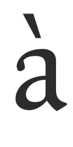
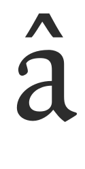
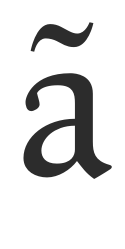
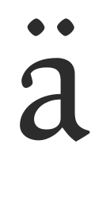
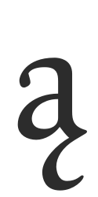
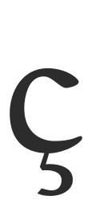

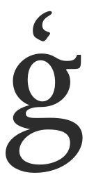

### Quelques exemples de diacritiques

'a accent grave' minuscule (unicode u + 00e0).
Créé dans une police en combinant le glyphe 'a' minuscule (unicode u+0061) et le glyphe 'diacritique accent grave' (unicode u+0300).

'a accent circonflexe' minuscule (unicode u+00e2).
Créé dans une police en combinant le glyphe 'a' minuscule (unicode u+0061) et le glyphe 'diacritique accent circonflexe' (unicode u+0302).

'a ogonek' minuscule (unicode u+0105).
Créé dans une police en combinant le glyphe 'a' minuscule (unicode u+0061) et le glyphe 'diacritique ogonek' (unicode u+0328).

'c cédille' minuscule (unicode u+00e7).
Créé dans une police en combinant le glyphe 'c' minuscule (unicode u+0063) et le glyphe 'diacritique cédille' (unicode u+0327).

'o double accent aigu' minuscule (unicode u+0151).
Créé dans une police en combinant le glyphe 'o' minuscule (unicode u+006f) et le glyphe 'diacritique double accent aigu' (unicode u+030b).

FontForge peut automatiquement créer des caractères accentués de 2 façons;

1. FontForge contient des informations rudimentaires sur l'endroit où placer les signes diacritiques, donc peut construire automatiquement la plupart des caractères accentués.
2. Pour plus de contrôle du placement diacritique, FontForge peut placer des signes diacritiques en fonction de la position des points d'ancrage créés par l'utilisateur.

Notez que si vous n'utilisez pas les ancrages et les tables de lookup pour positionner les signes diacritiques, alors si le glyphe d'un signe diacritique particulièr n'est pas présent dans votre police, FontForge utilisera plutôt un accent chassant similaire en place. Par exemple, si le signe diacritique 'accent aigu combiné' (u + 0301) n'est pas présent, FontForge utilisera le caractère 'accent aigu' (u+00b4) standard lorsqu'il construira automatiquement des glyphes accentués aigus. Si l''accent aigu combiné' est présent, alors FontForge l'utilisera toujours, sauf si vous forcez spécifiquement FontForge à utiliser des accents chassants pour construire des glyphes accentués.

## Positionnement automatique de base des signes diacritiques dans FontForge.

Dans le menu 'Elément' de FontForge, il y a une fonction appelée 'Assembler' qui peut être utilisée pour créer des caractères accentués, certains caractères composites et certains caractères en double. Pour construire automatiquement des caractères accentués FontForge utilise la fonction 'Elément> Assembler> Créer les glyphes accentués'. Cette fonction peut également être effectuée avec la touche <kbd>Ctrl</kbd> + <kbd>Maj</kbd> + <kbd>a</kbd>. Ainsi, à l'aide de l'exemple de construction du caractère 'a accent aigu' (u+00e1), il faudrait avoir déjà créé le 'a' minuscule (u+0061) et le glyphe 'accent aigu combiné' (u+301). Ensuite, en sélectionnant l'emplacement de caractères 'a accent aigu' et en utilisant la fonction 'Elément> Assembler> Créer les glyphes accentués', FontForge placera une référence au glyphe 'a' minuscule et une référence au glyphe 'accent aigu' dans l'emplacement de caractères 'a accent aigu' (voir ci-dessous).

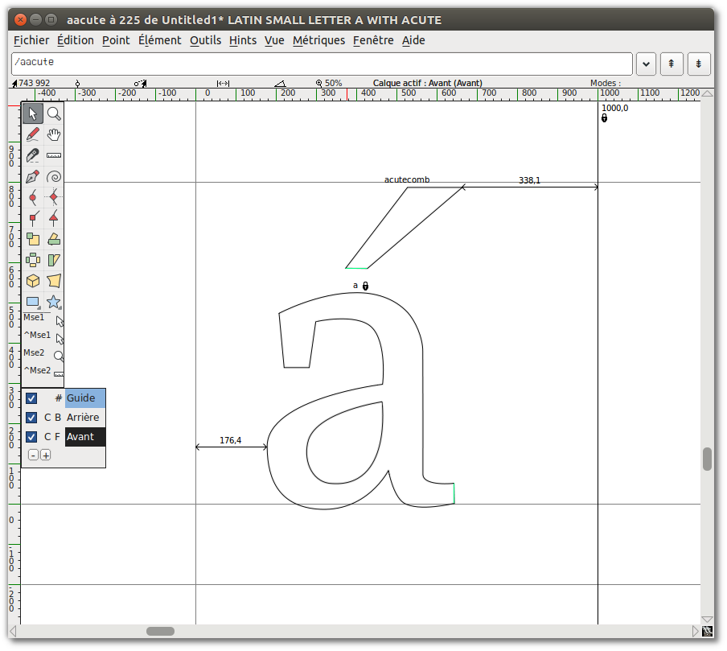

Ce positionnement automatique des signes diacritiques peut être réglé selon les préférences, qui se trouvent dans la section 'Accents' du menu des préférences de FontForge 'Fichier> Préférences> Accents' (voir ci-dessous).

'Préférer les accents chassants' &mdash; l'activation de cette option obligera FontForge à créer des glyphes accentués avec des caractères chassant, même si les caractères combinants appropriés sont présents. Cette option est ignorée lors de l'utilisation d'ancres pour positionner les signes diacritiques.

'Pourcentage de décalage des accents' contrôle la quantité d'espace vertical entre le glyphe de base et celui du diacritique. La valeur saisie ici est un pourcentage du cadratin de la police. Donc, une valeur de '6' va décaler le glyphe du signe à partir du glyphe de base de 6% du cadratin de la police.

Les préférences pour le positionnement horizontal du glyphe de signe peuvent également être définies. En mettant à 'Oui' la préférence 'Centrer les accents graves et aigus selon leur point bas', le glyphe d'accent sera centré au point le plus bas du glyphe de base.

Si vous mettez à 'Oui' l'option 'Centrer les autres accents selon leur point haut', l'accent sera centré sur le point le plus élevé du glyphe de base.

En mettant les deux préférences ci-dessus à 'Non', l'accent sera centré sur la largeur du glyphe de base. Si vous mettez les deux préférences ci-dessus à 'Oui', l'accent sera centré sur la largeur de la case de caractère.

## Utilisation des points d'ancrage pour placer des signes diacritiques

La méthode la plus précise et la plus efficace pour créer des caractères accentués dans FontForge consiste à utiliser des points d'ancrage.

Les points d'ancrage permettent un contrôle précis du positionnement du signe diacritique par rapport à chaque glyphe de base dans les caractères accentués. Ainsi, dans le cas du caractère 'a ogonek', le glyphe 'a' est le glyphe de base et il sera placé normalement. Le glyphe 'ogonek' est le 'glyphe de signe' et sera positionné de sorte que le point d'ancrage du 'glyphe de signe' coïncide avec le point d'ancrage sur le glyphe de base.

Dans l'exemple ci-dessous, en créant un caractère 'a ogonek', une classe d'ancrage a été créée et appelée 'bas'. Dans le glyphe 'a' minuscule, l'ancrage du 'bas' est placé au bas du fût du 'a' sous la forme d'une ancre de 'glyphe de base'. (voir ci-dessous)

Dans le glyphe 'ogonek', l'ancre du bas est placée au sommet du glyphe ogonek, sous la forme d'une ancre de 'signe'. (voir ci-dessous)

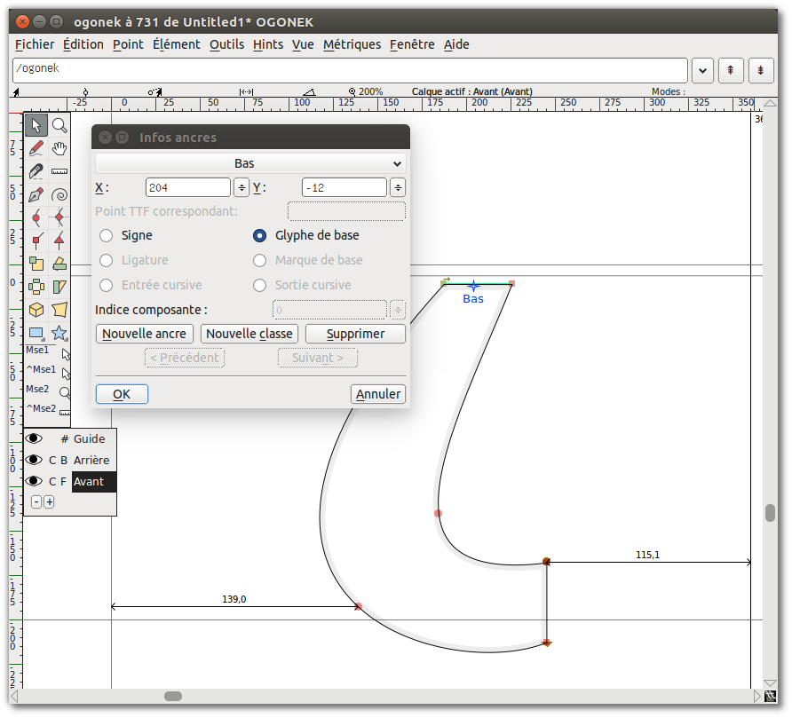

Ensuite, lorsque le caractère 'a ogonek' est construit (en utilisant la fonction 'Créer les glyphes accentués'), le point d'ancrage du signe inférieur sera placé au même emplacement que le point d'ancrage de base du 'bas', assurant que le glyphe ogonek indiqué est placé correctement au pied du fût du glyphe 'a' indiqué (voir ci-dessous). Ce placement exact et automatique n'aurait pas été possible sans utiliser de points d'ancrage pour positionner les glyphes de base et de signe.

### Création de points d'ancrage pour le placement de signes diacritiques (positionnement signe sur base)

FontForge utilise des fonctionnalités de recherche (lookup) appelées 'signe sur base' pour créer et positionner des points d'ancrage. Ces lookups de signe sur base peuvent être créés et édités dans la section Lookup GPOS des informations sur la fonte de votre police ('Elément> Infos fonte> Lookups> GPOS').

Dans la fenêtre Lookups GPOS, cliquez sur 'Nouveau lookup' et choisissez 'Positionnement signe sur base', puis choisissez 'Positionnement par signe' dans la colonne 'Nouveau' du volet Fonctionnalité (voir ci-dessous). Cliquez sur 'OK' pour fermer la fenêtre.

Lorsque le nouveau lookup est sélectionné, cliquez sur 'Nouvelle sous-table'. Dans la fenêtre résultante (voir ci-dessous), vous pouvez créer vos classes d'ancrage.

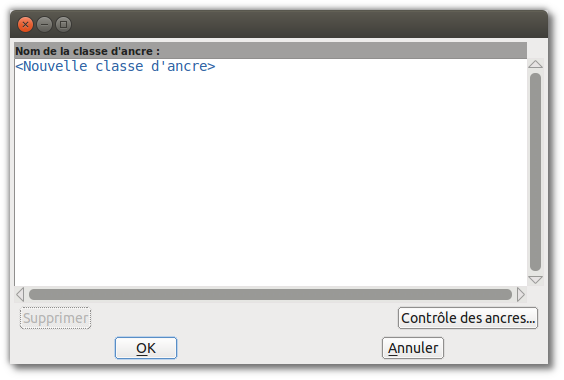

Dans cet exemple (ci-dessous), deux classes d'ancre ont été créées, 'haut' et 'bas'. La classe d'ancrage du 'haut' sera utilisée pour positionner les signes diacritiques placés au-dessus des glyphes, et l'ancrage du 'bas' sera utilisée pour positionner les signes sous les glyphes.

Pour placer une ancre avec un glyphe, il suffit d'utiliser le bouton droit de la souris dans une fenêtre d'édition de glyphe et de sélectionner la fonction 'Ajouter ancre' dans le menu contextuel.

La boîte de dialogue qui s'affiche vous permet d'indiquer si l'ancre est un ancrage sur base ou sur signe. La position de l'ancre peut également être affinée à partir de cette boîte de dialogue. Alternativement, l'ancre peut être déplacé en étant déplacé à la position avec la souris, ou déplacé en utilisant les touches haut, bas, gauche et droite. Le point d'ancrage peut également être modifié en cliquant avec le bouton droit de la souris sur le point d'ancrage et en choisissant «Infos...» dans le menu de la souris.

### Contrôle des classes d'ancrage

FontForge contient également une interface graphique utile pour contrôler la position de classes entières de points d'ancrage, permettant à l'utilisateur d'affiner la position de, par exemple, tous les accents aigus à la fois dans une police, ou tous les ancres dans une classe contenue dans, par exemple, les caractères qui font référence à la minuscule 'e'. Dans les exemples ci-dessous, nous pouvons voir comment utiliser cette interface graphique pour affiner la position de tous les accents aigus dans une police et pour affiner une classe d'ancre sur tous les caractères qui font référence au glyphe 'e' minuscule.

Une fois que vous avez créé des classes d'ancrage dans vos lookups de positionnement 'signe sur base' et ajouté des ancres à certains glyphes, vous pouvez contrôler ces classes à partir de "Élément>Infos fonte>Lookups> GPOS" puis modifier une sous-table contenant les classes d'ancrage. Vous verrez alors cette fenêtre;

À partir de là, sélectionnez la classe que vous souhaitez modifier et cliquez sur le bouton 'Contrôle des ancres'. Une interface graphique de cette classe vous sera ensuite présentée. Dans les exemples ci-dessous, nous éditons le contrôle de la classe 'haut'. Dans le premier exemple (ci-dessous), la minuscule 'e' a été sélectionnée dans la section 'Bases' du menu déroulant. Lorsqu'un glyphe de base est sélectionné, tous les caractères qui font référence à ce glyphe et contiennent un ancrage 'haut' de base s'affichent dans le volet d'aperçu. Nous pouvons alors ajuster la position de l'ancre de base 'haut' pour voir comment elle affecte la position de tous les glyphes qui contiennent l'ancrage de signe 'haut'.

Dans le deuxième exemple ci-dessous, le glyphe 'aigu' a été sélectionné dans la section 'Signes' du menu déroulant. Lorsqu'un glyphe de signe est sélectionné, tous les glyphes qui font référence au glyphe sélectionné et contiennent un point d'ancrage 'haut' s'affichent dans l'aperçu.

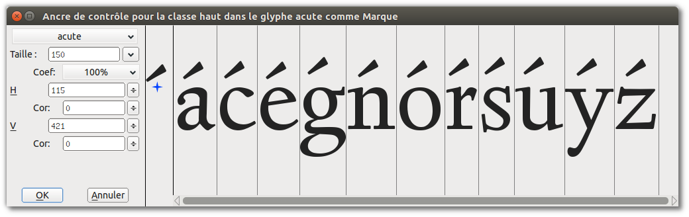

## Autres ressources (en anglais)

* <http://urtd.net/projects/cod/about>
* <http://ilovetypography.com/2009/01/24/on-diacritics/>
* <http://diacritics.typo.cz/>
* <http://scripts.sil.org/ProbsOfDiacDesign>
* <http://www.microsoft.com/typography/developers/fdsspec/diacritics.htm>
* <https://twitter.com/fostertype/status/610292546971893760>
