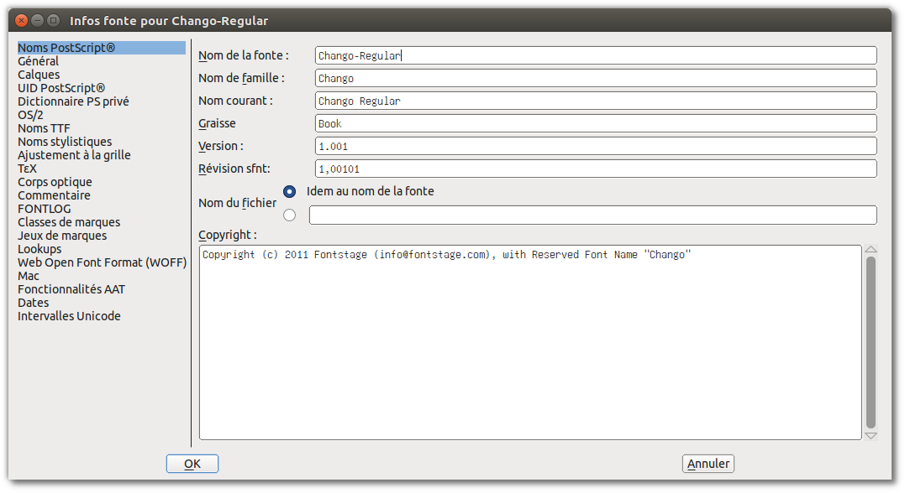

## Élément, Infos fonte

La fenêtre Infos fonte est omniprésente dans les éditeurs de polices et FontForge suit de près la spécification OpenType.
Cela peut sembler cryptique au début, mais l'utiliser peut aider à apprendre le format OpenType, et à son tour la lecture
sur le format OpenType rend la boîte de dialogue plus accessible.

## Numérotation des versions

Les développeurs de logiciels aiment utiliser la [gestion sémantique de version](http://semver.org/lang/fr/) pour leurs
programmes, et c'est aussi une bonne idée pour vos polices. D'une certaine manière, les polices sont une "API" pour que
le texte accède à certains sentiments associatifs chez les lecteurs.

Une version MAJEURE serait après une refonte complète. Comparez [Exo](http://www.google.com/fonts/specimen/Exo) et [Exo 2](http://www.google.com/fonts/specimen/Exo+2).
Si vous avez un document utilisant Exo, vous ne voulez pas tomber dans Exo 2, parce que le sentiment évoqué, le «ton» ou
«saveur», est (subtilement) différent. Prendre en charge une ou plusieurs nouvelles écritures qui sont assez similaires en hauteur, ou ajouter un nombre substantiel de langues, pourrait également constituer une révision MAJEURE, comme toute autre chose qui modifie substantiellement les métriques verticales ou horizontales. Cependant, si un design complémentaire est fait pour 2 écritures, il peut être préférable d'émettre 2 ou 3 familles, une avec chaque écriture mise à l'échelle de façon appropriée et les autres écritures mises à l'échelle comme des polices secondaires pour la typographie simple de textes multilingues.

Une version MINEURE serait tout ce qui modifie subtilement les métriques, telles que les métriques verticales, les approches horizontales ou l'amélioration du crénage, ou l'apport de corrections mineures à certains glyphes, car de telles mises à jour entraîneront la repagination des documents utilisant la police (bien que subtilement dans de nombreux cas). Voici un exemple (en anglais) de <http://www.fastcodesign.com/3033126/roboto-rebooted-why-google-plans-to-update-its-font-like-the-rest-of-its-products>:

 

L'ajout de quelques glyphes ou d'une douzaine d'entre-eux pour "compléter" la couverture d'un jeu de caractères précédemment planifié ou l'ajout de la prise en charge de quelques langues supplémentaires est probablement MINEUR, surtout si cela ne change pas les métriques verticales.

Un changement de type CORRECTIF serait tout ce qui améliore la police sans changer les métriques ou ne modifie pas le design d'un glyphe de manière visible, sans affecter la disposition finale du texte.
Votre version 1.001 pourrait ne pas avoir le champs fsType mis à 0 ou ne pas être exécuté encore par fontcrunch. La
modification de ces deux choses dans une version 1.0.1 ne sera pas visible ou ne créera aucune repagination.
Malheureusement, le troisième numéro de version de type CORRECTIF n'est pas disponible dans les champs de métadonnées des
polices OpenType. Au lieu de cela, incrémenter le numéro de version MINEUR pour des modifications au hinting ou aux métadonnées.

De plus, la version ne doit pas contenir plus de 3 décimales, alors qu'elle peut être représentée par 5 dans un fichier TTX. Par exemple `2.001` est typique, et peut apparaître comme` 2.00099` dans un fichier XML TTX.

Si vous créez de nouvelles versions de polices libres, les fonctions de [Github Releases](https://www.google.com/search?q=github+releases) sont très utiles.

## Nom de famille

Microsoft travaille dur pour s'assurer qu'un programme écrit pour une version antérieure de Windows continuera à s'exécuter sur les dernières versions, incitant les gens à se mettre à niveau. Cela signifie que le modèle de police TrueType de base présent dans Windows 3 existe toujours, et Windows ne prend pas en charge les familles de polices avec plus de 4 styles de base (Régulier, Italique, Gras, Gras Italique.)

Cela signifie pour les concepteurs de polices que nos noms de famille de polices doivent être configurés de manière à ce que nos polices puissent être utilisées dans tous les systèmes d'exploitation. Le format OpenType le permet, en complétant les valeurs de nom de famille et de style avec les valeurs "Nom de famille préféré" et "Nom de style préféré" qui auront priorité dans un logiciel interprétant le format OpenType.

Cette feuille de calcul de [Google Docs, Family Naming](https://docs.google.com/spreadsheets/d/1ckHigO7kRxbm9ZGVQwJ6QJG_HjV_l_IRWJ_xeWnTSBg/edit#gid=0) est basée sur des informations partagées par l'expert en polices polonais Adam Twardoch et discutées dans le [forum Fontlab](Http://forum.fontlab.com/index.php?topic=313.0).
Elle remplace l'[exemple de spécification OpenType](https://www.microsoft.com/typography/otspec/namesmp.htm).
