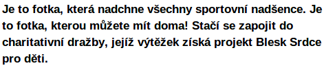
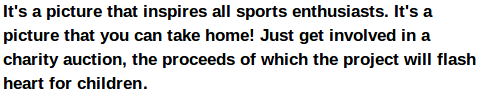

Lorsque vous avez l'inter-mots et un jeu de n et o, vous pouvez commencer à regarder l'interligne. Toutefois, une décision complète et définitive sur l'interligne est impossible sans avoir les lettres capitales et de la ponctuation.

## Pensez à l'interligne intentionnellement

Comme c'est le cas avec l'espacement des lettres et des mots, avoir trop ou trop peu d'interligne peut rendre votre police difficile à utiliser dans le monde réel. Par-dessus tout, trouver le juste équilibre entre les lignes est une question nécessitant réflexion et le test d'une gamme d'options avant de prendre une décision finale.

Règle générale, la plupart des nouveaux concepteurs de police ont tendance à mettre trop peu d'interligne dans leur police. Donc si vous n'êtes pas sûr, ajouter de l'espace supplémentaire est généralement une bonne idée.

Vous devriez également considérer la portée linguistique de votre projet lorsque vous considérez l'interligne. Si vous tester l'interligne de votre police uniquement avec des caractères non accentués, vous êtes susceptible de choisir une valeur d'interligne qui ne laisse aucune place pour les accents. Si vous êtes certain que votre police ne sera jamais utilisée avec des caractères accentués, cela pourrait être acceptable &mdash; mais les chances sont que votre police <em>sera</em> utilisée pour composer un texte accentué. Dans ce cas, un interligne trop petite entraînera un empiètement des accents sur le bas des glyphes de la ligne supérieure, et laissera au lecteur la tâche difficile (voire impossible) de lire le texte.

Une stratégie pour tester si l'interligne de votre police est appropriée pour les caractères accentués consiste à utiliser des exemples de texte à partir de plusieurs langues.

Pour les langues chargées de signes diacritiques (comme le tchèque), l'interligne doit être plus grande que pour les langues qui n'utilisent pas de signes diacritiques. Les exemples ci-dessus montrent le tchèque (ci-dessus) et l'anglais avec le même interligne assez large.

## Expérimentez avec l'interligne de votre police dans FontForge

Dans FontForge, vous pouvez définir et ajuster l'interligne de votre projet de polices à partir de la fenêtre Infos fonte. Ouvrez cette fenêtre en choisissant <em>Infos fonte</em> dans le menu "Elément", puis cliquez sur l'onglet Général. Notez les valeurs que FontForge a répertoriées pour Ascent et Descent. À moins que vous ayez déjà apporté des modifications manuelles, ces deux nombres, lorsqu'ils sont additionnés, devraient être égaux à la valeur de la taille en cadratin (Em) indiquée sur la ligne en dessous.

Passez maintenant à l'onglet "OS/2". Sur presque tous les ordinateurs, l'interligne de votre police sera déterminée par les valeurs d'ascent et de descent que vous entrez dans cet onglet, sous l'en-tête Métriques.

Il existe trois jeux de valeurs: Win Ascent et Descent, ascent et descent typographique, et ascent et descent HHead. Vous devez définir tous les ascents comme étant identiques à la valeur de l'ascent que vous avez notée dans l'onglet Général. Ensuite, vous devez définir tous les descents comme étant identiques à la valeur de descent que vous avez notée dans l'onglet Général, à une exception près: vous devez rendre le descent typographique <em>négatif</em>. Laissez la valeur identique, mais mettez un signe moins devant. Enfin, décochez toutes les options "Utiliser comme offset".

Ces paramètres vous donneront un bon point de départ. Vous pouvez maintenant tester votre police avec cette interligne et effectuer des ajustements incrémentaux jusqu'à ce que vous obteniez un résultat agréable à l'œil.

Si vous trouvez que votre interligne est trop serrée et que vous ne voulez pas ou ne pouvez pas rendre les métriques verticales plus importantes, vous pouvez diminuer la taille des glyphes pour gagner plus d'espace pour l'interligne.
