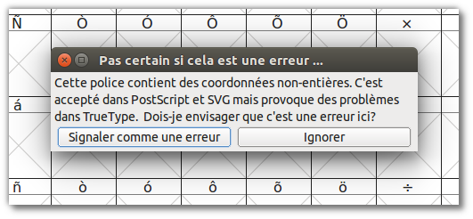
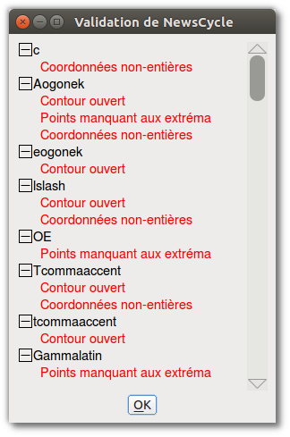
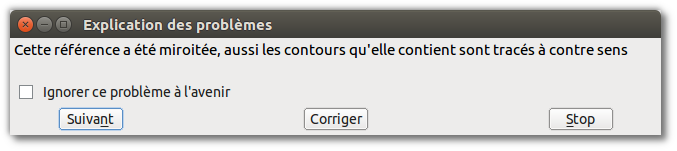

Dans un monde parfait, votre police serait prête à construire et à installer sur n'importe quel ordinateur moderne sans effort particulier, mais la réalité est plus compliquée-en particulier au cours du processus de conception. Les polices peuvent comporter des erreurs techniques qui les empêchent de fonctionner ou de s'afficher correctement. Par exemple, les courbes qui se croisent ne seront pas rendues correctement parce qu'elles n'ont pas «d'intérieur» et «d'extérieur». Les différents formats de fichiers de polices s'attendent également à ce que les glyphes adhèrent à certaines règles qui simplifient le placement du texte à l'écran. Les polices qui enfreignent les règles peuvent provoquer des problèmes inattendus. Un exemple de ce type de problème est que tous les points sur une courbe doivent avoir des coordonnées qui sont des entiers. Enfin, il y a des erreurs stylistiques qui ne sont pas techniquement incorrectes, mais que vous voudrez réparer &mdash; telles que des lignes qui sont destinées à être parfaitement horizontale ou verticale, mais sont accidentellement légèrement inclinées.

FontForge offre des outils que vous pouvez utiliser pour localiser (et, dans de nombreux cas, réparer) les trois catégories de problème. La validation de votre police pour éliminer ces erreurs permettra non seulement de s'assurer qu'elle peut être installée et appréciée par les utilisateurs, mais fera en sorte que le projet fini brille.

## Trouvez les problèmes

Le premier outil est appelé <em>Recherche de problèmes</em> et se trouve sous le menu Élément. Vous devez d'abord sélectionner un ou plusieurs glyphes, soit dans la fenêtre de fonte, soit dans la fenêtre de glyphe, ou dans la fenêtre de métriques, puis ouvrez l'outil Rechercher des problèmes. L'outil vous présente un assortiment de problèmes potentiels dans huit onglets distincts.

Vous pouvez sélectionner les problèmes qui vous intéressent en cochant la case à côté de chacun et, dans certains cas, fournir une valeur numérique à vérifier. Lorsque vous cliquez sur le bouton OK, l'outil examine tous les glyphes sélectionnés et signale tous les problèmes qu'il trouve dans une boîte de dialogue.

Les problèmes que l'outil recherche de problème peut vérifier sont triés dans ces huit groupes:

* Problèmes liés aux points
* Problèmes de chemins et de courbes
* Problèmes de références
* Problèmes avec le hinting
* Problèmes avec ATT
* Problèmes spécifiques aux polices CID-keyed
* Problèmes avec les boîtes englobantes
* Divers autres problèmes

Pas tous les contrôles sont nécessaires. Certains s'appliquent uniquement à des écritures ou des langages spécifiques (comme ceux de l'onglet "CID"), tandis que d'autres s'appliquent uniquement à des fonctions de police facultatives spécifiques (telles que les vérifications dans l'onglet des références). Mais vous devez vérifier que votre police passe les tests qui examinent les glyphes pour les fonctionnalités requises et plusieurs tests qui recherchent le comportement facultatif mais généralement attendu. Plusieurs des autres tests vous fournissent une rétroaction et des conseils au cours du processus de design, et sont à explorer pour cette raison.

### Tout d'abord: testez les fonctionnalités requises

Dans l'onglet "Points", sélectionnez le test <em>Coordonnées non-entières</em>. Ce test vérifie que tous les points de chaque glyphe (y compris les points sur la courbe et les points de contrôle) ont des coordonnées entières. Pas tous les formats de sortie de police requiert ce comportement, mais certains le demandent.

Dans l'onglet "Chemins", sélectionnez les options <em>Chemins ouverts</em> et <em>Chemins extérieurs dans le sens horaire</em>. Ce sont les deux fonctions obligatoires dans toutes les polices. La première recherche des courbes qui ne sont pas des formes fermées et la seconde assure que les courbes extérieures de chaque glyphe sont tracées dans le sens des aiguilles d'une montre. C'est une très bonne idée de vérifier les <em>chemins sécants</em> en même temps; bien que les formats de polices modernes puissent prendre en charge deux chemins croisés, les courbes qui s'entrecroisent ne sont pas autorisées. De plus, si un glyphe a des chemins auto-intersectés, FontForge ne peut pas effectuer le test <em>Chemins extérieurs dans le sens horaire</em>.

Dans l'onglet «Références», sélectionnez tous les six tests. Ces vérifications concernent toutes des références, dans lesquelles un glyphe inclut des chemins d'un autre glyphe. Par exemple, une lettre accentuée comprend une référence à la lettre originale (non accentuée), plus une référence au caractère accent. Tous les tests de l'onglet "Références" sont obligatoires pour au moins un format de sortie commun, et tous sont de bonnes idées.

De même, sélectionnez tous les tests dans l'onglet "ATT". Ces tests recherchent des noms de glyphes manquants, des règles de substitution qui font référence à des glyphes inexistants et d'autres problèmes liés aux noms de glyphe ou aux fonctionnalités OpenType. Les problèmes dont ils nous protègent sont rares, mais cela peut provoquer que la police sera considérée comme invalide par un ou plusieurs systèmes informatiques, donc ils valent la peine d'être inclus.

### Rendez la vie plus facile à vos utilisateurs: testez le bon fonctionnement

Les tests énumérés ci-dessus feront en sorte que votre police s'installe et s'affiche correctement selon les règles établies par les différents formats de police, mais il existe une poignée d'autres tests que vous devriez envisager d'ajouter &mdash; surtout à la fin du processus de design &mdash; simplement parce qu'ils vérifient les conventions communes suivies par la plupart des typographies modernes.

Dans l'onglet "Points", sélectionnez <em> Points de contrôle en dehors de la courbe</em>. Ce test recherchera des points de contrôle situés au-delà des extrémités du segment de courbe sur lequel ils résident. Il ya rarement une raison pour laquelle un point de contrôle devrait se trouver en dehors de la courbe, de sorte que ces cas signifient généralement des accidents. Il est également judicieux de sélectionner <em>Points trop éloignés </em>, qui recherche des points situés à plus de 32767 unités du point le plus proche. Cette distance est plus grande que la plupart des ordinateurs peuvent traiter, et un point qui est loin est presque certainement involontaire (à titre de comparaison, un glyphe simple a tendance à être dessiné sur une grille d'environ 1000 unités), donc enlever ces points est important.

Dans l'onglet "Chemins", les tests <em>Vérifier les extrema manquants</em> et <em>Plus de points que [val]</em> peuvent être bénéfiques. Le premier cherche des points aux extrema &mdash; c'est-à-dire le point le plus haut, le point le plus bas, et les points les plus à gauche et à droite du glyphe. Les formats de police modernes suggèrent fortement que chaque chemin ait un point à chacun de ses extrema horizontaux et verticaux. Cela rend la vie plus facile lorsque la police est rendue à l'écran ou sur la page. Cette vérification recherchera des points extrema manquants. Le deuxième test est une vérification sur le nombre de points au sein d'un glyphe. La valeur par défaut de FontForge pour cette vérification est de 1 500 points, ce qui correspond à la valeur proposée par la documentation PostScript, et elle est suffisante pour presque toutes les polices.

Comme son nom l'indique, l'onglet "Divers" répertorie les tests qui ne correspondent pas aux autres catégories. Parmi ceux-ci, les trois derniers sont utiles: <em>Codes Unicode répétés</em>, <em>Noms répétés</em> et <em>Incohérences nom/code Unicode</em>. Ils recherchent des erreurs de métadonnées dans le mappage entre les noms de glyphe et les cases Unicode.

### Aidez-vous: exécutez des tests qui peuvent aider au design

La plupart des autres tests de l'outil de recherche de problèmes peuvent être utiles pour trouver et localiser des incohérences dans votre collection de glyphes; des choses qui ne sont pas mauvaise ou invalide, mais que vous en tant que concepteur voudrez améliorer. Par exemple, le test <em>Y proche de la hauteur standard</em> dans l'onglet "Points" compare les glyphes à un ensemble de mesures verticales utiles: la ligne de base, la hauteur du glyphe "x", le point le plus bas de la descendante sur la lettre "p", et ainsi de suite. Dans une police de caractères cohérente, la plupart des lettres vont adhérer à au moins quelques-unes de ces mesures standard, donc les chances sont qu'un glyphe qui est très éloigné de celles-ci ait besoin de beaucoup de travail.

Le test <em>Bords presque horizontaux/verticaux/italiques</em> dans l'onglet "Chemins" recherche des segments de ligne qui sont presque exactement horizontaux, verticaux ou à l'angle de l'italique de la police. Faire vos lignes presque verticales parfaitement verticales signifie que les formes apparaîtront nettes lorsque la police est utilisée, et ce test est un moyen fiable pour traquer les segments pas tout à fait-droit qui pourraient être difficiles à repérer à l'œil nu.

Vous pouvez utiliser d'autres tests pour localiser des points de courbe qui sont trop proches les uns des autres pour être significatif, pour comparer les approches latérales des glyphes de même forme et pour effectuer une gamme d'autres tests qui révèlent les glyphes ayant des bizarreries. Une partie du processus de raffinement est de prendre vos designs initiaux et de les rendre plus précis; comme les autres aspects de la conception de police, c'est une tâche itérative, donc utiliser les outils intégrés réduit une partie de la répétition.

## Validez la police

L'autre outil de validation de FontForge est le validateur de la police, qui exécute une batterie de tests et vérifie la police en entier. Parce que le validateur est utilisé pour examiner une police complète, vous ne pouvez le démarrer qu'à partir de la fenêtre de fonte.  Vous le trouverez dans le menu Élément, sous le sous-menu Validation. Le validateur est conçu pour exécuter uniquement les tests qui examinent la police pour l'exactitude technique, essentiellement les tests décrits dans la section "testez les fonctionnalités requises" ci-dessus. Mais il exécute les tests contre la police en entier, et il le fait beaucoup plus rapidement que vous pouvez le faire vous-même glyphe par glyphe à l'aide de l'outil de recherche de problèmes.

La première fois que vous exécutez le validateur au cours d'une session particulière, une boîte de dialogue apparaîtra vous demandant si oui ou non il doit signaler les coordonnées de point non entier comme une erreur. La réponse prudente est de choisir "Signaler comme une erreur", car s'en tenir à des coordonnées entières est une bonne pratique de conception. Lorsque le validateur termine son scan de la police (ce qui ne prendra que quelques secondes), il ouvrira une nouvelle boîte de dialogue intitulée Validation de <em>quel que soit le nom de votre police</em>. Cette fenêtre répertorie tous les problèmes trouvés par le validateur, présentés dans une liste triée par glyphe.

Mais cette fenêtre n'est pas simplement une liste d'erreurs: vous pouvez double-cliquer sur chaque élément de la liste, et FontForge ira au glyphe correspondant et mettra en évidence le problème exact, avec une explication de texte dans sa propre fenêtre. Vous pouvez ensuite résoudre le problème dans l'éditeur de glyphe, et l'élément d'erreur associé disparaît immédiatement de la liste d'erreurs du validateur. Dans de nombreux cas, l'erreur sera quelque chose que FontForge peut automatiquement réparer. Dans ces cas, la fenêtre d'explication affichera en bas un bouton "Corriger". Vous pouvez cliquer dessus et effectuer la réparation sans efforts supplémentaires.

Pour certains problèmes, il n'y a pas de correction automatique, mais voir le problème à l'écran vous aidera à le corriger immédiatement. Par exemple, une courbe auto-sécante a un endroit spécifique où le chemin se croise &mdash; il peut être trop petit pour que vous puissiez le remarquer d'un coup d'œil, mais le grossissement vous permettra de remodeler le chemin et d'éliminer le problème.

Pour d'autres problèmes, il peut ne pas y avoir un point spécifique auquel l'erreur est localisée. Par exemple, si une courbe est tracée dans la mauvaise direction (c'est-à-dire dans le sens inverse des aiguilles d'une montre), toute la courbe est affectée. Dans les cas où FontForge ne peut pas résoudre automatiquement le problème et il n'y a pas de point spécifique sur le glyphe pour le validateur à mettre en évidence, vous pourriez avoir à rechercher afin de corriger manuellement le problème.

Enfin, il existe des tests effectués par le validateur qui pourraient ne pas être un problème pour le format de sortie final que vous avez à l'esprit &mdash; par exemple, le test des coordonnées non entières mentionné précédemment. Dans ces cas, vous pouvez cliquer sur la case à cocher "Ignorer ce problème dans le futur" dans la fenêtre d'explication d'erreur, et supprimer ce message d'erreur particulier lors de futures exécutions de validation.

## Résolvez les problèmes lors de l'édition

La plupart des erreurs que l'outil de recherche de problème et le validateur de la police entière recherchent peuvent être corrigées au cours du processus d'édition. Vous n'avez donc pas besoin de reporter la résolution de problèmes à la fin. Par exemple, le sous-menu Vue &gt; Afficher comporte des options qui mettent en évidence les zones problématiques lors de l'édition. Le menu élément contient des commandes comme <em>Ajouter des extrema</em> qui ajouteront les points extrema attendus dans la plupart des formats de fichier de sortie et des coches pour indiquer si le chemin sélectionné est orienté dans le sens horaire ou antihoraire. Si vous retournez une forme (horizontalement ou verticalement) dans l'éditeur de glyphe, vous remarquerez que sa direction est inversée automatiquement aussi. Si vous cliquez sur la commande <em>Corriger direction</em> dans le menu Élément, FontForge corrigera immédiatement l'orientation. Prendre l'habitude de faire de petits correctifs comme ceux-ci lorsque vous travaillez vous permettra d'économiser du temps au cours de la phase de validation finale.

# Le design fonctionne-t-il?

Les polices de caractères peuvent être plus ou moins 'fonctionnelles' dû à ces deux facteurs: facilité de lecture et lisibilité.

La lisibilité signifie que les designs des glyphes sont suffisamment distincts pour être instantanément reconnus. Voici quelques paires qui sont souvent trop similaires:

* La lettre "l" et le chiffre "1"
* La lettre "O" et le chiffre "0"
* La lettre "Z" et le chiffre "2"
* Les chiffres "1" et "7"

La facilité de lecture signifie que tous les glyphes fonctionnent bien ensemble pour une expérience de lecture familière et confortable. La création de documents de test est la meilleure façon de s'assurer de cela. Si vous avez un alphabet complet, vous pouvez composer du texte réel &mdash; par exemple en utilisant [FontFriend](http://somadesign.ca/projects/fontfriend/) pour glisser et déposer votre police dans un long article que vous souhaitez lire, puis l'imprimer.

Toutefois, si la police ne contient qu'une fraction de l'alphabet, vous pouvez utiliser un générateur de texte de test tel que [LibreText.org](http://libretext.org) et n'importe quel traitement de texte, application de publication assistée par ordinateur ou programme d'illustration générale (comme [Inkscape](http://www.inkscape.org)) pour créer des documents de test.

# Testez la police dans différents environnements

Lorsque vous testez des polices sur Microsoft Windows, l'extension [Propriétés de police](https://www.microsoft.com/typography/TrueTypeProperty21.mspx) peut être utile pour examiner rapidement les métadonnées internes de la police, telles que les numéros de version.

Si vous installez des polices en développement qui font que Windows se comporte de manière erratique, [John Hudson](http://typedrawers.com/discussion/1322/otf-fonts-from-glyphs-not-working-with-windows-word) a décrit comment effacer ces polices corrompues sur TypeDrawers:

> Redémarrez Windows en mode console de récupération. Dans la console, accédez au dossier Windows/Fonts et supprimez toutes les entrées de la police Rhodium. Ensuite, naviguez vers Windows/System32 et supprimez le fichier 'FNTCACHE.DAT' **(pas le .dll)**, puis redémarrez Windows. Le fichier de cache de police .dat sera reconstruit, puis vous pouvez alors réinstaller une copie propre de la police Rhodium et voir si cela fonctionne. (Ne vous inquiétez pas si vous obtenez toujours un message indiquant que la police est déjà installée: à ce stade, Windows vous ment.)
