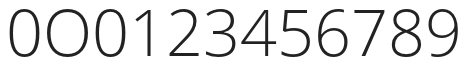
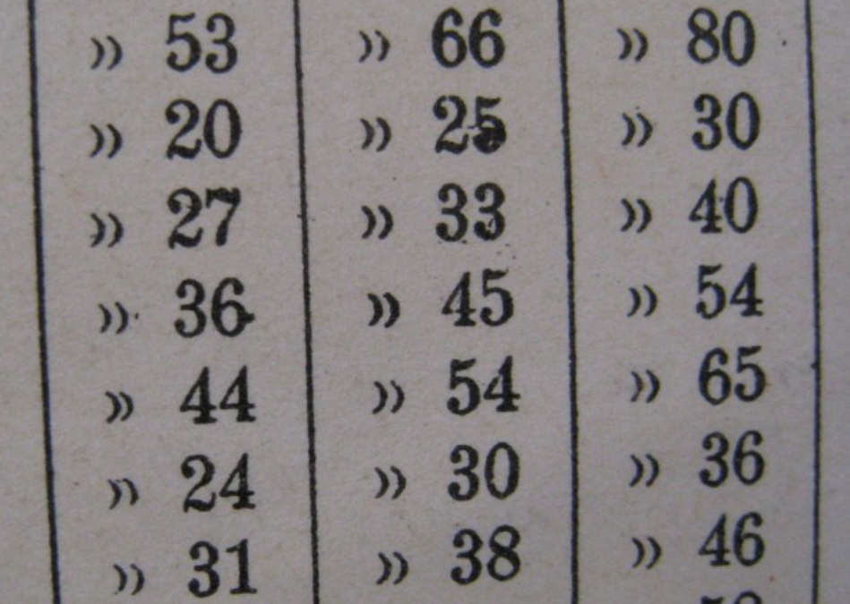

Les chiffres sont souvent difficiles pour les concepteurs de polices &mdash; et pour plusieurs raisons. L'une est que les chiffres ont un très grand nombre de courbes. Une autre est que les chiffres utilisent souvent des conventions dans leurs formes qui sont différentes (ou sont même en violation de) des conventions visuelles vues dans le reste du design de la police. En outre, les chiffres peuvent avoir un très grand nombre de traits (comme 8 et 5 par exemple), ou ils peuvent avoir de grands espaces blancs (comme 1, 7, et parfois 2 et 4). Les deux situations peuvent être difficiles à gérer. Enfin, il ya le problème de s'assurer que votre zéro est différent de la lettre capitale O.

Il peut être utile de regarder les chiffres d'une grande variété de polices pour mieux connaître les façons dont les concepteurs font face à ces problèmes.

Dans ces chiffres avec un nombre dense de traits (comme 8), vous pouvez constater que les concepteurs permettent aux largeurs de trait d'être un peu plus minces que ceux des lettres dans la police. Une approche similaire peut être observée sur le design du g avec descendante en boucle.

À l'inverse, pour compenser les chiffres avec de grandes proportions d'espace blanc, certains traits sont susceptibles de devenir plus épais que normal.

Afin de distinguer entre le zéro et la lettre capitale O, il existe une large gamme de solutions &mdash; comme faire le zéro plus étroit que le O, ou un zéro qui est parfaitement rond, ou peut-être (surtout dans une police à chasse fixe) mettre un barre oblique sur le zéro.

Avoir le zéro plus étroit que le O capital tout en ayant la même hauteur est l'approche commune. Cette approche est typique des chiffres alignés. Les chiffres alignés sont ceux dont le style est le plus courant. Des exemples de polices qui utilisent cette approche comprennent: de nombreux Garamonds, Futura et la police Web Google Open Sans. Ci-dessous, la police Open Sans montrant le zéro, le O capital, le zéro et d'autres chiffres.

Un cercle parfaitement rond ou presque parfaitement rond est moins commun, mais il existe. Des exemples de polices qui utilisent cette approche comprennent la police web Google Vollkorn ainsi que d'autres types commerciaux tels que Mme Eaves, Vendeta et Fleischman BT Pro. Les polices qui utilisent des chiffres proportionnels de style ancien sont plus susceptibles de présenter cette approche. Parfois, un zéro à hauteur d'x mais qui est plus étroit sera également vu.

Jusqu'à 11 styles identifiables permettent de classifier les chiffres quand vous incluez les fractions, les exposants et les indices. Nous allons examiner les 5 plus courants.

## Chiffre de style aligné

Les styles les plus courants de chiffres que l'on retrouve dans les polices sont l'alignement tabulaire et l'alignement proportionnel. L'alignement se rapporte aux hauteurs que les nombres utilisent. Si c'est un style aligné, les hauteurs de tous les nombres seront optiquement les mêmes. La différence entre les chiffres alignés de façon tabulaire et les chiffres alignés de façon proportionnelle est que dans l'alignement tabulaire tous les chiffres ont également la même largeur. Ce style est utile pour les feuilles de calcul et tout autre usage où il est utile pour les chiffres de rester empilés dans des lignes épurées à la fois horizontalement et verticalement.

Les chiffres avec alignement proportionnel ont l'avantage d'être visuellement égaux parce que les formes et l'espacement des nombres varient pour compenser la densité de trait différente.

## Chiffres à style variant ou à l'ancienne

Les chiffres tabulaires sont une invention relativement nouvelle en termes historiques. Avant d'exister, il y avait des nombres proportionnels à l'ancienne. Les chiffres de style ancien sont utiles si vous souhaitez que les nombres se mélangent et partagent le style d'un texte.

Les chiffres tabulaires à l'ancienne sont assez rares. Ils peuvent être utiles dans un rapport annuel où vous voulez donner une impression de style ancien mais l'espacement tabulaire typique de ce type de document. L'image ci-dessus provient d'une carte de catalogue de bibliothèque fait à la machine à écrire.

## Chiffres de style hybride

Les chiffres hybrides ne partagent pas la hauteur de capitale ou la hauteur x de la police, mais occupent leur propre hauteur. Le terme "hybride" se réfère à un mélange de chiffres à l'ancienne et alignés. Des exemples de polices qui utilisent des numéros de style hybride incluent les polices Georgia et les polices Google web Merriweather et Donegal. Les glyphes zéro, O capital, zéro, 1, 2, 3, etc de Merriweather sont montrés ci-dessous.

