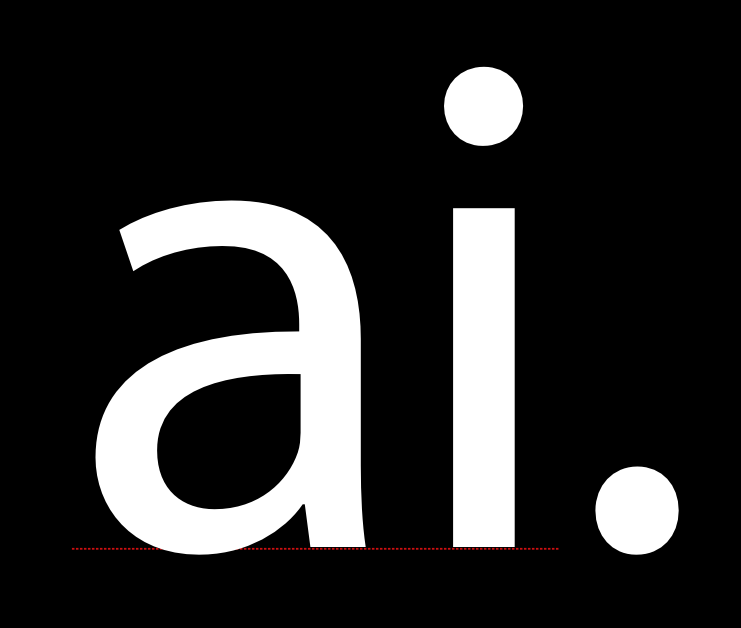
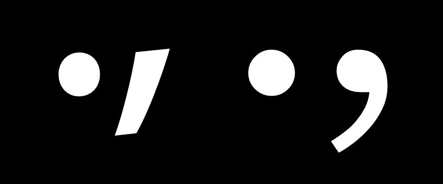
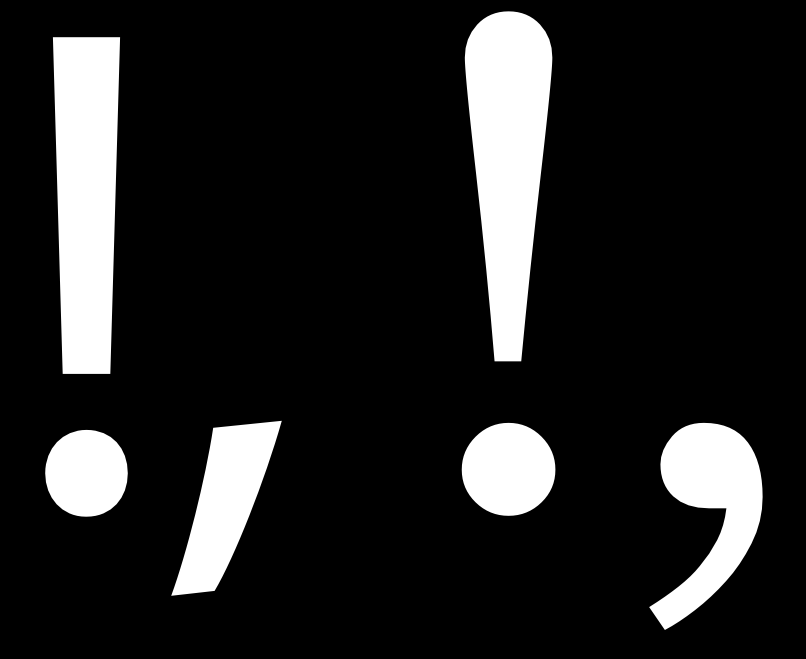
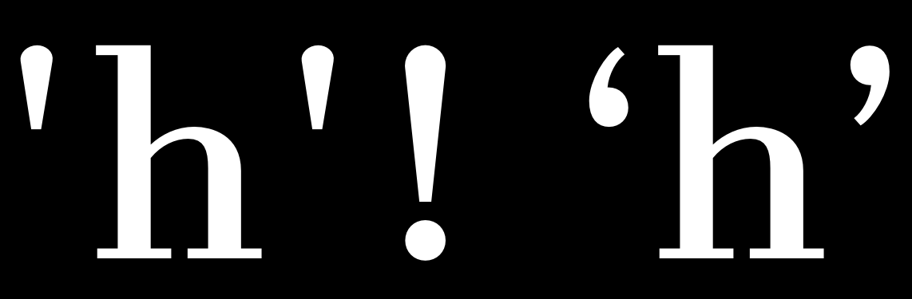
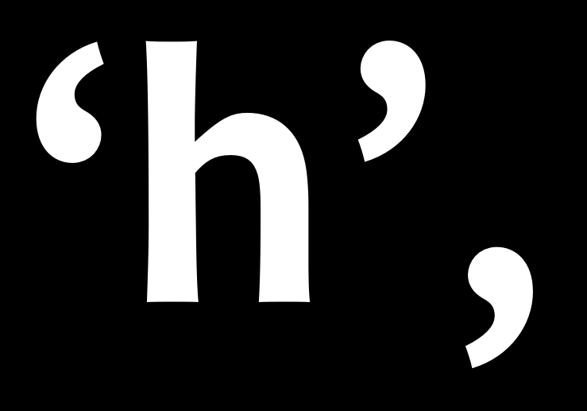

La ponctuation et autres symboles typographiques ont une histoire propre, distincte et à part du développement de l'alphabet. Mais vous constaterez que le même processus de conception s'applique toujours, y compris la réutilisation et l'adaptation de composants, et le test itératif de vos choix de design.

## Glyphes de ponctuation simples

La première chose à faire lors du design de la ponctuation est de créer le caractère '.', qui est connu comme le point.

La forme de ce glyphe est souvent prise du point sur le 'i,' qui est parfois appelé point suscrit. Après avoir copié le point, vous pouvez vouloir l'agrandir. Il est conseillé de tester plusieurs tailles de texte imprimé ou à l'écran.

Une fois que vous établissez une taille dont vous êtes satisfait, ce point peut être utilisé comme base pour une grande variété d'autres ponctuations, y compris ces glyphes: ; : ? ! ¡ ¿ · …

Le prochain glyphe à faire est la virgule. La forme de la virgule peut varier de façon surprenante. Il peut être utile de regarder de nombreux designs de virgule avant de concevoir le vôtre.

L'image ci-dessous montre deux des formes les plus courantes que la virgule peut prendre.

Le sommet de la virgule est souvent légèrement plus adouci que celui du point, car si il est identique, celle-ci peut paraître trop lourde. Dans l'image d'exemple, la virgule à droite est un bon exemple où cette compensation est appliquée. Une autre erreur commune à surveiller avec ce glyphe est de le faire trop court.

Quand vous avez votre virgule, il est assez facile de faire le point-virgule (;).

## Point d'exclamation et point d'interrogation

Le point d'exclamation peut être trompeur en ce qu'il <em>semble</em> simple à faire. Si vous regardez une gamme de caractères, vous verrez que parfois le design est en effet assez simple.

Toutefois, il s'agit d'un glyphe qui a une étonnante occasion de s'exprimer dans le design. Il arrive souvent que même dans une police qui a très peu de contraste, la barre au-dessus du point est un peu plus lourde au sommet qu'à la base. La forme du point d'exclamation se rapporte généralement à la conception de la virgule dans une certaine mesure.

Le point d'interrogation peut également être assez difficile à faire, car il vous oblige à équilibrer une courbe ouverte sur le point en dessous.

Comme avec le point d'exclamation, il est conseillé de regarder et même de tester une gamme de solutions différentes avant d'en choisir une pour votre design.

Le design des glyphes c, C, G, s et S peut fournir une certaine base pour la conception de ce glyphe, mais vous pouvez décider de choisir une forme qui est distincte aussi.

## Symboles additionnels

Les guillemets et apostrophes dactylographique &mdash; &apos; et &quot; &mdash; sont distincts des guillemets typographiques: ‘ ’ et “ ” ‚ „ .

Les apostrophes peuvent suivre la forme de la barre au-dessus du point dans le point d'exclamation, mais ils peuvent également être conçus séparément.

Généralement, les guillemets typographiques sont étroitement liés à la virgule, mais ils doivent être plus longs que la virgule et sont souvent plus courbés.

Les crochets [ ] sont relativement simples à faire car ils sont de forme carrée. Néanmoins, leur conception doit refléter les choix que vous avez faits dans le reste de la police.

La question principale à résoudre est comment grands et profonds ils seront. La convention est qu'ils doivent dépasser la hauteur des capitales très légèrement et descendre au-dessous de la ligne de base à environ 3/4 de la profondeur de vos descendantes de minuscules.

Ces choix seront également reflétés dans le design des parenthèses () et des accolades {}. La graisse des fûts sur ces trois symboles doit être inférieure à la graisse des fûts des capitales et des lettres minuscules.

Soyez averti: lorsque vous testez les caractères [ ] # dans la fenêtre de métriques, ils peuvent ne pas s'afficher. C'est parce qu'ils sont réservés par le programme. Au lieu de taper [] et #, vous devez taper /bracketleft /bracketright et /numbersign.

Les parenthèses devraient s'appuyer sur le design des formes connexes, telles que le D, le C et le G.

Les accolades sont remarquables par leur variation de design. Les accolades ont ceci en commun avec le point d'interrogation. La répartition de la graisse dans les accolades peut être comme la répartition de la graisse des nombres, dans la mesure où cela peut parfois violer les règles que vous suivez dans le reste du design.
