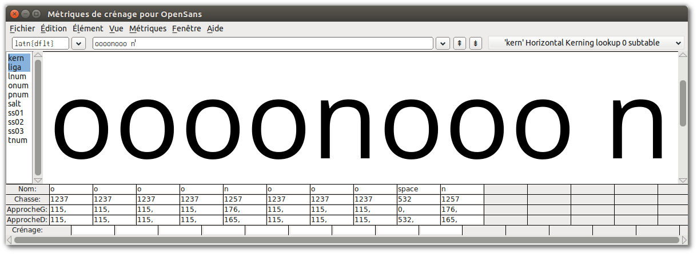
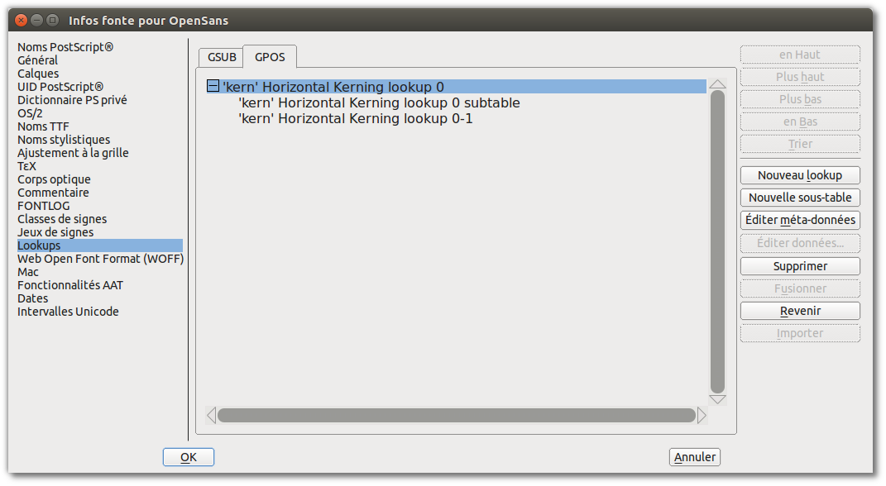

Les espaces entre les caractères sont une partie importante et intégrale de la conception d'une police.

La conception de l'espacement des lettres d'une police doit faire partie intégrale du processus de design d'une police. Un bon espacement est nécessaire pour le bon fonctionnement de la police.

Dans FontForge, la fenêtre de métriques vous permet de concevoir les métriques de votre police, de modifier l'espacement entre les glyphes et leur apparence ensemble. La fenêtre de métriques peut être ouverte à partir du menu ‘Fenêtre’, ou en utilisant la commande <kbd>Ctrl</kbd> + <kbd>K</kbd>.

L'espace entre deux glyphes a deux composantes; l'espace après le premier glyphe, et l'espace avant le deuxième glyphe. Ces espaces entre les glyphes sont composés ‘d'approches latérales’ entre chaque paire de glyphes. Chaque glyphe a une approche gauche et une approche droite. Dans l'exemple ci-dessous de la lettre minuscule ‘a’ de Open Sans, l'approche droite a une valeur de 166 unités et l'approche gauche a une valeur de 94 unités.

## <strong>Fonctions de base de la fenêtre de métriques</strong>

Les approches latérales des caractères peuvent être éditées dans la fenêtre de métrique de FontForge de 5 manières;

- Déplacer manuellement chaque limite d'approche latérale.
- Déplacer manuellement un caractère. Notez cependant que faire glisser un caractère n'aura d'effet que sur la valeur du côté gauche.
- Les valeurs des approches latérales peuvent être modifiées en éditant directement leur valeur dans les tables de métriques de la fenêtre de métriques.
- La valeur des approches latérales peut être incrémentée / décrémentée à l'aide du clavier.
- Utiliser des commandes dans le menu Métriques de la fenêtre des métriques.

<strong>Réglage des valeurs d'approches latérales avec le clavier.</strong>

Une méthode d'ajustement rapide et précis des valeurs métriques dans FontForge consiste à utiliser les touches haut, bas, gauche et droite du clavier. Les touches haut et bas sont utilisées pour incrémenter / décrémenter les valeurs et <kbd>Alt</kbd> + <kbd>Haut</kbd>, <kbd>Alt</kbd> + <kbd>Bas</kbd>, <kbd>Alt</kbd> + <kbd>Gauche</kbd> et <kbd>Alt</kbd> + <kbd>Droit</kbd> sont utilisées pour naviguer autour des différents champs de valeur de la fenêtre de métriques.

## Principes généraux

En principe, les caractères symétriques tels que 'A' 'H' 'I' 'M' 'N' 'O' 'T' 'U' 'V' 'W' 'X' 'Y' 'o' 'v' 'w' 'x' auront des approches symétriques, par exemple les approches gauche et droite d'un 'H' auront la même valeur. Notez cependant que ce n'est pas une règle absolue, mais générale.

Au fur et à mesure que vous espacer les caractères de votre design, vous devriez faire confiance à vos yeux. L'essentiel est de 'concevoir &mdash; regarder &mdash; ajuster &mdash; regarder à nouveau'.

Pour le parfait débutant; ne supposez pas que l'on obtient des résultats fiables en s'appuyant sur l'espace mesuré. Par exemple, alors que les mesures entre deux caractères peuvent être inégales, l'œil peut les voir comme égales. Un exemple évident de ceci peut être vu en essayant d'espacer les caractères 'H' et 'O'. Donc, dans l'exemple ci-dessous, les approches latérales du 'H' et du 'O' sont égales, mais semblent inégales. Dans la ligne inférieure, les approches latérales ne sont pas égales mais l'espacement semble plus équilibré.

Un outil pour générer de tels textes est disponible à cette adresse: <http://tools.ninastoessinger.com/>

## <strong>Commandes du menu Métriques pour l'édition de métriques</strong>

<strong></strong>'Centrer en largeur' &mdash; Cela centre le glyphe actuel dans sa largeur actuelle.

'Type de fenêtre' &mdash; La fenêtre de métriques de FontForge peut être configurée pour se comporter de 2 manières pour l'ajustement des métriques;

- 'Chasse seulement' &mdash; dans ce mode, la fenêtre des métriques ne peut être utilisée que pour ajuster la chasse des glyphes.
- 'Les deux' &mdash; Dans ce mode, la fenêtres des métriques ajustera soit la chasse, soit les valeurs de crénage.

'Définir chasse' &mdash; cette commande vous permet de changer la largeur du glyphe courant.

'Définir approche gauche' &mdash; vous permet de changer la valeur de l'approche gauche.

'Définir approche droite' &mdash; vous permet de changer la valeur de l'approche droite.

## <strong>Une approche de base pour l'espacement</strong>

La méthode suivante est conçue pour vous aider à concevoir efficacement les métriques de votre police.

En commençant par une chaîne de lettres minuscules 'o' dans la fenêtre de métriques, les approches gauche et droite peuvent être ajustées jusqu'à ce que l'espacement des caractères ait bonne apparence. Une façon d'obtenir cette 'bonne apparence' est d'équilibrer l'espace entre les 'o' avec l'espace blanc à l'intérieur des 'o'. En général, à l'exception des polices inclinées ou italiques, les côtés gauche et droit d'un 'o' minuscule doivent être de valeur égale. Une fois que vous êtes satisfait de l'espacement de votre chaîne de caractères 'o', introduisez le caractère 'n' de votre police (voir ci-dessous). Ensuite ajustez les approches latérales du 'n' de sorte que son espacement s'inscrit dans la balance de la chaîne de caractères 'o' (voir ci-dessous). Notez qu'en raison de la nature de la façon dont nos yeux voient, l'approche latérale droite du 'n' aura toujours une valeur plus petite que celle de l'approche gauche et les approches latérales du 'o' seront plus petites que les approches latérales du 'n'.

Une fois que le 'n' et le 'o' sont adéquatement espacés, leurs approches peuvent être utilisées pour créer les approches pour un ensemble d'autres caractères, par exemple;

- L'approche gauche du 'o' peut être utilisée pour l'approche gauche du 'c', 'd', 'e', et 'q'.
- L'approche droite du 'o' peut être utilisée pour l'approche droite du 'b' et 'p'.
- L'approche droite du 'n' peut être utilisée pour l'approche droite du 'h' et 'm'.
- L'approche gauche du 'n' peut être utilisée pour l'approche gauche du 'b', 'h', 'k', 'm', 'p' et 'r'

Note &mdash; Ce qui précède doit être utilisé comme un guide uniquement. Ce guide fournit un point de départ efficace pour trouver les valeurs correctes des approches latérales.

A partir de là, il est logique d'espacer ensuite le reste des approches latérales des caractères minuscules contre des chaînes de caractères 'n' et 'o', comme on peut le voir dans le diagramme ci-dessus. Encore une fois, faites confiance à vos yeux pour atteindre l'équilibre correct des caractères.

## <strong>Lettres majuscules</strong>

Les lettres majuscules peuvent être espacées en utilisant les mêmes principes que ci-dessus. Par exemple, commencez par la chaîne 'Hooooo' et ajustez l'approche droite du 'H' jusqu'à ce qu'il soit équilibré par rapport à la chaîne de caractères 'o'. L'approche gauche du 'H' étant égale à l'approche droite, le 'O' majuscule peut alors être espacé contre le 'H' (voir ci-dessous).

De là, tous les autres caractères peuvent être espacés par rapport à des caractères qui ont déjà été espacés. Il convient de noter que cette méthode peut être utilisée comme un bon point de départ pour l'espacement d'une police, mais il est vraisemblable que des ajustements plus minutieux de l'espacement seront également nécessaires pour atteindre des niveaux plus élevés de qualité. D'autres chaînes de caractères telles que 'naxna', 'auxua', 'noxno' et 'Hxndo' peuvent utiles pour cela.

## <strong>Crénage</strong>

Le crénage est le réglage de l'espacement entre des paires de caractères spécifiques. Le crénage permet l'espacement individuel des paires de caractères qui est appliqué en plus de l'espacement fourni par les approches latérales d'un caractère. Des exemples courants de paires de caractères où le crénage est souvent nécessaire pour améliorer l'espacement serait 'WA', 'Wa', 'To', 'Av'. Dans les exemples ci-dessous, nous pouvons voir que sans crénage, l'espacement entre les lettres 'T-o' and 'V-a' est trop large, alors qu'avec crénage, l'espace entre ces paires de caractères est beaucoup plus équilibré avec l'impression d'espacement du reste de la police.

La fenêtre de métriques de FontForge peut être utilisée pour concevoir les approches latérales et les valeurs de crénage. Les valeurs de crénage peuvent être appliquées à une police de plusieurs façons dans FontForge.  Deux de celles-ci sont présentées ci-dessous: le crénage par classes et le crénage par paires individuelles.

## <strong>Le menu Métriques de FontForge</strong>

'Type de fenêtre' &mdash; La fenêtre de métriques de FontForge peut être configurée pour se comporter de 2 manières pour l'ajustement du crénage;<strong></strong>

- 'Crénage seulement' &mdash; dans ce mode, la fenêtre des métriques ne peut être utilisée que pour ajuster le crénage.
- 'Les deux' &mdash; Dans ce mode, la fenêtres des métriques ajustera soit la chasse, soit les valeurs de crénage.

'Crénage par classes' &mdash; Cette commande fournit à l'utilisateur une boîte de dialogue pour manipuler les classes de crénage.

'Crénage manuel' &mdash; Cette commande fournit à l'utilisateur une boîte de dialogue à partir de laquelle vous pouvez ajuster des paires déjà crénées ou créer de nouvelles paires (voir ci-dessous).

## <strong>Réglage des valeurs de crénage avec le clavier</strong>

Tout comme pour ajuster les valeurs des approches latérales, les valeurs de crénage peuvent être modifiées rapidement et avec précision dans FontForge en utilisant les touches <kbd>Haut</kbd>, <kbd>Bas</kbd>, <kbd>Gauche</kbd> et <kbd>Droit</kbd> d'un clavier. Les touches <kbd>Haut</kbd> et <kbd>Bas</kbd> sont utilisées pour incrémenter / décrémenter les valeurs et <kbd>Alt</kbd> + <kbd>Haut</kbd>, <kbd>Alt</kbd> + <kbd>Bas</kbd>, <kbd>Alt</kbd> + <kbd>Gauche</kbd> et <kbd>Alt</kbd> + <kbd>Droit</kbd> sont utilisées pour naviguer autour des différents champs de valeur de la fenêtre de métriques.

## <strong>Crénage de paires individuelles</strong>

C'est le niveau le plus basique de création de paires de crénage dans FontForge. Dans la fenêtre de métrique, la valeur de crénage entre 2 caractères peut être ajustée manuellement soit en faisant glisser le caractère de droite vers ou à partir du caractère de gauche ou en modifiant la valeur de crénage directement dans la table de métriques de la fenêtre. Pour modifier les valeurs de crénage en faisant glisser des caractères, utilisez la poignée d'outil de crénage qui apparaît lorsque le curseur de la souris est placé entre 2 caractères (voir la capture d'écran ci-dessous). La valeur de crénage dans la table de métriques peut être modifiée en saisissant manuellement des valeurs ou en incrémentant / décrémentant la valeur à l'aide des touches haut / bas de votre clavier.

## <strong>Crénage par classes</strong>

Une 'classe de crénage' dans FontForge peut être créée pour construire des groupes de caractères qui auront tous la même valeur de crénage appliquée. Par exemple une classe peut être créée, appelons-la 'o_panse_gauche' dans laquelle les caractères 'o', 'c','D','e' et 'q' auront toujours la même valeur de crénage précédée, par exemple, du caractère 'T'. Le 'T' pourrait également être lui-même membre d'une autre classe qui comprendrait probablement d'autres caractères tels que Tcaron et Tbar. Effectivement, le crénage par classe peut vous faire gagner beaucoup de temps.

Le moyen le plus direct de créer des classes de crénage est à partir de l'élément «Crénage par classes» dans le menu «Métriques» de FontForge.
 
- Sélectionnez "Crénage par classes" et la fenêtre "lookup" vous sera présenté.
- Cliquez sur le bouton "Ajouter" et une autre fenêtre apparaîtra, où vous pourrez créer un lookup de de crénage.
- Choisissez l'élément "Positionnement par paire (crénage)" dans le menu déroulant "Type".
- Maintenant, cliquez sur la flèche vers le bas à côté de "Nouvelle" dans la colonne "Fonctionnalité" et choisissez "Crénage horizontal" dans le menu déroulant.
- Cliquez sur "OK". Vous pouvez conserver les noms par défaut que FontForge crée pour vous.

Maintenant, vous est présentée la fenêtre où vous pouvez construire vos propres classes de crénage (voir ci-dessus). Le premier caractère d'une paire de crénage sera choisi dans la colonne de gauche et le second caractère d'une paire sera choisi dans la colonne de droite.

L'onglet Lookups dans Élément &gt; Infos fonte &gt; fournit une interface au crénage par classe dans FontForge. Cette interface affiche un dialogue montrant tous les lookups GPOS (dont le crénage est un) et leurs sous-tables. Voir la capture d'écran ci-dessous;

Pour créer un nouveau lookup de crénage, cliquez sur «Nouveau lookup» et choisissez 'Positionnement par paire (crénage)' comme type de lookup et donnez au lookup un nom unique (voir ci-dessous).

Chaque ensemble de classes de crénage existe dans sa propre sous-table. Pour créer une sous-table, cliquez sur 'Nouvelle sous-table'. Lorsque vous créez une sous-table de crénage, on vous demandera si vous voulez un ensemble de paires de crénage individuelles ou un tableau de classes de crénage. Si vous choisissez les classes, vous obtiendrez la boîte de dialogue suivante dans lequel vous pouvez créer vos classes. Notez que vous pouvez choisir d'activer FontForge pour 'deviner' ou 'auto-créner' les valeurs de crénage entre les classes que vous créez dans la boîte de dialogue. Si vous utilisez FontForge pour deviner les valeurs de crénage, vous aurez sans doute besoin d'une certaine quantité d'essais et d'erreurs pour y parvenir, mais il est logique d'utiliser la fonction autokern comme point de départ pour le crénage de votre police.

Par exemple, dans la capture d'écran ci-dessus, 2 classes ont été créées; une classe contenant le caractère 'T' et une classe contenant le caractère 'o'. En cliquant sur 'ok' dans la boîte de dialogue ci-dessus, vous obtiendrez la fenêtre suivante où vous pouvez affiner la quantité de crénage entre ces deux classes 'T' et 'o'.

## Crénage manuel

Si les valeurs auto-crénées doivent être ajustées (et elles le devront)! Alors, cela peut être fait de plusieurs façons.

- Via la boîte de dialogue 'crénage par classes'.
- En utilisant la fenêtre de métriques.
- En utilisant la commande 'Crénage manuel' du menu Métriques.

## Lecture complémentaire (en anglais)

[Strategies for determining letter spacing](http://letterpunch.blogspot.com/2014/09/strategies-for-setting-letter-spacing-part-one.html)
