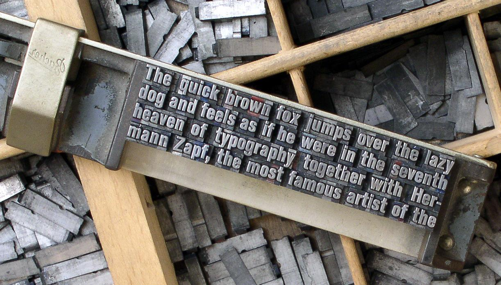
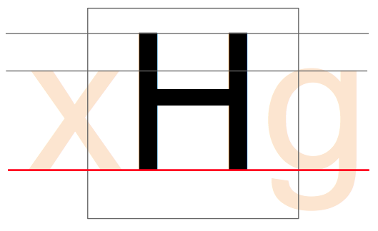

&mdash; Aussi appelée 'em size' ou 'UPM' en anglais.
Dans une police, chaque caractère est placé dans son propre espace défini. Dans la police
de métal traditionnelle cette espace était le bloc de métal réel de chaque caractère. La hauteur de
chaque morceau de caractère était uniforme, permettant aux caractères d'être rangés soigneusement
en rangées et en blocs (voir ci-dessous).

La hauteur d'une police est connue sous le nom de 'em' ou cadratin, et elle provient de la largeur du
caractère majuscule ‘M’; il a été fait en sorte que les proportions de cette lettre soit carrée
(d'où la dénomination 'cadratin').
La taille em est la taille de point sur laquelle une police de métal est calculée. Ainsi, une police de
10 points a une taille em de 10 points (voir ci-dessous).
 

Dans une police numérique, l'em est une quantité d'espace définie numériquement. Dans une police OpenType,
l'UPM &mdash; ou la taille em est généralement fixé à 1000 unités. Dans les polices TrueType, l'UPM est par
convention une puissance de deux, généralement définie à 1024 ou 2048.

Lorsque la police est utilisée pour définir le caractère, l'em est mis à l'échelle à la taille de point
souhaité. Cela signifie que, pour une police de 10 pt, les 1000 unités par exemple sont réduites à 10 pt.

Donc, si votre ‘H’ majuscule est de 700 unités de haut, il sera de 7 pt de haut sur une police de 10 pt.

### Mise en place dans la fenêtre de glyphes

En sachant que votre police utilise un UPM de 1000, 1024 ou 2048, vous devez configurer le dessin de vos
glyphes pour vous assurer que tous les aspects de votre police de caractères correspondent bien à ce carré UPM.

La taille du carré em peut être définie à partir de *Élément > Infos fonte&hellip;* puis cliquez sur
l'onglet Général et vous verrez le paramètre *EM*, lequel sera réparti entre les hauteurs *Ascendante* et
*Descendante*, les hauteurs respectives au-dessus et au-dessous de la ligne de base.

La ligne de base:

La hauteur de capitale:

La hauteur d'x:

Plus tard, lors de la conception de votre police, vous devrez définir les *Blue values* qui servent
pour les contours PostScript et également pour l'autohinter de FontForge &mdash; indépendamment des
contours sur lesquels vous travaillez.
Vous trouverez le paramètre dans *Élément > Infos fonte&hellip;*, sur l'onglet *Dictionnaire PS privé*.
FontForge peut d'abord deviner les valeurs en fonction de vos contours, mais vous devrez les modifier
vous-même pour régler les valeurs trop basses/trop hautes &mdash; mais nous sommes quelques chapitres en avance sur
ce concept (voir [“Création de ‘o’ et de ‘n’”]); apprenons d'abord FontForge et ses fonctionnalités de dessin.

[“Création de ‘o’ et de ‘n’”]: Creating_o_and_n.html
