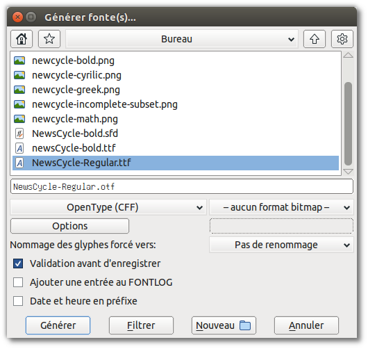
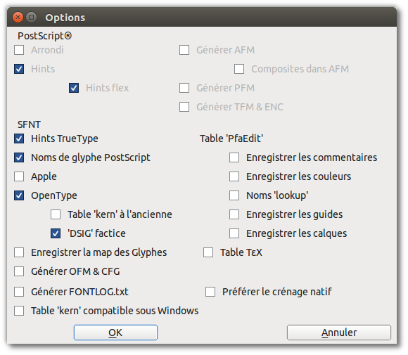

Bien que vous puissiez effectuer un large éventail de tests dans FontForge, vous devrez générer des fichiers de polices installables afin d'effectuer des tests réels pendant le processus de développement. En outre, votre objectif ultime est bien sûr de créer une police que vous pouvez rendre disponible dans un format de sortie pour d'autres personnes qui l'installeront et l'utiliseront. Vous utiliserez l'outil <em>Générer fonte(s)</em> (qui se trouve dans le menu Fichier) pour compiler une police utilisable, que ce soit pour vos propres tests ou pour publication au grand public. Mais vous devrez employer quelques étapes supplémentaires lors de la compilation du produit fini.

FontForge peut exporter vos polices vers différents formats, mais en pratique seulement deux sont importants: TrueType (qui a une extension de fichier <em>.ttf </em>) et OpenType CFF (qui a une extension <em >.otf </em>). Techniquement, le format OpenType peut englober toute une gamme d'autres options, mais le format CFF est celui qui est largement utilisé.

## Génération expéditive pour les tests

Pour construire un fichier de police à des fins de test &mdash; pour examiner l'espacement dans un navigateur Web par exemple &mdash; vous devez seulement vous assurer que votre police passe les tests de validation requis.

Vous pouvez utiliser l'outil <em>Validation</em> dans le menu Élément (voir le chapitre sur la validation des polices pour une explication plus détaillée) ou sélectionner tous les glyphes (appuyez sur <kbd>Ctrl</kbd> + <kbd>A</kbd> ou choisissez "Sélectionner" -&gt; "Tout sélectionner" dans le menu "Édition") puis exécutez quelques commandes pour appliquer des modifications de base en vrac. N'oubliez pas de sauvegarder votre travail avant de continuer. Cependant, certaines des modifications requises pour valider votre police pour l'exportation va modifier les formes de vos glyphes de façon subtile.

Pour les polices OpenType, corrigez d'abord la direction de tous vos chemins. Appuyez sur <kbd>Contrôle</kbd> + <kbd>Maj</kbd> + <kbd>D</kbd> ou choisissez "Corriger direction" dans le menu "Elément". Ensuite, vérifiez que vous n'avez pas laissé de chemins non fermés. Choisissez "Validation>Problèmes..." dans le menu «Elément», sélectionnez l'option <em>Chemins ouverts</em> dans l'onglet «Chemins» et cliquez sur OK pour lancer le test. Une fois que votre police passe le test sans erreurs, vous êtes prêt à générer une sortie OpenType.

Pour les polices TrueType, quelques étapes supplémentaires sont nécessaires. Vous devez d'abord corriger la direction de tous vos chemins comme décrit ci-dessus. Ensuite, ajustez tous les points pour qu'ils aient des coordonnées entières: soit appuyez sur <kbd>Ctrl</kbd> + <kbd>Maj</kbd> + <kbd>_</kbd> (soulignement), ou choisissez <em>à l'entier</em> dans le menu "Element" -&gt; "Arrondir". Enfin, ouvrez l'outil "Recherche de problèmes", sélectionnez le test <em>Chemins ouverts</em> comme décrit ci-dessus, puis sélectionnez tous les tests dans l'onglet "Références".

Afin que vous puissiez exécuter ces tests sans erreurs, vous devriez alors convertir vos chemins en courbes quadratiques. Ouvrez la fenêtre "Infos fonte" dans le menu "Élément". Cliquez sur l'onglet "Calques" et cochez l'option <em>Tous les calques quadratiques</em>. Cliquez sur OK en bas de la fenêtre et vous êtes prêt à générer une sortie TrueType.

### Compilation des fichiers de polices

Ouvrez la fenêtre <em>Générer fonte(s)</em> en la choisissant dans le menu "Fichier". La moitié supérieure de la fenêtre affiche des options familières de sélection de fichier, une liste des fichiers trouvés dans le répertoire courant, une zone de texte pour entrer un nom de fichier et des boutons pour naviguer vers d'autres dossiers et répertoires si nécessaire. C'est strictement un moyen pour vous aider à trouver rapidement le bon endroit pour enregistrer votre fichier de sortie, ou de choisir un fichier de police existant si vous avez l'intention de remplacer une sauvegarde précédente. Toutes les options que vous devez examiner se trouvent dans la moitié inférieure de la fenêtre.

Sur la gauche, un menu déroulant vous permet de sélectionner le format de la police que vous souhaitez générer. Vous devez choisir <em>TrueType</em> ou <em>OpenType (CFF)</em>, comme indiqué précédemment. Sur le côté droit, assurez-vous que <em>Aucun format Bitmap</em> est sélectionné. Sur la ligne en-dessous, assurez-vous que <em>Pas de renommage</em> est sélectionné pour l'option "Nommage forcé des glyphes vers:". Vous pouvez cochez l'option "Validation avant d'enregistrer" si vous le souhaitez (pour potentiellement attraper d'autres erreurs), mais cela est facultatif. Laissez les options "Ajouter une entrée au FONTLOG" et "Date et heure en préfixe" désactivées.

Cliquez sur le bouton "Générer", et FontForge va compiler votre fichier de polices. Vous pouvez charger la police dans d'autres applications et exécuter des tests, mais quand vous êtes prêt à revenir à l'édition, n'oubliez pas de rouvrir la version enregistrée de votre police que vous avez créée avant de générer votre <em>.ttf </em> ou <Em>.otf</em>.

## Génération de la version finale

La conception de votre police est un processus itératif, mais le jour viendra où vous devrez déclarer votre police terminée &mdash; ou au moins prête pour distribution au public. À ce stade, vous allez à nouveau générer un fichier de sortie .ttf ou .otf (peut-être même les deux), mais avant cela, vous devrez effectuer quelques étapes supplémentaires pour créer la version la plus conforme aux normes et la plus conviviale de votre fichier de police.

Tout d'abord, suivez les mêmes étapes de préparation que décrites dans la section sur la génération expéditive pour les tests. En particulier, n'oubliez pas de changer votre police à <em> Tous les calques quadratiques</em> si vous créez un fichier TrueType.

### Supprimer les chevauchements

Comme vous le savez, il est judicieux de conserver vos lettres sous forme de combinaisons de composants distincts que vous concevez: fûts, panses, empattements et autres morceaux de chaque glyphe. Mais bien que cette technique soit idéale pour la conception et le raffinage des formes, vous voulez que votre police finale et publiée ait des glyphes avec contours simples à la place. Cela réduit la taille du fichier un peu, mais surtout réduit les erreurs de rendu.

FontForge dispose d'une commande <em>Supprimer les recouvrements</em> qui combinera automatiquement les composants séparés d'un glyphe en un seul contour. Sélectionnez un glyphe (ou même sélectionnez tous les glyphes avec <kbd>Ctrl</kbd> + <kbd>A</kbd>), puis appuyez sur <kbd>Ctrl</kbd> + <kbd>Maj</kbd> + <kbd>O</kbd> ou choisissez Enlever les recouvrements dans le menu "Élément" -&gt; "Recouvrements". Cependant, une mise en garde: FontForge ne peut pas fusionner des formes si l'une des formes est tracée dans la mauvaise direction (c'est-à-dire si le chemin le plus à l'extérieur est dans le sens anti-horaire). Un chemin tracé dans la mauvaise direction est une erreur en elle-même que vous devriez réparer de toute façon.

### Simplifier les contours et ajouter des points extrema

Vous devriez également simplifier vos glyphes si possible &mdash; sans éliminer les détails, mais éliminer les points redondants. Cela réduit la taille de chaque glyphe, ce qui réduit considérablement la taille de l'ensemble des caractères de la police.

Dans le menu "Élément", choisissez "Simplifier" -&gt;<Em>Simplifier</em> (ou appuyez sur <kbd>Ctrl</kbd> + <kbd>Maj</kbd> + <kbd>M</kbd>). Cette commande fusionnera les points redondants sur la courbe dans tous les glyphes sélectionnés. Dans certains cas, seulement quelques points seront enlevés, dans d'autres il peut y en avoir beaucoup. Mais la simplification devrait se faire sans modifier sensiblement la forme des glyphes. Si vous constatez qu'un glyphe particulier <em>est</em> trop modifié par <em>Simplifier</em>, n'hésitez pas à annuler l'opération. Vous pouvez également expérimenter avec la commande <em>Simplifier d'avantage</em> située dans le même menu; elle offre des paramètres modifiables qui pourraient s'avérer utiles.

Dans tous les cas, après avoir terminé l'étape de simplification, vous devez ajouter tous les points extrema absents. Choisissez <em>Ajouter des extrema</em> dans le menu "Élément" (ou appuyez sur <kbd>Contrôle</kbd> + <kbd>Maj</kbd> + <kbd>X</kbd>). Comme indiqué précédemment, il est judicieux de placer des points sur courbe à l'extrémité de chaque glyphe durant sa création. Néanmoins, vous devriez tout de même effectuer cette étape lors de la préparation de la génération de sortie finale, car l'étape <em>Simplifier</em> éliminera occasionnellement un point extrema.

### Tout arrondir à des coordonnées entières

L'étape de préparation finale à exécuter consiste à arrondir tous les points (points de courbe et points de contrôle) à des coordonnées entières. Ceci est obligatoire pour générer une sortie TrueType, mais est également fortement recommandé pour la sortie OpenType. Il peut en résulter un rendu plus précis et un meilleur ajustement à la grille lorsque les polices sont affichées, sans effort de design supplémentaire.

Pour arrondir tous les points à des coordonnées entières, choisissez "Élément" -&gt; "Arrondir" -&gt; <Em>à l'entier</em>.

Dès que cette opération est terminée, vous pourriez remarquer quelque chose de déroutant. Parfois, simplement en raison des particularités des courbes impliquées, les processus d'arrondissement aux coordonnées entières, de simplification des glyphes et d'ajout d'extrema manquants peuvent être opposés. Cela peut se produire par exemple quand un bord extérieur incurvé a un point de contrôle qui se trouve juste devant l'horizontale ou la verticale. Dans cette situation, l'arrondissement à des coordonnées entières peut décaler la courbe légèrement et changer la position des extrema.

Il n'y a pas de solution unique à ce dilemme.  Le seul correctif garanti est de répéter le cycle d'étapes pour les glyphes affectés jusqu'à ce qu'ils se stabilisent à un point où les trois opérations n'interfèrent plus les uns avec les autres. Cela peut prendre plusieurs cycles, mais c'est rare.

### Valider

Votre police doit passer les tests de validation nécessaires avant de générer votre sortie finale. Comme dans le cas de l'étape de l'arrondissement des coordonnées à des entiers, les autres opérations préparatoires peuvent parfois introduire des erreurs.  Il est donc toujours judicieux d'exécuter le validateur de la police entière à ce stade avant de compiler la sortie finale. Le chapitre sur les outils de validation de FontForge vous donnera plus de détails sur ce qu'il faut vérifier.

### Un mot sur le hinting

Le hinting fait référence à l'utilisation d'instructions mathématiques pour afficher les courbes vectorielles dans une police de telle sorte qu'elles s'alignent bien avec la grille de pixels du dispositif de sortie (que cette grille soit composée de points d'encre ou de toner sur papier, ou luminescents sur un moniteur d'ordinateur).

FontForge vous permet d'ajouter des hints à votre police (et même fournit une fonction <em>Autohint</em>), mais en pratique cette étape n'est pas strictement nécessaire. Les systèmes d'exploitation modernes ont souvent une meilleure fonctionnalité d'ajustement à la grille dans leurs moteurs de rendu de texte que celle fournie par les hints que vous auriez créé avec beaucoup de temps et d'efforts. En fait, Mac OS X et Linux <em>ignorent</em> tous les hints incorporés dans le fichier de police. Si vous décidez que votre police requière du hinting pour les utilisateurs de Windows, il est préférable de construire la police sans hint, puis d'utiliser une application spécialisée telle que <strong>ttfautohint</strong> pour ajouter du hinting après le fait.

Pour le hinting CFF, consultez [cette vidéo](http://vimeo.com/38364880) d'Adobe chez RoboThon.

Configurer le hinting PS avec Python est possible: `private` est une liste de tuples (Merci [Sungsit](https://github.com/fontuni/boon/issues/26#issuecomment-157640491)!)

    font.private['BlueValues'] = (-20, 0, 600, 620, 780, 800, 810, 830)
    font.private['OtherBlues'] = (-225, -210)
    font.private['StdHW'] = 100,
    font.private['StdVW'] = 137,

### Vérifiez vos métadonnées

Enfin, une fois que votre police a été soigneusement préparée techniquement pour l'exportation, vous devriez prendre une pause et mettre à jour les métadonnées, en veillant à ce que des informations importantes soient incluses et à jour.

Tout d'abord, s'il s'agit de la version initiale de votre police, ouvrez la boîte de dialogue <em>Infos fonte</em> de la fenêtre "Élément" et sélectionnez l'onglet "Noms Postscript". Remplissez d'abord le nom de famille et la graisse de la fonte, puis copiez ces informations dans la case "Nom courant". Bien que l'utilisation de numéros de version ne soit pas nécessaire, il est extrêmement utile pour vous en tant que concepteur de différencier entre les différentes révisions de votre travail. Entrez "1.0" comme numéro de "Version" si vous n'êtes pas sûr. Ensuite, visitez l'onglet "Noms TTF" et entrez les mêmes informations.

Comme c'est le cas pour les numéros de version, il est utile, à long terme, de créer des entrées de journal pour chaque révision. Allez dans l'onglet "FONTLOG" et écrivez une ou deux phrases pour expliquer les changements éventuels dans la révision que vous créez pour distribution. Si c'est votre première entrée de journal, vous devriez également décrire votre fonte et son but dans une phrase ou deux.

Les polices, comme toutes les œuvres de création, doivent disposer d'une licence, afin que les utilisateurs sachent ce qu'ils sont et ne sont pas autorisés à faire. FontForge a un bouton dans l'onglet "Noms TTF" appelé "Ajouter Open Font License". La licence Open Font (OFL) est une licence de police conçue pour vous permettre de partager votre police avec le public avec très peu de restrictions sur la façon dont elle est utilisée, tout en vous protégeant en tant que concepteur d'autres prenant le crédit pour votre travail ou des dérivés créatifs de votre police qui seront confondus pour l'original. Cliquez sur le bouton pour ajouter les chaînes "Licence" et "URL de la licence" aux métadonnées des noms TTF. Si vous avez une autre licence que vous préférez utiliser au lieu de l'OFL, saisissez-la dans le champ "Licence" à la place.

Si vous avez apporté des modifications importantes à d'autres fonctionnalités de votre police, il est judicieux de vérifier les autres paramètres dans la fenêtre Infos fonte et de vous assurer que tout est toujours à jour. Les informations d'espacement linéaire, par exemple, se trouvent dans l'onglet "OS/2" sous "Métriques".

### Compilation des fichiers de polices

Le processus de génération des fichiers de police est le même lorsque vous créez la version finale comme c'est le cas lorsque vous créez une copie expéditive pour le test, mais vous voudrez accorder une plus grande attention à certaines des options.

Ouvrez la fenêtre <em>Générer fonte(s)</em> en la choisissant dans le menu "Fichier". Encore une fois, la moitié supérieure de la fenêtre vous permet de choisir le répertoire et le nom du fichier à donner à votre fichier de sortie &mdash; faites attention de ne pas écraser une sauvegarde précédente.

Dans le menu déroulant de gauche, sélectionnez le format de la police que vous générez, <em>TrueType</em> ou <em>OpenType (CFF)</em>, comme indiqué précédemment. Sur le côté droit, assurez-vous que <em>aucun format Bitmap</em> est sélectionné. Sur la ligne en-dessous, assurez-vous que <em>Pas de renommage</em> est sélectionné pour l'option "Nommage des glyphes forcé vers:". Vous pouvez cocher l'option "Validation avant d'enregistrer" si vous le souhaitez (pour potentiellement attraper d'autres erreurs), mais cela est facultatif. Laissez les options "Ajouter une entrée au FONTLOG" et "Date et heure en préfixe" désactivées.

Ensuite, cliquez sur le bouton "Options". Sélectionnez les options <em>Noms de glyphe Postscript</em>, <em>OpenType</em> et <em>DSIG factice</em> dans la fenêtre qui s'affiche et désélectionnez tout le reste.

Cliquez sur le bouton "Générer", et FontForge va compiler votre fichier de polices. Un dernier mot: il est important de ne pas écraser la version sauvegardée de votre travail dans FontForge avec les modifications que vous avez apportées dans cette section uniquement pour générer votre sortie <em>.ttf</em> ou <em>.otf</em>. Par exemple, vous perdez beaucoup de composants de glyphes individuels lorsque vous effectuez l'opération <em>Supprimer les recouvrements</em>. Mais la prochaine fois que vous reprendrez le travail sur votre police, vous voudrez certainement reprendre où vous avez laissé dans la version originale, la version remplie de glyphes avec composants individuels.

Par conséquent, si vous décidez d'enregistrer la version modifiée de votre fichier FontForge, assurez-vous que vous la renommez de manière mémorable, comme <em>MaPolice-TTF.sfd</em> ou <em>MaPolice-OTF.sfd</Em>. Mais vous n'avez pas forcément besoin de sauvegarder ces variations faites pour la sortie de votre fichier &mdash; en pratique, la prochaine fois que vous réviserez votre travail original dans FontForge, vous travaillerez de nouveau à la préparation de la sortie.

Félicitations! Vous avez maintenant créé votre première police. Tout ce qui vous reste à faire désormais est de partager votre travail: le télécharger sur le web, l'afficher sur votre blog, et le dire à vos amis.

Sans doute, vous reviendrez et continuerez à réviser et à affiner votre police de caractères &mdash; après tout, comme vous l'avez vu, le design des polices est un processus très itératif. Mais assurez-vous de faire une pause et de profiter de ce que vous avez accompli d'abord.

