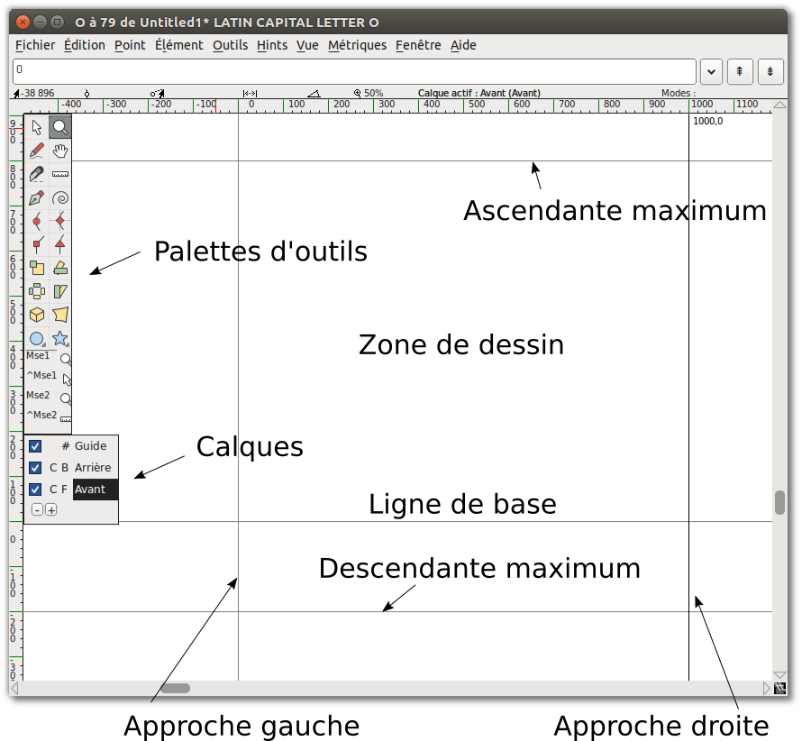
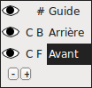
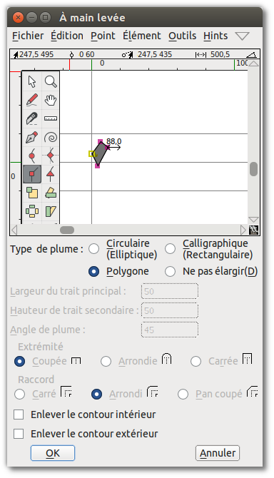

Concevoir une police dans FontForge impliquera l'utilisation d'un certain nombre d'outils et
d'utilitaires, en commençant par un ensemble d'outils de dessin qui peuvent être familier aux
utilisateurs ayant de l'expérience avec des graphiques vectoriels &mdash; bien qu'il y ait des
différences notables.
Nous chercherons d'abord à comprendre comment les courbes de B&eacute;zier fonctionnent, avant
de regarder les outils de dessin FontForge eux-mêmes.

## Comprendre les courbes de B&eacute;zier

Les "courbes de B&eacute;zier" sont une représentation mathématique particulière utilisée pour produire
des courbes lisses numériquement. Généralement, les ordres *cubiques*- et *quadratiques*- de ces courbes
sont employés &mdash; bien que FontForge supporte également les courbes de *Spiro* qui sont une
représentation alternative pour le concepteur.

Dans ce chapitre, nous ne discuterons que des chemins *cubiques*, car c'est ce qui est généralement
utilisé lors du dessin des glyphes. Les chemins *Spiro* seront discutés dans le chapitre suivant et
les courbes *quadratiques* ne se retrouvent que dans les polices TrueType et sont rarement utilisées
dans le dessin &mdash; elles sont plutôt générées au moment de la construction.

Un chemin typique de B&eacute;zier est composée d'une ancre, avec deux poignées qui marquent la
direction globale &mdash; la longueur de chaque poignée détermine la longueur de la courbe de chaque
côté &mdash;voir ci-dessous.

### Différents types de points

#### Points curvilignes (Représentés sous forme de points ronds)

Les *points curvilignes* ont deux poignées, chacune étant liée à l'autre de sorte que la ligne entre
elles reste toujours droite, afin de produire une courbe lisse de chaque côté.
 

<h4 class="quiet">Points curvilignes H/V (Représentés sous la forme de points en forme de losange)</h4>

Les *points curvilignes H/V* (‘horizontal/vertical’) sont une variante de points curvilignes qui
s'accrochent à l'axe horizontal ou vertical &mdash; un outil essentiel pour obtenir des formes de Bézier
correctes (plus de détails dans la section suivante).

#### Coins ou points angulaires (représentés par des points carrés)

Les *coins* peuvent avoir 0, 1 ou 2 poignées de Bézier. La position de chaque poignée est
indépendante des autres, ce qui la rend apte à des discontinuités dans le contour.
Sans poignées, ces points produiront des lignes droites.

#### Points tangents (représentés par des points triangulaires ou des ‘pointes de flèches’)

Si vous voulez commencer à partir d'une ligne droite, puis commencer à arrondir en douceur, vous voudrez
utiliser des *points tangents*.
Une *tangente* laisse une ligne droite d'un côté, tandis que la poignée de B&eacute;zier de l'autre côté
est sa direction &mdash; ceci assure une transition continue entre la ligne et la courbe.

### Faire les bons choix

Afin de produire des courbes appropriées &mdash; avec points de contrôle minimaux et une rastérisation
facilitée, les ancres doivent toujours être placés aux **extrema de la courbe**, et sauf dans les endroits
où vous avez des angles dans la forme de vos lettres, la ligne qui détermine le chemin doit être **horizontale
ou verticale**.

<b>Remarque:</b> Si vos points de contrôle ne sont pas placés aux extrema, FontForge signalera les extrema
réels avec une icône de mire:

Vous pouvez alors corriger ce problème en copiant votre contour actuel vers un autre calque, puis déplacer
les points de contrôle autour de sorte que le contour soit bien tracé &mdash; sinon l'outil de validation de
FontForge ajoutera automatiquement le point aux extrema. Vous pouvez fusionner l'ancre mal placée de ce point avec
<I>bouton droit > Fusionner </i>.  
Plus d'informations à ce sujet seront données dans le chapitre sur la validation
.

Pour élaborer, il y a deux cas où vous devrez renoncer à des chemins de B&eacute;zier horizontaux et verticaux:

- Si vous voulez changer la pente globale de votre courbe, comme avec la partie supérieure gauche du ‘a’
  ci-dessous qui est maintenu presque plat:
  
- Si vous voulez placer des angles dans vos lettres, comme dans la partie inférieure gauche du ‘g’ ci-dessous
  &mdash; c'est généralement où vous voulez utiliser un *coin* (à part pour dessiner des lignes):
  

<b>Remarque:</b> Comme vous pouvez le constater, lors de l'ajout d'angle avec un <i>coin</i>, la
direction de chaque poignée doit être tangente à la courbe où elle arrive.

## Maîtriser les outils de dessin de FontForge

Dans la fenêtre principale, double-cliquez sur l'une des cases de glyphe pour lancer la fenêtre de glyphe.

<b>Remarque:</b> Les nombres sur le haut où se croisent les axes x et y, de gauche à droite indiquent:

<ul>
<li>L'emplacement actuel (x, y) de votre curseur sur le canevas</li>
<li>L'emplacement du dernier point sélectionné</li>
<li>La position relative du curseur sur le point sélectionné</li>
<li>La distance entre votre curseur et le point sélectionné</li>
<li>L'angle du point sélectionné au curseur (par rapport à la ligne de base)</li>
<li>Le niveau de grossissement actuel, suivi du nom du calque actif.</li>
</ul>

<b>Mise en garde:</b> Parfois, il semble que FontForge ne répond pas lorsque vous êtes à l'intérieur
de la fenêtre de glyphe. Il se peut qu'il y ait une boîte de dialogue ouverte cachée derrière &mdash; il suffit
de la déplacer et de fermer la boîte de dialogue.

Une *ligne* se compose de 2 points.

Une courbe ou *spline* se compose de 4 points: 2 points à l'extrémité de la spline et 2 ‘poignées’, qui décrivent
la pente de la spline à ces points d'extrémité.

### Copier, coller, couper et supprimer des points, des splines et des lignes

Comme pour la plupart des logiciels de dessin, FontForge vous permet de copier, couper, coller ou supprimer n'importe
quel point, ligne ou spline. Ces commandes sont disponibles dans le menu Édition, ou en utilisant les touches typiques
de votre système d'exploitation (également affichées à côté de chaque commande dans le menu).

## Familiarisez-vous avec les outils de dessin

Maintenant que vous connaissez votre chemin autour de la zone de travail, il est temps de se familiariser avec les
outils.

### Pointage et Zoom

Le pointage et le zoom se comportent de la même manière que les outils équivalents dans d'autres applications.
Le pointeur est un outil de sélection, utilisé pour sélectionner des points, des chemins et d'autres objets sur le canevas.
L'outil Zoom vous permet de zoomer (Z) facilement; pour effectuer un zoom arrière: allez dans le menu Vue et sélectionnez
*Réduire* (X) ou *Adapter*.

Notez que vous pouvez également passer momentanément à l'outil de pointeur tout en utilisant un autre en maintenant
enfoncée la touche <kbd>Ctrl</kbd>.

### Dessin à main-levée

L'outil de dessin à main-levée vous permet d'esquisser des tracés irréguliers.

Sur la zone de dessin, cliquez et maintenez, puis déplacez-vous pour dessiner. Retournez à l'outil pointeur, et
vous pouvez sélectionner des points sur le chemin que vous avez dessiné.

Lorsque vous sélectionnez un des points sur le chemin, il se transforme en un cercle jaune. Si le point sélectionné
est sur une courbe, il affichera ses points de contrôle avec une poignée magenta et une poignée cyan. Vous pouvez
saisir n'importe quelle poignée et la faire glisser pour modifier la forme de la courbe.

### Les outils point

Expliquons maintenant l'utilisation des outils point.

Pour ajouter un point à un chemin, sélectionnez tout d'abord un de ces outils, puis cliquez sur le chemin
et donnez-lui une petite poussée. Vous obtiendrez un nouveau point sur la ligne.

L'outil point courbe permet d'ajouter un point dans un segment incurvé.
L'outil point courbe HV limite les nouveaux points afin qu'ils aient des points de contrôle horizontaux ou
verticaux &mdash; Ceci est important pour la mise en place de points aux extrema.
L'outil point de coin vous permet de faire un virage serré dans le chemin.
L'outil point de tangente vous permet de passer d'un segment droit à un segment courbe le long du chemin.

### La plume (courbes interactives)

L'outil plume vous permet d'ajouter un point sur la courbe et de faire glisser ses points de contrôle.

### Spiro

La sélection de l'outil Spiro vous place en mode de dessin Spiro. Ce mode vous permet de dessiner des
courbes qui refondent lorsque vous repositionnez les nœuds. Certaines personnes préfèrent cette méthode
à l'approche standard (connue sous le nom d'édition Bézier), mais si vous êtes habitué à l'édition
Bézier vous trouverez peut-être que cela mène à des choses inattendues.

### Le couteau

L'outil couteau vous permet de couper les splines en deux. Cela est pratique si vous avez dessiné une
forme et que vous avez seulement besoin d'une partie de celle-ci.

### La règle

L'outil règle vous donne des informations de mesure et de coordonnées. Lorsque vous l'utilisez, il
affiche une info-bulle flottante à côté du curseur. Si vous placez votre curseur sur un point,
l'info-bulle vous donne des informations de mesure et de coordonnées encore plus détaillées. Si vous
la placez à côté d'une spline, il vous donne des informations sur la courbure et le rayon. Le plus
utile, si vous cliquez et faites glisser l'outil règle, vous verrez la distance de déplacement du
curseur, plus chaque intersection que vous avez tendu à travers.

### Les outils de transformation

Il y a six outils de transformations:

**Remarque:** Pour plusieurs outils de transformation, si vous double-cliquez sur l'outil, vous pouvez
saisir des valeurs numériques.

L'outil échelle vous permet de redimensionner un objet à la main. Maintenir la touche <kbd>Maj</kbd> enfoncée
vous permet d'augmenter l'échelle d'un objet tout en le conservant ses proportions.

L'outil rotation vous permet de tourner librement un objet. Il tourne l'objet sélectionné autour de
la position où vous avez cliqué.

L'outil symétrie vous permet de retourner une sélection à l'horizontale ou à la verticale. Le point
auquel vous cliquez sur le canevas est le point d'origine de la transformation.

**Remarque:** Après avoir inversé un point, vous voudrez probablement appliquer Élément &gt; 
*Corriger direction*.

L'outil inclinaison vous permet d'incliner horizontalement la sélection dans le sens des aiguilles
d'une montre ou dans le sens inverse des aiguilles d'une montre.

L'outil de rotation 3D vous permet de faire pivoter un objet dans la troisième dimension et de
projeter le résultat sur le plan x-y.

L'outil Perspective vous donne une autre façon de déformer une forme de façon non linéaire.

**Remarque:** Il n'y a pas d'option numérique pour la transformation en perspective.

### Les outils rectangle/ellipse et polygone/étoile

Ces outils vous permettent de dessiner des formes géométriques de base, ce qui est plus rapide
que de construire ces formes à partir de segments de ligne distincts.

En cliquant sur la zone de chevron sur ces outils vous aurez la possibilité de passer à un
autre outil. Si vous double-cliquez sur l'un des outils, vous afficher les options relatives
à la forme.

Options de rectangle: style de coin et boîte englobante (coin ou centre).

Options d'ellipse: boîte englobante ou autour du centre.

Options de polygone: nombre de sommets.

Options d'étoiles: nombre de pointes d'étoiles et profondeur des pointes en pourcentage. Plus le
pourcentage est élevé, plus les branches de l'étoile sont longues.

### Mse1 et Mse2

Sous la palette d'outils, vous pouvez afficher l'outil actuel et les opérations disponibles pour les
deux boutons de la souris:

- Bouton gauche (Mse1)
- Bouton gauche + <kbd>Ctrl</kbd> (^ Mse1)
- Bouton de la molette de la souris (Mse2)
- Bouton de la molette de la souris + <kbd>Ctrl</kbd> (^ Mse2)

De cette façon, vous pouvez utiliser quelques outils différents sans avoir à cliquer à plusieurs
reprises sur la palette d'outils.
 

<b>Attention:</b> Il semble que la fonctionnalité Mse ne fonctionne pas correctement.

### Calques

Le canevas de FontForge a trois calques par défaut: le calque guide, le calque d'arrière-plan et le
calque d'avant-plan. Les calques guide sont utilisées pour insérer des guides (tels que des guides de
hauteur d'x ou de hauteur de capitale). Les calques d'avant-plan et les calques d'arrière-plan sont
tous les deux utilisées pour le dessin, mais seule le calque de premier plan le plus élevé sera
rendu dans votre police finale.

Une case à cocher indique si un calque est visible, et vous pouvez cliquer dessus pour changer 
la visibilité. Le C (ou Q) indique si vous utilisez des courbes cubiques ou quadratiques.

Le #, B ou F indique si le type de calque est guide, d'arrière-plan ou d'avant-plan, ce qui est
important si vous ajoutez des calques supplémentaires. Vous pouvez créer et supprimer des calques
supplémentaires à l'aide des boutons plus (+) ou moins (&minus;) dans cette section de la palette
d'outils. Le type de calque et le type de courbe peuvent également être contrôlés en cliquant avec
le bouton droit (une fois que vous avez ajouté des calques supplémentaires).

## Dessin de base

Maintenant, examinons quelques workflows de dessin de base, dont vous aurez souvent besoin.

### Couper une forme dans une autre

1. Commencez par utiliser l'outil rectangle pour dessiner un rectangle dans la zone de dessin de
   la fenêtre de glyphe.
2. Ensuite, utilisez l'outil ellipse pour dessiner une ellipse dans le rectangle que vous venez de
   dessiner.
    
3. Allez dans le menu Élément et choisissez *Corriger direction*. Vous verrez que les deux formes
   se sont fusionnées, et que vous avez essentiellement percé un trou dans le centre du rectangle.
   

### Supprimer le chevauchement

1. Ajoutez une étoile qui chevauche le coin du rectangle.
    
2. Sélectionnez l'étoile et la forme précédente. Il vous suffit de sélectionner un point de chaque
   forme chevauchante, mais il est acceptable de sélectionner des points supplémentaires.
3. Allez à Élément &gt; Recouvrement &gt; *Enlever les recouvrements*. Vous verrez que vos deux
   formes sont devenues une seule.
   

### Ajouter un point

À l'aide de l'outil plume, cliquez et maintenez au milieu d'un segment de ligne, puis faites glisser
la souris pour changer la forme.

### Points tangents

Sélectionnez le coin inférieur gauche de votre nouvelle forme (l'intersection de la courbe et de la
droite). Dans le menu Point, vous verrez que *point angulaire* est coché. Sélectionnez *Convertir
en point tangent*. Cela change le nœud carré en triangle, mais c'est tout ce que ça fait jusqu'à ce
que vous fassiez l'étape suivante:
Extension des points de contrôle.

Pour ce faire, choisissez Élément &gt; *Infos...*, qui ouvre la fenêtre Infos points. Dans l'onglet
Emplacement de cette fenêtre, accédez au champ PdeC suivant et définissez une grande distance, par
exemple 75. Cliquez sur OK. Vous verrez que la courbe se poursuit maintenant doucement dans la droite.

### Transformation

Maintenant, sélectionnez environ un quart de la forme &mdash; l'étoile et une partie de l'ellipse au
milieu.

Choisissez l'outil Rotation 3D, déplacez-vous au milieu de la zone sélectionnée, puis cliquez lentement
et faites glisser jusqu'à ce que vous voyiez quelque chose que vous aimez, puis relâchez. Voici un exemple
de rotation 3D utilisé sur l'image de pratique:

### Définir la forme et la largeur du trait

Jusqu'à présent, vous avez utilisé l'outil de dessin à main levée pour tracer une ligne. Si vous
double-cliquez sur l'outil de dessin à main levée, vous obtenez la boîte de dialogue à main levée
illustrée ici, qui contient une fenêtre de dessin. C'est là que vous sélectionnez la forme et la
taille de la plume. Cette boîte de dialogue apparaît également lorsque vous choisissez l'option
*Étendre ligne* dans le menu Élément.

À l'aide de l'outil point de coin, dessinez un polygone et cliquez sur OK.

Maintenant, tracez une ligne avec l'outil de dessin à main levée. Lorsque vous relâchez le bouton de
la souris, le nouveau chemin est automatiquement tracé avec la forme que vous avez choisie dans la boîte
de dialogue à main levée, comme montré ici.

## Continuez à dessiner!

Vous devriez continuer à expérimenter avec les outils de dessin jusqu'à ce que vous vous sentiez à
l'aise pour dessiner et transformer toutes les formes dont vous avez besoin. À ce stade, vous êtes
équipé pour commencer à construire les composants des glyphes, mais vous devriez également prendre le
temps de regarder les autres ensembles d'outils de FontForge.
Le chapitre suivant, ["Dessin avec Spiro"], décrit le mode de dessin Spiro. Le dessin Spiro est
assez différent de l'édition de courbes de  B&eacute;zier qu'il nécessite ses propres explications.

["Dessin avec Spiro"]: Drawing_With_Spiro.html

# Lectures complémentaires (en anglais)

A [TypeDrawers Forum Discussion on Beziers](http://typedrawers.com/discussion/967) incluant ces liens partagés par Nina Stössinger <a href="https://twitter.com/ninastoessinger/status/593687255341998080">sur twitter</a>:

* [Bezier Curves and Type Design: A Tutorial](http://learn.scannerlicker.net/2014/04/16/bezier-curves-and-type-design-a-tutorial/) par Fábio Duarte Martins
* [So What’s the Big Deal with Horizontal &amp; Vertical Bezier Handles Anyway?](http://theagsc.com/community/tutorials/so-whats-the-big-deal-with-horizontal-vertical-bezier-handles-anyway/)
* [Hand Lettering: How to Vector Your Letterforms](http://design.tutsplus.com/tutorials/hand-lettering-how-to-vector-your-letterforms--cms-23248) par Scott Biersack
* [Type Basics](http://typeworkshop.com/index.php?id1=type-basics&amp;id2=&amp;id3=&amp;id4=&amp;id5=&amp;idpic=15#pictloader) par Underware
* [The Bézier Game](http://bezier.method.ac) par Marc MacKay
