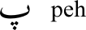
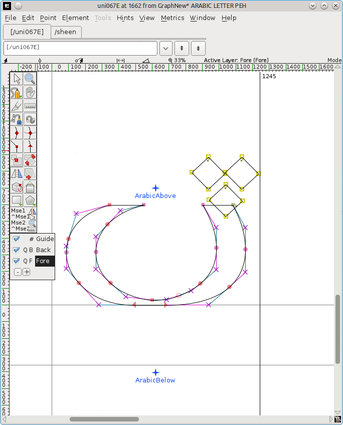
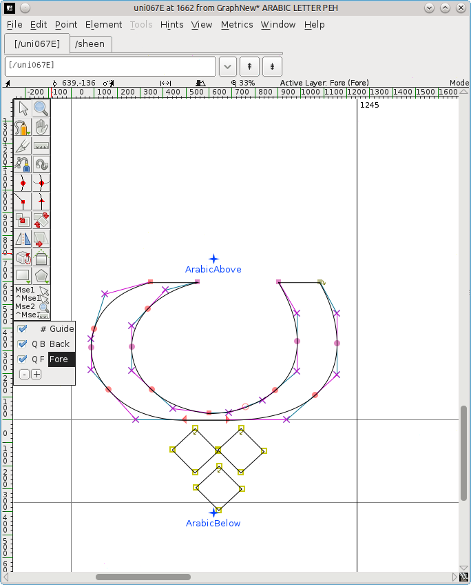
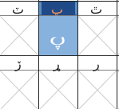
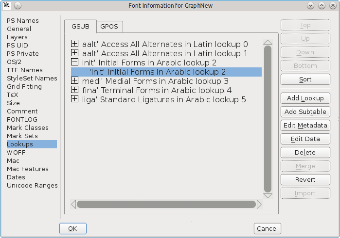
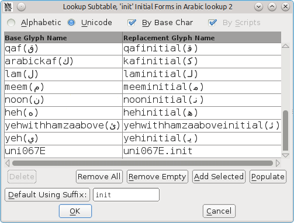

## はじめに

アプリケーションでフォントを利用する際に、必要なグリフが欠けていることがあります。アラビア語フォントでは、ここで特別な問題が発生します。アラビア文字のグリフの形状は単語内の位置だけでなく、文字自体の属性にも依存するためです。これを意味のない文字列 babab で説明すると、文字 **beh** は、最初に来るか（語頭形）、途中に来るか（語中形）、最後に来るか（語尾形）によって三つの異なる形状になります。しかし、文字順 dadad の場合には、単語のどこに出現しても、**dal** という文字の形一つだけになります。

オープン・ライセンス（たとえば、 [GPL](http://gnu.org/copyleft/gpl.html) や [OFL](http://scripts.sil.org/OFL-FAQ_web)）のフォントでは、ユーザーによる改変が許されています。もともとオープン・ライセンスの下にあったフォントを改変して配布する場合は、元の作者の著作権表示とライセンス情報を保持する必要がありますが、あなたの行なった改善点部分に何する内容を著作権表示の最後に追加することはできます。

 

この章では、アラビア語のフォントにグリフを追加する方法について説明していきます。使用するフォントは [Graph](http://openfontlibrary.org/en/font/graph) というもので、追加するグリフは **peh** (U+067E) です。これはアラビア語自体には存在しませんが、アラビア文字が使用される一部の言語では **p** を指します。（アラビア文字で使用できるグリフの完全なリストについては、[Unicode charts](http://www.unicode.org/charts) を参照してください。）

## フォントの作業用コピーを作成する

このフォントを Web ページからダウンロードして解凍します。FontForge を起動し、フォントを読み込み,
これを sfd ファイルとして保存します。保存する前に、提示された名前を **GraphNew.sfd** というフォント名に変更します。

## フォント名の変更

### なぜフォント名の変更が必要なのか？

もしフォント名を変更しないと、あなたが改変したフォントは元のフォントと共にはインストールできません。最初に元のフォントをアンインストールする必要があります。改変版フォントを配布するつもりであれば、フォント名を変更することも賢明です。フォントの元の作成者が「予約フォント名（RFN）」の仕組みに基づいてフォント名を予約している場合は、フォント本来の名前は元の作成者によるフォントにしか使用できません。

### フォント名のデータを変更する

メニュー項目から「**エレメント**」⇒「**フォント情報**」を選択して、「PS Name」の項で表示される「フォント名」「ファミリー名」「表示用の名前」を「**GraphNew**」に変更します。
Select **Element > Font Info**, and in the *PS Names* panel, change *Fontname*, *Family Name*, and *Name For Humans* to **GraphNew**.

必要に応じて、「著作権」の欄に既に記載されている内容の後に「追加グリフの作成者」としてのメモを追記できます。

「TTF 名」の項では、「ファミリー」と「フルネーム」の名前が「PS Names」にある項目から取得され、すでに **GraphNew** が表示されているはずです（これらを直接編集することはできません）。「Preferred Family」と「Compatible Full」欄の内容を GraphNew に変更します。 これらの名前変更により、必要に応じて、このフォントを元のフォントと一緒にインストールできるようになります。

必要に応じて、「デザイナー」用の欄に既に記載されている内容の後に「追加グリフの作成者」としてのメモを追記できます。

「**OK**」ボタンをクリックして、変更内容を保存します。このフォントに新たに「UniqueID（XUID）」を生成しますかというメッセージが表示されますので、「**変更**」をクリックします。

## *peh* 分離形のグリフを追加する

フォント一覧表のアラビア語セクションに移動します。「**表示**」⇒「**移動**」を選択し、ドロップダウン・ボックスから「**Arabic**」（アラビア語）を選んで、「**OK**」ボタンを押します。

フォント一覧表のセルをクリックすると、その Unicode 番号とフォント名がパネルの上部に青色で表示されます。セル番号 1662 に移動すれば、 *1662 (0x67e) U+067E "uni067E" ARABIC LETTER PEH* のように青色で表示されます。「参照用グリフ見出し」の下にあるセルは灰色の交差する斜線が表示されており、フォントにグリフが含まれていないことを示しています。

*beh*（U+0628）をコピーし、その一つのドットを三点ドットに置き換えて、*peh* を作成します。

*beh* のセル（位置 1576）をクリックし、続いて右クリックして **コピー** を選択します。次に、*peh* セルを右クリックし、**貼り付け** を選択します。*beh* が *peh* セルにコピーされたので、次はドットの変更を行ないます。

三点ドットを持つグリフを見つけます。*sheen*（位置 1588、U+0634）で間に合うでしょう。セルをダブルクリックして、アウトライン・ウィンドウ（グリフ・デザイン・パネル）を開きます。<kbd>V</kbd> を押してツールボックス内のポインタ・ツール（矢印）が選択されていることを確認し、<kbd>Z</kbd> を押してパネル表示を拡大すると、グリフがよく見えるようになります。

クリック＆ドラッグして上の三点点を選択すると、そのノード（線の結節点）の色がピンクからベージュに変わります。誤って他のノードを含めたり必要なノードを除外してしまった場合には、<kbd>Shift</kbd> を押しながらクリックしてそのようなノードの選択または解除を行ないます。<kbd>Alt</kbd> ＋ <kbd>C</kbd> を押すと選択したグリフの部分がコピーされます。

フォント一覧表に戻り、*peh* のセルをダブルクリックします。これにより、*peh* がアウトライン・ウィンドウ（グリフ・デザイン・パネル）の *sheen* タブの隣にある別のタブにロードされます。

クリック＆ドラッグして *peh* の下の点を強調表示し、<kbd>Delete</kbd> を押します。<kbd>Alt</kbd> ＋ <kbd>V</kbd> を押して、*peh* のグリフ本体の上に表示される三点ドットを貼り付けます。各ドットのノードは強調表示したままにし、より簡単に反転・移動できるようにしておきます。

ドットを反転： ツールボックスから「[反転ツール](../ja-JA/Using_the_Fontforge_Drawing_Tools.md#変形ツール)」（Flip tool、赤い破線の左右に並んだ二つの三角形ポインタが表示されます）を選択します。（あるいは、ドット・グリフの中央を右クリックし、ポップアップ・メニューから 「**選択範囲を反転**」を選択します。）ドットのノードの一つをクリックし、マウスをわずかに左または右にドラッグします。

反転ドットの移動： <kbd>V</kbd> を押して、もう一度ポインタ・ツールを選択し、ドットのノードの一つをクリック、そしてドットをグリフ本体の下にドラッグします。中央の *ArabicBelow* マークの上に配置します。

アウトライン・ウィンドウ（グリフ・デザイン・パネル）を閉じます。 これで、フォント一覧表に *peh* の新しいグリフが表示されるはずです。 改変したフォントを保存します （「**ファイル**」⇒「**保存**」）。

## *peh* の接続形グリフを追加する

しかしながら、この形はグリフの分離形（単独型）に過ぎません。もしこの改変したフォントを利用した場合、語頭形、語中形、語尾形がないことに気付くでしょう。この三形態は別々に作成しなければなりません。

> 「この（これらの）形態は符号化（encode）されていないグリフとして作成されます（FontForge の慣習では〔unicode コードポイントの代わりに〕「-1」のように表記するグリフのことです《[参考](../ja-JA/Importing_Glyphs_from_Other_Programs.md#個人用グリフ・リスト)》）。したがって、これらには事前に割り当てられたフォント枠がありません。」（Khaled Hosny ― エジプトの書体デザイナー）

メニュー項目の「**エンコーディング**」⇒「**エンコーディングスロットを追加**」を選択し、必要なグリフの数を入力します。今回の場合は「3」です。FontForge はフォント一覧表の最後に同じ数のスロット（フォント枠）を追加し、そこに移動します。最後の三つのセル（位置番号 65537、65538、65539）には「参照用グリフ見出し」として「疑問符」が表示されます。上述の手順を繰り返してエンコードされていない（フォント番号のない）グリフをこれらのセルに追加します。

【注意】 フォント一覧表にフォーカスがあるときに誤って入力を開始すると、一覧表上部のヨーロッパ語セクションに移動してしまうことに注意してください。最下部に戻るには「<strong>表示</strong>」⇒「<strong>移動</strong>」を選択し、ドロップダウン・ボックスから「<strong>Unicode 文字ではない</strong>」を選択して、「<strong>OK</strong>」をクリックします。

### 「語尾形」を作成する

アラビア語グリフのセットが表示される 65152 (U+FE80) 以降の位置まで、フォント一覧表を少し上に移動します。
U+FE90 (位置 65168) に、*behfinal* グリフがありますので、それをクリックし、<kbd>Ctrl</kbd> ＋ <kbd>C</kbd> を押してコピーします。 一覧表の最後から三番目のセル（位置 65537）まで戻り、そのセルをクリック後、<kbd>Ctrl</kbd> ＋ <kbd>V</kbd> を押して *behfinal* のグリフを貼り付けます。

セルを右クリックし、「**グリフ情報**」を選択します。 命名規則では、「分離形グリフの番号 ＋ 字形の接尾辞」を使用することになっているため、「**グリフ名**」を **uni067E.fina** に変更し、「**OK**」 をクリックします。 これで、セルの「参照用グリフ見出し」の疑問符が *peh* に変わります。

「三点ドット」グリフの取得：　*sheen*（U+FEB5）をダブルクリックしてアウトライン・ウィンドウ（グリフ・デザイン・パネル）にロードし、「三点ドット」を選択して <kbd>Ctrl</kbd> ＋ <kbd>C</kbd> を押します（コピー動作）。

*pehfinal* をダブルクリックしてアウトライン・ウィンドウ（グリフ・デザイン・パネル）にロードし、クリック＆ドラッグしてドット〔グリフ下の一点ドット〕のノードを強調表示し、<kbd>削除</kbd> を押します。

続いて <kbd>Ctrl</kbd> ＋ <kbd>V</kbd> を押して *sheen* からコピーした「三点ドット」を挿入し、反転して、グリフ本体の下の位置に移動します。<kbd>Ctrl</kbd> ＋ <kbd>S</kbd> を押して、変更したフォント一覧表を保存します。

### 「語頭形」と「語中形」を作成する

「語頭けい」U+FE91（位置 65169）を最後から二番目のセル（位置 65538）にコピーし、一点ドットを削除して三点ドットを貼り付けます。

そのセルを右クリックして、「**グリフ情報**」を選択し、「グリフ名」を「**uni067E.init**」に変更した後、「**OK**」ボタンをクリックします。

「語中形」U+FE92（位置 65170）を一番最後のセル（位置 65539）にコピーし、一点ドットを削除して三点ドットを貼り付けます。

そのセルを右クリックして、「**グリフ情報**」を選択し、「グリフ名」を「**uni067E.medi**」に変更した後、「**OK**」ボタンをクリックします。

「**File**」メニューから「**Save**」を選択して変更したフォント一覧表を保存します。

## 検索を追加する

分離形は、分離されたフォームは、その「語頭形」、「語中形」、「語尾形」に紐付け（マッピング）されている必要があります

「**エレメント**」メニューから、「**フォント情報**」⇒「**Lookups**  (検索)」を選択します。

「*'init' Initial Forms in Arabic lookup 2*」（［語頭］アラビア語の語頭形検索）という項目の先頭にある **＋** をクリックします。 これにより、同じ名前のサブメニューが開きます。 このサブメニューをクリックします。

そうすると、右側の「**Edit Data**（データの編集）」ボタンが使用できるようになりますので、クリックしてください。

ポップアップ表示される「*Lookup Subtable*」パネル（検索サブパネル）で、「**Unicode**」ボタンがオンになっていることを確認します。文字リストを下に最後までスクロールします。

「*Default Using Suffix*」（デフォルト ― 接尾辞を使用）の横のボックスに、関連する接尾辞 (この場合は **init**) を入力し、「**Default Using Suffix**」をクリックします。

新しい文字エリアの割当（マッピング）が、uni067E（*peh* の分離形）から uni067E.init（語頭形）まで、文字リストに追加されます。「**OK**」をクリックします。

「*'medi' Medial Forms in Arabic lookup 2*」（語中形）および「*'fina' Terminal Forms in Arabic lookup 2*」（語尾形）のサブメニューに対しても同じ操作を行ない、関連する接尾辞として「*medi*」と「*fina*」を選択します。

もう一度「**OK**」をクリックしてパネルを閉じ、フォント 一覧表を保存します（<kbd>Ctrl</kbd> ＋ <kbd>S</kbd>）。

【注意】「*Default using Suffix*」は 「Unicode 06（*Arabic*）」ブロック内のグリフでのみ機能するようです。「Unicode 07」（*アラビア語補助*）内のグリフ、たとえば、二点ドットが付いた *ain* は、「*新規*」と記載された行をクリックしてグリフ名を入力し、手動で追加する必要があるかもしれません。

### 改変したフォントを生成する

「**File **」メニューから「**フォントを出力**」を選択します。

「*PS Type 1 （バイナリ）*」を表示されたドロップダウン・メニューで「**TrueType**」を選択し、ファイル名が「*GraphNew.ttf*」であることを確認します。

フォントを保存する場所に移動し、「**生成**」をクリックします。表示される二つの情報メッセージに対して、「**はい**」と「**生成**」をクリックします。

その後は、通常のフォント・インストール手順を使用して、改変したフォントをインストールできます。 新しいグリフ *peh* は、この章の冒頭と同じ意味のない例文内で既存のグリフと一緒に使用できます。

 

【注意】　LibreOffice で使用しているフォントに変更を加えた場合、その変更を反映するには LibreOffice を再起動する必要があることに注意してください。さもないと、新しく変更が加えられたフォントではなく、以前のバージョンのフォントが使用されます。

FontForge を使用してアラビア語グリフを編集する際のアドバイスをくださった [Khaled Hosny 氏](http://khaledhosny.org) に感謝します。

## 参考文献

「[改善されたアラビア語の自動ヒントに関するこのスレッド](http://lists.nongnu.org/archive/html/freetype-devel/2015-08/msg00016.html)」には、アラビア語グリフの重なっている部分を描画する方法に関するヒントが記載されています。
