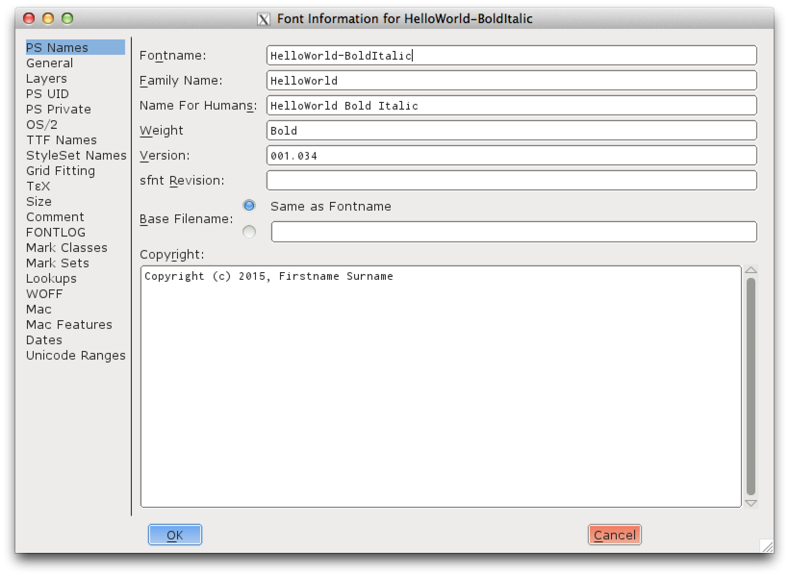

## エレメント ⇒ フォント情報

**フォント情報** ウィンドウはどのフォント・エディターにもあり、FontForge では『OpenType 規格』に厳密に従っています。最初は暗号めいて見えるかもしれませんが、使用するにつれて OpenType 形式により詳しくなり、反対に、OpenType 形式を読み解くことで、ダイアログ・ウィンドウに近付き易くなります。

## バージョン番号

ソフトウェアの開発者は、プログラムの管理に [Semantic Versioning](../ja-JA/Glossary.md#★-semantic-versioning-意味付け版数管理) 方式を用いることを好みますが、これはフォントの管理においても良いアイデアです。ある意味、フォントは、テキストが読者の連想感情を呼び起すための「インターフェース（[API](../ja-JA/Glossary.md#★-api)）」だからです。 
>> 《※ 訳注：　バージョン番号は通常ピリオド（.）で区切られた三組の数字からなる「メジャー.マイナー.パッチ」の形です。》

**メジャー変更**（メジャー・バージョン番号）は全面的な再設計後に付ける番号です。Google Fonts の [Exo](http://www.google.com/fonts/specimen/Exo) と [Exo 2](http://www.google.com/fonts/specimen/Exo+2) とを比較してみてください。もし「Exo」を用いて文書を作成した場合、「Exo2」へ即座に切り替えようとは思わないでしょう。なぜなら、呼び起こされる感情（文字の声とか字面の趣きとか）が微妙に異なるからです。文字の高さがほとんど同じである書体や多くの言語に対するサポートの追加も、垂直または水平方向のメトリクスを大幅に変更するもの同様に、「主変更」として扱う対象になります。

しかしながら、二つの書体（スクリプト）に対する補完的なデザインを作成する場合は、二つまたは三つのファミリーとしてリリースするのがよいでしょう。一つのファミリーには各書体を適切に配列配置したもの、もう一つのファミリーには多言語テキストの簡略な緊急代替用タイプセットのための二次フォントとしての書体を配置したものです。

**マイナー変更**（マイナー・バージョン番号）は、メトリクスの僅かな変更に対して用いられます。たとえば垂直方向のメトリクス、水平方向のサイド・ベアリング（文字左右の余白）やカーニングの改善、グリフのちょっとした修正などに対してで、このような変更は、そのフォントを使用した文書に（多くの場合、僅かなものですが）再表示処理（リフロー）が発生するためです。事例はこちらです（出典元： ["Roboto Rebooted: Why Google Updates Its Font Like The Rest Of Its Products"](https://www.fastcompany.com/3033126/roboto-rebooted-why-google-plans-to-update-its-font-like-the-rest-of-its-products)）:

 

当初想定していた文字セットを「完成」させるために数個あるいは十数個のグリフを追加したり、対応する言語を数言語増やすような場合は、おそらく「マイナー」変更となります（特に、垂直方向のメトリクスが変わらない場合）。

**パッチ** レベルでの変更とは、メトリクスを変更することなくフォントを改善するもの、あるいはグリフ・デザインの目に見える変更のことで、最終的なテキスト・レイアウトに影響を及ぼさないものです。

あなたがリリースした 1.001 版が fsType が 0 に設定されていないとか、 fontcrunch を通じて実行されていない可能性があるとかのために、これら両方を変更して修正版 1.0.1 をリリースしても、この変更は可視化もされず、テキストの再表示（リフロー）も行なわれません。
> 《※ 訳注：　この部分の内容が意味不明です。おそらく、次行で説明される「パッチ番号が OpenType では利用できない」事例の記述と思われますが、内容に脈絡がありません。中国語版では、この部分は割愛されています。》

残念ながら、三番目の「パッチ・バージョン番号」は、OpenType フォント・バージョンのメタデータ・フィールドでは使用できません。 代わりに、ヒンティングやメタデータに対する変更に対しても「マイナー・バージョン番号」の値を一つ増して対応します。

また、バージョン番号は 3 桁を越えてはいけませんが、TTX ファイル中では 5 桁で表示されることがあります。たとえば、通常は「2.001」であるところが、TTX XML ファイルでは「2.00099」のようになります。

フリー・フォントをリリースする場合には、[GitHub のリリース](https://www.google.com/search?q=github+releases) 機能が非常に便利です。

## フォント・ファミリーの名前

マイクロソフト社（Microsoft）は、人々に最新版へのアプグレードを促すために、旧バージョンの Windows 向けに作られたプログラムが最新バージョンの Windows でも稼働するように懸命に取り組んでいます。このことは、Windows 3.1 で導入された TrueType フォントの基本仕様が依然として用いられているということであり、Windows では四つの基本書体（標準体、イタリック体、太字体、太字イタリック体）のフォント・ファミリーしか対応していません。

つまり、フォント・デザイナーにとっては、すべてのフォントがすべてのオペレーティング・システムで使用できるような方法でフォント・ファミリ名を設定する必要があるということです。OpenType 形式では、OpenType 対応ソフトウェアで優先される「優先ファミリ名」と「優先スタイル名」にファミリ名とスタイル名の値を補完することでこれが可能になります。

この [Family Naming Google Docs Spreadsheet](https://docs.google.com/spreadsheets/d/1ckHigO7kRxbm9ZGVQwJ6QJG_HjV_l_IRWJ_xeWnTSBg/edit#gid=0) は、ポーランドのフォント専門家 Adam Twardoch 氏から共有され、[Fontlab フォーラム](http://forum.fontlab.com/index.php?topic=313.0) で議論された情報です。この情報は  [OpenType specification example](https://www.microsoft.com/typography/otspec/namesmp.htm)〔リンク切れ〕に代わるものです。

>> 《※ 訳注：　上記リンク情報は 2015 頃のものです。》