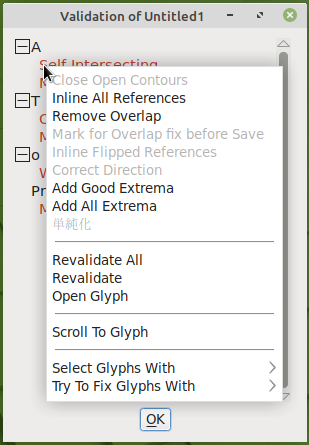

理想の世界では、フォントは特別な努力もせずに最新のコンピュータにインストールできるでしょうが、現実の世界では厄介で面倒です。 デザイン作業においては、特に。フォントには、正しい動作や表示が行なわれなくなる技術的な問題がありがちなのです。たとえば、交差する曲線が、「内側」と「外側」がないために正しく描画されないというようなことです。また、さまざまなフォントのファイル形式では、グリフが画面上へのテキスト配置を簡素化する特定の規則に準拠していることを前提としていますので、規則に違反するフォントは予期しない問題を引き起こすことになります。このような問題の事例としては、曲線状のすべての点の座標は整数でなければならない、というものがあります。最後に、技術的には問題がありませんが、それでも修復する必要があるスタイル上の問題点があります。たとえば、完全に水平または垂直になるように意図されている線が、誤ってわずかにずれている場合などです。

FontForge では、この三種類の問題点を発見（し、多くの場合、修復）できるツールを提供しています。こうした問題点を取り除くためにフォントを検証することは、ユーザーが安心してインストールし利用できるばかりでなく、完成したプロジェクトの完成度も高まります。

## 問題点の発見ツール

最初のツールは「**問題点を発見**」（Find Problems）といい、**エレメント** メニューの中にあります。まず最初に、ひとつ以上のグリフを（フォント・ビュー、アウトライン・ビュー、メトリック・ビューのいずれかから）選択し、その後に「問題点を発見」ツールを開きます。このツールでは、さまざまな潜在的問題点を八つの個別タブに表示しています。

発見したい問題点を指定するには、それぞれの項目の横にあるチェックボックスをオンにし、場合によってはフォントをチェックするための数値を指定します。「**OK**」ボタンをクリックすると、選択されているすべてのグリフを検査し、見つかった問題点をダイアログ・ボックスに表示します。

「問題点を発見」ツールが検査する問題点は、以下の八つに分類されます：

* 点： 操作点（points）に関する問題
* バス： パス（paths）と曲線（curves）に関する問題
* 参照： 参照（references）に関する問題
* ヒント： ヒンティング（hinting）に関する問題
* ATT： ATT に関する問題
* CID： [CID](../ja-JA/Glossary.md#cid-keyed-font-cid-フォント) フォント（CID-keyed fonts）に関する問題
* BB： [矩形境界線](../ja-JA/Glossary.md#★-bounding-box-バウンディングボックス境界ボックス矩形境界線)（bounding boxes）に関する問題
* ランダム： その他のさまざまな問題

すべての項目確認が必要なわけではありません。いくつかの項目は特定の文字や言語だけに適用され（たとえば、「CID」タブの項目など）、またその他の項目は、特定のオプション・フォント機能 (「参照」タブの項目など) にのみ適用されます。しかし、作成したフォントが、グリフに必要とされている特性を検証する各評価試験と、オプションではあるが一般的に期待される動作を調べる幾つかの評価試験に合格しているかの確認が必要です。その他の幾つかの評価試験はデザイン作業中のフィードバックと指針を与えてくれるものであるため、その意味でも検討する価値はあります。

### 優先事項：　必要特性の評価試験

「点」タブでは、「**整数ではない座標**」の評価試験を選択します。この評価試験では、各グリフのすべての点（曲線状の点と制御点の両方を含みます）が整数座標を持っているかを確認します。すべてのフォント出力形式でこの評価が必要な訳ではありませんが、必要とする出力形式もあります。

「パス」（輪郭線）タブでは、「**開いたパス**」と「**一番外のパスが時計回りかをチェック**」を選択します。このふたつは、すべてのフォントに必須な特性です。一番目の評価試験は「閉じた図形でない曲線がないか」を、二番目の評価試験は「各グリフの外側の曲線が時計回りに描かれているか」を、確かめます。「**交差するパス**」の評価項目も検証しておくと良いでしょう。なお、最新のフォント形式は交差する二つのパスに対応していますが、それ自体が交差する曲線は許可されていません。加えて、グリフに自己交差するパスがある場合には、FontForge は「**一番外のパスが時計回りかをチェック**」評価を実行できません。

「参照」タブでは、六つの評価試験※すべてを選択します。このタブの評価項目はすべて「参照」に関連しており、グリフに他のグリフのパスを参照しています。たとえば、アクセント記号付き文字は、元の（アクセント記号のない）文字への参照に加えて、アクセント記号文字への参照を含んでいる、といったようにです。「参照」タブ内のすべての評価試験は、少なくとも、ひとつの一般的な出力形式に対しては必ず実施すべきですが、全部の出力形式に対して行なうことは良策です。
>> 《※ 訳注：　FontForge 2023版では 評価項目の選択肢が 7 つに増えています。》

同様に、「ATT」タブもすべての評価試験を選択します。このタブの評価試験では、グリフ名のないもの、存在しないグリフの置き換え規則、グリフ名に関連するその他の問題や OpenType フォントの特性について解析します。ここで対処される問題点は滅多に起こらないものですが、全部、コンピューター・システムによってはフォントが無効であるとみなされる原因になる問題ですので、評価試験に含めておく価値はあります。

### フォント・ユーザーのために：　快適な動作のための評価試験

上述の評価試験では、フォントがさまざまなフォント形式で定められた規則に従って正しくインストールされ、正しく表示されるかを確認していますが、追加すべき他の評価試験が（特にデザイン作業の最後には）いくつかあります。これは、最新のタイポグラフィが従っている一般的な規則をチェックするために行なわれます。

「点」タブでは、「**端点の外にはみ出す制御点**」を選択します。この評価試験は曲線線分（スプライン曲線）上にあるべき制御点が、曲線の終端点を越えているものを検出します。制御点が曲線外に存在すべき理由は滅多にないので、このような事例はふつう間違いがあることを意味します。また、「**遠すぎる点**」も選択したほうがよいでしょう。これは、最も近い次の点から 32,767 単位以上離れている点がないかを検出するものです。この距離は、通常のコンピューターが内部で処理できる距離よりも大きく、また、それほど離れている点は意図的に設定されたものでないことでほぼ間違いないので（因みに、ひとつのグリフはおよそ 1,000 単位の格子上に描画されています）、このような点を取り除くことが重要です。

「パス」のタブでは、「**極大点の欠落をチェック**」と「**点の個数の上限：**　」の両評価項目が重要です。一つ目の項目は極大点にある点、すなわち、グリフの最上点、最下点、最も左の点、最も右の点を検出します。最新のフォント形式では、各パスの水平方向と垂直方向の極値のそれぞれに点があることが強く推奨されています。そうすることで、フォントの画面上またはページ上の描画が容易になるからです。この評価項目は不足している極点を検知します。二つ目の評価試験は、グリフ内の点の数の整合性チェックです。FontForge の「点の数」の既定値は 1,500 で、これは PostScript 規格文書で推奨されている値であり、ほとんどすべてのフォントに十分な値です。

「ランダム」タブには、その名前が示すとおり、他のカテゴリに当て嵌まらないさまざまな評価項目がリストされています。このうち、最後の三つ、「**Unicode値の重複をチェック**」「**グリフ名の重複をチェック**」「**Unicodeとグリフ名の不一致をチェック**」は重要です。これらの評価項目では、グリフ名と Unicode スロット間のマッピングでのメタデータ・エラーを検出します。

### 自分のために：　フォント・デザインのための評価試験

「**問題点を発見**」ツールにあるその他の評価試験の多くは、グリフのコレクション内の不一致、すなわち間違っていたり無効なものではありませんが、フォント・デザイナーとして磨きをかけたいもの、を特定するのに役立ちます。たとえば、「点」タブにある「**Y near standard heights**」評価項目（標準高さに近い Y 座標）はグリフを一連の有効な垂直測定値、つまり、[ベースライン](../ja-JA/Glossary.md#baseline-ベースライン基準線)（基準線）、「x」グリフの高さ、文字「p」の [デセンダー](../ja-JA/Glossary.md#descender-デセンダー)最下点など、と比較します。統一的な書体では、ほとんどの文字がこうした標準的な測定値の少なくとも二つに基づいているので、どれにも基づいていないグリフには多くの作業がきっと必要でしょう。

「パス」タブの「**水平/垂直/イタリック※に近い辺**」という評価項目は、ほとんど水平・垂直な、またはフォントのイタリックの角度部分の、線分を検出します。ほとんど垂直な線を完全に垂直にすることで、フォントが使用されたときに字形が明瞭に描画されます。この評価項目は、肉眼では見つけるのが難しいどこかしっくりこない部分を探し出す場合に頼りになる方法です。
>> 《※ 訳注：　日本語版 FontForge 2023 では、項目表記から「イタリック」が省かれています。したがって「イタリック」関連の検証が行なわれているのかどうかは不明です。》

意味を持たないほど近すぎる曲線上の点を特定したり、形状の似たグリフのサイドベアリングを比較したり、異質な部分があるグリフを炙り出す一連の評価項目を実施するなどの、他の評価試験も利用できます。初期の書体デザインを、より正確なものにすることは、洗練作業の一部です。フォント・デザインの他の側面と同じように、これは反復的な作業であるため、組み込みツールを使用することで、繰り返し作業の一部が軽減されます。

## フォントの検証

FontForge のもうひとつの検証ツールは、一連の評価を一括実行してフォント全体をチェックする「完全フォント検証ソフト」です。このソフトは全フォントの検査に用いられ、「フォント・ビュー・ウィンドウ」から起動するだけです。**エレメント**メニューの **Validation** 項目のサブ・メニュー内にある「**Validate**」（検証する）を選択してください。この検証ではフォントの技術的な正確さの評価（基本的には上述の「優先事項：必要特性の評価試験」の項に記載されている評価内容のことです）を行なうように設計されています。評価試験は全フォントに対して実行されますので、「**問題点を発見**」ウィンドウにあるツールを使って自分で個別に行なうよりもずっと迅速に作業を行なえます。

編集作業中にはじめてこの検証ソフトを実行すると、ダイアログ・ボックスが表示され、「整数ではない点の座標をエラーとしてフラグを立てるかどうか」を尋ねられます。整数座標を使用することは望ましい設計慣行であるため、「エラーとして報告」を選択することが無難です。検証ソフトがフォントの解析を完了すると（ほんの数秒後です）、「［フォント名］の検証」と表記された新しいダイアログ・ボックスが開きます。このウィンドウには、解析で見つかったすべての問題点が、グリフ毎に分類されて表示されます。

このウィンドウは単なる問題点のリストというだけではありません。各項目をダブル・クリックすると※、FontForge が関連するグリフにジャンプして問題点を強調表示、別ウィンドウで問題点が内容説明とともに強調表示されます。
>> 《※ 訳注： FontForge 2023版では、ダブル・クリックをしても問題のグリフへはジャンプしないが、「右クリック」で以下のコンテキスト・メニューが開きます。このなかの **Open Glyph** を選択するとグリフ・ウィンドウを表示できます。》

グリフ編集ウィンドウで問題の箇所を修正すると、関連するエラー項目が即座に検証結果のリストから消えます。多くの場合、問題箇所は FontForge が自動的に修復できるもので、その場合は問題点の説明ウィンドウの下部に「**修正**（Fix）」ボタンが表示されます。そのボタンをクリックすれば、なにも他の苦労をすることなく修復が行なわれます。

問題点によっては、自動修復が行なわれませんが、表示された問題点を見れば、たちどころに修正方法がわかるでしょう。たとえば、たとえば、「自己交差曲線」という問題には、パスがそれ自体と交差する特定の場所があります。小さ過ぎて一見しただけではどこに問題があるか気づかないかもしれませんが、拡大すればパスの形状が確認でき、修正して問題を解決できます。

他の問題点については、問題点の箇所が特定の点ではないかもしれません。たとえば、曲線の向きが反対である場合（つまり、時計回りでなければならないところが、反時計回りになっているとき）、曲線全体の問題になります。FontForge が自動的に修復できない事例や、検出ソフトがグリフ上の特定の点であることを指摘できない事例では、手作業でその問題を解決するためにあちらこちらを探し廻らなければなりません。

最後に、検証ソフトによって実行される幾つかの評価試験がありますが、想定している最終出力形式によっては問題とはならない可能性がります。たとえば、上述の「整数ではない座標」の検証試験です。このような場合では、「**この問題は今後無視する**」のチェック・ボックスをクリックすると、以降の検証作業時にエラー・メッセージの表示を抑制できます。

## 編集中に問題点を修正する

「問題点を発見」ツールや「完全フォント検証ツール」が検出する問題点のほとんどは、編集作業中に修正可能ですので、トラブルシューティングを先延ばしにする必要はありません。たとえば、**表示**（View） ⇒ **表示**（Show）※サブメニューには、編集中に問題箇所を強調表示するオプションがあります。**エレメント** メニューでは、ほとんどの出力ファイル形式で必要とされる極値点を追加する「**極大値を追加**」のようなコマンドや、選択されているパス（輪郭線）が時計回りまたは反時計回りかを示すチェック・ボックスがあります。グリフ・エディターで図形を（水平方向・垂直方法に）反転すると、そのアウトラインの方向も自動的に反転していることに気が付くでしょう。**エレメント** メニューの「**アウトラインの向きを修正**」コマンドをクリックすると、FontForge が時計回り／反時計回りの向きを即座に修正します。作業中にこのような小さな修正を行なう習慣を身につけると、後の検証段階で時間を少し節約できます。
>> 《※ 訳注：「Show」というメニュー項目は 2023版では不明》

# そのフォント・デザインは機能する？  

書体は、読み易さ（可読性）と見易さ（視認性）のふたつの面で、良くも悪くも「機能」します。

**視認性** Legibility とは、グリフのデザインが、即座に正しく認識されるために十分なほど、はっきりと明確であることをいいます。次の例は、しばしばあまりにも似すぎている文字のペアです。

* 文字の「L」と数字の「1」
* 文字の「O」と数字の「0」
* 文字の「Z」と数字の「2」
* 数字の「1」と数字の「7」

**可読性** Readability とは、親しみのある快適な読書体験のために、すべてのグリフが一体となって働くことをいいます。これを確実に実現するための最良の方法は、試験的な文書を作成してみることです。もし、全アルファベットが完成しているのであれば、実際の文章を作成することができます。たとえば、[FontFriend](http://somadesign.ca/projects/fontfriend/) を使用して、読みたい長いニュース記事に自分のフォントをドラッグ・アンド・ドロップし、印刷します。

しかしながら、全アルファベットが揃っていない場合には、[LibreText](https://github.com/garethsprice/libretext/) のような試験文書作成ソフトとワードプロセッサーやデスクトップ・パブリッシング・ソフト、あるいは一般的な描画ソフト（[Inkscape](http://www.inkscape.org) のような）を使用して、試験用の文書を作成してみましょう。

# 異なる環境でのフォントの検証

Microsoft 社の Windows でフォントを検証する場合、「[Font properties extension](https://www.microsoft.com/typography/TrueTypeProperty21.mspx)（フォント特性拡張機能）」がバージョン番号などの内部フォント・メタデータをすばやく確認するのに役立ちます。 

開発用フォントをインストールして Windows の動作が不安定になった場合に、破損したフォントを削除する方法を [John Hudson](http://typedrawers.com/discussion/1322/otf-fonts-from-glyphs-not-working-with-windows-word) が書体デザイン・フォーラム「TypeDrawers」上で次のように説明しています。

> Windows を回復コンソール・モードで再起動します。コンソール画面で、Windows/Fonts フォルダーに移動し、〔問題を起こしているフォント、たとえば〕「Rhodium フォント」のすべてのエントリを削除します。次に Windows/System32 フォルダーに移動し、「FNTCACHE.DAT」ファイル（**.dll** ファイルではありませんのでご注意ください）を削除します。その後、 Windows を再起動します。フォント・キャッシュ・ファイル「FNTCACHE.dat」が再構築されるので、〔削除したフォント、今回の例では〕「Rhodium フォント」のクリーン・コピーを再インストールして、動作するかどうかを確認します。（フォントは既にインストールされているというメッセージが表示されても心配しないでください。その段階では Windows は嘘をついています。）
