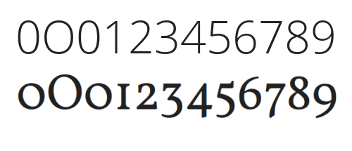

数字はフォント・デザイナーにとってしばしば難しいものです　&mdash;　いくつかの理由のせいで。ひとつには、数字には非常に多くの曲線があるからです。別の理由は、数字はしばしばその形状に他のフォント・デザインに見られる視覚的慣例とは異なる（あるいは違反しているとさえいえる）慣例を用いているからです。さらにいえば、数字は非常にたくさんの筆線がある場合（「8」や「5」のように）や、空白部分が大きい場合（「1」や「7」、時には「2」や「4」のように）があります。どちらの場合も取り扱いが難しいものです。最後に、数字のゼロ「0」が大文字の「O」ではないように見せるにはどうするか、という問題があります。

何種類ものフォントでそれぞれの数字を考察することは、デザイナー達がこうした問題に対処してきた方法をより詳しく知ることができるので、役に立ちます。

筆線の濃い数字（たとえば「8」）では、デザイナーが筆線の幅をそのフォントの通常の文字よりもやや細めにしていることに気付くかもしれません。同様のことは、丸い部分が二つある「g」のデザインでも見ることができます。

反対に、空白部分の比率が大きい数字では、一部の筆線を通常よりも太くすることがあります。

数字のゼロを大文字の「O」と異なるように見せるには、多くの方法があります。たとえば、ゼロを大文字の「O」よりも文字幅を狭くするとか、真ん丸のゼロとか、（特にモノスペースのフォントでは）ゼロにスラッシュ（/）を重ねる、などです。

ゼロの文字幅を大文字「O」よりも狭くしつつ文字高さを同じにすることは、一般的な方法です。この方法は、数字の最も一般的なスタイルである、文字高さの揃った数字に典型的なものです。フォントの例としては、多くの「ガラモンド Garamond」「フューチュラ Futura」、グーグル・ウェブ・フォントの「オープンサンズ Open Sans」フォントなどがあります。次の事例は「オープンサンズ」フォントで「ゼロ」「大文字の O」「その他の数字」を示したものです。

真ん丸、あるいはほぼ真ん丸にする方法は一般的ではありませんが、ないわけではありません。このやり方を用いているフォントの例としては、グーグル・ウェブ・フォントの「フォルコルン Vollkorn」フォントや、商用フォントの「Mrs Eaves」「ヴェンデッタ Vendeta」「フライシュマン Fleischman BT Pro」があります。伝統的な、文字高さが異なる形の数字を用いるフォントは、この方法を採用していることが多くあります。ゼロが時には[エックスハイト](../ja-JA/Glossary.md#x-height-エックスハイト小文字の高さ)と同じ高さで文字幅が狭くなっているものも見られます。

>>《Open Sans（上）と Vollkorn（下）との比較 》

数字にはまた、分数、上付き文字、下付き文字を含めると、最大 11 もの見分けられるスタイルがあります。 次に、最も一般的な 5 つのスタイルを見ていきましょう。

## 「ライニングスタイル」の数字

フォントの中に見い出される数字の最も一般的なスタイルは、「等幅ライニング」と「可変幅（プロポーショナル）ライニング」です。「**ライニング**」とは数字で用いられている「文字の高さ」のことです。「ライニング」スタイルの場合、すべての数字の高さは見た目が同じです。「等幅ライニング」と「可変幅ライニング」の違いは、「等幅ライニング」ではすべての数字が同じ文字幅になっています。このスタイルは、スプレッドシート（集計表）や数字が縦方向にも横方向にも整然と並んでいると役立つ用途に有用です。

「可変幅（プロポーショナル）ライニング」の数字には、数字の形状や間隔を変化させて筆線の太さの違いを相殺できるため、見た目がより均質に見えるという利点があります。

## さまざまな「オールドスタイル」の数字

等幅の数字は、歴史的な観点では、比較的新しい発明品です。等幅の数字が出現する前には、可変幅のオールドスタイル数字がありました。このオールドスタイルの数字は、数字を文章に混ぜてそのスタイルを共有したい場合に便利です。

等幅のオールドスタイル数字はかなり稀です。この数字は、昔ながらの数字様式で表示したい、かつ、等幅間隔での表示が一般的な年次報告書などに有用です。上記の画像は、タイプライターによる図書館のカード目録です。

## 「ハイブリッドスタイル」の数字

ハイブリッド型の数字では、フォントのキャプ・ハイトやエックス・ハイトに準拠せず、代わりにフォント自体の文字高さを有しています。「ハイブリッド」という名前は、「オールドスタイル」と「ライニング」数字の混合型であることを示しています。ハイブリッド・スタイルの数字を使用するフォントの例には、「ジョージア Georgia」、Google Web フォントの「メリウェザー Merriweather」および「ドネガル Donegal」などがあります。「メリウェザー」による数字のゼロ、大文字「O」、ゼロ、1、2、3、などのグリフは、以下のとおりです。

