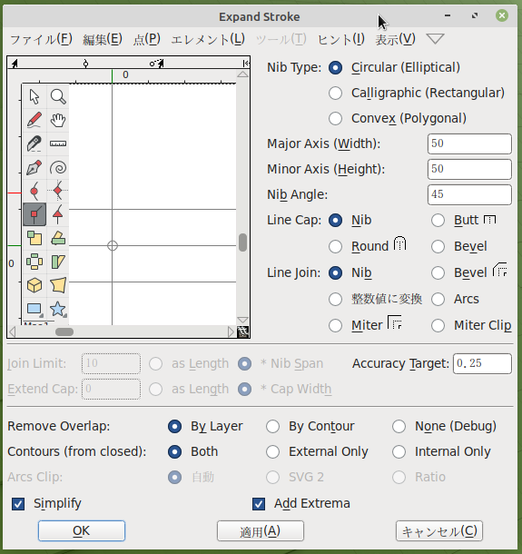

>>> 《訳注》FontForge 20230101 版では、メニュー項目やポップアップ項目に**日本語化されていない**部分があります。

>>> 《訳注》ベジェ曲線関係の用語の訳語は以下のとおりです。
>>> + 変化点 breaks
>>> + 曲線点 Curve points / Anchor points
>>> + H/V 曲線点 horizontal/vertical curve points
>>> + 角の点 Corner points / Coins
>>> + 方向点 Handle points
>>> + 接点 Tangent points

  

FontForge でのフォント・デザインには、ベクター・グラフィックスの経験があるユーザーにはお馴染みの描画ツールを始めとする多くのツールやユーティリティが用いられていますが、顕著な違いがあります。

FontForge の描画ツール自体を紹介する前に、まずベジェ曲線がどのように機能するかを理解しましょう。

## ベジェ曲線への理解

ベジェ曲線とは、滑らかな曲線をデジタル処理で生成するために使用される特定の数学的表現を指します。一般的には、三次と二次のベジェ曲線が用いられますが、FontForge ではデザイナー向けの代替表現である螺旋曲線にも対応しています。

本章では、グリフの描画で一般的に使用される三次曲線についてのみ説明し、螺旋曲線については次章にて紹介します。二次曲線は TrueType フォントだけに見られ、描画では滅多に用いられていません。むしろ、ビルド時に生成されるものです。

典型的なベジェ曲線は、ひとつのアンカー・ポイントと、全体の方向を示す 2 つのハンドル（方向点）で構成されています。各ハンドルの長さで、曲線の両側の長さを指定します（下図を参照）。

### 基準点の種類

#### ・曲線点（アンカー・ポイント、図の丸い点）

**曲線点**（アンカー・ポイント）には 2 つのハンドルがあります。各ハンドルは曲線点を介して直線で繋がっており、曲線点の両側の滑らかな曲線を生成してます。

#### ・H/V（水平・垂直）曲線点（図の菱形の点）

**H/V 曲線点** （水平／垂直）とは、方向を水平軸または垂直軸に揃えた曲線点の一種で、ベジェ曲線の形を決定するのに不可欠なものです。（詳細は次章で説明します）。

#### 角の点／コイン（図では四角の点）

**角の点**（コイン）には、0 〜 2 個のベジェ曲線ハンドルをつけることができます。このハンドルの位置は他のハンドルとは無関係で、輪郭線に不連続性を与えます。ハンドルがない場合、角の点（コイン）からは直線になります。

#### 接点（図では三角形の点または矢印形）

直線から始めて滑らかな曲線を形成したい場合は、**接点**を使用するとよいでしょう。
 
 **接線**は、片側に直線を残し、反対側のベジェ曲線ハンドルが直線の曲がる方向を指定します。これにより、直線から曲線への連続的な移行が実現されます。

### 正しい作法

最小限の制御点と簡便なラスター化で望ましい曲線を作成するには、アンカー（曲線点）を常に**曲線の極値**に配置する必要があります。しかしながら、字形に変化点がある場所では、文字の輪郭を決定づける線は**水平または垂直**である必要があります。

<b>【メモ】</b>　制御点が極値に配置されていない場合には、FontForge は「照準アイコン（ ⊕ ）」で実際の極値を示します。

この問題を修正するには、制御値が適切に配置されるように、現在の輪郭線を別のレイヤーにコピーし、制御点を移動します。そうしない場合は、FontForge の検証ツールが、自動的に極点に制御点を追加します。この時、ずれていたアンカー（曲線点）を <B>右クリック ⇒ マージ（<u>M</u>）</b> で統合できます。 

詳しくは、後ほど説明する「[作成したフォントの検証](Making_Sure_Your_Font_Works_Validation.md)」の章をお読みください。

上記の「作法」を詳しく言うと、水平／垂直のベジェ曲線を使えないケースが 2 つあります。

- 次の英文字「a」の左上部分（ほとんど平らになっています）のように、曲線の傾き全体を変更したい場合：
  

- 次の英文字「g」の左下部分のように（通常、描線とは別に、**角の点**を用いる場所ですが）、字形に変化点を置きたい場合：
 
  

<b>【メモ】</b>　ご覧のとおり、**角の点**で変化点を設定すると、各ハンドルの向きは、ハンドルの線が曲線に到達している部分で、曲線に対する接線になっているはずです。

## FontForge の描画ツールを習得する

FontForge のメイン・ウィンドウから、グリフ・ボックスの一つをダブル・クリックし、「グリフ・ウィンドウ」を開きます。〔※ 訳注：　ウィンドウが開かない場合は、グリフ・ボックスの上で **右クリック** し、開いたメニューから「**アウトラインウィンドウを開く（<u>U</u>）**」を選択します。〕

<b>【メモ】</b>　x 軸と y 軸が交差している部分の上に表示される数字は、左から右へ、以下の内容を示します。

<ul>
<li>ウィンドウ上の現在のカーソル位置（x、y）</li>
<li>最後に選択した場所の位置</li>
<li>選択した位置に対するカーソルの相対的位置</li>
<li>選択した位置とカーソル位置との距離</li>
<li>選択した位置とカーソル位置（ベースラインに対して）との角度</li>
<li>現在の拡大レベル</li>
<li>アクティブ・レイヤー名</li>
</ul>

<b>【注意】　</b>時に、グリフ・ウィンドウ内で作業を行なっている際に、FontForge が応答していないように見えることがあります。そのときはウィンドウの裏にダイアログ・ボックスが隠れている可能性があります。ウィンドウを移動させてダイアログ・ボックスを処理してください。

**線** には二つの点があります。

**[スプライン曲線](../ja-JA/Glossary.md#spline-スプライン曲線)** は、二つの終端点と二つのハンドルの四つの点で構成されています。これによりその終端点でのスプライン曲線の傾きを指定します。

### 各点、スプライン曲線、各描線をコピー、ペースト、カット、削除する

ほとんどの描画ソフトウェア同様に、FontForge でも設定点・描線・スプライン曲線をコピー・カット・ペースト・削除することができます。これらのコマンドは、**編集メニュー** あるいは使用しているコンピューターの所定の**キー操作**（メニューのコマンド横にも表示されています）から実行できます。

## 描画ツールを理解しましょう

作業ウィンドウ廻りの操作が判ったところで、次に各ツールの使用方法を学びましょう。

### 「ポインタ」と「拡大」

**ポインタ** と **拡大** は、他のアプリケーションのツールと同じような働きをします。

**ポインタ** は選択を行なうツールで、作業ウィンドウ上の各設定点・描線・オブジェクトを選択するために用います。

**拡大** ツールでは、<kbd> Z </kbd>キー で簡単に表示を**拡大**できます。表示を**縮小**するには、**表示メニュー** から **縮小** または **枠に揃える** を選択します（<kbd> X </kbd>キー でも操作できます）。

**【メモ】**　他のツールを選択中に <kbd>Ctrl</kbd> キーを押すと、押している間は、一時的にポインタ・ツールに切り替わります。

### 「フリーハンド」ツール

**フリーハンド** ツールは、自由な描線を描くためのツールです。

描画エリア上で、描画開始点からクリックしたままマウスを走らせると線が描けます。ポインタ・ツールに戻ると、描いた線上の各点が選択できるようになります。

描線上の点の一つを選択すると、その点が「黄色の丸」に変わります。もし選択した点が曲線部にあれば、マゼンタ（赤紫色）とシアン（青緑色）のハンドル線のある制御点（方向点）も表示されます。ハンドル先端の制御点を掴んで動かすと曲線の形状も変化します。

### 「点」ツール

では、「点」ツールの操作について学びましょう。

描線に点を追加するには、まず最初に上図のいずれかのツールを選択し、次に描線の上をクリックして少し押し付けます。すると、描線上にあたらしい制御点が追加されます。
>> - Curve 曲線点
>> - HV Curve 接線が水平・垂直の曲線点
>> - Corner 角の点
>> - Tangent 接点

**曲線点** ツールは、曲線線分に制御点を追加するために用います。

**接線が水平・垂直の曲線点** ツールは、新しい制御点が水平もしくは垂直に揃うように制限されます。これは **極限点** の設定の際に重要です。

**角の点** ツールは、鋭く折れ曲がった描線を作成することができます。

**接点** ツールは、描線が直線線分から曲線線分へ切り替わる部分を指定するために用います。

### 「ペン」ツール

**ペン** ツールでは、曲線上に点を追加した後、そこから制御点を引き出します。

### 「螺旋」ツール

**螺旋** ツールを選択すると、螺旋描画モードに切り替わります。螺旋描画モードでは、結節点の位置を変更すると自動で曲線を修正してくれます。標準的なやりかた（「ベジェ編集」といいます）よりもこの方法を好む人もいますが、ベジェ編集に慣れている場合には、これが予想外の動きをすると思うかもしれません。

### 「ナイフ」ツール

**ナイフ** ツールは、スプライン曲線を二つに分割するためにします。この機能は、ある形を描画したがその一部分だけが必要になったという場合に便利です。

### 「定規」ツール

**定規** ツールでは、測定値や座標情報がわかります。使用すると、カーソルの隣にヒント情報が示されます。設定されている点の上にカーソルを当てると、ヒント情報がさらに詳しい測定値や座標情報が得られます。スプライン曲線の近傍では、曲率や半径に関する情報がわかります。もっとも便利なのは、「定規」ツールをクリックしてドラッグすると、カーソルの移動した距離と、カーソルが横切ったすべての交点の情報が得られることです。

### 「変形」ツール

**変形** ツールは、六つあります。

**【メモ】**　すべての変形ツールは、ツールをダブル・クリックすると、（ダイアログ・ウィンドウが開いて）数値を入力して設定できます。
- ※ 訳注：　**ダイアログ・ウィンドウ** は、メニュー項目の **エレメント** ⇒ **変形（T）** ⇒ **変形（T）** からも、開くことができます〕。

**縮尺** ツール（Scale）では、作業中のデータをフリーハンドで自在に拡大・縮小できます。<kbd>Shift</kbd> キーを押したまま操作すると、縦横比率そのままにデータを拡大縮小できます。

**回転** ツール（Rorate）は、作業中のデータを自由に回転できます。最初にクリックした箇所の廻りにあるデータが選択されて、回転します。

**3D 回転** ツール（3D Rotate）は、データを三次元で回転し、その結果を x-y 面上（二次元）に描き出します。

**反転** ツール（Flip）は、選択箇所を横方向または縦方向に反転するツールです。マウスでクリックした箇所が変換の原点となります。

**【メモ】**　選択点の反転後には、メニュー項目の **エレメント** ⇒ **アウトラインの向きを修正（C）** を適用すると良いでしょう。

**傾斜** ツール（Skew）は、選択箇所を、時計回りまたは反時計回りに、水平方向に歪めるツールです（「ダイアログ・ウィンドウ」に表示されている「withershins 反対方向に」とは、反時計回りのことです）。　〔※ 上記【メモ】、ダイアログ・ウィンドウの開き方も参照〕

**遠近法** ツール（Perspective）は、非線形に形状を変形させるもう一つの方法です。

**【メモ】**　「遠近法」変換では、数値入力による操作はできません。

### 「長方形・楕円」ツールと「多角形・星型」ツール

これらのツールを使用すると、大雑把な幾何学的形状を描けますので、個々に線分を繋げてその形状を作成するよりも手早く作成できます。

これらのツールの右下にある⊿マークをクリックすることで、各々のツールが交互に切り替わります。どちらかのツールをダブル・クリックすると、形状タイプのオプション画面を開くことができます。

**長方形オプション**：　コーナー起点描画か、[バウンディングボックス](../ja-JA/Glossary.md#★-bounding-box-バウンディングボックス境界ボックス)描画（中心起点描画）か。

**楕円オプション**：　バウンディングボックス描画か、中心起点描画か。

**多角形オプション**：　頂点の数。

**星型オプション**：　星の頂点（凸点）の数と凹点の深さ（％）。パーセントの数値が大きいほど、星の腕が長くなります。

### マウス１ と マウス２（Mse1 ／ Mse2）

ツールバーの下には、二つのマウス・ボタンに現在割り当てられているツールと操作が表示されます。

- 左ボタン（マウス１ Mse1）
- 左ボタン＋ <kbd>Ctrl</kbd>（^Mse1）
- マウス・ホイ―ル・ボタン（マウス２ Mse2）
- マウス・ホイ―ル・ボタン＋ <kbd>Ctrl</kbd>（^Mse2）

このように、いくつかの異なるツールをツールバーで繰り返し切り替えることなく使えるのです。

<b>【注意】</b>　このマウス（Mse）機能は現在のところ正しく動作しないようです。

### レイヤー

FontForge の描画エリアには初期設定で三つのレイヤーがあります。すなわち、ガイド・レイヤー、背面レイヤー、前面レイヤーです。**ガイド・レイヤー** は「[エックスハイト](../ja-JA/Glossary.md#x-height-エックスハイト小文字の高さ)線」や「[キャプハイト](../ja-JA/Glossary.md#cap-height-キャップ・ハイト大文字の高さ)線」などのガイド線を表示するのに用いられます。**前面レイヤー** と **背面レイヤー** は両方とも描画作業に用いられますが、最前面の前面レイヤーのみが最終フォントに描画されます。

チェックボックスは、各レイヤーが表示されているかどうかを示します。非表示にしたいレイヤーは、チェックを外します。

続く文字列の一字目の「C」（または「Q」）は、三次曲線（C）または二次曲線（Q）が用いられていることを示します。

二字目の「#」「B」「F」は、各レイヤーが「ガイド（#）」「前面（F = <b>F</b>ore）」「背面（B = <b>B</b>ore）」のどのレイヤー・タイプであるかを示します。これは、自分自身でレイヤーを追加していくと大きな意味を持ちます。

レイヤーの追加または削除は、このツールバーにある <kbd>＋</kbd> または <kbd>-</kbd> ボタンで行なえます。レイヤー・タイプと曲線タイプは、右クリックでひらくダイアログ・ウィンドウにて変更できます（追加レイヤーを作成している場合）。

## 描画の基本

次に、必要になることが多い、基本的な描画のワークフローについて説明します。

### 別の図形から一部を切り取る方法

1. まず、**長方形ツール** を使って、グリフ・ウィンドウの描画エリア内に長方形を描きます。

2. つぎに、**楕円ツール** で、今描いた長方形の中に楕円を描きます。

   

3. **エレメント** メニューを開き、**アウトラインの向きを修正（<u>C</u>）** を選択すると、二つの図形が合体し、実質的に長方形の真ん中に穴が開いているように見えます。

   

### 二つの図形を結合する方法

1. 星形を加え、長方形の角に重ねます。
   

2. 星形と前の図形を選択します。重なり合う各図形の一点を選択するだけで OK ですが、選択する点を追加しても問題ありません。

3. メニューの **エレメント（<u>L</u>）** ⇒ **重複処理（<u>V</u>）** ⇒ **重なり合う図形を結合（<u>R</u>）** を選択します。これで、二つの図形がひとつになります。
   

>《※ 訳注：　本項の原文タイトル "Remove overlap" は、そのまま訳すと「重複部分を取り除く」になりますが、実際の操作説明では二つの図形を一体化する手順が書かれているため、説明内容に即して上記の訳文としています。》

### 制御点を追加する方法

**ペン** ツールで、線分の途中をクリックしたままマウスを移動して引っ張ると図形の形状を変更できます。

### 接点を追加する方法

図形の接点を追加する部分を選択します（ここでは、上記で作成した図形の左下部分 ― 曲線と直線が交差する点 ― を選択しています）。次に、メニュー項目の **点（<u>P</u>）** をクリックすると、「**角の点（<u>O</u>）**」にチェックが付いているのがわかります。そこで、「**曲線の開始点（<u>T</u>）**」を選択します。この変更で、制御点のマーカーが四角（□）から三角（▷）に切り替わるだけで、次の操作を行なうまでは、何も起こりません：　ここで制御点のハンドル（×印）を伸ばす操作を行ないます。

そうするためには、メニューの **エレメント** ⇒ **情報を得る（<u>I</u>）** を選択し、「**点の情報**」ウィンドウを開きます。そｓぐて「**位置**」タブの中の「**次の制御点**」の項目へ行き、「**距離**」の値を大きな数、例えば 75 のように、入力します。OK ボタンをクリックすると、曲線が滑らかに直線部に繋がるようになったのが判るでしょう。

### 変形

では次に、図形の左上約 4 分の 1、つまり星型と中央の楕円の一部、を選択してみます。

「3D 回転」ツールを選択して、選択した図形の中央部に移動し、クリックしたままゆっくりと動かし、好みの形になったところで離します。以下の図が、「3D 回転」の実行例です。　《訳注：　クリックした点を中心に回転変形します。》

### Set stroke shape and width

ここまでは、線を描くのに「フリーハンド」描画ツールを使ってきました。「フリーハンド」ツールをダブル・クリックすると、次の **フリーハンド・ダイアログ** ウィンドウが開きます。ここでは、ペンの形状と太さを選択できます。このダイアログは、**エレメント** メニューの **輪郭を太らせる** を選択することでも表示できます。

> 《※ 訳注：　ダブル・クリックでダイアログが表示されない場合は、「エレメント」メニューの「輪郭を太らせる」項をクリックして表示させます。但し、FontForge 20230101 では、Freehand ダイアログに似た「Expand Stroke」ダイアログが表示されるようです（以下参照、但し英語表記多し）。》

《※ 訳注：　主な記載項目の参考暫定訳》

<ul>
<li>Nib Type: ペン先のタイプ（選択：　楕円・平形・多角形）</li>
<li>Major Axis (Width): 主軸（幅）</li>
<li>Minor Axis (Height): 副軸（高さ）</li>
<li>Nib Angle: ペン先角度</li>
<li>Line Cap: 線の先端部（選択：　ペン先・平型・丸形・斜形</li>
<li>Line Join: 線の接合部（選択：　ペン先・斜形・整数値に変換・円弧・留め継ぎ〔額縁〕・留め継ぎ〔詳細不明〕）</li>
<li>Join Limit: 接合幅（選択：　指定長さ・ペン先幅分）</li>
<li>Extend Cap: 線端延長（選択：　指定長さ・ペン先幅分）</li>
<li>Remove Overlap: 重複部削除（選択：　レイヤー毎・輪郭毎・なし）</li>
<li>Contours (from closed): 輪郭（閉輪郭？）（選択：　両方・外部のみ・内部のみ）</li>
<li>Arcs Clip: 円弧片？（選択：　自動・SVG 2・比率）</li>
<li>Simplify: 単純化</li>
<li>Add Extrema: 極値を追加</li>
</ul>

**角の点** ツールを使って多角形を描き、「OK」をクリックします。

次に、「フリーハンド」描画ツールを使用して線を描きます。マウス ボタンを放すと、上記「フリーハンド」ダイアログで指定した形状で新しい線が自動的に描かれます。

> 《※ 訳注：　Linux版 FontForge 20230101 では、「フリーハンド」描画 → 「輪郭を太らせる」ダイアログの設定 → 「自動変換」の手順になるようです。》

## 練習を続けましょう！

「描画」ツールの取り扱いに習熟して、どのような形でも思い通りに描き、変形できるようになるまで、いろいろと試してみてください。この段階で、グリフの各要素を構築する準備はできていますが、その他の FontForge のツールの扱いにも時間を割いてください。

次章 [「螺旋ツールで描画する」] では、**螺旋描画モード**について説明します。「螺旋描画」は、ベジェ曲線編集とは明確な違いがあるので、その機能について解説する必要があるためです。

[「螺旋ツールで描画する」]: Drawing_With_Spiro.html

# 参考文献

「[ベジェ曲線についての討論（TypeDrawers Forum ）](http://typedrawers.com/discussion/967)」には、Nina Stössinger 氏の <a href="https://twitter.com/ninastoessinger/status/593687255341998080">ツイッター</a> による以下の情報へのリンクが含まれています〔すべて英語版サイト〕:

* [Bezier Curves and Type Design: A Tutorial](http://learn.scannerlicker.net/2014/04/16/bezier-curves-and-type-design-a-tutorial/) by Fábio Duarte Martins
* [So What’s the Big Deal with Horizontal &amp; Vertical Bezier Handles Anyway?](http://theagsc.com/community/tutorials/so-whats-the-big-deal-with-horizontal-vertical-bezier-handles-anyway/)　《※ 訳注：　記載リンクでは表示できず？　この [サイト](https://www.photoshopfaceoff.com/design-tutorials/so-what-s-the-big-deal-with-horizontal-vertical-bezier-handles-anyway.html) と同一内容か…？》
* [Hand Lettering: How to Vector Your Letterforms](http://design.tutsplus.com/tutorials/hand-lettering-how-to-vector-your-letterforms--cms-23248) by Scott Biersack
* [Type Basics](http://typeworkshop.com/index.php?id1=type-basics&amp;id2=&amp;id3=&amp;id4=&amp;id5=&amp;idpic=15#pictloader) by Underware
* [The Bézier Game](http://bezier.method.ac) by Marc MacKay
