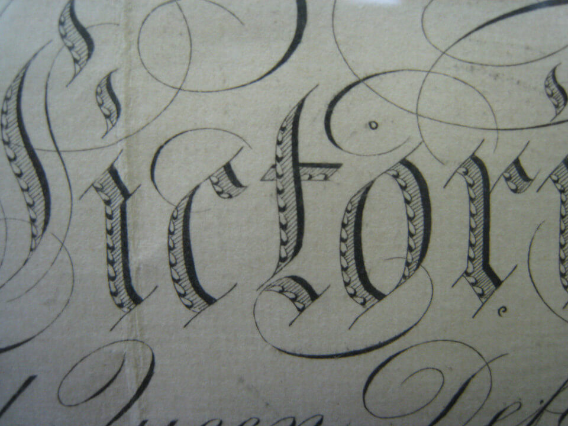
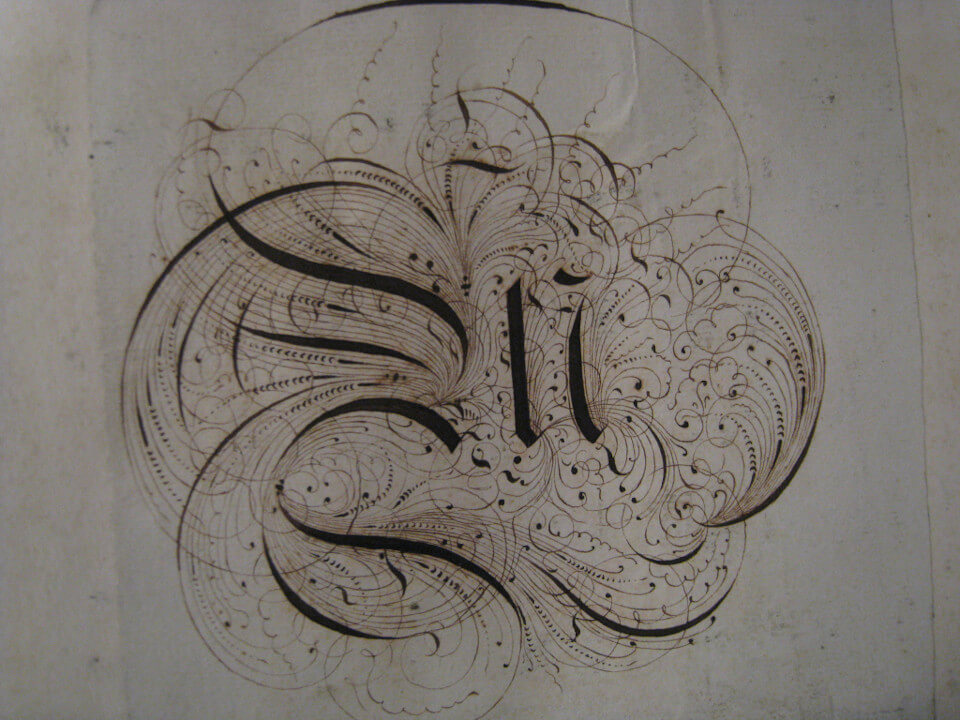
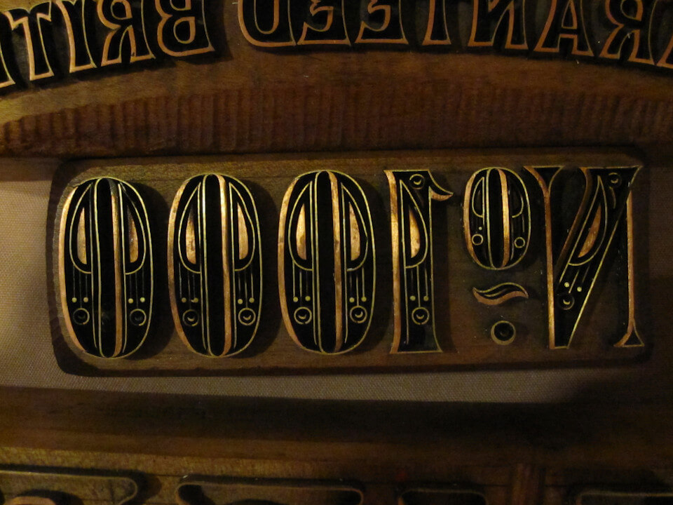

活字書体は、手書き文字や書道文字、レタリング文字、意匠文字（ロゴ）とは何が異なるのでしょうか？

活字書体のデザインが他の文字と異なる唯一最大の問題点は、ある書体のグリフ（字体）が他のグリフのどれとでも共働する必要があることです。このことは、しばしば、書体の部分部分のデザインや間隔が、連綿と続く入念な妥協の産物となることを意味します。こうした妥協は、書体のデザインを、「素晴らしい文字」のコレクションとしてではなく、素晴らしい「文字のコレクション」の創出として捉えるのが一番相応しいということを示しています。言い換えれば、個々の文字の何が素晴らしいかではなく、集合体として、一丸となってどのように機能するのかを考え、このことを優先する必要があるということです。

この、個々の部分をではなく、システム全体を優先する必要性は、システム・レベルでデザイン・プロセスを分析する必要性にも繋がっています。文字全体に及ぶ特性は、特にデザイン・プロセスの初期の段階で、私達が重点を置きたい部分になっています。

もうひとつ、書体デザインが特異であるのは、デザインしている形状が、かなりの程度まで、すでにほとんど確立されていることです。書体デザイナーとしてのわたしたちの仕事は、全く新しい形状を生み出すことではなく、むしろ既存の形状の新しいバージョンを生み出すことなのです。このことが、新書体のデザイナーを困惑させる可能性があります。正に必要な範囲の変更だけを行なって、読者を遠ざけることなく楽しませることは、厄介な作業です。デザイナーというものは、文字単位での思考に囚われがちですが、活字書体にとって最も意味のあることは、一番多く繰り返されているのはその要素要素であるということを最初から理解していれば、この過ちは容易に回避できます。書体デザインは、わたしたちが認識する一般的な形状だけではなく、最も頻繁に現れる形状にも適用される特徴をデザインすることなのです。

こうした特徴が、フォントの声や雰囲気を生み出すことに役立つだけではなく、フォントが何の役に立つのか（立たないのか）を判断したり、時には、フォントが適している技術的な文脈を見極めるのに役立つ、ということを認識することにも有益です。

このようにフォントのデザインを考えるのは、近寄りがたい、あるいは非常に掴みどころのないものようように見えるかもしれません。しかし、この考え方に慣れることが、より速く、より効率的な、尚且つ、満足のいく書体デザインのプロセスへ辿り着く鍵なのです。

では、書体デザインの主な体系的特徴を紐解いていきましょう。

### 文字の構造　Construction

文字の構造とは、ある書体を形成するときの元になる筆線の骨組みのことです。おそらく書体の骨格を想像することでしょう。用いる構造の種類は、ほぼ間違いなく、考慮すべき最も需要な問題のひとつです。というのも、構造は、特にそのデザインがいくらかでも読者に馴染みがあるのであれば、残りの非常に多くの選択肢に影響するからです。上記の例では、文字の中の白線が、文字本来の形が意図する大まかな構造を示しています。

とはいえ、筆線の終わり方（終点）と「セリフ」（下記参照）は通常「構造」が意味する部分ではありません。構造は字体の骨格であり、その他の部分（幅、線の太さ、終点、など）はすべて肉体です。

### 「エックス・ハイト」と「キャップ・ハイト」の比率　Proportion of X-height to Cap-height

左側の文字は「[Playfair Display]」書体のもので、キャップ・ハイトに比べて大きな エックス・ハイトを持っています。一方、右側の文字は、「[EB Garamond]」書体のもので、エックス・ハイトは小さくなっています。この例では、H の文字サイズを双方の書体で比較できるように調整してあります。

### アセンダー高さ　Ascender Height

上図では、「アセンダー高さ」の相対的な違いを説明するために、エックス・ハイトは合わせてあります。

アセンダーは通常（特に、テキスト・デザインに於いては）キャップ・ハイトを少し越えますが、キャプハイトと同じか、低い場合さえもあります。長いアセンダーは書体の見映えに優美さを加えることができます。その場合は、しばしばエックス・ハイトを低く設定します。

### ディセンダー深さ　Descender depth

アセンダーと同様に、長く伸びるディセンダーも優美に感じられます。

しかし、長いアセンダーと長いディセンダーと共に取り入れると、管理が難しくなることがあります。もしその書体が狭い行間で使用されると、長い線があることで行を跨いで上下の文字同士が重なる可能性があります。

## 文字幅　Width

書体デザインの幅は、見た感じだけではなく、どの用途に適しているのかも変えてしまいます。右側の例は文章の書体で、左側の例は人目を引くためのディスプレイ・デザイン書体です。右の文章書体例よりも幅が狭い文字も可能で、省スペースや小さなスペースに多くの文章を詰め込むのに用いられます。

### 文字幅の規則性と可変性　Width regularity versus variability

次の例の上段の文字は、下段の文字よりも文字幅が広くなっています。

### 文字の太さ　Weight

### 文字の傾き　Slant

### コントラスト　Contrast

「コントラスト」とは、グリフ内で筆線（ストローク幅）の変化がどの程度あるかを指しています。次の2つの「O」の文字を見比べてください。左側の「O」には、グリフの上部と側部とで先の太さに大きな変化があります。どちらのグリフにもある程度のコントラストがありますが、左側のグリフには右側のグリフよりもはるかにコントラストが強くなっています。

筆線の太さ（ストロークの幅）が変わらない書体、またはコントラストに目に見える違いがない書体には、コントラストのある書体とは明確に異なる特徴があります。したがって、筆線コントラストの有無は、「セリフ体」か「サンセリフ体」かの選択と同様に、文字デザインで最初に行なう選択となります。興味深いのは、「スラブ」セリフ体の書体デザインでは、通常、文字内で一定のストローク幅が使用されており、セリフ体という名前とは裏腹に、スラブ・セリフ体のデザインは文字通りセリフだけに関するものではないということです。「コントラスト」は文字の太さの見え方に関するものであって、実際に測定するものではありません。認知の規則が適用されることを覚えておいてください（詳しくは「[自分の目を信頼する]」の章を参照してください）。

### コントラストの角度　Angle of contrast

以下の画像は、小文字「o」の細い部分が異なっています。左のグリフでは、細い部分はぴったり垂直軸の位置にあります。右のグリフでは、その軸は傾いています。

### 太さの配置　Weight distribution

あなたがデザインするフォントにコントラストがほとんどない、または、まったくない場合には、この太さの配置について考える必要はありません。
しかしながら、ほとんどのフォントには、少なくともある程度のコントラストがあるので、その場合、そのフォントの太さをどのように配分するかという点では非常に多くの選択肢があります。

#### ・垂直配置　Vertical

太さを垂直方向で揃えることは非常に一般的な方法です。上図の数字「9」と「8」は特に顕著な事例です。

#### ・水平配置　Horizontal

太さを水平方向で揃えることはさほど一般的ではありませんが、それでも多くのフォントで見られます。

#### ・低重心　Bottom-heavy

#### ・頭でっかち　Top-heavy

#### ・不規則配置　Irregular

### 縦線　Stems

文字の縦線はただ真っ直ぐであればよく、特に関心を払うものでもないと考えるのは簡単ですが、実は縦軸の太さと形状は慎重に検討して選択する（選択すべき）部分なのです。

### 接合部　Joins

### ボウル　Bowls

「ボウル」とは下記イラストの〔丸くなっている〕筆線(ストローク)の部分で、中の黒い部分ではありません。筆線の内側は「カウンター」と呼ばれています。書体をデザインしていると、活字をデザインしていると、筆線の形状や幅のせいではなく、カウンターの形状や大きさのせいで作業中の文字を修正している自分に気づくことがよくあります。

### 終端部　Terminals

「終端部」とは筆線（ストローク）の終わりの部分の形ですが、「セリフ」と同じではありません。終端部はしばしば筆線の角度に直角に、横方向または縦方向に切り取られます。文字の形が呼び起こすペン先（ニブ）や他の筆記用具の形を反映していることもあります。

### 速さ　Speed

左側の「n」は右側のものよりもずっと手早く書かれたようにみえます。この「速さ」については、「[イタリック体]」についての章で、より詳しく説明を行ないます。

### 規則性　Regularity

以下に述べる特徴はすべての書体デザインに見られるものではありません。しかしながら、あなたが行なう書体デザインの一部となるかもしれない変動要素です。そうであれば、これらの特徴が変動要素としてあなたの書体に対して果たす役割の大きさを検討する価値はあります。

### 飾り書き　Flourish

上側のフォントでは大文字に飾り書きがより顕著で、二番目のフォントでは飾り書きは小文字のほうに多く見られます。

### セリフ、あるべきか、あらざるべきか　Serif - to be or not to be

セリフは書体のもっとも目立つ特徴で、しばしば最初の書体の分類は、セリフ体かサンセリフ体かで行なわれています。

この選択には、書体の筆線の終端部がどのように見えるのかが影響しています。セリフは、両側にも片側だけにも付きますし、筆線に対して直角であったり、書体固有の角度であったりもします（たとえば、常に水平または垂直のように）。また、セリフには「ブラケット」有り無しの違いもあります。セリフ体のデザインは、上記すべてが混ぜ合わさったもので、特定の文字、特に「S」「C」「Z」の文字、では多少のバラツキはあるものの、その書体のデザインに一貫して適用されます（多少のバラツキとは、たとえば、すべての文字に水平セリフがある書体では、しばしば、s、c、z が垂直セリフになる、というようなことです）。

「サンセリフ体よりもセリフ体の方が読みやすい」という都市伝説がありますが、これは、追って連絡するまでは、[まったくの迷信](http://asserttrue.blogspot.se/2013/01/the-serif-readability-myth.html) です。

セリフの形は、終端部の形と関連しています。

#### ・ブラケット　Brackets

セリフが文字の主軸（縦線）と接続しているところのコーナーの部分は「ブラケット」（「取付け金具」の意）と呼ばれています。書体のデザインによってはセリフに柔らかな感じを与えるためにブラケットを付けますし（例としては、[Times New Roman] 書体）、ブラケットを使わない選択をするフォントをあります。また書体によっては、片側だけにブラケットを付けたり、両側に大きさが異なるブラケットをつけるものもあります。

ブラケットは、優美さ（ [Times New Roman] 書体の大小のブラケット）や太めでくっきり（ブラケットのない [Arvo] 書体）といった書体の感じを表出する比較的目につくパラメーターなのです。

#### ・スラブ（太線）セリフ　Slab-serifs

「メカニスティック mechanistic」（機械風）とか「エジプシャン Egyptian」（埃及風）とも称されますが、このスラブ・セリフは、太線でブロックのようなセリフ字体です。スラブ・セリフではブラケットは使用されません。通常、この書体のデザインではグリフに筆線のコントラスト（太い・細い）はあまりありません。[Rockwell]、[Courier]、[American typewriter] などの書体がこのセリフの特徴を反映しています。

スラブ・セリフ体は、「コントラスト」を持たない書体デザインになんらかの装飾やリズムを追加するのに用いられてきたと考えるのが安全かもしれません。しかし、これも絶対的なルールではありません。

#### ・セリフの終端部　Serif Terminals

文字の終端部と同様に、セリフの終わりの形状も、柔らかさとか太めといった書体の感じに影響しています。セリフの終端部分は、「柔らかく丸い」（[Courier]）とか「きっぱりとして角張っている」（[Rockwell]）とかがあります。

### 装飾　Decoration

文字の形状の内側自体が装飾されたり、文字の形状の外側に過剰な装飾が施されたもの、あるいは、両方の装飾を持つものです。

### 立体文字　Dimension

[Playfair Display]: http://www.forthehearts.net/typeface-design/playfair-display/
[EB Garamond]: http://www.georgduffner.at/ebgaramond/
[自分の目を信頼する]: Trusting_Your_Eyes.html
[イタリック体]: Italic.html
[Times New Roman]: http://practicaltypography.com/times-new-roman.html
[Arvo]: http://files.korkork.com/index.php?/fonts/arvo/
[Rockwell]: http://www.myfonts.com/fonts/mti/rockwell/
[Courier]: http://typedia.com/explore/typeface/courier/
[American typewriter]: http://www.myfonts.com/fonts/linotype/itc-american-typewriter/
