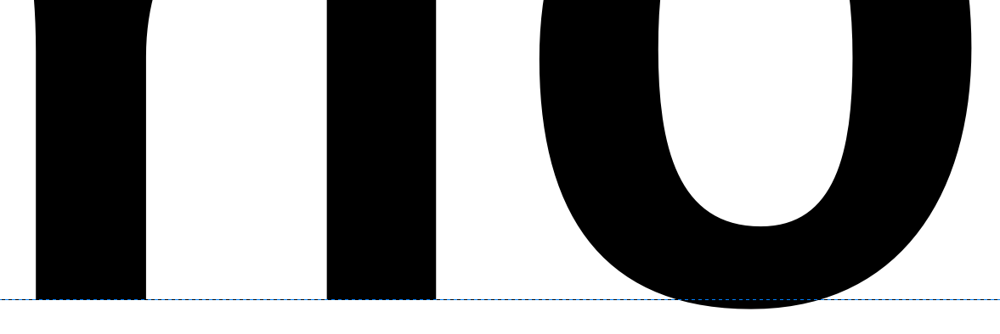
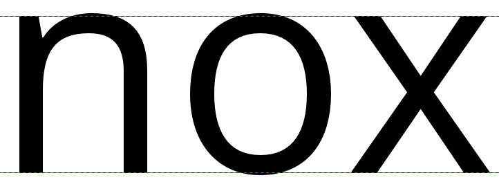
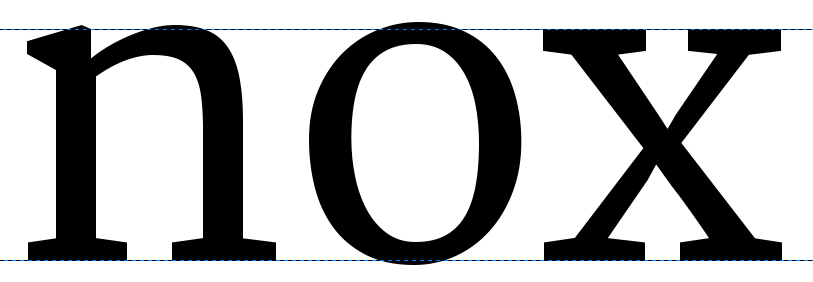
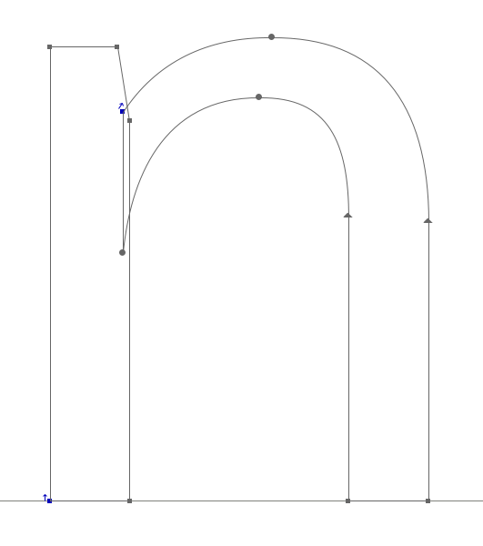
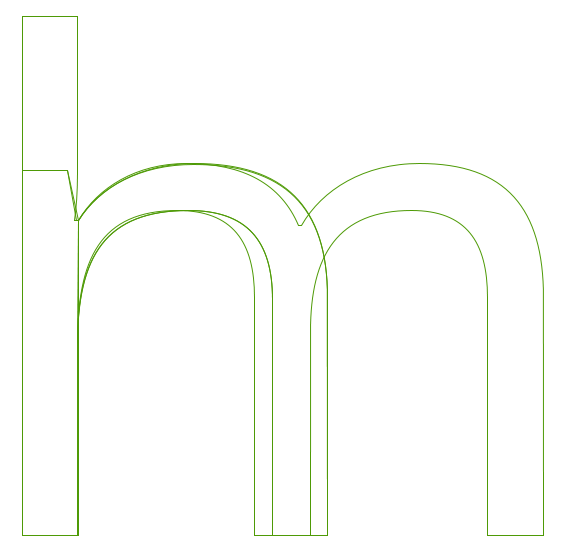
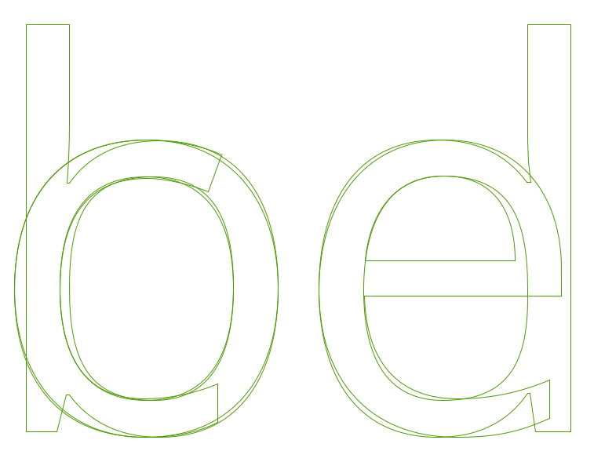
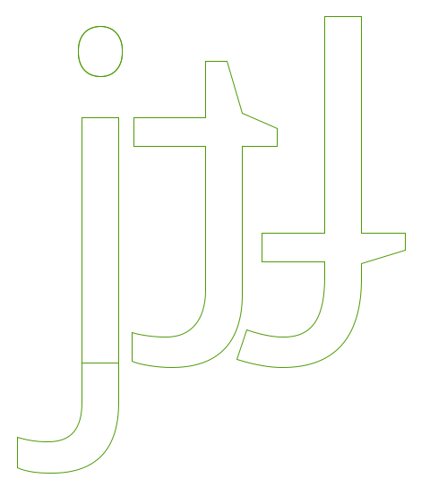

Existem muitas abordagens para projetar uma fonte. Pode ser útil desconstruir os processos maiores
envolvidos para que comece rapidamente, e fornecer uma base sólida para o valor de toda a fonte de
caracteres.
Uma abordagem popular e valiosa para isso é projetar primeiro os caracteres ‘o’ e ‘n’, acertando
elementos essenciais de forma, espaço e equilíbrio, antes de reuni-los para a formação de
outros caracteres. Criar os caracteres minúsculos ‘o’ e ‘n’ pode nos fornecer algumas das
formas e estruturas fundamentais que irão sustentar todos os outros caracteres que são necessários.

Embora o design do ‘o’ possa parecer bastante simples, todas as características mencionadas
no capítulo [“O que é uma Fonte?”][“What is a font?”] entram em jogo. A escolha que você faz sobre cada característica
deve ser uma escolha deliberada.

## Curvas Excedentes e Compensação Ótica

Uma maneira pela qual efeitos ópticos impactam o design de tipo é como curvas e bordas retas aparecem
ao olho.
Por exemplo, para que uma curva e uma borda reta pareçam estar alinhandas corretamente na
linha de base (Baseline), a curva deve estar na verdade um pouco abaixo da linha, produzindo uma *curva excedente*. A
parte do caractere que mergulha logo abaixo da linha de base (Baseline) para parecer assentada na
linha de base é chamada de *excedente* &mdash; demonstrada abaixo. Sem essas partes excedentes, os caracteres com
curvas em torno da linha de base aparecerão desalinhados em uma linha de texto.

Dessa forma, uma área de *compensação ótica* é necessária para fornecer a ilusão de alinhamento
na altura de x (x-height) e na altura das maiúsculas (Cap Height) (veja abaixo).

## Projetando O ‘o’ Minúsculo

O design do ‘o’ não é apenas uma questão da parte preta da letra. Enquanto o ‘o’ fornece
o peso e a forma mais básica do bojo, o branco &mdash; ou oco &mdash; fornece o tamanho e
a forma usados pelo resto da fonte.
Em termos gerais, também podemos observar que a forma redonda do ‘o’ será ecoada em outros
caracteres. Estes incluem o b, c, d, e, p, e q, e a forma também implicará a modelagem
e formas de curvas dentro de qualquer outro caractere da fonte, como O, C, D, e Q.

Além disso, o branco dentro do ‘o’ deve ser utilizado ao projetar o espaçamento de nossa fonte; o
‘o’ também configura a referência de ritmo dos espaços usados entre todos os outros glifos na fonte. Estes dois
valores estão muito relacionados, então, essencialmente, você também precisará projetar a quantidade de espaço em branco que formam
as distâncias laterais do seu ‘o’. Como princípio geral, com exceção de fontes inclinadas ou
itálicas, o ‘o’ deve ter a mesma quantidade de espaço nos lados esquerdo e direito, e o espaço em
branco entre uma sequência de caracteres ‘o’ deve balancear o espaço em branco no interior dos ‘o’s.

Aqui, adentramos bem no território de espaçamento e métricas, então mesmo nessa fase inicial, você
pode querer dar uma olhada no capítulo [“Espaçamento, Métricas, e Kerning”][“Spacing, Metrics, and Kerning”], que cobre as implicações
básicas do espaçamento em uma fonte.
Isso deve levá-lo a um caractere ‘o’ bem espaçado, o que o ajudará com o design do ‘n’.

## Design Do ‘n’ Minúsculo

Uma vez que você esteja satisfeito com a forma e o espaçamento do seu ‘o’ minúsculo, como mostrado com um exemplo
de sequência de caracteres, o próximo passo dessa abordagem é criar um ‘n’ minúsculo equilibrado, bem espaçado e
com forma adequada, o qual você irá injetar na sua sequência de ‘o’s.

Se olharmos a anatomia de um ‘n’, podemos separá-lo em dois ou três componentes consistindo de uma <i>haste</i> e uma <i>curva</i>.
Esta abordagem pode nos dar um atalho para manter o equilíbrio e a harmonia dentro de nossos caracteres à medida que eles
são formados, e à medida que nosso conjunto de caracteres cresce. Olhando para o ‘n’ mostrado abaixo; ele é dividido em
dois componentes. Estes componentes separados se combinam para formar um ‘n’, mas os mesmos componentes
serão reutilizados mais tarde ao formar outros caracteres; por exemplo, a haste à esquerda do ‘n’ pode ser
usada para formar a haste esquerda de todos os outros caracteres minúsculos.

Adiantando-se novamente para o capítulo sobre espaçamento e métricas, o design do caractere ‘n’
deve acompanhar o processo de espaçar os caracteres ‘n’ e ‘o’ juntos.

Agora, pegando os métodos que você usou para criar os caracteres ‘n’ e ‘o’, você está pronto para expandir
o conjunto de caracteres minúsculos. As qualidades dos componentes de haste e curva do ‘n’ e ‘o’
informam o jeito que você pode formar outros caracteres.
Se estudarmos os caracteres abaixo da [Open Sans], podemos ver as relações entre os aspectos
formais de caracteres separados e como eles podem ser repetidos, com alguns ajustes, para formar os
componentes de nossa fonte.

[“What is a font?”]: What_Is_a_Font.html
[“Spacing, Metrics, and Kerning”]: Spacing_Metrics_and_Kerning.html
[Open Sans]: http://opensans.com/
