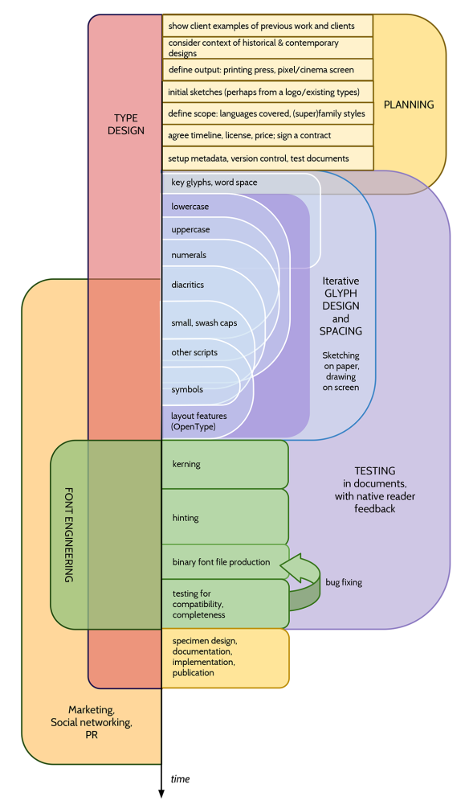

Agora que você entende que o desenho de uma fonte pode variar, você pode decidir se o seu projeto
vai envolver apenas uma fonte, se será uma coleção de diversos estilos, ou uma família de
três ou quatro estilos (agora uma tradição), ou algo ainda maior.

Os estilos mais comuns de famílias de tipos incluem:

* Regular e Bold
* Regular, Bold e Itálico &mdash; eventualmente com Bold em itálico
* Fino, Light, Book, Regular, Semi-Bold, Bold, Extra-Bold, Pesado e Black
* Regular, Condensado, Bold e Bold Condensado
* Estreito, Condensado, Largo e Extra-Largo
* Regular, Semi-Floreado, Floreado, Muito Floreado, Extremamente Floreado.

Enquanto que existem motivos para padrões de famílias existirem, vodê pode ter em mente um tipo
bem diferente de agrupamento.

O escopo do seu projeto pode ser determinado de acordo com sua pretensão e tempo
disponível. Mas muitas vezes os escopos são determinados pelo uso que será dado para coleção ou família de
fontes, ou, ainda, pela necessidade do seu cliente. Certamente, para tipógrafos profissionais,
as duas últimas questões são os fatores mais determinantes.

## A Sensação

A coisa mais importante a se pensar num desenho de tipo é a sensação que ele evoca.
É difícil verbalizar, mas é isso que torna uma fonte consideravelmente diferente de qualquer outra.

Um tipógrafo de Portugal, Natanael Gama, que desenhou a família [Exo](https://fonts.google.com/fonts/specimen/Exo) usando FontForge,
apresenta em sua página um outro projeto para o escultor [John Williams](http://ndiscovered.com/john-williams/), e inclui um descritivo que indica os aspectos do projeto:

* Figurativo &ndash; Abstrato: 50%
* Gracioso &ndash; Robusto: 30%
* Calmo &ndash; Enérgico: 0%
* Confuso &ndash; Claro: 15%
* Experimental &ndash; Normal: 15%
* Notório &ndash; Casual: 15%
* Outras ideias: Beleza, Espaços externos, Condição Humana

## Quantidade de Caracteres

Uma fonte ainda será uma fonte mesmo que contenha apenas um caractere. Mas uma fonte também pode conter centenas
ou até milhares de caracteres. Se o seu projeto é de iniciativa própria, então esta escolha
é arbitrária. É você quem terá que decidir se deseja apenas maiúsculas, ou se quer incluir caracteres encontrados em
outras fontes que você usa. Se você está trabalhando para um cliente, você deve especificar qual
ou quais línguas a fonte pretende oferecer suporte. Seu objetivo também poderia ser ampliar uma fonte existente,
adicionando alguns caracteres para que funcione em uma ou mais línguas.

É certamente uma boa ideia fazer esta escolha de maneira intencional, e desviar da tendência
de pecar por excesso. É comum que durante a criação de uma fonte, seja tentador incluir mais e
mais caracteres &mdash; mas é de mais-valia continuar melhorando o conjunto de caracteres básicos
do que adicionar novos.

## Fluxo de trabalho em famílias de muitos estilos

Se você decide, desde o início, que pretende ter mais de uma fonte, você irá poupar tempo se
planejar e construir a família sistematicamente, trabalhando em seus estilos aos poucos e paralelamente, em vez
de completar um estilo por vez.

Certamente, é impossível criar *cada* estilo de maneira completamente paralela, mas é
possível completar uma determinada etapa do desenho de cada estilo à medida em que se verifica as
relações entre eles, desde o início. Pode ser útil completar
um conjunto completo de letras de teste (por exemplo “adhesion”) na versão regular e, em seguida, fazer
o mesmo para os outros estilos. Mas você também pode tornar o processo ainda mais gradual,
tomando decisões sobre partes específicas das letras-base (como ‘n’ e ‘o’) para todos os estilos
de uma só vez.

Dependendo da abrangência e variação da família que está sendo planejada, você pode economizar
tempo fazendo uma interpolação de caracteres, não apenas entre estilos
intermediários, mas para designar preceitos para o desenho das variáveis tipográficas que permeiam os
membros da família.

Para mais informações sobre variáveis tipográficas, veja o capítulo
[“O que é uma fonte?”](What_Is_a_Font.html).

## Técnico: Gerenciamento de Versões

Aprenda sobre Git e Github para administrar seus arquivos, e use o formato "SFDir" em seus projetos.

* [Discussion about using Git to manage SFDir files](https://groups.google.com/forum/#!topic/googlefonts-discuss/CQ-S8Y3ROqc)
* <https://help.github.com/articles/what-are-other-good-resources-for-learning-git-and-github>

## Etapas do Processo

Back in 2010, Dave Crossland, Eben Sorkin, Claus Eggers Sørensen, Pablo Impallari, Alexei Vanyashin, Dan Rhatigan and other Anonymous contributors developed a total process diagram for Latin fonts:

This was made with Google Drawings and like this site is licensed under the Creative Commons Attribution-ShareAlike licence.
The source is [here](https://commons.wikimedia.org/wiki/File:Latin_Typeface_Design_Process_Overview.pdf).

A version for Non-Latin (Devanagari) projects is also available at [here](https://commons.wikimedia.org/wiki/File:Devanagari_Typeface_Design_Process_Overview.pdf).

<!-- Editable versions of the above, with unknown stability, may be found in GitHub PR №225. -->

## Ambientes de Teste

When planning your project, you must consider the intended mediums for your typeface.
Examples of mediums are web and mobile platforms, digital projectors,
cheap office bubble-jet and laser printers, high-end print bureau laser printers,
magazine offset lithographic printing, and high-speed high-volume newspaper printing.

You should then try to acquire or arrange access to those typesetting technologies, so you can see
the real results of your work.

Throughout the type design process, you will find it very helpful to preview text set with your
(prototype) typeface at a resolution higher than your laptop or workstation screen. This typically
means a laser printer with "true" 1200 DPI and Adobe PostScript 3. For individuals it is possible
to purchase something like this for around $500, and some 2013 recommendations were:

* HP P2055d
* Xerox Phaser 4510
* Xerox Phaser 5550
* Nashua/Ricoh P7026N

In May 2013, the [Production Type](http://productiontype.com) studio had a Xerox 7525 with a "fiery" controller, which cost around €12,000 to purchase. This could be leased for €300 per month with toner, parts and maintenance.
In late 2015, Octavio Pardo leased a [Xerox Phaser 7100](
https://www.xerox.com/en-us/office/printers/phaser-7100) in a similar way for €30 per month.

## OpenType Features

You can plan the OpenType features of your project before you begin drawing. Common features include:
* `liga` ligatures
* `onum`, `lnum` numerals

For some languages `locl` works but for others it doesn't, so it is best to expose language specific forms via both `locl` and `ssNN` or `cvNN`.

The OpenType specification allows for some kinds of features which are not recommended:
* `hist`. Read more in this [discussion on TypeDrawers](http://typedrawers.com/discussion/1358/what-are-the-best-practices-for-the-hist-feature-long-s).

## Further Reading

* Aoife Mooney's presentation on the type design process at TypeCon 2014: <https://vimeo.com/107421895>
* TypeDrawers discussion of [Printer recommendations for proofing](http://typedrawers.com/discussion/314/printer-recommendations-for-proofing)
