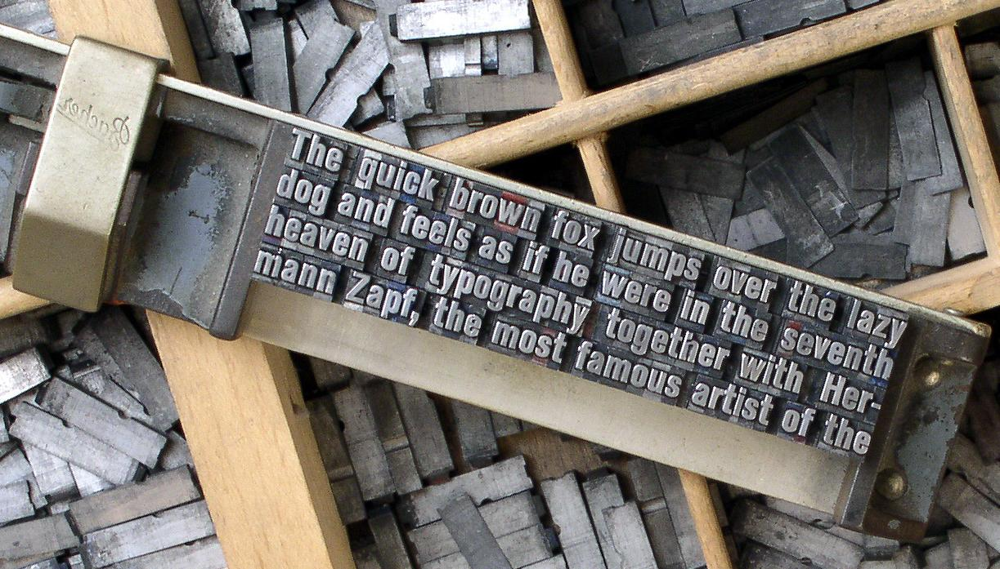
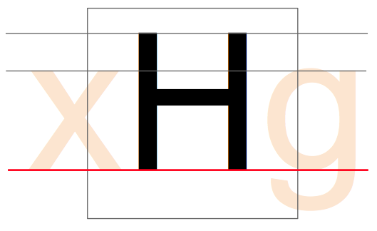
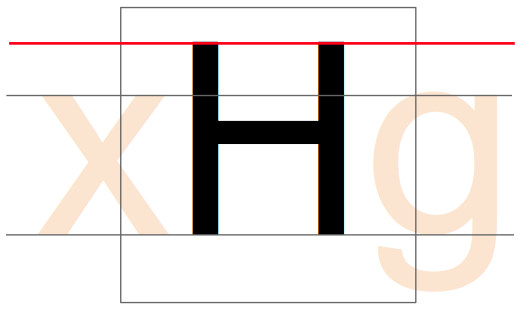
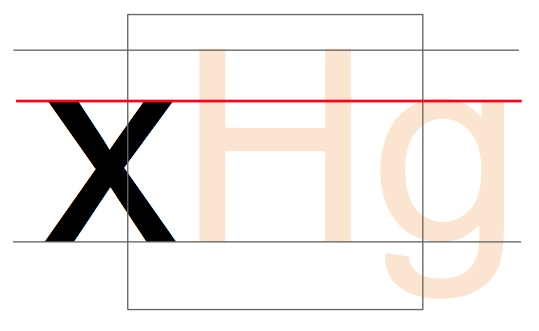

&mdash; Also called the ‘em size’ or ‘UPM’.  
In a font, each character is fitted into its own space container. In traditional metal type this
container was the actual metal block of each character. The height of each character piece was
uniform, allowing the characters to be set neatly into rows and blocks (see below).

The height of the type piece is known as the ‘em’, and it originates from the width of the uppercase
‘M’ character; it was made so that the proportions of this letter would be square (hence the ‘em
square’ denomination).  
The em size is what the point size of metal type is calculated upon. So, a 10 points type has a 10
points em (see below).
 

In digital type, the em is a digitally-defined amount of space. In an OpenType font, the UPM &ndash;
or em size is usually set at 1000 units. In TrueType fonts, the UPM is by convention a power of two,
generally set to 1024 or 2048.

When the font is used to set type, the em is scaled to the desired point size. This means that for
10 pt type, the 1000 units for instance get scaled to 10 pt.

So if your uppercase ‘H’ is 700 units high, it will be 7 pt high on a 10 pt type.

### Setting that up in the Glyph Window

With the knowledge that your font is using a 1000, 1024, or 2048 UPM, you need to set up the drawing
of your glyphs to ensure that all aspects of your typeface fit adequately into that UPM square.

The size of the em square can be set from *Element > Font Info&hellip;* then click on the General
tab and you will see the *EM* setting, which value shall be distributed between the *Ascender* and
*Descender* heights, respectively heights above and underneath the baseline.

The Baseline:

The Cap Height:

The x-height:

Later when designing your type, you will have to set the Blue values which serve for PostScript
outlines and also for the FontForge autohinter &ndash; regardless of which outlines you are working
on.  
You will find the setting in *Element > Font Info&hellip;*, on the *PS Private* tab. FontForge can
initially guess the values based on your outlines, but you will have to edit them yourself for
overshoots/undershoots &mdash; we are a few chapters ahead of this concept (see 
[“Creating ‘o’ and ‘n’”]); let’s first get ahold of FontForge and its drawing functionalities.

[“Creating ‘o’ and ‘n’”]: Creating_o_and_n.html