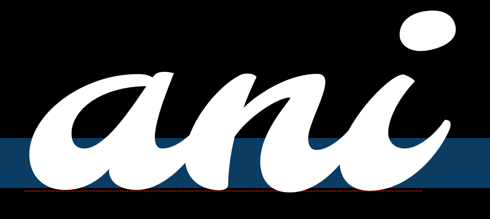

&mdash; O que diferencia a tipografia da escrita manual, caligrafia, letreiramento ou de logotipos?

A grande questão que faz o design de tipos diferente é a necessidade de cada glifo presente em uma fonte
funcionar em relação a todos os outros. Isso significa que o design e o espaçamento de cada parte
da tipografia exige uma série de decisões cuidadosas. Estas decisões significam que podemos
pensar melhor sobre o design tipográfico como a criação de uma maravilhosa coleção de letras, mas não como uma
coleção de letras maravilhosas. Em outras palavras, devemos pensar no grupo e como ele vai
funcionar em conjunto e priorizar isto sobre qualquer questão sobre quão maravilhosa pode ser uma única letra.

A necessidade de priorizar o conjunto ao invés de uma parte única, também leva a um indispensável
comprometimento com o processo de design em nível sistêmico. É importante focar em algumas características 
que diferenciam as letras, especialmente no início do processo de design.

Uma outra particularidade no design de tipos é que, em grande medida, as formas que estamos projetando já foram
significativamente estabelecidas. Nossa tarefa como designers de tipos está mais próxima de criar novas versões 
sobre formas existentes do que inventar formas completamente novas. Isso pode confundir type designers iniciantes.
Encontrar a quantidade certa de mudança com o objetivo de aguçar o leitor e não irritá-lo é uma tarefa complicada. 
Muitas vezes, designers ficam presos no desenho de letras específicas. Este erro pode ser facilmente evitado se você 
perceber desde o início que o mais importante em uma fonte é a identificação das partes que mais se repetem. 
Design de tipos não é só sobre projetar determinadas características aplicadas às formas comuns que nós reconhecemos, 
mas também as formas que ocorrem com mais frequência.

É muito útil reconhecer que estas características não só ajudam a criar uma voz ou atmosfera para uma fonte,
como também determinam se ela será ou não eficiente em determinado contexto tecnológico.

Pode parecer intimidador ou excessivamente abstrato pensar sobre o design de uma fonte desta maneira.
No entanto, se acostumar com essas idéias é a chave para um rápido, eficaz e satisfatório
processo no design de tipos.

Vamos começar a identificar as principais características sistêmicas no design de tipos.

### Construção

Nos referimos a Construção quando analisamos os traços fundamentais que dão forma a um particular glifo. 
O tipo de construção que utilizamos é sem dúvida uma das questões mais importantes para se pensar, pois trará
efeitos sobre muitas das opções restantes, particularmente se o seu projeto de alguma forma vai se sentir familiar para os leitores.

No exemplo acima, a linha branca dentro das letras indica a construção aproximada sugerida pela forma das próprias letras.

Nos referimos a Construção quando analisamos a estrutura dos traços fundamentais que dão forma particular a um glifo. 
Possivelmente você pode imaginar o esqueleto do glifo. O tipo de construção utilizada é sem dúvida uma das questões 
mais importantes de se pensar, pois trará efeitos sobre muitas das opções restantes, particularmente se o seu projeto 
de alguma forma vai se sentir familiar para os leitores.

No entanto, a forma como os traços terminam (os ‘terminais’) e as ‘serifas’ (abaixo) não são geralmente parte do que chamamos
por ‘construção’. Construção é o esqueleto do glifo, enquanto o restante; – largura, peso, terminais – são todas as partes do corpo.

No exemplo acima, a linha branca dentro das letras indica a construção aproximada
sugerida pela forma das próprias letras.

### Proporções da altura-x para a altura da Caixa-alta

As letras posicionadas ao lado esquerdo fazem parte da fonte [ Playfair Display], que tem uma altura-x grande em relação à altura
da sua caixa-alta. As letras à direita são da fonte [ EB Garamond ], que tem uma altura-x menor. 
No exemplo acima, o tamanho do H foi ajustado para ficar na mesma altura.

### Altura Ascendente

No exemplo acima, as alturas de x foram ajustadas para ilustrar a diferença de relação
entre as alturas ascendentes.

Ascendentes geralmente ultrapassam pelo menos um pouco a altura das capitulares, especialmente em fontes para texto. Em alguns
casos, no entanto, elas podem ser iguais ou mais baixas que a altura das capitulares. Ascendentes mais longas podem adicionar
elegância para o visual de uma fonte. Elas costumam ter altura de x menor.

### Descendentes

Assim como nas ascendentes, as descendentes longas aparentam elegância.

Apresentadas em conjunto, ascendentes e descendentes longas podem se tornar difíceis de gerenciar. Se sua fonte
for utilizada com uma entrelinha pequena, as letras alongadas podem colidir sobre as linhas do texto.

## Largura

A largura do seu tipo irá alterar não só a sua aparência mas também sua usabilidade.
O exemplo da direita é de uma fonte para texto, o da esquerda é de uma fonte display que pretende atrair 
mais rapidamente a atenção do leitor. Letras mais estreitas que a fonte de texto do exemplo também são possíveis
e podem ser utilizadas para economizar espaço, por exemplo para encaixar mais texto em espaços menores.

### Largura regular versus largura variável

As letras na linha de cima deste exemplo apresentam uma maior variedade de largura que as letras na
linha de baixo.

### Peso

### Inclinação

### Contraste

Ao falarmos Contraste nos referimos a variação de largura do traço encontrada em um glifo.
Percebe-se nos dois glifos ’O’ abaixo que o da esquerda apresenta maior variação na espessura de linha entre 
o topo e as laterais do glifo. Ambos tem contraste, mas o exemplo da esquerda tem muito mais que o da direita.

Tipos com peso consistente (largura do traço) em seus glifos ou sem contraste visível, produzem
uma distinção pura dos tipos sem contraste. Assim como a escolha entre tipos com ou sem serifa,
contraste é uma escolha inicial no design de tipos. É interessante notar que o design de serifas
’slab’(quadradas) geralmente usa uma largura consistente do traço em suas letras, e que o design de
serifas quadradas não se trata somente sobre serifas por mais que falemos delas! Devemos lembrar de
aplicar as regras de percepção (veja {“Confiando em seus olhos”]) &ndash;  contraste é mais sobre como
o peso aparenta do que a sua medida exata.

### Ângulo de contraste

Na imagem abaixo, vemos que as formas das partes finas das letras ‘o’ minúsculas são diferentes.
No glifo da esquerda, as partes finas se encontram em um eixo vertical perfeito. No glifo da direita,
o eixo é diagonal.

### Distribuição do peso

Se sua fonte apresenta contraste mínimo ou quase inexistente, você não precisa pensar muito sobre isso.
No entanto a maioria das fontes tem pelo menos algum grau de contraste. Nesses casos, você tem uma ampla
variedade de opções para escolher quando chegar a hora de distribuir o peso em sua fonte.

#### Vertical

Distribuição vertical de peso é muito comum. O 9 e 8 abaixo são um bom exemplo em particular.

#### Horizontal

Distribuição de peso horizontal é bem menos comum no entanto é vista em muitas fontes.

#### Peso na base

#### Peso no topo

#### Irregular

### Hastes

É fácil assumir que as suas hastes serão retas e que esta não é uma preocupação real, mas
ambos peso e forma das hastes, são caminhos que podem e devem fazer parte de suas escolhas.

### Joins

### Bowls

Note that bowls are the stroke part in the below illustrations and not the black inner forms. The
inner strokes are referred as “counters”. While designing type, you will often find yourself
altering your work not because of the shape or width of the stroke but due to the shape and size of
the counter.

### Terminals

Terminals are the end forms of the strokes. They are not same as the serifs. They are often
perpendicular to the angle of the stroke at its end, or sheared horizontally or vertically. They may
also reflect the shape of the nib or other mark-making tool that the letter forms evoke.

### Speed

The ‘n’ on the left seems to be written much faster than the one on the right. Speed is discussed in
more detail in the chapter [on italics].

### Regularity

The following characteristics are not present in all type designs, however they are variables that
may be a part of your design. If this is the case, it is worth considering the degree to which they
will play a role as a variable.

### Flourish

Notice that in the font on top the flourish is more present in the capital letter and the second one
the flourish is more in the lowercase.

### Serif - To be or not to be

Serifs are one of the most distinct aspects of a typeface, and often the first classification of
type is between serif and sans-serif type.

This choice affects how the end terminals will look like. Serifs can be two sided or one sided. They
can be perpendicular to stroke or have their own direction (like being always horizontal or
vertical). Serifs can be with or without brackets. Any serif design is a mix of all of the above
applied consistently to the type design with some deviations for particular letters, especially the
‘S’, ‘C’ and ‘Z’ (e.g. a type with horizontal serifs for all letters will often have s, c and z to
have vertical serifs).

There is a urban legend asserting that serif types are easier to read than sans-serifs &ndash; it is
[a sole myth](http://asserttrue.blogspot.se/2013/01/the-serif-readability-myth.html), until further
notice.

The form of the serifs are related to the forms of the terminals.

#### Brackets

The corner portions of a serif where it connects to the main stroke are called ‘brackets’. A
particular design may have them giving a soft feel to the serif ([Times New Roman] is an example) or
may choose to not have any bracket. Some designs also use brackets only on one side or with
different proportions on the two sides.

This is a relatively strong parameter that renders feel to the type &ndash; elegance (smooth or
large brackets of [Times New Roman]) or chunky crisp (absent brackets of [Arvo]).

#### Slab-serifs

Also called mechanistic or Egyptian type, slabs are thick, block-like serifs. Slab serifs don’t use
brackets. Generally speaking, type design with such serifs are seen to have less contrast in their
glyphs &ndash; [Rockwell], [Courier] or [American typewriter] reflect that.

It may be safe to assume that slab serifs have been used to add some ornament or rhythm to an
otherwise no-contrast type design. But this is not an absolute rule.

#### Serif Terminals

Just like letter terminals, the end shape of the serifs themselves contribute to the feel of the
type &ndash; either soft or chunky. Serif terminals can be soft and rounded ([Courier]) or blunt and
angular ([Rockwell]).

### Decoration

### Dimension

[Playfair Display]: http://www.forthehearts.net/typeface-design/playfair-display/
[EB Garamond]: http://www.georgduffner.at/ebgaramond/
[“Trusting your eyes”]: Trusting_Your_Eyes.html
[on italics]: Italic.html
[Times New Roman]: http://practicaltypography.com/times-new-roman.html
[Arvo]: http://files.korkork.com/index.php?/fonts/arvo/
[Rockwell]: http://www.myfonts.com/fonts/mti/rockwell/
[Courier]: http://typedia.com/explore/typeface/courier/
[American typewriter]: http://www.myfonts.com/fonts/linotype/itc-american-typewriter/

