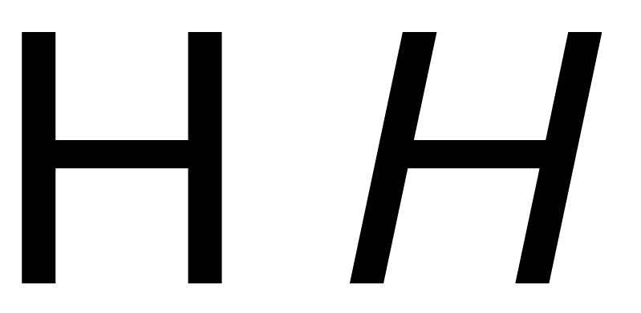

&mdash; O que diferencia a tipografia da escrita manual, caligrafia, letreiramento ou de logotipos?

A grande questão que faz o design de tipos diferente é a necessidade de cada glifo presente em uma fonte
funcionar em relação a todos os outros. Isso significa que o design e o espaçamento de cada parte
da tipografia exige uma série de decisões cuidadosas. Estas decisões significam que podemos
pensar melhor sobre o design tipográfico como a criação de uma maravilhosa coleção de letras, mas não como uma
coleção de letras maravilhosas. Em outras palavras, devemos pensar no grupo e como ele vai
funcionar em conjunto e priorizar isto sobre qualquer questão sobre quão maravilhosa pode ser uma única letra.

A necessidade de priorizar o conjunto ao invés de uma parte única, também leva a um indispensável
comprometimento com o processo de design em nível sistêmico. É importante focar em algumas características 
que diferenciam as letras, especialmente no início do processo de design.

Uma outra particularidade no design de tipos é que, em grande medida, as formas que estamos projetando já foram
significativamente estabelecidas. Nossa tarefa como designers de tipos está mais próxima de criar novas versões 
sobre formas existentes do que inventar formas completamente novas. Isso pode confundir type designers iniciantes.
Encontrar a quantidade certa de mudança com o objetivo de aguçar o leitor e não irritá-lo é uma tarefa complicada. 
Muitas vezes, designers ficam presos no desenho de letras específicas. Este erro pode ser facilmente evitado se você 
perceber desde o início que o mais importante em uma fonte é a identificação das partes que mais se repetem. 
Design de tipos não é só sobre projetar determinadas características aplicadas às formas comuns que nós reconhecemos, 
mas também as formas que ocorrem com mais frequência.

É muito útil reconhecer que estas características não só ajudam a criar uma voz ou atmosfera para uma fonte,
como também determinam se ela será ou não eficiente em determinado contexto tecnológico.

Pode parecer intimidador ou excessivamente abstrato pensar sobre o design de uma fonte desta maneira.
No entanto, se acostumar com essas idéias é a chave para um rápido, eficaz e satisfatório
processo no design de tipos.

Vamos começar a identificar as principais características sistêmicas no design de tipos.

### Construção

Nos referimos a Construção quando analisamos os traços fundamentais que dão forma a um particular glifo. 
O tipo de construção que utilizamos é sem dúvida uma das questões mais importantes para se pensar, pois trará
efeitos sobre muitas das opções restantes, particularmente se o seu projeto de alguma forma vai se sentir familiar para os leitores.

No exemplo acima, a linha branca dentro das letras indica a construção aproximada sugerida pela forma das próprias letras.

Nos referimos a Construção quando analisamos a estrutura dos traços fundamentais que dão forma particular a um glifo. 
Possivelmente você pode imaginar o esqueleto do glifo. O tipo de construção utilizada é sem dúvida uma das questões 
mais importantes de se pensar, pois trará efeitos sobre muitas das opções restantes, particularmente se o seu projeto 
de alguma forma vai se sentir familiar para os leitores.

No entanto, a forma como os traços terminam (os ‘terminais’) e as ‘serifas’ (abaixo) não são geralmente parte do que chamamos
por ‘construção’. Construção é o esqueleto do glifo, enquanto o restante; – largura, peso, terminais – são todas as partes do corpo.

No exemplo acima, a linha branca dentro das letras indica a construção aproximada
sugerida pela forma das próprias letras.

### Proporções da altura-x para a altura da Caixa-alta

As letras posicionadas ao lado esquerdo fazem parte da fonte [ Playfair Display], que tem uma altura-x grande em relação à altura
da sua caixa-alta. As letras à direita são da fonte [ EB Garamond ], que tem uma altura-x menor. 
No exemplo acima, o tamanho do H foi ajustado para ficar na mesma altura.

### Altura Ascendente

No exemplo acima, as alturas de x foram ajustadas para ilustrar a diferença de relação
entre as alturas ascendentes.

Ascendentes geralmente ultrapassam pelo menos um pouco a altura das capitulares, especialmente em fontes para texto. Em alguns
casos, no entanto, elas podem ser iguais ou mais baixas que a altura das capitulares. Ascendentes mais longas podem adicionar
elegância para o visual de uma fonte. Elas costumam ter altura de x menor.

### Descendentes

Assim como nas ascendentes, as descendentes longas aparentam elegância.

Apresentadas em conjunto, ascendentes e descendentes longas podem se tornar difíceis de gerenciar. Se sua fonte
for utilizada com uma entrelinha pequena, as letras alongadas podem colidir sobre as linhas do texto.

## Largura

A largura do seu tipo irá alterar não só a sua aparência mas também sua usabilidade.
O exemplo da direita é de uma fonte para texto, o da esquerda é de uma fonte display que pretende atrair 
mais rapidamente a atenção do leitor. Letras mais estreitas que a fonte de texto do exemplo também são possíveis
e podem ser utilizadas para economizar espaço, por exemplo para encaixar mais texto em espaços menores.

### Largura regular versus largura variável

As letras na linha de cima deste exemplo apresentam uma maior variedade de largura que as letras na
linha de baixo.

### Peso

### Inclinação

### Contraste

Ao falarmos Contraste nos referimos a variação de largura do traço encontrada em um glifo.
Percebe-se nos dois glifos ’O’ abaixo que o da esquerda apresenta maior variação na espessura de linha entre 
o topo e as laterais do glifo. Ambos tem contraste, mas o exemplo da esquerda tem muito mais que o da direita.

Tipos com peso consistente (largura do traço) em seus glifos ou sem contraste visível, produzem
uma distinção pura dos tipos sem contraste. Assim como a escolha entre tipos com ou sem serifa,
contraste é uma escolha inicial no design de tipos. É interessante notar que o design de serifas
’slab’(quadradas) geralmente usa uma largura consistente do traço em suas letras, e que o design de
serifas quadradas não se trata somente sobre serifas por mais que falemos delas! Devemos lembrar de
aplicar as regras de percepção (veja {“Confiando em seus olhos”]) &ndash;  contraste é mais sobre como
o peso aparenta do que a sua medida exata.

### Ângulo de contraste

Na imagem abaixo, vemos que as formas das partes finas das letras ‘o’ minúsculas são diferentes.
No glifo da esquerda, as partes finas se encontram em um eixo vertical perfeito. No glifo da direita,
o eixo é diagonal.

### Distribuição do peso

Se sua fonte apresenta contraste mínimo ou inexistente, você não precisa pensar muito sobre isso.
No entanto a maioria das fontes tem pelo menos algum grau de contraste. Nesses casos, você tem muitas
opções para escolher quando chegar a hora de distribuir o peso em sua tipografia.

#### Vertical

Distribuição vertical de peso é muito comum. Os números 9 e 8 abaixo são em particular um bom exemplo.

#### Horizontal

A distribuição de peso horizontal é bem menos comum, no entanto é encontrada em muitas fontes.

#### Peso na base

#### Peso no topo

#### Irregularidade

### Hastes

É fácil assumir que as suas hastes serão retas e que esta não é uma preocupação real, mas
ambos peso e forma das hastes são caminhos que podem e devem fazer parte de suas escolhas.

### Joins

### Bowls

Note that bowls are the stroke part in the below illustrations and not the black inner forms. The
inner strokes are referred as “counters”. While designing type, you will often find yourself
altering your work not because of the shape or width of the stroke but due to the shape and size of
the counter.

### Terminais

Terminais são as formas finais dos traços. Não são o mesmo que serifas. Se apresentam geralmente
perpendiculares ao ângulo do traço em seu final ou cortados de maneira rente de forma horizontal ou vertical.
Os terminais geralmente refletem a forma da pena ou de outra ferramenta que inspirou o desenho das letras.

### Velocidade

O ’n’ da esquerda parece ter sido escrito com muito mais velocidade que o da direita. Velocidade é
discutida em detalhes no capítulo [itálicos].

### Regularidade

As características a seguir apresentadas não estão presentes em todas as fontes, de qualquer 
maneira são variações que podem fazer parte do seu design. Se for este o caso, é válido considerar 
o grau que elas irão desempenhar seu papel.

### Floreios

Observe que o floreio se encontra mais presente na letra maiúscula B no exemplo de cima 
e na letra minúscula f no exemplo da parte de baixo.

### Serifas - Ser ou não ser

Serifas são apenas um dos aspectos que distinguem uma fonte, frequentemente a primeira maneira de
classificar tipos é com serifas ou sem serifas.

Esta escolha influencia como os terminais serão. Serifas podem ter um ou dois lados. Podem
ser perpendiculares ao traço ou ter direção própria (como sempre na horizontal ou na vertical). 
Serifas podem ser com ou sem brackets. Todo o projeto de serifas é uma mistura dos itens acima aplicados
de forma consistente para o design de tipos com algumas mudanças para letras em particular, especialmente 
no 'S', 'C' e 'Z' (por exemplo, um tipo com serifas horizontais em todas as letras frequentemente têm 
s, c e z com serifas verticais).

Existe uma lenda urbana afirmando que os tipos com serifa são mais fáceis de ler do que os sem serifa &ndash; 
ele é [um mito único](http://asserttrue.blogspot.se/2013/01/the-serif-readability-myth.html), até novo aviso.

A forma das serifas estão relacionadas às formas dos terminais.

#### Brackets

As partes do canto de uma serifa que se conectam ao traço principal são chamadas de ‘brackets’. Um
design particular pode apresentá-los para dar uma sensação suave à serifa ([Times New Roman] é um exemplo) 
ou pode optar por não ter nenhum bracket. Alguns designs também usam brackets só de um lado ou com
diferentes proporções nos dois lados.

Este é um parâmetro relativamente forte que trás ao tipo a sensação de &ndash; elegância (suaves e
grandes brackets da [Times New Roman]) ou robustos e quebradiços (brackets ausentes da [Arvo]) .

#### Serifas quadradas

Também conhecidas como tipografia mecana ou egípcia, Slabs são serifas grossas como blocos. Slab serifs não usam
brackets. Genericamente falando, type design com esse tipo de serifa tem menos contraste em seus 
glifos &ndash; [Rockwell], [Courier] or [American typewriter] refletem isso.

Pode ser seguro afirmar que slab serifs tem sido usadas para adicionar algum ornamento ou ritmo 
de alguma maneira a um type design sem contraste. Mas isto não é uma regra absoluta.

#### Terminais das serifas

Assim como os terminais das letras, a forma final das serifas contribui para a sensação do
tipo &ndash; seja macia ou grossa. Terminais das serifas podem ser suaves e arredondados ([Courier])
ou bruscos e angulares ({Rockwell]).

### Decoração

### Dimensão

[Playfair Display]: http://www.forthehearts.net/typeface-design/playfair-display/
[EB Garamond]: http://www.georgduffner.at/ebgaramond/
[“Trusting your eyes”]: Trusting_Your_Eyes.html
[on italics]: Italic.html
[Times New Roman]: http://practicaltypography.com/times-new-roman.html
[Arvo]: http://files.korkork.com/index.php?/fonts/arvo/
[Rockwell]: http://www.myfonts.com/fonts/mti/rockwell/
[Courier]: http://typedia.com/explore/typeface/courier/
[American typewriter]: http://www.myfonts.com/fonts/linotype/itc-american-typewriter/

