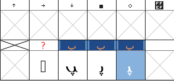

## 简介

在某些情况下一个字体可能缺少一个在你的应用程序中使用时必要的字形。阿拉伯字体在这里展示了特殊的问题，由于字形的形状不仅依赖于它在词中的位置，也依赖于字母本身的属性。因此（使用无意义的序列*babab*），字母*beh*有三种不同的形状，依赖于是否处于开头、中间还是结尾。然而（使用无意义的序列*dadad*），字母*dal*只有一个形状，而无论其处于词中的什么位置。

在开源协议（例如[GPL](http://gnu.org/copyleft/gpl.html)或[OFL]( http://scripts.sil.org/OFL-FAQ_web)下的字体允许用户做出修改。如果你修改了一个基于一个开源协议的字体然后分发它，那么你必须保持原作者的版权条款和许可信息，尽管你可以在你的分发版本的版权条款后添加你的条款。

本章介绍为一个阿拉伯字体添加一个字形。我们将使用的字体是[Graph](http://openfontlibrary.org/en/font/graph)，我们将添加的字形是*peh*（U+067E），它在阿拉伯字体中并不出现，但是在使用阿拉伯书写字母的一些语言中指定*p*（阿拉伯书写字母的字形全列表参见[Unicode图表](http://www.unicode.org/charts)）。

## 制作字体的工作副本

从网页下载并字体并解压。运行FontForge并加载字体。将其保存为*sfd*，在保存前编辑建议的名字来读取**GraphNew.sfd**。

## 重命名字体

#### 为什么要重命名字体？

如果你不重命名字体，你修改的字体将不会与原始的区分开安装 &mdash; 你将不得不首先卸载原始字体。如果你准备分发你的修改版的时候重命名字体也是明智的 &mdash; 如果字体原作者使用Reserved Font Name（RFN）机制保留了字体名，那么原始名字只能用于原作者的字体版本。

#### 修改名称数据

选择**Element -> Font Info**，在*PS Names*面板下将*Fontname*，*Family Name*和*Name For Humans*修改为**GraphNew**。

如果有必要，你可以在*Copyright*一项的文本后添加一条信息“Additional glyphs added by”。

在*TTF Names*面板下的，t*Family*和*Fullname*的名称取自*PS Names*一项，应该显示的是*GraphNew*（你不能直接编辑他们）。将*Preferred Family*和*Compatible Full*两项修改为**GraphNew**。现在如你所希望的那样，这些名称的修改将会允许你将字体与原始字体安装在一起。

如果有必要，你可以在*Designer*一项的文本后添加一条信息“Additional glyphs added by”。

点击**OK**来保存修改。你将会看到一条关于为字体生成一个新的UniqueID（XUID）的消息 &mdash; 点击**Change**。

## 为*peh*的孤立形式添加字形

打开字体图表的阿拉伯区域：选择**View -> Go to**，点击下拉框并选择**Arabic**，然后点击**OK**。

点击字体图表中的一个单元格将会在面板顶部用蓝色显示其Unicode数字和名称。转到位置1662，将会显示蓝色的*1662 (0x67e) U+067E "uni067E" ARABIC LETTER PEH*。引用的字形下面的单元格包含一个灰色的X，意味着字体并不包含这个字形。

我们将通过复制*beh*（U+0628）并将其一个点替换为三个点来制作*peh*。

点击*beh*单元格（位置1576），然后右击并选择**Copy**。然后右击*peh*单元格并选择**Paste**。现在*beh*被复制进*peh*单元格，接下来要修改的是点。

找到一个包含三个点的字形 &mdash; *sheen*（位置1588，U+0634）符合。双击这个单元格 &mdash; 将会打开一个字形设计面板。按<kbd>V</kbd>来确保工具箱的指针工具（剪头）选中，按<kbd>Z</kbd>扩大面板来给你一个字形的好的视图。

点击拖动sheen上的三个点的节点，颜色从粉色变为米色。如果你意外地包含或者忽略了一个节点，那么取消选择或者通过按<kbd>Shift</kbd>并点击来选择。按<kbd>Alt</kbd> + <kbd>C</kbd>来复制。

返回字体表格并双击*peh*单元格 &mdash; 这会将*peh*加载到字形设计面板*sheen*选项卡旁边的另一个选项卡。

点击拖动来高亮*peh*下面的点，然后按<kbd>Delete</kbd>。按<kbd>Alt</kbd> + <kbd>V</kbd>来粘贴三个点，很可能出现在*peh*主体的上面。留下高亮的点的节点，这样你可以很容易地翻转或者移动它们。

翻转点：从工具箱选择翻转工具（两个三角形中间有一条红色虚线）。（也可以右击点的中间，从弹出菜单中选择**Flip the selection**。）点击点的节点中的一个，轻微向左或右拖动鼠标。

移动翻转的点：按<kbd>V</kbd>来再次选择指针工具，点击点的节点中的一个，然后将其拖动到字形主体的下面。将他们放在*ArabicBelow*标记上的中间位置。

关闭字形设计面板。现在字体表格中的*peh*应该有一个新的字形。保存修改的字体（**File -> Save**）。

## 为*peh*的连接形式添加字形

但是这只是字形的孤立（独立）形式。如果你尝试使用你修改过的字体，你将会发现开头、中间和结尾形式并不可用。它们必须被分开制造。“这些形式作为未编码字符（FontForge约定编码是-1的字形）来构建。它们没有预定义的位置。”（Khaled Hosny）

选择**Encoding -> Add Encoding Slots**并输入你想要的字形的数量 &mdash; 在这种情况下是**3**。FontForge将会在字体的后部添加同样数量的位置，你将会被移动到字体表格中那个位置。最后三个单元格（位置65537，65538，65539）的引用字形处有一个问号，在这些单元格中你将会通过重复上面的流程添加未编码字形。

需要注意的是如果你在字体表格仍然拥有叫点的时候错误地开始输入，你会移动到顶部的European区域。要回到底部，选择**View -> Go to**，点击下拉框并选择**Not a Unicode Character**，然后点击**OK**。

#### 创建最终形式

向上滚动一点字体表格直到你向前到达位置65152（U+FE80）的一系列阿拉伯字形。在U+FE90（位置65168）你讲看到一个*behfinal*字形 &mdash; 点击它并按<kbd>Ctrl</kbd> + <kbd>C</kbd>来复制它。向下滚动到表格的倒数第三个单元格（位置65537），点击它，并按<kbd>Ctrl</kbd> + <kbd>V</kbd>来粘贴*behfinal*字形。

右击单元格并选择**Glyph Info**。命名规范是使用孤立字形的数字 + 一个形式的后缀，因此将*Glyph Name*修改为**uni067E.fina**，然后点击**OK**。引用单元格的问号将会修改为*peh*。

得到三个点：双击*sheen*（U+FEB5）来将它加载到字形设计面板，选择三个点并按<kbd>Ctrl</kbd> + <kbd>C</kbd>。

双击新的*pehfinal*来将它加载到字形设计面板，点击拖动来高亮点的节点并按<kbd>Delete</kbd>。

<kbd>Ctrl</kbd> + <kbd>V</kbd>来插入来自*sheen*的三个点，翻转它们，将它们移动到字形主体以下的位置。按来保存修改过的字体表格。

#### 创建开头和中间的形式

复制初始形式U+FE91（位置65169）到倒数第二个单元格（位置65538），删除单个点并粘贴三个点。

右击单元格，选择**Glyph Info**，将*Glyph Name*修改为**uni067E.init**，并点击**OK**。

复制中间形式U+FE92（位置65170）到最后一个单元格（位置65539），删除单个点并粘贴三个点。

右击单元格选择**Glyph Info**，将*Glyph Name*修改为**uni067E.medi**，并点击**OK**。

选择**File -> Save**来保存修改过的字体表格。

## 添加查找

孤立的形式必须被映射（连接）到它的开头、中间和结尾形式。

选择**Element -> Font Info -> Lookups**。

点击*'init' Initial Forms in Arabic lookup 2*旁边的**+**。这将会打开同名的子菜单。点击这个子菜单。

右边的*Edit Data*按钮现在将会变成可用 &mdash; 点击它。

在弹出的*Lookup Subtable*面板中，确保*Unicode*按钮勾选。将字符列表向下滚动知道最后。

在*Default Using Suffix*旁边的输入框里，输入相关的后缀（在这种情况下是**init**），然后点击**Default Using Suffix**。

一个新的映射将会被添加到字符列表，从uni067E（*peh*的孤立形式）到uni067E.init（初始形式）。点击**OK**。

对*'medi' Medial Forms in Arabic lookup 2*和*'fina' Terminal Forms in Arabic lookup 2*下的子菜单做同样的操作，选择*medi*和*fina*作为相关的后缀。

再次点击**OK**来关闭面板，并保存字体表格（<kbd>Ctrl</kbd> + <kbd>S</kbd>）。

需要注意的是*Default Using Suffix*看起来只能工作在Unicode 06（*Arabic*）块 &mdash; 在Unicode 07（*Arabic Supplement*），比如带两个点的*ain*，可能必须通过点击带行标记的*New*并输入名称来手动添加。

### 生成修改的字体

选择**File -> Generate Fonts**。

在*PS Type 1 (Binary)*的下拉框中选择**TrueType**，并检查文件名是*GraphNew.ttf*。

跳转到你想要保存字体的地方，然后点击**Generate**。在弹出的两个信息消息中点击**Yes**和**Generate**。

然后你可以使用一般字体安装步骤来安装修改的字体。然后新的字形*peh*可以与已有的字形在相同的本章开始提到的无意义的例子中一起使用：

<b>注意：</b>如果你在LibreOffice中使用一个字体并修改了这个字体，那么你需要重启LibreOffice来看到任何改变 &mdash; 否则它将使用之前的字体而不是改变了的。

感谢[Khaled Hosny](http://khaledhosny.org)对使用FontForge编辑阿拉伯字形的建议。
