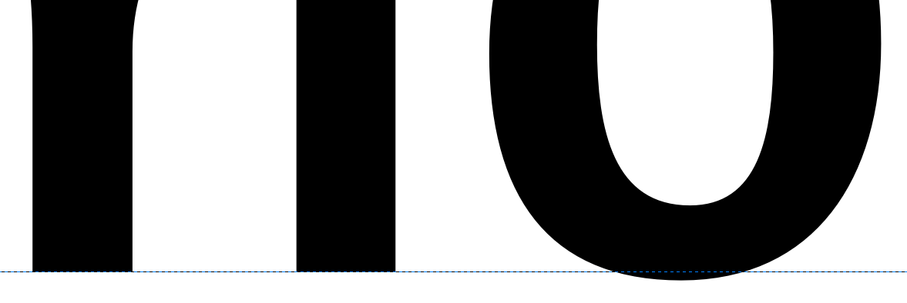
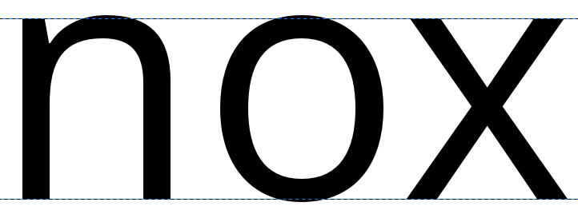
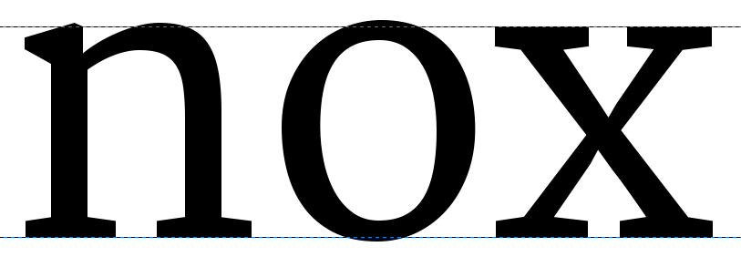
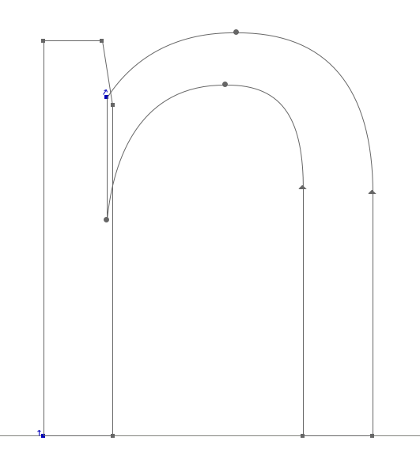
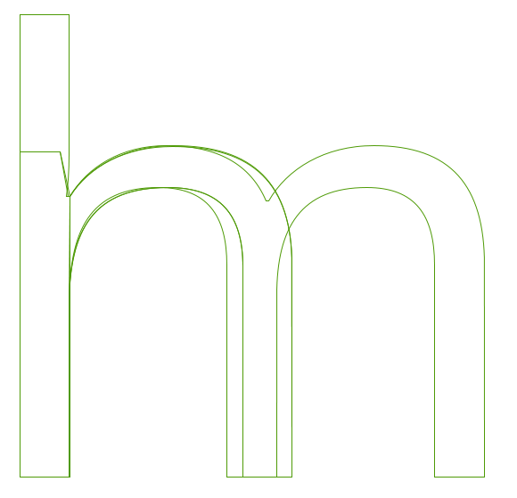
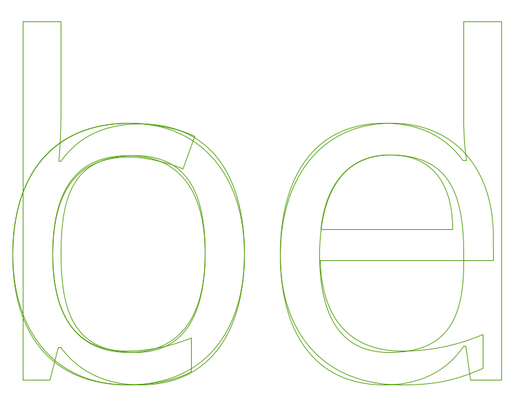
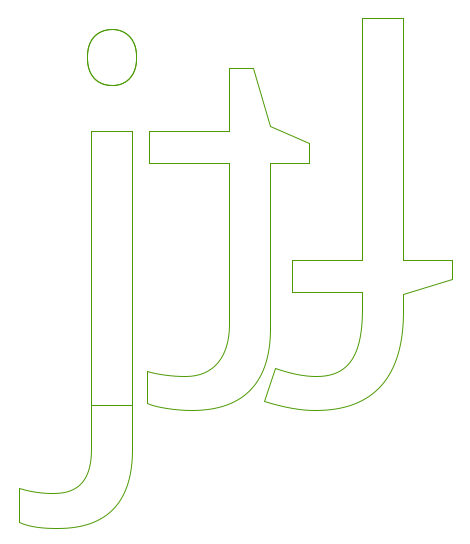

设计字体有很多种方法。解构涉及的大规模的进程，以快速开始并为整个字体的字符的价值提供坚实的基础。这样做是有益的。
达到这个目的的一个受欢迎的有价值的方法是首先设计“o”和“n”，在定下形式、间距和平衡的必要元素，然后再将它们合在一起形成其他字符。创建小写的“o”和“n”字符可以提供给我们一些基本的形式和结构，可以支撑所有其他的需要的字符。

尽管设计“o”可能看起来是十分容易的事情，但是所有在[“什么是字体？”][“What is a font?”]一章中提到的字符都开始起作用。你对每个字符所做出的选择应该是深思熟虑的。

## 下垂和上突

光学效果影响字体设计的一种方式是曲线和直的边在眼睛里是如何出现。
比如说，如果要曲线和直边看起来正确地在基线上对齐，那么实际上曲线必须放在基线以下一点点，这就产生了下突。为了看起来放置在基线上而压低到基线以下的字符的那部分称作*下垂* &mdash;如下演示。没有下垂，基线附近有曲线的字符将会看起来没有在文本的线上对齐。 

类似于下突，提供x高度和大写高度的对齐错觉需要一部分区域*上突*（如下）。

## 设计小写“o”

设计“o”不仅仅是字母中黑色部分的问题。“o”提供了非常基本的弧（bowl）的粗细和形状，白色部分 &mdash; 或对立面 &mdash; 提供了字体其他部分使用的尺寸和形状。
一般说来，我们也可以在其他字符中看到“o”中的圆形。这些字符包括b，c，d，e，p和q，这些形式也会影响字体中其他字符的曲线的形状和形式，比如O，C，D和Q。

此外，“o”中的白色部分应该在设计字体间距的时候利用起来；“o”也会设定字体中其他字形间使用的间距。这两个值之间关联很大，因此基本上你也需要设计你的“o”两旁的空白数量。作为一般原则，除了斜体或者意大利斜体，其他字体的“o”左右两边的间距是相同，“o”字符的字符串的空白间距应该与“o”内的空白间距相平衡。

我们已经接触了很多间距和度量值，所以即使在这一较早阶段，你也可能希望看一下[“间距，度量值和紧缩”][“Spacing, Metrics, and Kerning”]一章，涵盖了字体间距的基本含意。
这样将会使你做出间距很好的字符“o”，这样对你设计“n”也有帮助。

## 设计小写的“n”

一旦你可以对你的小写字符“o”的形式和间距感到高兴，就像展示的示例字符串那样，那么下一步就是创造形状合适、平衡、间距良好的小写字母“n”，这样你就可以将其插入“o”的字符串。

如果我们观察“n”的解刨，我们可以将其分割成2或3个组成部分，包括一个<i>茎</i>和一条<i>曲线</i>。

这种方式可以在我们的字符集增长的时候，给你形成字符时与其他字符保持平衡和谐的捷径。  看下面的例子“n”；他被分为两部分。分开的组件合在一起就形成了一个“n”，但是同样的组件在稍后形成其他字符的时候可以再次使用；比如左边的“n”的茎可以在形成其他所有小写字母的茎的时候使用。

你可以再次快进到间距和度量值的章节，字符“n”的设计应该跟上调整字符“n”和“o”间距的进程。

现在利用你所使用过的方法来创造一个“n”和一个“o”字符，你已经准备好扩大小写字符集。“o”和“n”的茎和曲线组件为你形成其他字符指明道路。
如果我们学习下面的来自[Open Sans]的字符，我们可以看到各个字符的正式面貌以及他们如何重复出现，通过一些调整形成新的字体的组件。

[“What is a font?”]: What_Is_a_Font.html
[“Spacing, Metrics, and Kerning”]: Spacing_Metrics_and_Kerning.html
[Open Sans]: http://opensans.com/