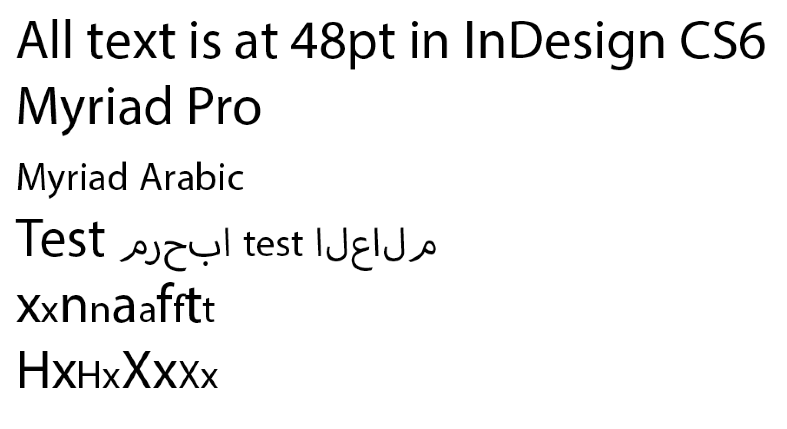

_感谢Adam Twardoch、Erin McLaughlin、Neelakash Kshetrimayum、Dan Reynolds、Pooja Saxena、Dr Girish Dalvi为本页贡献了如此多的想法_

设计一个新的原创的[天城体](http://en.wikipedia.org/wiki/Devanagari)样式遵循的流程非常类似设计新的原创的拉丁文的流程。从自由字体的_自由_中能够获得的独特的好处是你可以为字体的初创者从没相处的新目的修改并重用它们 &mdash; 例如设计一个天城体并改造一个已有的拉丁字体来解决它。

## 天城体字形

天城体包含这些不同类型的字形：

* 辅音（36）
* 独立的元音（28）
* 元音maatras
* 字距
* 天城体数字（10）
* 拉丁数字（新的或者或者将已有的调整到与天城文字相适应）
* nukta组合
* 半形式
* 连接（独特的连字字形）
* 不同长度的“I”元音maatras
* 天城体标点符号
* 拉丁标点符号（新的或者调整已有的）
* 拉丁字母

咨询（[天城体Unicode页面](http://www.unicode.org/charts/PDF/U0900.pdf)）和（[微软天城体OpenType字体开发页面](http://www.microsoft.com/typography/OpenTypeDev/devanagari/intro.htm)）来学习更多关于这些字形和印度语形状引擎如何工作的内容。

写书法或者与此接近学习字帖来学习书写字母如何工作是有帮助的，这样你会明白什么字母在结构上应该与什么其他字母相似。这些[Aksharaya的天城体书法字帖中的2页](https://groups.google.com/d/msg/googlefontdirectory-discuss/XRYMYHZpUVc/_mLQWbr8rp8J)可以用作笔的角度和字母比例的参考。.

## 首先做什么

在设计一个天城体和拉丁字体样式时，以在天城体旁边绘制拉丁文字开始是重要的。最早一步是设计“关键”字形，以此通过基础形状和间距（这在拉丁文中可能是‘adhesion’或者‘videospan’）来建立字体样式的个性。进程早期设计最低和最高的“高度极值”。

你将会需要大量的元音标记来开始质地和缩放的测试。

印度理工大学孟买分校的字体排印教授Girish Dalvi博士在他的博士论文中写到，

> 通过这一研究的结果我们可以推断出10个字母अ इ ए ख त भ द ध थ ष可以捕获几乎所有的剩余天城体字母的正式属性。在这些字母中，字母अ इ ख भ द ध ष定义了大多数字母的特性，是最具决定性的。因此我们认为通过首先设计这些字母，天城体设计的流程可以为学生和字体设计师简化，剩下的字母可以通过这些衍生出来。

Erin McLaughlin建议将这些字形作为一个初始连字：**पाव + किमीनुफू + भरसगदह + र्मों ड्डू (height extremes) + यथधआछड … 连续字符集合**并建议关注“Au”元音标记 + reph + anusvara连字！这里的Ma是为了后继。

字形的高度极值允许你确定竖直度量值和如何缩放两个书写系统来共同工作。Adobe发布了非常大的字体家族覆盖各种不同的正字法。它们根据共享的一般比例分成不同的家族；Myriad Pro包含Latin,、Greek和Cyrillic，而Hebrew与Arabic设计打包成分来的家族，包含在**改进的**Latin中. 

下面是Myriad Pro Latin和Myriad Arabic并排：

（认出Adobe的整洁的选择：Myriad Arabic的大写高度是Myriad Pro Latin的x高度）

需要注意的是在Lohit字符集中，最低的字形是形式，意味着靠下的字符将会下沉到比基线低很多的地方：

待办事项：添加vattu+U，vattu+Uu，U，Uu和subscript V（用于合词）的图片

（Vattu是底基线样式的reph。详情参见[微软术语](https://www.microsoft.com/typography/otfntdev/indicot/terms.htm)页面）

理想地，这些应该堆叠在你最低的竖直堆叠结合以下，就像左边的例子（Lohit并不完全竖直适应，在右边）

## 间距方法

设计拉丁字体有代表性地涉及了一系列艰巨字符串像这样：

> HHxHOHOxOO  
> nnXnonoXoo

其中X代表了你关注间距的字母，概念是看这个字母挨着有点平的字符和圆的字符。

Pa与Va或Da是天城体相等的：

> पपXपवपवXवव  
> पपXपदपदXदद

当刚刚开始一个项目的时候，从使用Pa完全填充一个页面开始，以此得到笔画粗细、对立面大小和间距的正确平衡。

> पपपपपपपपपपपपपपपपपपपपप 

一旦Pa有了正确的“color”，你可以开始添加其他基本常见的字符：

> पपपवपपपपपवपववपपव （）va，随机化的）  
> पपपापपपपापपाप （Aa maatra，岁计划的）  
> पपपदपपपपपदपददपपद （da，随机化的）  

然后你可以开始使用上面的间距字符串来添加新的字形：

> पपरपदपदरदद  
> पपकपदपदकदद  
> पपलपदपदलदद  
> पपपीपदपदपीदद

诸如此类！

你将希望在一个像那样长的列表中看看这些，这样你可以在屏幕或打印介质上向下滚动时一个一个地比较字形。做竖直检查比只是长的一行连续文本更有效。原因是：

当你在竖直列中看间距字符串时，你可以很容易地比较当前字符到上下行之间的间距。按同样的方式，你可以容易地从坏地设置完全调整的文本中识别出“rivers”，如果你比较剩下的间距字符串，那么可以容易地在间距上看到白色间隙或者暗点。

上面的间距字符串允许你比较非常不同的形状，这样间距甚至更加贯穿（而不是所有太松或太紧的圆的字符）。

中间的四个字形Pa/Da/Pa/Da允许你将比较字符与两个三字符集合相比较，也就是Pa/Da/Pa或者Da/Pa/Da。

在对一些元音和辅音绘制和调整间距后，你将能够只使用这些字母做出数量有限的词并开始用实际文本测试你的设计。

## 作品分解结构

在任何一个字体样式设计项目中，描绘出一个作品分解结构是好主意。

对于一些非常熟悉的人来说，有可能在大约4-6个月内设计出天城体样式的初始的细体和粗体。

这里有一个经验丰富的设计者在设计有些简单的“sans”时，制作9种不同粗细、直立和倾斜的插值替换的字体家族的时间表：

|Week|Goal|Glyphs|
|--:|:--|--:|
|1|Establish design in 7-10 key glyphs|10|
|2|Refine, design tallest glyphs, match heights and weights to Latin in Regular & Bold, test screen rendering with ttfautohint|20|
|3|Refine proportions with native reader feedback|40|
|4|Get native reader feedback, refine and add more conjuncts|100|
|5|Get native reader feedback, refine and add more conjuncts|200|
|6|Get native reader feedback, refine and add more conjuncts|300|
|7|Get native reader feedback, refine and add more conjuncts|400|
|8|Get native reader feedback, refine and add more conjuncts|500|
|9|Get native reader feedback, refine and add more conjuncts|600|
|10|Get native reader feedback, refine and add more conjuncts|700|
|11|Get native reader feedback, refine and add more conjuncts|800|
|12|Get native reader feedback, refine and add more conjuncts|900|
|13|Derive Bold|1,800|
|14|Refinements, Kerning, testing with native reader feedback|1,800|
|15|Extrapolation and clean-up of Thin and Black weights, generation and clean-up of slanted styles|3,600|
|16|Interpolated styles refinement|3,600|
|17|General refinement of spacing, kerning & testing in all styles|3,600|
|18|Finalisation|3,600|

## 有用的资源

### 简介

* <http://www.linotype.com/6896/devanagari.html>

### 从哪里寻找灵感和创意

在<http://indiantypefoundry.com>Google Fonts发布的网站查看天城体，来找到字体形状变化的灵感。

另一个好的地方是搜索印地语“e-paper”电子报网站来看实际使用字体的广告通常有更多的字体多样性。<http://epaper.jagran.com>是一个流通非常广泛的印度电子报纸。

Flickr也是一个形象化创意的好的来源：

* <https://www.flickr.com/groups/devanagari-script/>
* <https://www.flickr.com/groups/37703106@N00/>
* <https://www.flickr.com/groups/indicscripts/>
* <https://www.flickr.com/photos/pauldhunt/sets/72157603715699186>

#### 历史资源

得到H. M. Lambert编写的由牛津大学出版社于1953年出版的Introduction to the Devanagari Script和B. S. Naik编写的孟买语言理事会1971年出版的Typography of Devanagari（3卷）的副本。

除了那些，还有至少两种欧洲19世纪字体的一般来源值得一看：英国和德国（主要是莱比锡）的字体样式。这些字体更多地用来设置梵文字文本而非印度文本。

同时也尝试从印度字体铸造中找到19世纪和20世纪的文本字体样式的例子。像你期望的那样，它们明显很少欧化。从19世纪起在欧洲学院 梵文字体中有一些靠不住的东西，它们看起来根本不存在于20世纪的印度的排印中。这些印度来源可能更难从西方图书馆中找到，但是可能Erin McLaughlin更加领先。例如Matthew Carter的19世纪70年代的天城体Linotype排字机是基于Nirnaya Sagar公司的字体样式。它们的字体和孟买字体公司的字体应该可以在一些西方大学或者国家图书馆中找到。我也推荐查找Monotype的天城体和LinoType天城体（1970年代版和1980/90年代版，而非指示同名的原始的1935版）。

在荷兰的Typefounders并没有天城体（Charles Enschede, Harry Carter 1978）。无论你做什么，不要看Bodoni在1818年手工制作的字体。

一些来自H. Berthold AG的德国制造的天城体可能在Reichsdruckerei于1924年在柏林出版的Alphabete und Schriftzeichen des Morgen- und des Abendlandes的45-47页看到。

### 文章

Sarang Kulkarni写了["Issues with Devanagari Display Type (PDF)"](http://www.typoday.in/2013/spk_papers13/sarang-kulkarni-typographyday2013.pdf)

Yashodeep Gholap写了[Designing a Devanāgarī text font for newspaper use  (PDF)](http://www.typoday.in/2012/spk_papers/yashodeep-gholap-typographyday2012.pdf)

Vaibhav Singh的MATD论文[Devanagari in multi-script typography](http://issuu.com/typefacedesign/docs/vaibhav_singh_dissertation)

### Lohit2天城体

Lohit2天城体可以通过使用其字形列表和OpenType布局码来作为新OFL字体的基础。想要使用可以通过[原始FontForge来源](https://github.com/pravins/lohit2/tree/master/devanagari) or as a [UFO zip下载](https://github.com/frank-trampe/lohit2/archive/master.zip)

### OpenType布局

[微软天城体OpenType字体开发页面](http://www.microsoft.com/typography/OpenTypeDev/devanagari/intro.htm)

### 天城体刨析

[Aksharaya的天城体书法指南的2页](https://groups.google.com/d/msg/googlefontdirectory-discuss/XRYMYHZpUVc/_mLQWbr8rp8J)，可以用来作为笔锋角度和字母比例的参考。

印度理工学院孟买分校（比得上美国的麻省理工学院媒体实验室）的Girish Davli教授发表了这个[天城体刨析文章（PDF）](https://web.archive.org/web/20130913220315/http://www.idc.iitb.ac.in/resources/dt-jan-2009/Anatomy%20of%20Devanagari.pdf)

如果你对天城体书写字母的不熟悉，那么知道传统书法笔锋力道是重要的，这与拉丁不同。这里有一个笔画角度和曲线如何传统地赋予粗细的快速文档。如果你遵循这些粗细原则来绘制你的曲线，而不是剪切粘贴拉丁字母的一部分，那么你的设计将会更加成功，并且看起来更少“拉丁化”。 <iframe width="560" height="315" src="//www.youtube-nocookie.com/embed/_P-Ty512SyA?rel=0" frameborder="0" allowfullscreen></iframe>

[天城体Unicode页面](http://www.unicode.org/charts/PDF/U0900.pdf) 展示了基本字母，但没有连字。

### 测试工具

Adobe InDesign对非欧洲书写字母的OpenType字体的支持只有在Creative Cloud中才可靠，甚至最新版本也没有改善。自由Harfbuzz与微软OpenType的实现是完成度最高的，因此你应该在Windows和Mac OS X下使用最新版本的Chrome、Firefox和微软Word来测试你的字体，以保证形状上的错误来自于字体而非底层引擎。

[Pablo Impallari的天城体测试页面](http://www.impallari.com/testing/devatest.php) （以及[Github上的源码](https://github.com/impallari/font-testing-page/)）提供了一些已经制作好的测试布局，你可以拖动你的OTF或者TTF字体到页面上来加载它。

[Pooja Saxena的字体工具](https://anexasajoop.github.io/devanagari-type-tools)（以及[Github上的源码](https://github.com/anexasajoop/devanagari-type-tools)）来生成字母连接的测试文本。

[Adhesion天城体文本](http://www.adhesiontext.com/devanagari/)是Miguel Sousa构建的用来制造只包含可能使用你已经绘制的字形来书写的单词的假文本 的工具的一个特殊版本。插入你已经绘制的字形（अआईईउऊ等），将会诞生一些你用于证明的示例单词。

Huerta Tipografica的[Devanaguide](http://devanaguide.huertatipografica.com/)是一个开源工具，用来看和比较不同的天城体。它也允许你打字并同时在所有字体上预览。Devanaguide也包含了一个[天城体词表](https://github.com/andrestelex/devanaguide/blob/master/deva-dictionary.txt)，对测试文本设计有帮助。

### 论坛讨论

Typophile

* [Adobe天城体](http://typophile.com/node/95460)

Google字体目录讨论

* [关于相比于拉丁，放置肩线、顶部、底部等等的约定？](https://groups.google.com/forum/#!topic/googlefontdirectory-discuss/TaX0NKHket4)
* [从Lohit2开始](https://groups.google.com/forum/#!topic/googlefontdirectory-discuss/VAhs5MnjZ30)与[pdf](https://groups.google.com/forum/#!topic/googlefontdirectory-discuss/_3gtTalzKUQ)
* [Adobe字形列表](https://groups.google.com/forum/#!topic/googlefontdirectory-discuss/q8CQHVxVZ0Y)
* [rVocalic与rrVocalic](https://groups.google.com/forum/#!topic/googlefontdirectory-discuss/eYmmBQENBb8)
* [天城体字符优先顺序](https://groups.google.com/forum/#!topic/googlefontdirectory-discuss/7dtNw8wwJzI)
