变音是添加或结合到一个字母上的标记，经常用来字母的声调改变为添加的标记。一些变音标记（比如“acute”和“grave”）经常被称为重音。变音标记可能出现在一个字母的上面或者下面，一个字母内或两个字母之间。

### 一些变音的例子

小写的“a with grave”（unicode u+00e0）。在一个字体中通过将小写的“a”字形（unicode u+0061）和“combining grave accent”字形（unicode u+0300）联合起来创造。

小写的“a with circumflex”（unicode u+00e2）。在一个字体中通过将小写的“a”字形（unicode u+0061）和“combining circumflex accent”字形（unicode u+0302）联合起来创造。

小写的“a with ogonek”（unicode u+0105）。在一个字体中通过将小写的“a”字形（unicode u+0061）和“combining ogonek”字形（unicode u+0328）联合起来创造。

小写的“c with cedilla”（unicode u+00e7）。在一个字体中通过将小写的“c”字形（unicode u+0063）和“combining cedilla”字形（unicode u+0327）联合起来创造。

小写的“o with double acute”（unicode u+0151）。在一个字体中通过将小写的“o”字形（unicode u+006f）和“combining double acute accent”字形（unicode u+030b）联合起来创造。

FontForge可以用2种主要的方式自动地创造带重音的字符：

1. FontForge包含了放置变音标记位置的基本信息，所以可以自动地构建几乎所有的重音符号。
2. 为了对变音符号放置有更好的控制，FontForge可以给予用户创建的锚点的位置来放置变音标记。

<b>注意：</b>如果你没有使用锚点和查找表来控制变音标记的位置，那么如果一个特定的变音标记没有出现在你的字体中，FontForge会使用一个类似的间隔字符来替代。例如如果要联合的“acutecomb”（u+0301）没有出现在你的字体中，那么FontForge将在自动构建任何添加acute accent的字形时会使用标准的“acute”（u+00b4）字符。如果“acutecomb”出现了，那么FontForge将会总是使用它，除非你特别强制FontForge使用间隔字符来构建有重音的字形。

## FontForge对变音标记的基本自动替换

在FontForge的“Element”菜单，有一个“Build”功能可以用来创建变音字符、某些组合字符和一些重复的字符。使用“Element > Build > Build Accented Glyph”功能可以在FontForge中自动构建带重音的字符。这个功能也可以通过快捷键<kbd>Ctrl</kbd> + <kbd>Shift</kbd> + <kbd>A</kbd>来使用。因此如果要使用“a acute“字符（u+00e1），我们需要已经创造出小写的“a”（u+0061）和“acutecomb”字形（u+0301）。然后选择“a acute”字符位置并使用“Element > Build > Build Accented Glyph”功能，FontForge将会放置一个到小写的“a”字形引用和一个到“acutecomb”字形的引用到“a acute”字符位置（如下）。

<b>注意：</b>如果一个变音标记字形没有出现在你的字体中，那么FontForge将会使用一个类似的间隔字符来替代。例如如果要联合的“acutecomb”（u+0301）没有出现在你的字体中，那么FontForge将在自动构建任何添加acute accent的字形时会使用标准的“acute”（u+00b4）字符。如果“acutecomb”出现了，那么FontForge将会总是使用它，除非你特别强制FontForge使用间隔字符来构建有重音的字形。

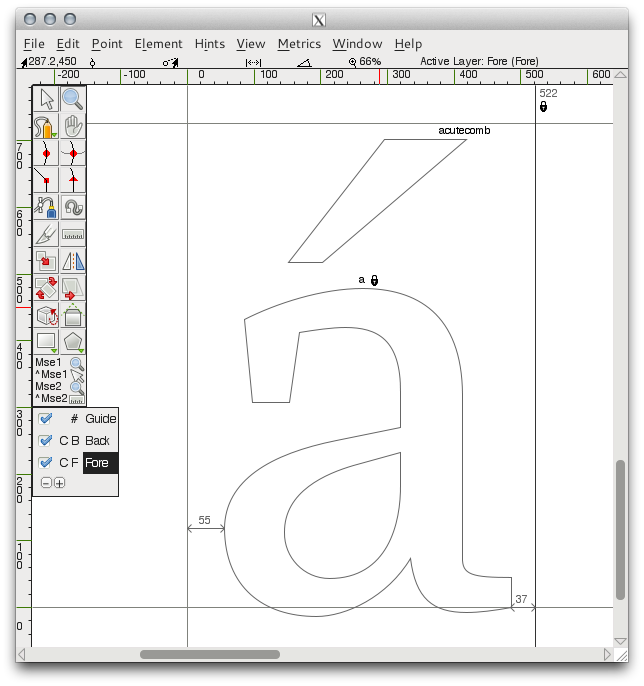

变音标记的自动放置可以通过偏好设置来调整，可以在FontForge的偏好设置菜单“File > Preferences > Accents”下的“accents”区域找到（如下）。 

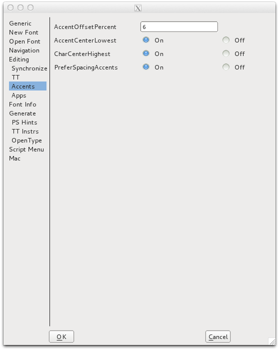

“PreferSpacingCharacters” - 选择这个选项为“On”将会强制FontForge使用间隔字符来构建重音字形，即使适当的联合字符出现。这个选项在使用锚点来放置变音标记时失效。

“AccentOffsetPercent”控制基本字形和标记字形的竖直间距的总量。这里输入的数值时字体的em square的百分比。所以如果数值是“6”将会使标记字形到基本字形的距离将是字体的em square的百分之六。

标记字形水平放置的偏好设置页可以设置。在“AccentCenterLowest”的偏好设置选择“On”将会使重音字形处于基本字形的最低点的中央。

在“AccentCenterHighest”的偏好设置选择“On”将会使重音字形处于基本字形的最高点的中央。

上面两个偏好设置都选择“Off”将会使重音放置在基本字形的宽度中央。上面两个偏好设置都选择“On”将会使重音放置到字符空间的中央。

## 使用锚点来放置变音

在FontForge中构建重音字符的最精确有效的方式是使用“锚点”。

锚点允许你精确地控制变音标记在有重音的字符上相对于每个基本字形的位置。因此在字符“a ogonek”中，“a”字形时基本字形并会放置在正常位置，“ogonek”字形是“标记字形”并会放置在某个位置使得“标记字形”的锚点与基本字形的锚点一致。

在下面的例子中，创造一个“a ogonek”字符，创建了一个称作“底部”的锚类。在小写的“a”字形中，“底部”锚点放置在“a”的茎的底部。这是“基本字形”的锚点的形式。

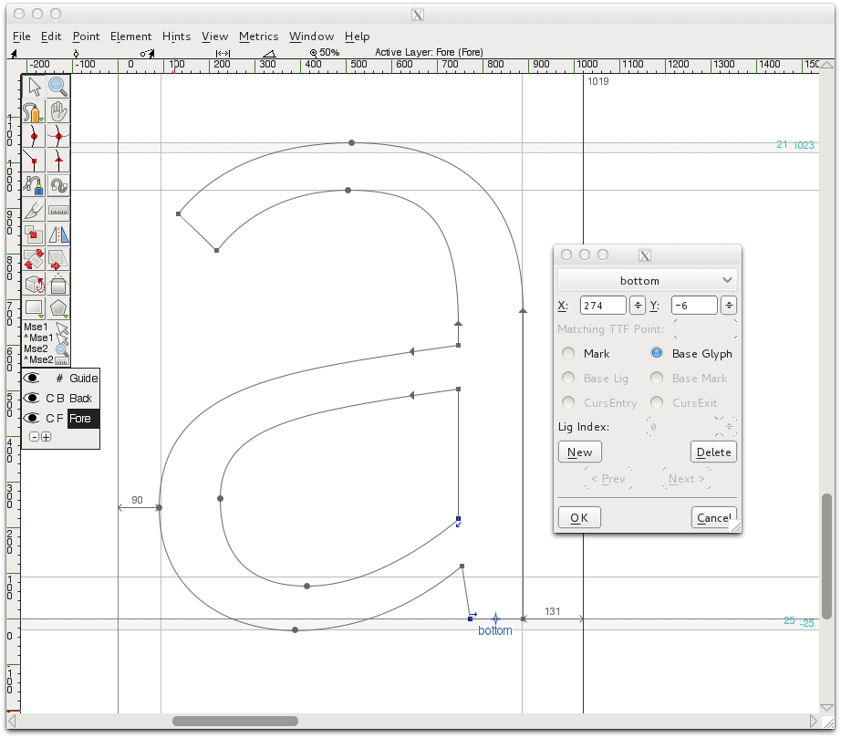

在“ogonek”字形中，标记锚点的形式中的底部锚点放置在字形的顶部（如下）。

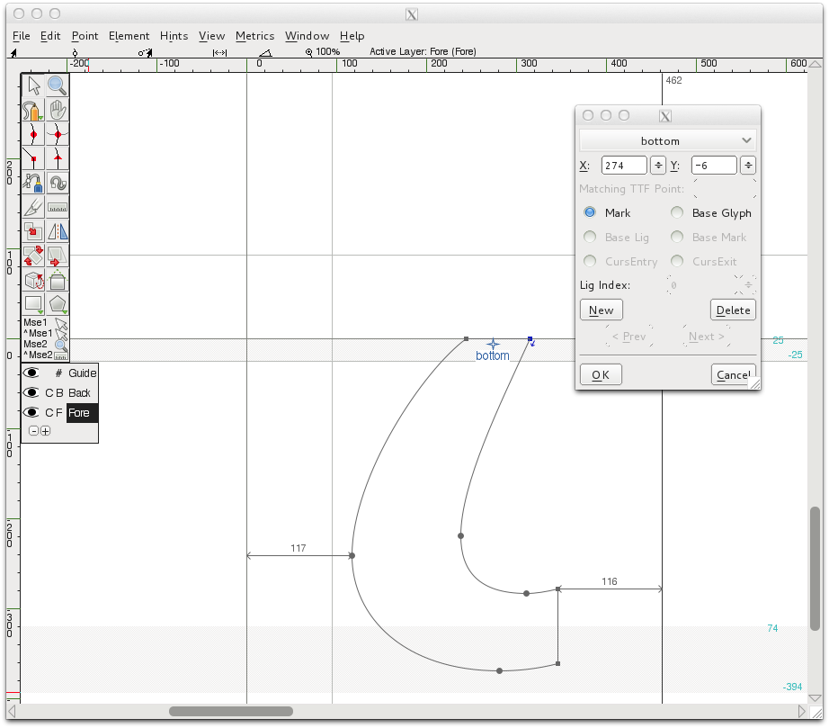

那么在“a ogonek”字符构建时（使用“Build Accented Charcter”功能），“底部”标记锚点将会放置在与“底部”基本锚点相同的位置，保证ogonek字形的引用正确地放置在“a”的引用的茎的尾部（如下）。这一精确自动的位置只有在使用锚点来放置基本和标记字形的时候才可以使用。

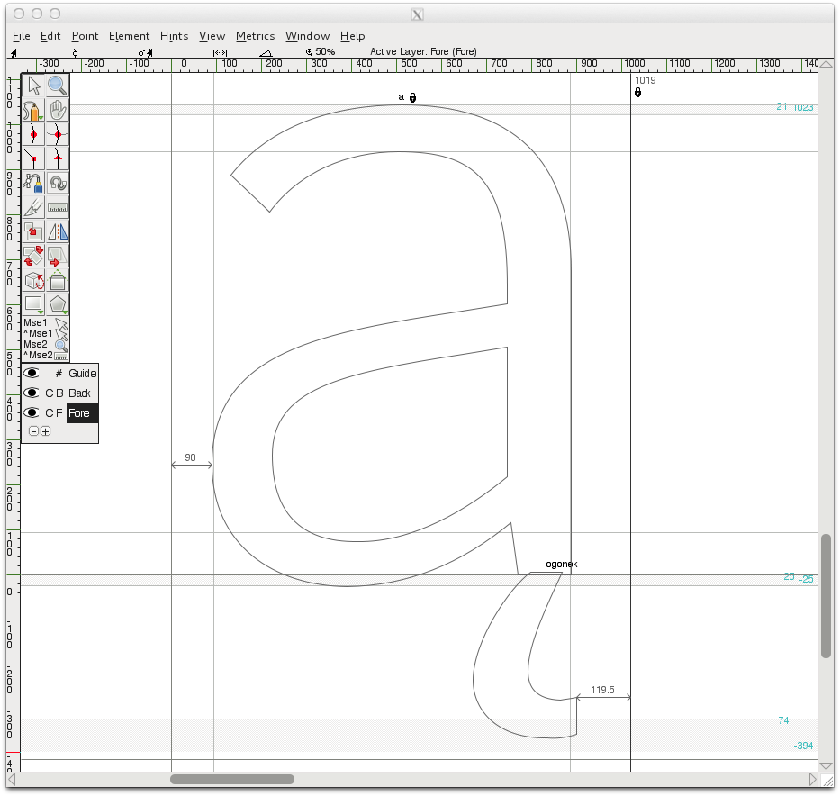

### 为放置变音标记创建锚点（到基本位置的标记）

FontForge使用被称为“mark-to-base”的查找功能来创建和放置锚点。这些mark-to-base查找可以通过你的字体的Font Info的GPOS Lookups区域来创建和编辑（“Element>Font Info>Lookups>GPOS”）。

在GPOS Lookups窗口中，点击“Add Lookup”并选择类型“Mark to Base Position”，然后在Feature窗格的“New”一列选择“Mark Positioning”（如下）。点击“OK”关闭窗口。

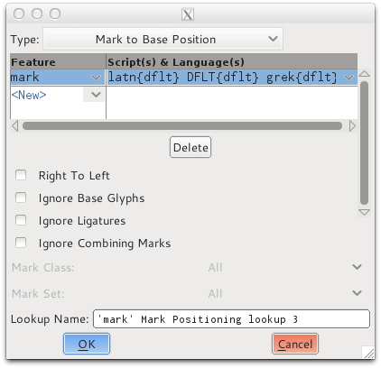

选中新的查找，点击“Add Subtable”。在结果窗口（如下）你可以创建你的锚类。

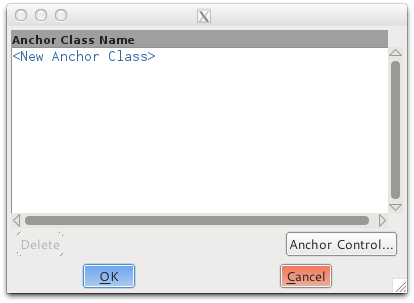

在这个例子中（如下），创建了两个锚类“top”和“bottom”。“top”锚类将会用来放置字形上面的变音标记，“bottom”类将会用来放置字形下面的标记。

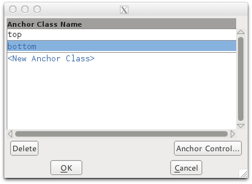

要在一个字形上放置锚点，只需要在字形编辑窗口鼠标右击，在右键菜单中选择“Add Anchor”功能。出现的对话框让你可以设置锚点是基本锚点还是标记锚点。锚点的位置也可以通过这个对话框来调整。锚点也可以通过鼠标拖拽或方向键来移动到你想要的位置。右击锚点选择右键菜单中的“get info”也可以修改锚点。

### 锚类的控制

FontForge也包含了一个有用的图形界面来控制锚点的所有类的位置，使用户可以很好地调整位置，例如一次性调整位置字体中所有的尖重音（acute accent），或者调整一个类别中包含的所有锚点，例如引用小写字母“e”的字符。下面的例子中我们可以看到如何使用这个图形界面来良好地调整一个字体中所有尖重音的位置，调整所有引用小写字母“e”字形的字符的锚类别。

一旦你在你的mark-to-base位置查找中创建了锚类别，并为一些字形添加了锚点，你可以通过“Element>Font Info>Lookups>GPOS”来控制这些类别，然后编辑包含锚类别的子表。你将会看到下面的窗口：

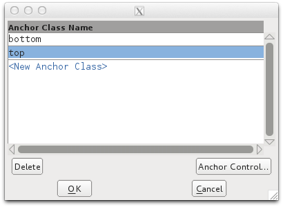

在这里我们可以选择你希望编辑的类别病点击“Anchor Control”按钮。这个类别的一个图形界面将会展现在你面前。在下面的例子中我们在编辑“top”类别的控制。在第一个例子中（如下），在“Bases”区域的下拉菜单中选中选中小写字母“e”。当一个基本字形被选中，所有引用这个字形并包含“top”基本锚点的字符将会显示在预览窗格。然后我们可以调整“top”基本锚点的位置来看它如何影响所有包含“top”标记锚点的字形的位置。

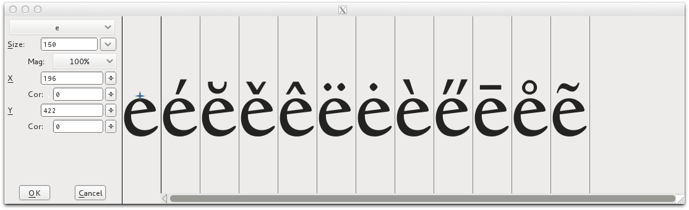

在第二个例子中，如下，在“Makrs”区域的下拉菜单中选中“acute”字形。当一个标记字形选中时，所有引用选中字形并包含“top”标记锚点的字形将会显示预览效果。

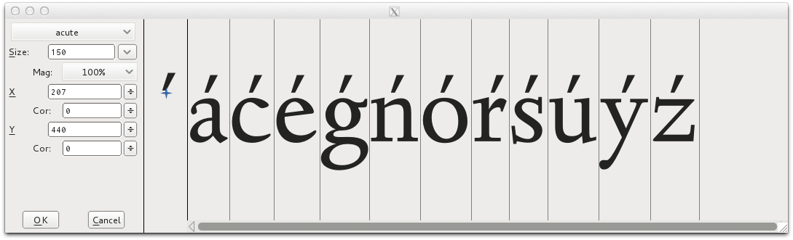

## 其他资源

* http://urtd.net/projects/cod/about
* http://ilovetypography.com/2009/01/24/on-diacritics/
* http://diacritics.typo.cz/
* http://scripts.sil.org/ProbsOfDiacDesign
* http://www.microsoft.com/typography/developers/fdsspec/diacritics.htm
