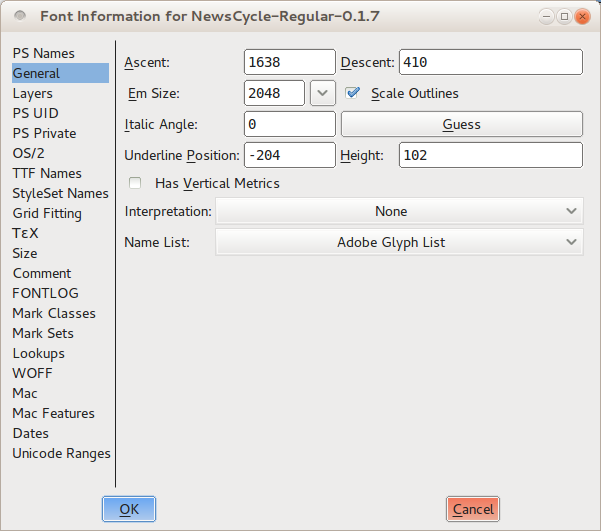
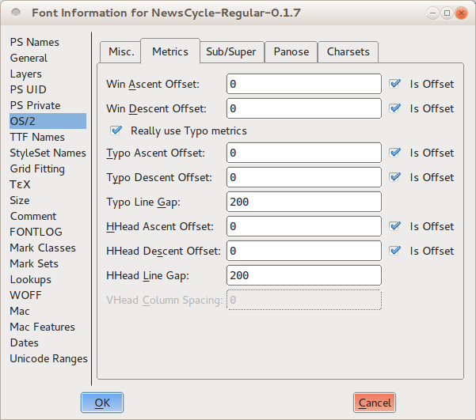

当你有了字间距和字母n与o的集合，你可以开始看行间距。但是行间距的最终选择直到你了解了大写字母和一些标点符号后才可能做出。

## 有意地思考行间距

就像字母和字间距的情况，行间距太多或者太少会使得你的字体在真实世界的使用中显得尴尬。找到合适的行间距平衡就是有意地考虑这个问题并考虑测试做出最终决定的过程中的一些选项范围，这笔其他更重要。

一般规则是，大多数新的字体设计者更倾向于犯字体行间距太小的错误，所以你不确定的情况下加入额外的间距经常是个好主意。

在考虑行间距的时候，你也应该考虑你的项目的语言覆盖范围。如果你只使用无重音的字符来测试你字体的行间距，那么你设定的行间距很可能没有空间来放重音。如果你确定你的字体永远不会使用带重音的字符，那么这是可以接受的 &mdash; 但是你的字体被用来设置重音文本的几率还存在。在那种情况下，太小的行间距将会导致一行的重音进入上面字形的底部。使得读者难以阅读文本。 

一个测试你的字体的行间距是否适合重音字符的方法是从多个语言中挑选示例文本。

对于变音标记重的语言（比如捷克语），行间距应该比没使用变异符号的大。例子展示了相同的行间距的捷克语（上面的）和英语。

## 在FontForge中试验你字体的行间距

在FontForge中，你可以在字体信息窗口中设置调整你的字体项目的行间距。在“Element”菜单中选择<em>Font Info</em>，然后点击General选项卡可以打开这个窗口。需要注意FontForge列在顶部（Ascent）和底部（Descent）的数值。除非你已经手动改变了数值，否则这两个数字加起来等于Em size的值。

现在切换到“OS/2”选项卡。你的字体在几乎所有的电脑上的行间距将由你在Metrics选项卡输入的顶部和底部值决定。下一步你应该设置所有的

这里有三组值：Win Ascent与Descent，Typo Ascent与Descent和HHead Ascent与Descent。你应该将所有的Ascent设置与你在General选项卡下的值相同。接下来你应该将所有的Descent设置为与你在General选项卡下的值相同，除非你要设置Typo Descent数值为<em>负数</em>。 在这种情况下把数值设置为相同，但是在前面输入负号。最后取消对“is offset”选项的勾选。

这些设置将给你一个可感觉到的起点。现在你可以开始通过这一行间距来测试你的字体，并且增量调整直到你得到让眼睛舒服的结构。

如果你发现你的行间距太紧并且你不希望或不能让其字体的竖直距离更大，那么你可以将字形缩小来留给行间距更多空间。